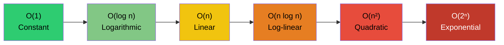
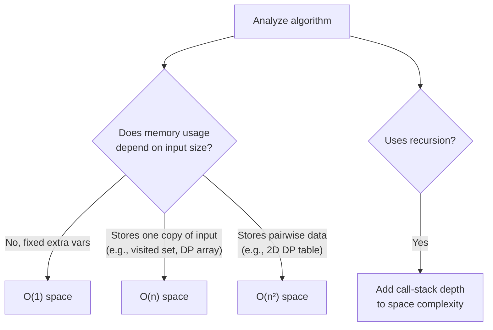

# Time & Space Complexity (Big-O)

> **Big-O notation** describes how an algorithm's running time or memory use grows as the input size `n` grows, ignoring constant factors and lower-order terms.

## Why it matters

Complexity analysis is how interviewers check that you can reason about an algorithm beyond "does it work." A correct solution that is O(n²) when O(n log n) is achievable signals a gap in fundamentals, and most follow-up questions in an interview ("can you do better?") are really asking you to reduce complexity. Being fluent in Big-O also lets you talk concretely about trade-offs - time vs. space, average case vs. worst case - which is exactly how real engineering decisions get made.

## Notation: O, Ω, and Θ

- **Big O (O)** - upper bound. "This algorithm never does worse than this."
- **Big Omega (Ω)** - lower bound. "This algorithm never does better than this."
- **Big Theta (Θ)** - tight bound. Used when the upper and lower bounds match, giving an exact growth rate.

In interviews, "complexity" almost always means Big O, since it's the worst-case guarantee that matters most for reliability.

## Common Growth Classes

| Class | Name | Example |
|---|---|---|
| O(1) | Constant | Array index access, hash map lookup (average case) |
| O(log n) | Logarithmic | Binary search, balanced BST lookup |
| O(n) | Linear | Single pass through an array, linear search |
| O(n log n) | Log-linear | Merge sort, quicksort (average), heap sort |
| O(n²) | Quadratic | Bubble sort, selection sort, nested loops over the same input |
| O(2ⁿ) | Exponential | Brute-force subset generation, naive recursive Fibonacci |

As `n` grows, the gap between these classes widens dramatically - an O(n²) solution that's fine for `n = 100` can become unusable at `n = 1,000,000`, while an O(n log n) solution scales gracefully.

## Best, Average, and Worst Case

Complexity can differ depending on the input, so algorithms are often described by three cases:

- **Best case** - the most favorable input (e.g., quicksort on an already-partitioned array).
- **Average case** - expected performance over typical/random inputs.
- **Worst case** - the least favorable input; this is what Big O usually refers to and what interviewers care about most, since it's the guarantee you can rely on.

| Algorithm | Best | Average | Worst |
|---|---|---|---|
| Quicksort | O(n log n) | O(n log n) | O(n²) |
| Hash table lookup | O(1) | O(1) | O(n) |
| Binary search | O(1) | O(log n) | O(log n) |
| Linear search | O(1) | O(n) | O(n) |

Quicksort's worst case (already-sorted input with a naive pivot choice) and a hash table's worst case (all keys colliding into one bucket) are classic examples of why average case doesn't tell the whole story.

## Amortized Complexity

Amortized analysis looks at the average cost of an operation over a sequence of operations, even if individual operations occasionally cost more. The canonical example is a dynamic array (like a Java `ArrayList` or a C++ `vector`):

- Appending is usually O(1).
- Occasionally the array is full and must be resized (typically doubled), which costs O(n) for that one operation.
- Spread across `n` appends, the total cost of all the resizes is O(n), so each append is **O(1) amortized**, even though a single append can spike to O(n).

This is distinct from average case: amortized analysis is a guarantee about a sequence of operations on the *same* data structure, not a statement about random inputs.

## Space Complexity

Space complexity measures the extra memory an algorithm needs beyond the input itself (sometimes called auxiliary space), as a function of `n`.

- **O(1) space** - in-place algorithms, e.g., reversing an array with two pointers, or iterative algorithms with a fixed number of variables.
- **O(n) space** - algorithms that store a copy of the input or intermediate results, e.g., memoized dynamic programming, or a hash map built while scanning a list.
- **O(n²) space** - algorithms that build a full matrix, e.g., a DP table for edit distance or Floyd-Warshall all-pairs shortest paths.

Recursion has a hidden space cost: each call frame sits on the call stack, so a recursive function's space complexity is generally proportional to the maximum recursion depth - O(n) for linear recursion, O(log n) for recursion that halves the problem each call (like a balanced divide-and-conquer). Tail-call optimization can eliminate this in some languages, but it isn't guaranteed in most mainstream ones (Python and Java, for example, don't do it).

## Common Interview Questions

**Q: What's the difference between time complexity and space complexity?**
A: Time complexity measures how the runtime grows with input size; space complexity measures how the extra memory used grows with input size. They're analyzed independently, and improving one can worsen the other.

**Q: What's the difference between Big O, Big Omega, and Big Theta?**
A: Big O is an upper bound (worst case), Big Omega is a lower bound (best case), and Big Theta is a tight bound where the upper and lower bounds coincide. Interviews almost always focus on Big O.

**Q: What is amortized time complexity, and why does dynamic array append run in O(1) amortized?**
A: It's the average cost per operation across a sequence, allowing occasional expensive operations as long as they're rare enough. Dynamic array append is O(1) amortized because resizing (O(n)) happens infrequently enough that its cost, spread across all prior appends, averages out to O(1) per append.

**Q: Why can quicksort be O(n log n) on average but O(n²) in the worst case?**
A: Quicksort's performance depends on how balanced its partitions are. With a good pivot choice it splits the array roughly in half each time (O(n log n)), but with a poor pivot choice (e.g., always picking the first element on an already-sorted array) it can degrade to unbalanced partitions of size n-1 and 1, giving O(n²).

**Q: What is the space complexity of a recursive function, and how does it relate to the call stack?**
A: It's proportional to the maximum depth of the recursion, since each active call adds a frame to the call stack. Linear recursion (e.g., naive factorial) is O(n) space; recursion that halves the input each call (e.g., balanced binary search) is O(log n) space.

**Q: Can you trade space for time, or vice versa?**
A: Yes - this is a common optimization pattern. Memoization/dynamic programming stores intermediate results (extra space) to avoid recomputing them (saving time), and hashing trades memory for near-constant-time lookups instead of linear scans.

**Q: What's the time complexity of iterating over a 2D array, and of BFS on a graph?**
A: A full 2D array traversal is O(n·m) for an n-by-m array. BFS is O(V + E), since it visits every vertex once and examines every edge once.

## Related

- [Sorting Algorithms](sorting.md) - concrete algorithms that illustrate O(n log n) vs O(n²) trade-offs
- [Recursion](recursion.md) - where call-stack space complexity comes from
- [Coding Problems](coding-problems.md) - practice applying complexity analysis to real problems
