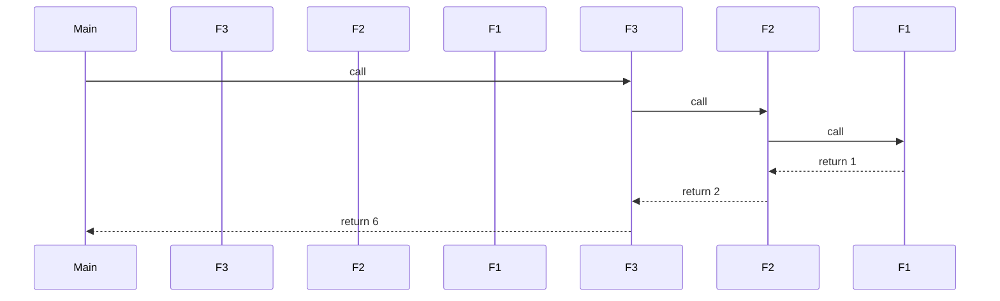
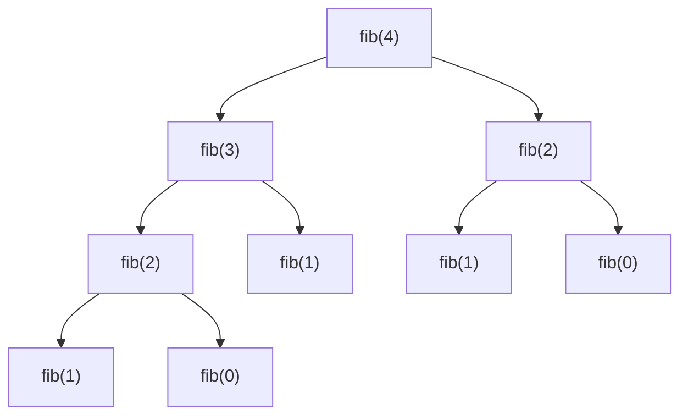

# Recursion

> **Recursion** is a technique where a function solves a problem by calling itself on smaller subproblems until it reaches a **base case** that can be answered directly.

## Why it matters

Recursion shows up constantly in interviews because it maps naturally onto trees, graphs, divide-and-conquer algorithms, and backtracking. Interviewers use it to check whether you can identify a base case, reason about the call stack, and spot when a recursive solution will blow up in time or space without optimization. It's also a quick way to see if you understand the trade-off between clean recursive code and iterative alternatives.

## Base Case vs Recursive Case

Every correct recursive function needs two parts:

- **Base case** - the condition that stops the recursion and returns a value directly, without further calls. Without this, the function recurses forever (until the stack overflows).
- **Recursive case** - the part where the function calls itself with an input that is "smaller" or "closer" to the base case, then combines that result to solve the current problem.

```python
def factorial(n):
    if n <= 1:        # base case
        return 1
    return n * factorial(n - 1)   # recursive case
```

If the recursive case never converges toward the base case (e.g., you forget to decrement `n`), you get infinite recursion and a stack overflow.

## The Call Stack

Each recursive call pushes a new **stack frame** onto the call stack, holding that call's local variables, parameters, and return address. Frames are popped in last-in-first-out order as calls return, which is why recursion naturally mirrors problems with nested or reversible structure.



Each arrow down is a new frame pushed; each arrow up is a frame popped. The maximum depth of this chain determines both the space used and whether you risk a **stack overflow**.

## Factorial and Fibonacci in Code

Factorial is **linear recursion** - one recursive call per invocation:

```python
def factorial(n):
    if n <= 1:
        return 1
    return n * factorial(n - 1)
```

Fibonacci (naive version) is **tree recursion** - two recursive calls per invocation, which branches exponentially:

```python
def fib(n):
    if n <= 1:        # base cases: fib(0) = 0, fib(1) = 1
        return n
    return fib(n - 1) + fib(n - 2)
```

## The Recursion Tree for fib(4)

Naive Fibonacci recomputes the same subproblems repeatedly. Drawing the call tree makes the wasted work obvious:



Notice `fib(2)` is computed twice and `fib(1)` three times. This overlap is exactly what memoization eliminates.

## Time and Space Complexity

| Function | Time | Space (call stack) | Notes |
|---|---|---|---|
| `factorial(n)` | O(n) | O(n) | One call per level, linear chain |
| `fib(n)` naive | O(2^n) | O(n) | Exponential calls, but stack depth is only O(n) |
| `fib(n)` memoized | O(n) | O(n) | Cache avoids recomputation |
| `fib(n)` iterative | O(n) | O(1) | No call stack growth at all |

A common mistake is confusing the **number of calls** (time complexity) with the **stack depth** (space complexity). Naive Fibonacci makes exponentially many calls, but at any moment the stack only holds O(n) frames deep, because it's depth-first.

## Stack Overflow

Every stack frame consumes memory, and the call stack has a fixed size (set by the OS or language runtime). If recursion goes too deep - either because the input is large or because a base case is missing or unreachable - you get a **stack overflow** (e.g., `RecursionError` in Python, `StackOverflowError` in Java/JS). This is a real, practical limit: deep recursion on unbounded input (like recursing over a large list without a size cap) is a common bug that interviewers probe for. Converting to an iterative approach, or using a language/technique with **tail call optimization**, avoids this ceiling.

## Memoization

Memoization caches the result of each unique subproblem so it's computed once, turning exponential tree recursion into linear work.

```python
def fib_memo(n, cache={}):
    if n <= 1:
        return n
    if n in cache:
        return cache[n]
    cache[n] = fib_memo(n - 1, cache) + fib_memo(n - 2, cache)
    return cache[n]
```

This is top-down dynamic programming: same recursive structure, but with a lookup table (dict, array, or `functools.lru_cache` in Python) guarding against repeated work. It trades O(2^n) time for O(n) time at the cost of O(n) extra space for the cache.

## Tail Recursion

A recursive call is in **tail position** when it's the very last operation in the function - nothing is done with its result after it returns.

```python
# Not tail recursive: multiplication happens after the recursive call returns
def factorial(n):
    if n <= 1:
        return 1
    return n * factorial(n - 1)

# Tail recursive: the recursive call is the last action, result passed via accumulator
def factorial_tail(n, acc=1):
    if n <= 1:
        return acc
    return factorial_tail(n - 1, n * acc)
```

Tail recursion matters because some compilers/runtimes can perform **tail call optimization (TCO)**, reusing the current stack frame instead of pushing a new one, effectively turning the recursion into a loop with O(1) space. Important caveat for interviews: mainstream languages like Python and (standard) JavaScript engines do **not** guarantee TCO, so a tail-recursive function in Python still consumes O(n) stack space and can still overflow. Languages like Scheme and some functional languages do guarantee it.

## Common Interview Questions

**Q: What's the difference between the base case and the recursive case?**
A: The base case is the terminating condition that returns a result without further recursive calls. The recursive case reduces the problem toward the base case and calls the function again. Both are required; missing either causes infinite recursion or incorrect results.

**Q: Why is naive recursive Fibonacci so slow?**
A: Because it recomputes the same subproblems many times - `fib(n-2)` is computed independently inside both the `fib(n-1)` and `fib(n)` branches, leading to O(2^n) total calls even though there are only n distinct subproblems.

**Q: How do you fix the exponential blowup in Fibonacci?**
A: Use memoization (cache each `fib(k)` result the first time it's computed) for top-down O(n) time, or switch to an iterative bottom-up solution that builds up from `fib(0)` and `fib(1)` using O(1) space.

**Q: Can every recursive function be rewritten iteratively?**
A: Yes. Any recursion can be converted to iteration using an explicit stack (or a loop, for simple cases) to manage the state that would otherwise live in call frames. It's not always simpler, but it's always possible, and it avoids stack overflow risk.

**Q: What causes a stack overflow, and how do you avoid it?**
A: Recursing too deep - either an unreachable/missing base case or legitimately large input - exhausts the fixed-size call stack. Avoid it by ensuring the base case is always reachable, bounding recursion depth, or converting to an iterative solution for large inputs.

**Q: Does tail recursion guarantee O(1) space?**
A: Only if the language/runtime performs tail call optimization. Python and standard JavaScript engines generally do not, so a tail-recursive function there still uses O(n) stack space. Languages like Scheme guarantee TCO as part of the spec.

**Q: When would you prefer recursion over iteration in an interview?**
A: When the problem's structure is naturally recursive - trees, graphs, divide-and-conquer (merge sort, quicksort), or backtracking (permutations, subsets) - recursion usually produces clearer, more maintainable code. For simple linear accumulation, iteration is often more efficient and safer from a stack-depth perspective.

## Related

- [complexity.md](complexity.md) - deeper dive into Big-O analysis used to evaluate recursive algorithms
- [sorting.md](sorting.md) - merge sort and quicksort are classic divide-and-conquer recursive algorithms
- [coding-problems.md](coding-problems.md) - practice problems that frequently require recursive or backtracking solutions
