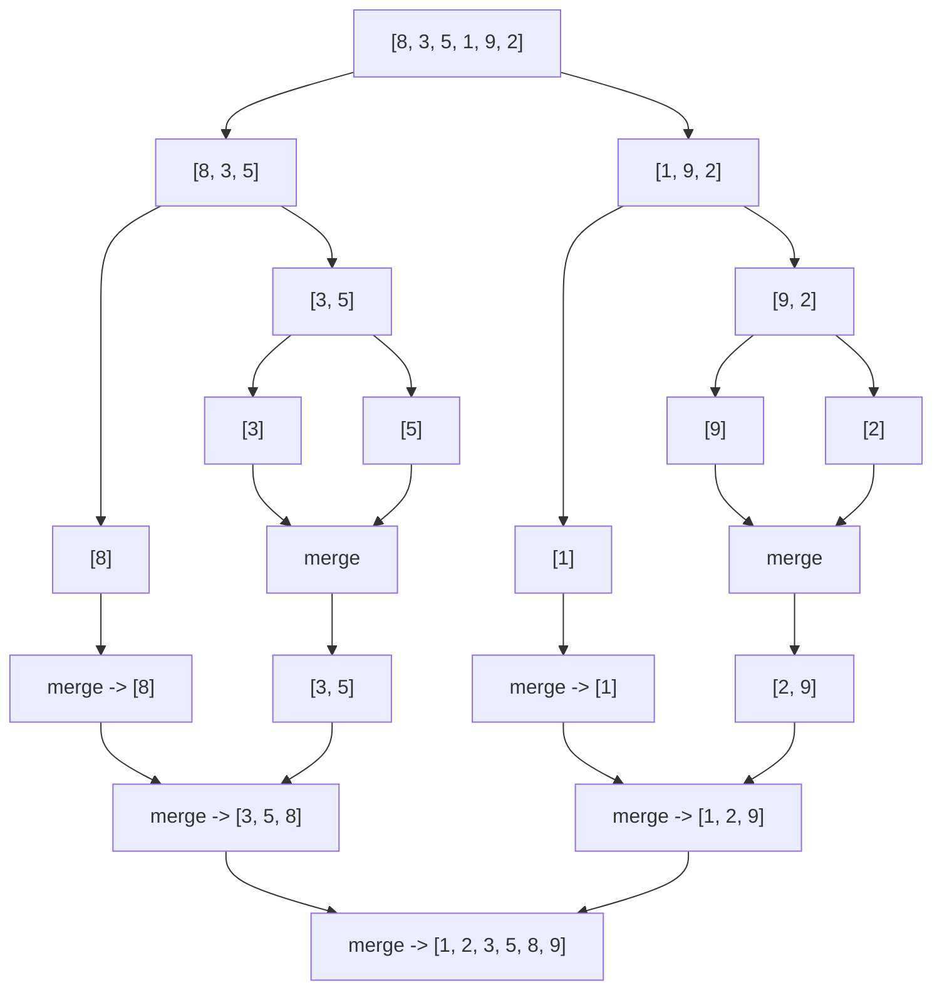

# Sorting Algorithms

> **Sorting** is the process of arranging elements of a collection into a defined order, and it is the canonical vehicle interviewers use to probe your grasp of time/space trade-offs, recursion, and algorithm design paradigms.

## Why it matters

Sorting questions rarely test whether you can call `sort()` - they test whether you understand *why* one algorithm beats another for a given input shape, memory budget, or stability requirement. Interviewers use sorting to check if you can reason about best/average/worst case complexity, recognize divide-and-conquer as a design pattern, and trace recursive execution by hand. It's also a springboard into harder questions: external sorting, k-way merges, and choosing the right algorithm for nearly-sorted or bounded-range data.

## Comparison Table

| Algorithm | Best | Average | Worst | Space | Stable | In-place |
|---|---|---|---|---|---|---|
| Bubble sort | O(n) | O(n²) | O(n²) | O(1) | Yes | Yes |
| Selection sort | O(n²) | O(n²) | O(n²) | O(1) | No | Yes |
| Insertion sort | O(n) | O(n²) | O(n²) | O(1) | Yes | Yes |
| Merge sort | O(n log n) | O(n log n) | O(n log n) | O(n) | Yes | No |
| Quicksort | O(n log n) | O(n log n) | O(n²) | O(log n) | No | Yes |
| Heap sort | O(n log n) | O(n log n) | O(n log n) | O(1) | No | Yes |

Notes:
- Bubble sort hits O(n) best case only with an early-exit flag when no swaps occur in a pass.
- Insertion sort is the best choice for small or nearly-sorted arrays despite its O(n²) worst case - many production sorts (e.g., Timsort) fall back to it for small runs.
- Quicksort's worst case (already-sorted input with a naive pivot) is usually avoided with randomized or median-of-three pivot selection.
- "Stable" means equal elements keep their relative input order - important when sorting by a secondary key after already sorting by a primary one.
- Merge sort's O(n) space comes from the auxiliary array used during merging; heap sort and quicksort (in-place partitioning) sort within the input array.

## Divide and Conquer

Merge sort and quicksort are both **divide-and-conquer** algorithms: they split a problem into smaller subproblems of the same shape, solve those recursively, then combine the results.

- **Divide**: split the array into (roughly) equal halves or partitions.
- **Conquer**: recursively sort each piece; the recursion bottoms out at arrays of size 0 or 1, which are trivially sorted.
- **Combine**: merge sort does the real work here (merging two sorted halves); quicksort does the real work in the divide step (partitioning around a pivot), so its combine step is a no-op.

This split of "where the work happens" is the key distinction interviewers look for: merge sort's cost is dominated by the merge step, while quicksort's cost is dominated by the partition step.



## Merge Sort Implementation

```python
def merge_sort(arr):
    if len(arr) <= 1:
        return arr

    mid = len(arr) // 2
    left = merge_sort(arr[:mid])
    right = merge_sort(arr[mid:])

    return merge(left, right)


def merge(left, right):
    result = []
    i = j = 0

    while i < len(left) and j < len(right):
        if left[i] <= right[j]:   # <= keeps the sort stable
            result.append(left[i])
            i += 1
        else:
            result.append(right[j])
            j += 1

    result.extend(left[i:])
    result.extend(right[j:])
    return result
```

The `<=` comparison (rather than `<`) is what makes this implementation stable: when elements are equal, the one from the left half is taken first, preserving original order.

## Quicksort Implementation

```python
def quicksort(arr, low=0, high=None):
    if high is None:
        high = len(arr) - 1

    if low < high:
        pivot_index = partition(arr, low, high)
        quicksort(arr, low, pivot_index - 1)
        quicksort(arr, pivot_index + 1, high)

    return arr


def partition(arr, low, high):
    pivot = arr[high]
    i = low - 1

    for j in range(low, high):
        if arr[j] <= pivot:
            i += 1
            arr[i], arr[j] = arr[j], arr[i]

    arr[i + 1], arr[high] = arr[high], arr[i + 1]
    return i + 1
```

Quicksort sorts in-place (O(log n) space for the recursion stack) but is not stable, because the partition step can reorder equal elements relative to each other.

## Choosing an Algorithm

- **Need stability** (e.g., sorting by one key after another): merge sort, or insertion sort for small inputs.
- **Memory constrained, no extra array allowed**: heap sort (guaranteed O(n log n), O(1) space) or quicksort (usually fast, but worst case O(n²)).
- **Data is nearly sorted or small (n < ~20-50)**: insertion sort, often used as the base case inside merge sort/quicksort hybrids.
- **Need guaranteed worst-case performance** (e.g., real-time systems): heap sort or merge sort, never plain quicksort.
- **External sorting** (data doesn't fit in memory): merge sort, because it accesses data sequentially and merges naturally across disk chunks.

## Common Interview Questions

**Q: Why is quicksort usually preferred over merge sort in practice despite a worse worst case?**
A: Quicksort sorts in-place with O(log n) auxiliary space versus merge sort's O(n), and it has better cache locality and lower constant factors due to fewer data movements and no allocation for a temporary array. With randomized or median-of-three pivot selection, the O(n²) worst case becomes extremely unlikely in practice.

**Q: What does it mean for a sort to be stable, and when does it matter?**
A: A stable sort preserves the relative order of elements that compare equal. It matters when you sort by multiple keys in sequence - for example, sort a list of people by name, then stably sort by age, and people with the same age remain ordered by name.

**Q: Can you sort in better than O(n log n)?**
A: Not for comparison-based sorting - O(n log n) is the proven lower bound, since a comparison sort is equivalent to determining one ordering out of n! possibilities, requiring log2(n!) = O(n log n) comparisons. Non-comparison sorts like counting sort, radix sort, and bucket sort can achieve O(n + k) or O(nk) by exploiting structure in the data (bounded integer ranges, fixed-width keys), rather than comparing elements directly.

**Q: Walk through how quicksort's partition step works.**
A: Pick a pivot (commonly the last element), then scan the array maintaining a boundary index for "elements known to be <= pivot." For each element, if it's <= pivot, swap it into the boundary region and advance the boundary. At the end, swap the pivot into place right after the boundary, so everything left of it is <= pivot and everything right is greater.

**Q: Why does merge sort need O(n) extra space?**
A: The merge step combines two sorted subarrays into one sorted array, and doing that in-place without extra storage would require excessive shifting, destroying the O(n log n) time guarantee. Implementations typically allocate a temporary array to hold the merged result before copying it back.

**Q: When would you choose heap sort over both merge sort and quicksort?**
A: When you need O(1) extra space and a guaranteed O(n log n) worst case simultaneously - merge sort needs O(n) space, and quicksort can degrade to O(n²). The trade-off is that heap sort has poor cache locality and is not stable.

**Q: How would you detect if an array is already sorted, and how does that affect algorithm choice?**
A: A single linear scan checking `arr[i] <= arr[i+1]` for all i detects this in O(n). For nearly-sorted data, insertion sort or bubble sort with an early-exit flag can run close to O(n), while naive quicksort with a fixed pivot can degrade to O(n²) on already-sorted input - a good reason to randomize pivot choice.

## Related

- [Big-O Complexity](complexity.md) - the notation used throughout this comparison
- [Recursion](recursion.md) - the technique underlying merge sort and quicksort's divide-and-conquer structure
