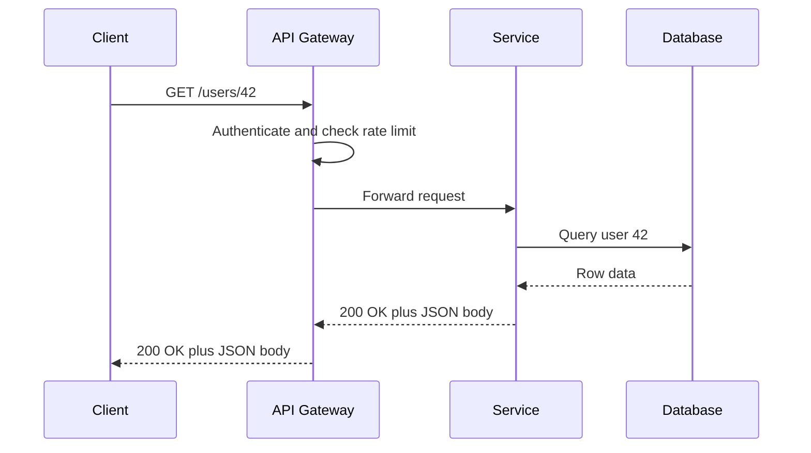
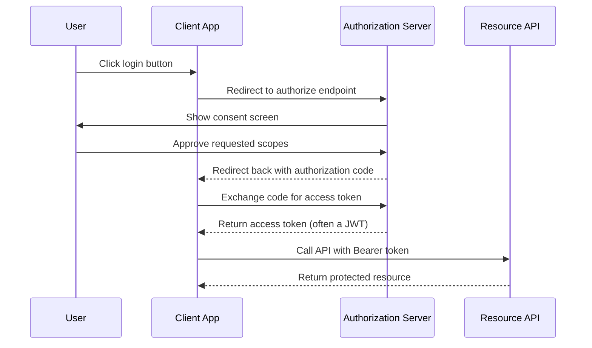

# API Concepts

> An **API** (Application Programming Interface) is a contract that lets two pieces of software exchange data and trigger behavior without either side needing to know the other's internal implementation.

## Why it matters

API design questions show up in nearly every backend interview because they reveal whether a candidate has actually operated a service in production, not just built one. Idempotency, statelessness, versioning, pagination, and rate limiting separate a toy endpoint from an API that survives retries, scale, and years of client integrations. Auth questions (API keys vs OAuth vs JWT) check whether you understand the difference between identifying a caller and authorizing what it can do.

## What Is an API?

An API defines the methods, data formats, and rules two systems use to communicate. In HTTP-based APIs, this usually means:

- **Endpoint** - a URL that represents a resource or action, e.g. `https://api.example.com/v1/users/42`.
- **Method** - the verb describing the intended operation (`GET`, `POST`, `PUT`, `PATCH`, `DELETE`).
- **Payload** - the request or response body, typically JSON.
- **Status code** - a machine-readable outcome (`200`, `201`, `400`, `401`, `404`, `429`, `500`).

| Style | Transport / Format | Typical Fit |
|---|---|---|
| REST | HTTP + JSON | General-purpose CRUD APIs |
| GraphQL | HTTP + a query language | Clients need flexible, shaped responses |
| SOAP | HTTP/SMTP + XML, strict contracts | Legacy enterprise, formal service contracts |
| gRPC | HTTP/2 + Protocol Buffers | Low-latency internal service-to-service calls |

See [rest.md](rest.md), [graphql.md](graphql.md), and [soap.md](soap.md) for style-specific detail.

## The Request/Response Cycle

Every API call is fundamentally a round trip: a client sends a request, something processes it, and a response comes back with a status and a body.



The gateway layer commonly handles cross-cutting concerns - auth, rate limiting, transformation, caching - so individual services don't reimplement them.

## Idempotency

An operation is **idempotent** if calling it once has the same effect as calling it many times. This matters because networks fail: a client that times out waiting for a response often retries, and idempotent methods make that safe.

| Method | Idempotent | Safe (no side effects) | Notes |
|---|---|---|---|
| GET | Yes | Yes | Read-only |
| PUT | Yes | No | Replaces a resource entirely; repeating it gives the same end state |
| DELETE | Yes | No | Deleting an already-deleted resource is still "deleted" |
| POST | No | No | Typically creates a new resource each time unless an idempotency key is used |
| PATCH | Depends | No | Idempotent only if the update is a full replacement, not a relative change like "increment by 1" |

For non-idempotent operations like payments, APIs often accept an **idempotency key** (a client-generated unique ID) so the server can detect and safely ignore duplicate retries.

## Statelessness

REST APIs are typically designed to be **stateless**: the server holds no memory of previous requests from a client, and every request carries all the information needed to process it (credentials, context, etc.). This has real consequences:

- Any server instance can handle any request, making horizontal scaling and load balancing straightforward.
- There's no server-side session to lose if an instance crashes.
- State is carried by the client, usually via a bearer token or JWT rather than a session ID.

The trade-off: requests can get larger, and the server can't push data without the client asking - which is why webhooks and streaming exist for real-time needs (see [streaming.md](streaming.md)).

## Versioning

APIs change, but existing clients can't be forced to update on your schedule. Versioning lets you evolve an API without breaking consumers.

| Strategy | Example | Pros | Cons |
|---|---|---|---|
| URI path | `/v1/users` | Explicit, easy to route and cache | Clutters URLs; encourages full-resource duplication |
| Custom header | `Accept: application/vnd.api+json; version=1` | Keeps URLs clean | Less discoverable; harder to test in a browser |
| Query parameter | `/users?version=1` | Simple to add | Easy to omit by accident; complicates caching |

Regardless of strategy, prefer additive change (new optional fields) over breaking change, plus a clear deprecation timeline before removing an old version.

## Pagination

Returning an entire dataset in one response doesn't scale. Pagination breaks large result sets into pages.

| Approach | Mechanism | Pros | Cons |
|---|---|---|---|
| Offset/limit | `?offset=40&limit=20` | Simple to implement; supports jumping to an arbitrary page | Slow on large offsets (databases still scan skipped rows); results shift if rows are inserted/deleted mid-pagination |
| Cursor-based | `?after=<opaque_token>&limit=20` | Stable and efficient even as data changes underneath; scales well | No random access to an arbitrary page; cursor logic is more complex to build |

Cursor-based pagination is generally preferred for large, frequently-changing datasets; offset/limit is fine for small, mostly-static ones.

## Rate Limiting

Rate limiting caps how many requests a client can make in a given window, protecting the service from abuse, accidental overload, and noisy-neighbor clients. Common algorithms:

- **Fixed window** - count requests per fixed time block (e.g. per minute); simple but allows bursts at window boundaries.
- **Sliding window** - smooths that boundary effect by tracking requests over a rolling interval.
- **Token bucket** - a bucket refills at a steady rate; each request consumes a token, allowing controlled bursts up to the bucket size.
- **Leaky bucket** - requests are processed at a constant rate regardless of burst, smoothing output.

A rate-limited API typically returns `429 Too Many Requests`, with `Retry-After` and `X-RateLimit-*` headers telling the client when to try again.

## Authentication and Authorization

Authentication answers "who (or what) is calling?"; authorization answers "what is it allowed to do?" APIs commonly combine several mechanisms:

| Method | Proves | Typical Use | Notes |
|---|---|---|---|
| API Key | Identity of the calling application | Server-to-server calls, simple public APIs | No user context; must be treated as a secret, not just an identifier |
| OAuth 2.0 | Delegated authorization on behalf of a user | Third-party access ("Sign in with Google", granting a scoped token) | A framework of flows, not a token format itself |
| JWT | Self-contained, signed claims | Access/session tokens issued after login or an OAuth exchange | Verifiable without a database lookup; hard to revoke before it expires |

A JWT is just three base64url-encoded parts joined by dots:

```text
<header>.<payload>.<signature>
```

The header names the signing algorithm, the payload carries claims (user ID, scopes, expiry), and the signature lets the server verify the token hasn't been tampered with - without needing to store session state.

OAuth 2.0's authorization code flow, the most common browser-based pattern:



## Common Interview Questions

**Q: What makes an HTTP method idempotent, and why does it matter?**
A: Repeating the same request any number of times produces the same end state as doing it once. It matters because clients retry on timeouts or dropped connections, and idempotent methods make those retries safe without risking duplicate side effects.

**Q: Why is statelessness a core REST constraint?**
A: It means the server keeps no per-client session between requests, so any instance can handle any request. That makes horizontal scaling and load balancing simple and removes the risk of losing session state when an instance restarts.

**Q: Offset-based vs cursor-based pagination - when would you choose each?**
A: Offset/limit is simplest and fine for small or static datasets and when random page access is needed. Cursor-based pagination is preferred at scale or when the underlying data changes frequently, since it stays stable and efficient even as rows are inserted or deleted.

**Q: What's the difference between authentication and authorization?**
A: Authentication verifies who or what is making the request (identity). Authorization determines what that authenticated identity is allowed to do (permissions/scopes). An API key or JWT signature handles authentication; scopes or roles in the token handle authorization.

**Q: How would you version a public API without breaking existing clients?**
A: Prefer additive, backward-compatible changes (new optional fields) whenever possible. When a breaking change is unavoidable, introduce a new version (via URI path or header), support both in parallel, and give clients a clear, documented deprecation timeline before retiring the old one.

**Q: How does rate limiting protect an API, and what should a client do when limited?**
A: It caps request volume per client to prevent overload and abuse, using algorithms like token bucket or sliding window. When limited, the API returns `429` with headers like `Retry-After`, and a well-behaved client should back off and retry after that interval rather than hammering the endpoint.

**Q: Why use a JWT instead of a server-side session for authentication?**
A: A JWT is self-contained and signed, so any service can verify it without a shared session store or database lookup, which fits stateless, horizontally scaled architectures. The trade-off is that a JWT can't be easily revoked before it expires, since no server tracks its validity centrally.

## Related

- [rest.md](rest.md) - REST-specific constraints, resource modeling, and HTTP semantics
- [graphql.md](graphql.md) - a query-based alternative to fixed REST endpoints
- [soap.md](soap.md) - the older, XML-based, contract-first API style REST largely replaced
- [streaming.md](streaming.md) - when request/response polling isn't enough and you need continuous data
- [kafka.md](kafka.md) - event-driven communication as an alternative to synchronous API calls
