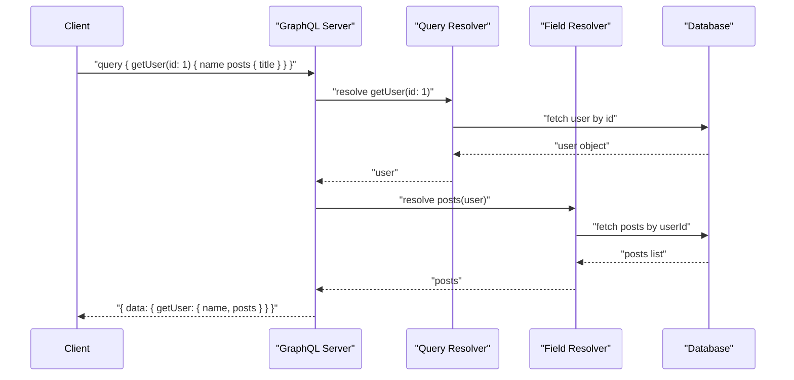
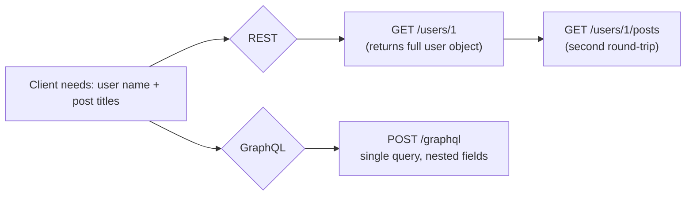

# GraphQL

> **GraphQL** is a query language and runtime for APIs that lets clients request exactly the data they need through a single, strongly-typed endpoint.

## Why it matters

Interviewers ask about GraphQL to see if you understand the trade-offs between flexible, client-driven data fetching and the simplicity of REST. It also tests whether you grasp schema design, resolver execution, and the operational challenges (caching, N+1 queries, security) that come with giving clients this much control. Expect follow-up questions comparing it directly to REST and probing how you'd solve performance and security issues in production.

## Core Components

GraphQL APIs are built from five core pieces:

- **Schema**: A strongly-typed contract that defines every type, field, and operation the API supports. It's the single source of truth for what clients can ask for.
- **Query**: Read operation, roughly equivalent to `GET` in REST.
- **Mutation**: Write operation for creating, updating, or deleting data.
- **Subscription**: A long-lived operation (typically over WebSockets) that pushes real-time updates to clients.
- **Resolver**: A function attached to each field in the schema that knows how to fetch or compute that field's value.

## Schema and Types

The schema defines object types, their fields, and the root operation types (`Query`, `Mutation`, `Subscription`). Fields can be scalars (`String`, `Int`, `Boolean`, `ID`, `Float`), other object types, or lists of either. A trailing `!` marks a field as non-nullable.

```graphql
type User {
  id: ID!
  name: String!
  email: String!
}

type Query {
  getUser(id: ID!): User
}

type Mutation {
  createUser(name: String!, email: String!): User
}

type Subscription {
  userAdded: User
}
```

## Queries, Mutations, and Subscriptions

**Query** - fetch data, specifying only the fields you need:

```graphql
query {
  getUser(id: "1") {
    name
    email
  }
}
```

**Mutation** - modify data on the server:

```graphql
mutation {
  createUser(name: "Alice", email: "alice@example.com") {
    id
    name
  }
}
```

**Subscription** - receive real-time updates when an event occurs:

```graphql
subscription {
  userAdded {
    id
    name
  }
}
```

**Variables** make queries dynamic and reusable instead of hardcoding values into the query string:

```graphql
query GetUser($id: ID!) {
  getUser(id: $id) {
    name
    email
  }
}
```

```json
{ "id": "1" }
```

**Fragments** let you reuse a named set of fields (e.g. `fragment UserFields on User { id name email }`) across multiple queries instead of repeating field lists.

## Resolvers

A resolver is a function that returns the value for a single field. The GraphQL runtime walks the query, calling the matching resolver for each requested field, passing along the parent object's resolved value so nested fields can use it.

```javascript
const resolvers = {
  Query: {
    getUser: (_, { id }) => getUserById(id),
  },
  Mutation: {
    createUser: (_, { name, email }) => createUser(name, email),
  },
};
```

Resolving a query is a tree walk: the root resolver runs first, then its result is passed down so field resolvers on nested types can run against it.



Because each field is resolved independently, naively resolving a list's nested field (like `posts` for every user) triggers one database call per item - the classic **N+1 problem**. Batching libraries like DataLoader collapse these into a single query per request.

## Single Endpoint vs REST

GraphQL exposes one endpoint (typically `POST /graphql`); the query body - not the URL - determines what data comes back. REST exposes many endpoints, one per resource, with the response shape fixed by the server.

| Feature | GraphQL | REST |
|---|---|---|
| Endpoints | Single endpoint | Multiple resource-based endpoints |
| Data fetching | Client specifies exact fields | Server determines response shape |
| Over-fetching | No (only requested fields returned) | Common (fixed response payloads) |
| Under-fetching | No (nested queries in one request) | Common (requires multiple round-trips) |
| Versioning | Fields evolve without new versions | Often requires `/v2` endpoints |
| Caching | Harder (single endpoint, POST-based) | Easy (HTTP caching per URL) |
| Tooling | Requires GraphQL server/client | Native HTTP tooling everywhere |

Over-fetching happens in REST when an endpoint returns more fields than the client needs (e.g., a `/users/1` endpoint returning 20 fields when the UI only shows a name). Under-fetching happens when a single REST call isn't enough, forcing the client to chain multiple requests (e.g., fetching a user, then separately fetching their posts). GraphQL solves both by letting the client describe the exact shape of data across nested relationships in one request.



## Errors and Introspection

GraphQL always returns HTTP 200 for a well-formed request, even on failure, and reports problems in an `errors` array alongside `data`:

```json
{
  "data": null,
  "errors": [
    {
      "message": "User not found",
      "locations": [{ "line": 2, "column": 3 }],
      "path": ["getUser"]
    }
  ]
}
```

**Introspection** lets clients query the schema itself, which is what powers tools like GraphiQL and code generators:

```graphql
{
  __schema {
    types {
      name
      fields {
        name
      }
    }
  }
}
```

## Pagination

Cursor-based pagination (the Relay connection pattern) is the standard approach for large or frequently-changing datasets, since offset-based pagination can skip or duplicate items when data changes between pages. A `UserConnection` type wraps `edges` (each with a `cursor` and a `node`) and a `pageInfo` object exposing `hasNextPage` and `endCursor`, letting clients page forward without relying on numeric offsets.

## Authentication and Authorization

GraphQL has no built-in auth model - it's handled the same way as any HTTP API, typically via a token passed in headers, verified once, and made available to every resolver through a shared context object:

```javascript
const server = new ApolloServer({
  typeDefs,
  resolvers,
  context: ({ req }) => {
    const token = req.headers.authorization || "";
    const user = verifyToken(token);
    return { user };
  },
});
```

Authorization checks (does this user have permission for this field?) then happen inside individual resolvers using that context.

## Benefits and Drawbacks

Benefits: efficient fetching (only requested fields), a strongly typed, self-documenting schema, a single endpoint instead of many resource URLs, no over/under-fetching, and real-time updates via subscriptions.

Trade-offs: more setup and learning curve than REST, harder HTTP caching (no per-resource URL), parsing/resolving arbitrary queries costs more than serving a fixed response, and unrestricted queries can be abused for denial-of-service - so query depth/complexity limits and rate limiting are essential.

## Tools and Ecosystem

**Apollo Server/Client** and **GraphQL.js** are the most common server/client implementations; **GraphQL Code Generator** produces typed code from a schema; **DataLoader** batches per-request fetches to solve the N+1 problem; **Hasura** auto-generates a GraphQL API over a database.

**Schema stitching** combines multiple independent schemas into one. **Federation** goes further, letting multiple services each own part of a distributed schema while clients see a single unified API - the more common approach in modern microservice architectures.

## Common Interview Questions

**Q: How is GraphQL different from REST?**
A: REST exposes multiple endpoints where the server fixes the response shape, often causing over-fetching or under-fetching. GraphQL exposes a single endpoint where the client specifies exactly which fields it needs, including across nested relationships, in one request.

**Q: What problem do resolvers solve, and what's the N+1 problem?**
A: Resolvers are functions that fetch or compute the value for one schema field, letting each field's data source be independent (a database, a microservice, a cache). The N+1 problem occurs when a list field's resolver runs once per item (e.g., fetching posts for each of 50 users individually); DataLoader batches these into a single query.

**Q: How does GraphQL handle versioning compared to REST?**
A: GraphQL generally avoids versioned endpoints. New fields can be added to types without breaking existing clients, and deprecated fields are marked with `@deprecated` rather than removed, so schemas evolve in place.

**Q: Why is caching harder in GraphQL than REST?**
A: REST responses are cacheable per URL using standard HTTP caching. GraphQL typically uses a single `POST /graphql` endpoint with varying query bodies, so there's no natural cache key; solutions include persisted queries, response caching keyed on the query+variables hash, or caching at the resolver/data-source level.

**Q: How do you secure a GraphQL API against abusive queries?**
A: Limit query depth and complexity, set timeouts, use rate limiting, and disable introspection in production if the schema shouldn't be public. Without these, a deeply nested or broad query can force the server to do disproportionate work relative to a single request.

**Q: What is schema federation and why would you use it?**
A: Federation lets multiple backend services each own and serve a portion of a single logical GraphQL schema, while a gateway composes them into one API for clients. It's used to let independent teams own their part of the graph without one team owning a giant monolithic schema.

**Q: When would you choose REST over GraphQL?**
A: When the API is simple, resource-shaped, and benefits from HTTP-native caching, or when the team lacks the operational maturity to manage schema evolution, query complexity limits, and resolver performance that GraphQL requires.

## Related

- [REST](rest.md) - the architectural style GraphQL is most often compared and contrasted against
- [SOAP](soap.md) - another API paradigm with contrasting design philosophy (rigid contracts vs flexible queries)
- [Streaming](streaming.md) - relevant background for how GraphQL subscriptions deliver real-time data
- [API Concepts](concepts.md) - general API design concepts referenced throughout this comparison
