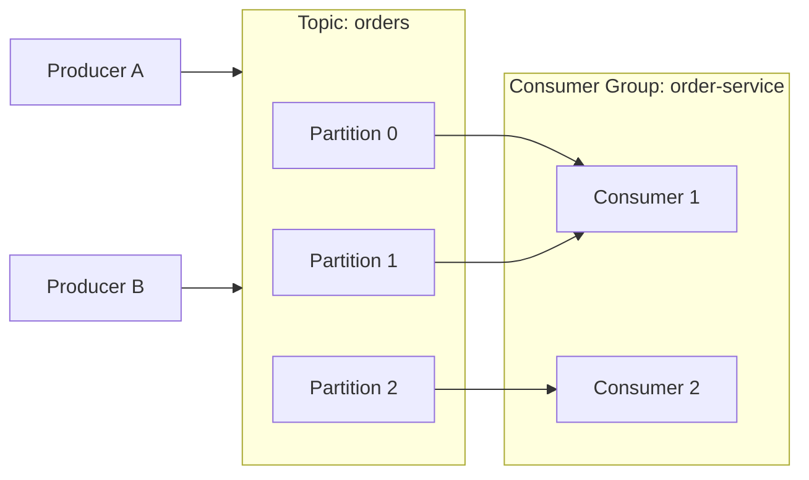
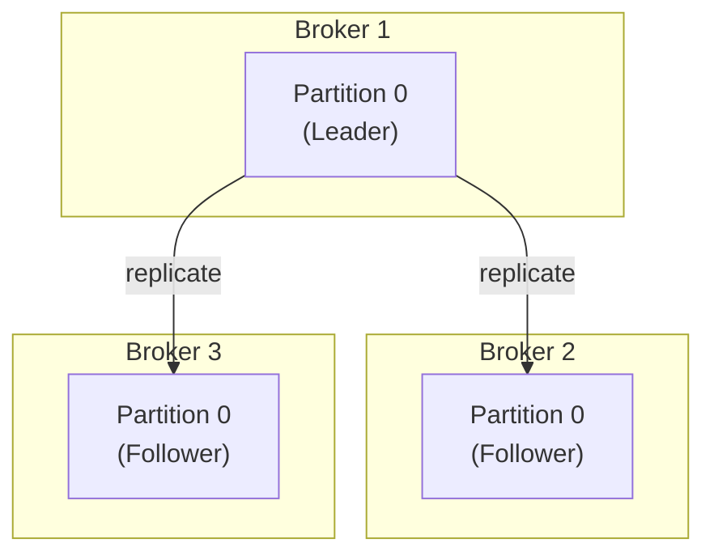

# Apache Kafka

> **Apache Kafka** is a distributed event streaming platform that stores and moves records as an ordered, replicated, append-only log, letting many producers and consumers exchange high-throughput data reliably and in near real time.

## Why it matters

Kafka underpins event-driven architectures, microservice decoupling, log aggregation, and stream processing at most large-scale systems. Interviewers ask about it to see whether a candidate understands distributed systems trade-offs: how ordering, durability, and scalability are balanced through partitioning and replication, and how consumer groups achieve parallelism without duplicating work. It's also a good proxy for whether someone has operated a real messaging system in production, not just called a client library.

## Core Components

- **Producer**: A client that publishes (writes) records to Kafka topics. Producers choose which partition a record goes to, either via a key hash, round-robin, or a custom partitioner.
- **Consumer**: A client that subscribes to topics and reads records in order, tracking its position via offsets.
- **Broker**: A single Kafka server that stores partitions and serves reads/writes. A Kafka cluster is made up of multiple brokers.
- **Topic**: A named, logical stream of records. Producers write to topics; consumers read from topics.
- **Partition**: An ordered, immutable sub-log within a topic. Partitions are the unit of parallelism and distribution across brokers.
- **Consumer Group**: A set of consumers that cooperate to consume a topic, each partition assigned to exactly one consumer within the group.
- **Controller/Metadata layer**: Coordinates partition leadership and cluster metadata. Older Kafka versions used ZooKeeper for this; newer versions use KRaft, Kafka's built-in Raft-based consensus, removing the ZooKeeper dependency.

## Topics, Partitions, and Offsets

A topic is split into one or more partitions so that its data and load can be spread across brokers. Each partition is an append-only log: records are written sequentially and each gets a monotonically increasing **offset**, a per-partition sequence number that a consumer uses to track its read position and resume after a restart or failure.

Key properties:

- Ordering is guaranteed **only within a partition**, not across the whole topic.
- Records with the same key are routed to the same partition (via a hash of the key), so per-key ordering is preserved.
- More partitions mean more parallelism for consumers, but also more overhead for the cluster to manage (open files, replication traffic, leader elections).

| Concept | Scope | Purpose |
|---|---|---|
| Topic | Logical stream | Groups related records for producers/consumers |
| Partition | Physical log within a topic | Enables parallelism and horizontal scaling |
| Offset | Position within a partition | Lets a consumer track and resume progress |

## Producers and Consumers

Producers send records asynchronously and can tune reliability with the `acks` setting:

```text
acks=0   -> fire and forget, fastest, may lose data
acks=1   -> leader confirms write, safer, replicas may lag
acks=all -> leader and in-sync replicas confirm, strongest durability
```

Consumers pull records from brokers (Kafka is pull-based, not push-based) and commit offsets, either automatically on an interval or manually after processing, to record progress. Manual commits give stronger processing guarantees but require careful handling of at-least-once vs. exactly-once semantics.

## Consumer Groups and Parallelism

A consumer group lets multiple consumer instances share the work of reading a topic: Kafka assigns each partition to exactly one consumer in the group at a time, so records are never processed twice by the same group. If a topic has more partitions than consumers, some consumers read multiple partitions; if there are more consumers than partitions, the extras sit idle. Adding or removing consumers triggers a **rebalance**, where partition assignments are recomputed.

Different consumer groups are fully independent: each group gets its own copy of every record, which is how Kafka supports multiple independent applications reading the same topic.



## Brokers, Replication, and Fault Tolerance

Each partition has a configured **replication factor**: one broker holds the **leader** replica that serves all reads and writes, while other brokers hold **follower** replicas that copy data from the leader. Followers that are caught up are called **in-sync replicas (ISR)**. If the leader broker fails, Kafka elects a new leader from the ISR set, so the partition stays available with no data loss (as long as `acks=all` was used and at least one ISR was up to date).



This design is what gives Kafka its durability: data is written to disk and copied to multiple brokers, so a single broker or disk failure does not lose committed records.

## Ordering Guarantees

- Kafka guarantees strict ordering **within a single partition**: records are appended and read in the order they were written.
- There is **no ordering guarantee across partitions** of the same topic.
- To get ordering for a logical entity (e.g., all events for one order ID), use that entity's ID as the message key so all its events land in the same partition.
- Increasing partition count for an existing topic can break key-based ordering guarantees going forward, since the key-to-partition mapping changes.

## Retention

Kafka retains records for a configurable period or size regardless of whether they have been consumed, which is a key difference from traditional message queues that delete messages once consumed. Retention can be:

- Time-based (e.g., keep records for 7 days).
- Size-based (e.g., keep up to a fixed size per partition).
- Compacted (keep only the latest record per key, used for things like changelog topics).

## Common Interview Questions

**Q: What is the difference between a Kafka topic and a partition?**
A: A topic is the logical named stream that producers write to and consumers read from. A partition is a physical, ordered sub-log of that topic; a topic is divided into one or more partitions so the data and read/write load can be distributed across brokers.

**Q: How does Kafka guarantee message ordering?**
A: Ordering is only guaranteed within a single partition, not across an entire topic. To keep related events in order, producers use a message key (e.g., an entity ID) so all its records hash to the same partition.

**Q: What is the difference between a consumer and a consumer group?**
A: A consumer is a single client reading from a topic. A consumer group is a set of consumers that split the partitions of a topic between them, so each partition is read by exactly one consumer in the group, enabling parallel, non-duplicated consumption.

**Q: What happens when a broker holding a partition leader fails?**
A: Kafka detects the failure and promotes one of the in-sync replicas (ISR) to be the new leader for that partition, so the topic stays available. Producers and consumers with up-to-date metadata are redirected to the new leader.

**Q: What does the `acks` producer setting control?**
A: It controls the durability/latency trade-off for writes: `acks=0` doesn't wait for any acknowledgment, `acks=1` waits for the partition leader to write the record, and `acks=all` waits for the leader and all in-sync replicas, giving the strongest durability guarantee at the cost of latency.

**Q: Why can't you have more active consumers in a group than partitions?**
A: Kafka assigns each partition to exactly one consumer within a group at a time to avoid duplicate processing. If there are more consumers than partitions, the extra consumers have nothing to be assigned and stay idle until a rebalance changes the assignment.

**Q: How is Kafka different from a traditional message queue like RabbitMQ?**
A: Kafka retains records for a configured time or size regardless of consumption and allows multiple independent consumer groups to re-read the same data, acting like a durable, replayable log. Traditional queues typically remove a message once it's been consumed and acknowledged, and are built around per-message delivery rather than log replay.

## Related

- [Real-Time & Streaming APIs](streaming.md) - broader context on push-based and streaming API styles Kafka is often used to implement
- [API Concepts](concepts.md) - foundational API terminology referenced throughout this topic
