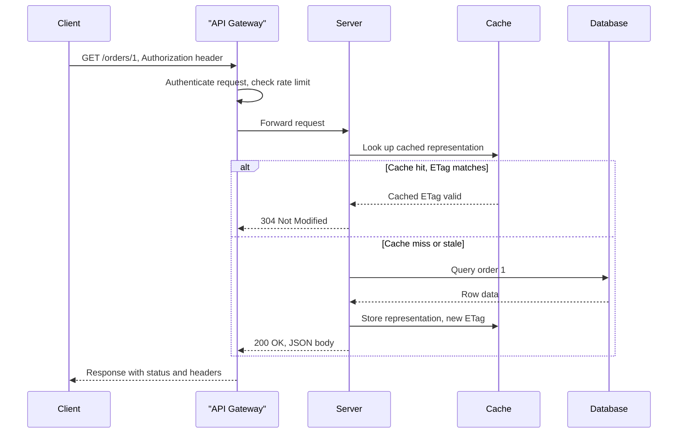

# REST APIs

> **REST** (Representational State Transfer) is an architectural style for networked applications that models everything as a resource, addressed by a URI and manipulated through a uniform set of HTTP methods.

## Why it matters

REST underpins most public and internal HTTP APIs, so interviewers use it to check whether a candidate understands more than "GET fetches, POST creates." They probe for the actual architectural constraints, correct use of idempotency and status codes, and whether you can design a resource model that scales and stays backward compatible. Weak answers describe CRUD-over-HTTP; strong answers reference constraints, maturity levels, and trade-offs against alternatives like GraphQL or gRPC.

## REST Architectural Constraints

Roy Fielding's dissertation defines REST through six constraints. An API that violates them is still "an HTTP API," just not strictly RESTful.

| Constraint | Meaning |
| --- | --- |
| Client-Server | Clients and servers evolve independently; the server doesn't manage UI concerns. |
| Statelessness | Each request carries all context needed to process it; no server-side session state. |
| Cacheability | Responses declare whether they can be cached, to reduce client-server interaction. |
| Uniform Interface | Resources are identified by URIs and manipulated through a fixed set of methods and representations. |
| Layered System | Intermediaries (gateways, load balancers, proxies) can sit between client and server transparently. |
| Code on Demand *(optional)* | Servers can extend client behavior by sending executable code, e.g. JavaScript. |

Statelessness is the constraint interviewers probe most: it means no server-side session, not "no persistent data." Persisted data lives in a database; state about *this request's progress* must not live in server memory between calls.

## HTTP Methods and Idempotency

Idempotency means issuing the same request N times produces the same server state as issuing it once. Safety means the method has no side effects at all.

| Method | Safe | Idempotent | Typical use |
| --- | --- | --- | --- |
| GET | Yes | Yes | Retrieve a resource |
| HEAD | Yes | Yes | Retrieve headers only |
| OPTIONS | Yes | Yes | Discover allowed methods |
| PUT | No | Yes | Replace a resource entirely |
| DELETE | No | Yes | Remove a resource |
| PATCH | No | Not guaranteed | Partially update a resource |
| POST | No | No | Create a resource or trigger an action |

Why PUT is idempotent but POST isn't: `PUT /users/1` with the same body always leaves user 1 in the same final state. `POST /users` called twice creates two users. PATCH is idempotent only if the update is a full-state replacement of specific fields; a PATCH that says "increment counter by 1" is not idempotent even though it's a PATCH.

```http
PUT /users/1 HTTP/1.1
Content-Type: application/json

{ "name": "John", "email": "john@example.com" }
```

## Status Codes

| Code | Meaning | When to use |
| --- | --- | --- |
| 200 OK | Success | Standard successful GET/PUT/PATCH |
| 201 Created | Resource created | Successful POST, include `Location` header |
| 204 No Content | Success, empty body | Successful DELETE or PUT with nothing to return |
| 304 Not Modified | Cached copy is valid | Conditional GET with matching `ETag` |
| 400 Bad Request | Malformed request | Validation failure, bad syntax |
| 401 Unauthorized | Not authenticated | Missing or invalid credentials |
| 403 Forbidden | Authenticated but not allowed | Authorization failure |
| 404 Not Found | No such resource | Unknown URI or ID |
| 409 Conflict | State conflict | Version clash, duplicate unique key |
| 422 Unprocessable Entity | Semantically invalid | Well-formed but fails business rules |
| 429 Too Many Requests | Rate limited | Client exceeded quota |
| 500 Internal Server Error | Server fault | Unhandled exception |
| 503 Service Unavailable | Server overloaded/down | Retry later, often with `Retry-After` |

A common interview trap: returning `200 OK` with an error payload instead of the correct 4xx/5xx status. Clients, proxies, and monitoring tools rely on the status code, not the body, to know what happened.

## Resource Naming

- Use nouns, not verbs: `/orders`, not `/getOrders`.
- Use plural collection names consistently: `/users`, `/users/1`.
- Model relationships with nesting, but keep it shallow: `/users/1/orders`, not `/users/1/orders/2/items/3/reviews`.
- Use query parameters for filtering, sorting, and pagination, not for identifying a resource: `/orders?status=shipped&sort=-createdAt`.
- Avoid trailing slashes and mixed case; prefer lowercase, hyphenated paths for multi-word segments (`/order-items`).
- Version at a boundary you control, most commonly the URI (`/v1/users`) or an `Accept` header (`Accept: application/vnd.company.v1+json`).

## Richardson Maturity Model

The Richardson Maturity Model grades how "RESTful" an API actually is, from plain RPC-over-HTTP up to full hypermedia.

| Level | Name | Characteristic |
| --- | --- | --- |
| 0 | The Swamp of POX | Single endpoint, one HTTP verb (usually POST), operation encoded in the body. Effectively RPC. |
| 1 | Resources | Multiple URIs identify distinct resources, but still mostly one HTTP verb. |
| 2 | HTTP Verbs | Proper use of GET/POST/PUT/DELETE and status codes per resource. Most "REST APIs" in production stop here. |
| 3 | Hypermedia Controls (HATEOAS) | Responses include links describing available next actions, letting clients navigate the API dynamically. |

Most real-world APIs are Level 2. Level 3 is rare in practice because it adds client and server complexity that many teams decide isn't worth the payoff, but it's worth knowing why it exists.

## HATEOAS

Hypermedia as the Engine of Application State means a client shouldn't need out-of-band documentation to know what it can do next; the response tells it, via links.

```json
{
  "id": 1,
  "name": "John",
  "status": "pending",
  "links": [
    { "rel": "self", "href": "/orders/1" },
    { "rel": "cancel", "href": "/orders/1/cancel", "method": "POST" },
    { "rel": "items", "href": "/orders/1/items" }
  ]
}
```

The benefit: if the cancel endpoint moves or a cancel is no longer allowed (order already shipped), the server simply omits or changes that link, and a hypermedia-aware client adapts without a hardcoded URL or a client-side rules engine.

## Request Lifecycle



## Common Interview Questions

**Q: What's the difference between PUT and PATCH?**
A: PUT replaces the entire resource with the payload provided; any field omitted is typically reset to its default or null. PATCH applies a partial update, changing only the fields included in the request.

**Q: Is PATCH idempotent?**
A: Only if the patch describes an absolute end state, e.g. "set status to shipped." A relative patch like "increment quantity by 1" is not idempotent, since repeating it changes the result each time.

**Q: Why is statelessness important in REST, and what does it not mean?**
A: It means the server holds no session context between requests, so any server instance can handle any request, which is essential for horizontal scaling and load balancing. It does not mean the API is forbidden from persisting data in a database.

**Q: What's the difference between 401 and 403?**
A: 401 Unauthorized means the request lacks valid authentication credentials. 403 Forbidden means the caller is authenticated but doesn't have permission to perform that action on that resource.

**Q: What is the Richardson Maturity Model and where do most APIs sit?**
A: It's a four-level scale, 0 to 3, measuring how RESTful an API is, based on use of resources, HTTP verbs, and hypermedia controls. Most production APIs sit at Level 2: correct resources and verbs, but no HATEOAS links.

**Q: How would you design pagination for a large collection endpoint?**
A: Use query parameters like `?page=2&limit=20` or cursor-based parameters like `?cursor=abc123&limit=20` for large, frequently-changing datasets, and return metadata (total count, next cursor or page) alongside the data array so clients can navigate without guessing.

**Q: When would you choose GraphQL or gRPC over REST?**
A: GraphQL fits when clients need flexible, aggregated queries across many resources and want to avoid over- or under-fetching. gRPC fits internal, latency-sensitive service-to-service communication where a shared binary contract and HTTP/2 streaming outweigh REST's human-readability and cacheability.

## Related

- [GraphQL](graphql.md) - flexible query alternative to fixed REST endpoints
- [SOAP](soap.md) - older, contract-first protocol REST largely replaced for public APIs
- [API Concepts](concepts.md) - broader API design and architecture fundamentals
- [Streaming APIs](streaming.md) - when request/response REST isn't the right fit
