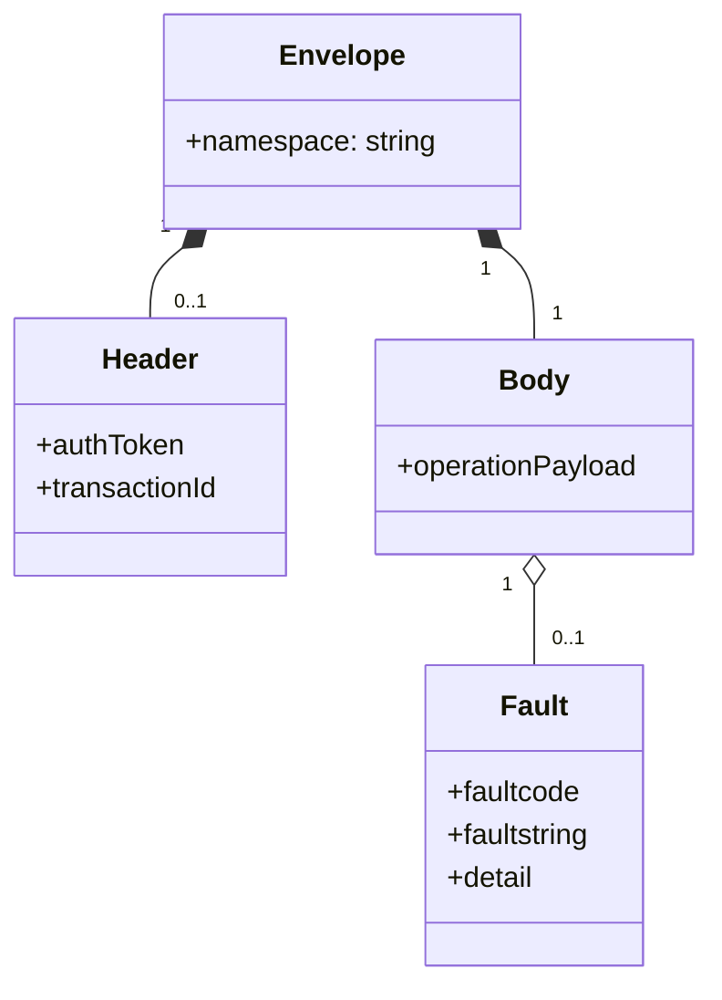
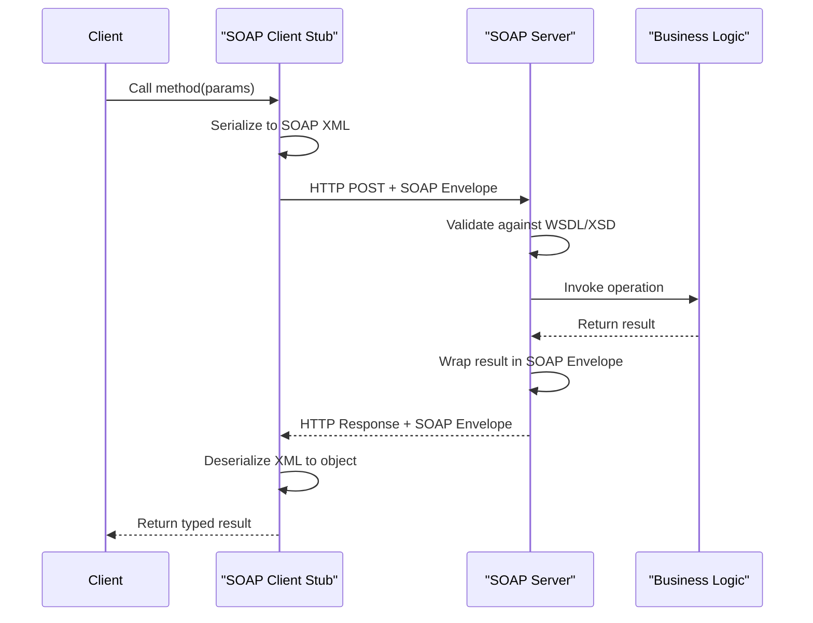

# SOAP (Simple Object Access Protocol)

> **SOAP** is an XML-based messaging protocol for exchanging structured information between systems, typically over HTTP, using a strict envelope format and formal contracts defined in WSDL.

## Why it matters

Interviewers bring up SOAP to check whether you understand API design beyond REST, and to see if you've worked in enterprise environments (banking, telecom, government, healthcare) where SOAP is still the standard. It also tests whether you understand contract-first design, strong typing over the wire, and why standards like WS-Security exist. Even if you never write a new SOAP service, you'll likely maintain or integrate with one.

## Message Structure: Envelope, Header, Body

Every SOAP message is an XML document wrapped in a mandatory `Envelope`, which contains an optional `Header` and a mandatory `Body`.

- **Envelope** - the root element; declares the XML namespace and marks the document as a SOAP message.
- **Header** (optional) - carries metadata that isn't part of the actual payload: authentication tokens, transaction IDs, routing info, or WS-Security credentials. Intermediaries can process the header without touching the body.
- **Body** - the actual payload: the request parameters or the response data (or a `Fault` element if something went wrong).
- **Fault** - a special element inside the Body used to report errors, with standardized sub-elements like `faultcode`, `faultstring`, and `detail`.

```xml
<soap:Envelope xmlns:soap="http://www.w3.org/2003/05/soap-envelope">
  <soap:Header>
    <auth:Token xmlns:auth="urn:example:auth">abc123</auth:Token>
  </soap:Header>
  <soap:Body>
    <m:GetPrice xmlns:m="urn:example:prices">
      <m:StockName>IBM</m:StockName>
    </m:GetPrice>
  </soap:Body>
</soap:Envelope>
```



## WSDL: The Service Contract

WSDL (Web Services Description Language) is an XML document that formally describes a SOAP service: what operations it exposes, what messages (inputs/outputs) each operation takes, the data types involved (usually via an embedded XML Schema), and where the service is hosted (the binding and endpoint address).

Because the contract is machine-readable, tooling can generate client stubs and server skeletons automatically - this is why SOAP is called **contract-first**: you agree on the WSDL, then generate code from it, rather than writing code and documenting it afterward.

Key WSDL sections:

| Element | Purpose |
|---|---|
| `types` | Data types used, usually an inline XSD schema |
| `message` | Defines the shape of a single request or response |
| `portType` (or `interface` in WSDL 2.0) | Groups operations, like an interface |
| `binding` | Specifies the protocol and data format (e.g., SOAP over HTTP) |
| `service`/`port` | The actual network address (URL) where the service is deployed |

## Stateful vs Stateless

SOAP itself doesn't mandate either model, but it's commonly used both ways:

- **Stateless** SOAP services treat each call independently, with no session tied to the transport - similar in spirit to REST. Common in modern SOAP-over-HTTP setups.
- **Stateful** SOAP services can maintain a session or conversation across multiple calls, often using WS-* extensions like WS-Addressing, WS-ReliableMessaging, or session identifiers carried in the SOAP Header. This is more common in older enterprise integrations (e.g., a multi-step transaction that spans several calls and must remember prior context on the server).

Statefulness in SOAP is typically layered on through headers and WS-* specs rather than being a core protocol feature, which is different from how it's discussed in REST (where statelessness is a defining architectural constraint).

## SOAP Request/Response Flow



## SOAP vs REST

| Aspect | SOAP | REST |
|---|---|---|
| Format | XML only | JSON, XML, plain text, etc. |
| Contract | Formal (WSDL), required | Optional (OpenAPI/Swagger) |
| Transport | HTTP, SMTP, TMQ, etc. | Almost always HTTP |
| Style | Operation/RPC-oriented | Resource-oriented (nouns + verbs) |
| Statelessness | Not enforced; can be stateful | Core architectural constraint |
| Error handling | Standardized `Fault` element | HTTP status codes |
| Security | WS-Security (message-level, granular) | Relies on HTTPS/TLS, OAuth, etc. |
| Payload size | Larger (verbose XML, envelope overhead) | Smaller (lightweight JSON) |
| Tooling | Strong code-gen from WSDL | Lighter tooling, more manual |
| Typical use | Enterprise integration, formal contracts | Web/mobile APIs, public APIs |

## When SOAP Is Still Used

SOAP hasn't disappeared - it's still the standard in domains where formal contracts, strict typing, and built-in enterprise-grade features outweigh REST's simplicity:

- **Financial services and banking** - message-level security (WS-Security) and guaranteed delivery (WS-ReliableMessaging) matter more than payload size.
- **Telecom** - many carrier-grade systems and legacy OSS/BSS platforms are built on SOAP.
- **Healthcare and government** - regulatory and interoperability standards (some HL7-related transports, government B2B gateways) still specify SOAP/WSDL.
- **Legacy enterprise integration** - large organizations with SOAP-based middleware (ESBs, mainframe integrations) that would be costly to migrate.
- **Payment gateways and third-party enterprise APIs** - some long-standing vendor APIs remain SOAP-only for backward compatibility.

New public-facing APIs are overwhelmingly REST or GraphQL today, but SOAP remains common in B2B and internal enterprise contexts where its formality is a feature, not a burden.

## Common Interview Questions

**Q: What is a SOAP API? Briefly explain.**
A: SOAP is an XML-based protocol for exchanging structured messages between systems over a transport like HTTP. Every message is wrapped in an Envelope containing an optional Header (metadata like auth tokens) and a mandatory Body (the payload or a Fault). Services are formally described by a WSDL contract, which tools use to generate client and server code.

**Q: What's the difference between SOAP and REST?**
A: SOAP is a protocol with a strict XML message format and a formal WSDL contract; REST is an architectural style built on HTTP verbs and resources, usually using JSON. SOAP has built-in standards for security and reliability (WS-Security, WS-ReliableMessaging); REST relies on HTTP mechanisms like TLS and standard status codes. REST is generally lighter-weight and more common for public web/mobile APIs.

**Q: What is WSDL and why does it matter?**
A: WSDL is an XML document that describes a SOAP service's operations, message formats, data types, and endpoint address. It matters because it enables contract-first development - client and server code can be auto-generated from it, ensuring both sides agree on the exact structure of requests and responses before any code is written.

**Q: Is SOAP stateful or stateless?**
A: SOAP doesn't mandate either. It's commonly used statelessly (each call independent, similar to REST), but it can be made stateful using WS-* extensions or session identifiers carried in the SOAP Header, which is common in older enterprise systems that need multi-step transactions.

**Q: How does SOAP handle errors?**
A: Through a standardized `Fault` element inside the Body, containing sub-elements like `faultcode`, `faultstring`, and optional `detail`. This is different from REST, which typically communicates errors via HTTP status codes (4xx/5xx) plus an application-defined error body.

**Q: Why would a company choose SOAP over REST today?**
A: Mainly for built-in message-level security (WS-Security), guaranteed delivery and reliability (WS-ReliableMessaging), strict typing via XSD, and formal contracts required for regulatory or legacy interoperability - common in banking, telecom, and government systems. It's rarely chosen for new public APIs.

**Q: Can SOAP run over transports other than HTTP?**
A: Yes. SOAP is transport-agnostic and can run over HTTP, SMTP, TCP/JMS, or other protocols, though HTTP is by far the most common in practice.

## Related

- [REST APIs](rest.md) - the more common alternative architectural style, contrasted throughout this page
- [GraphQL](graphql.md) - another API paradigm, useful for comparing query flexibility vs SOAP's rigid contracts
- [API Concepts](concepts.md) - foundational API terminology referenced here
