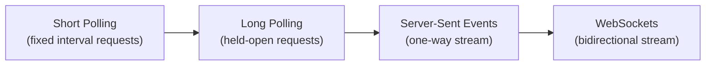
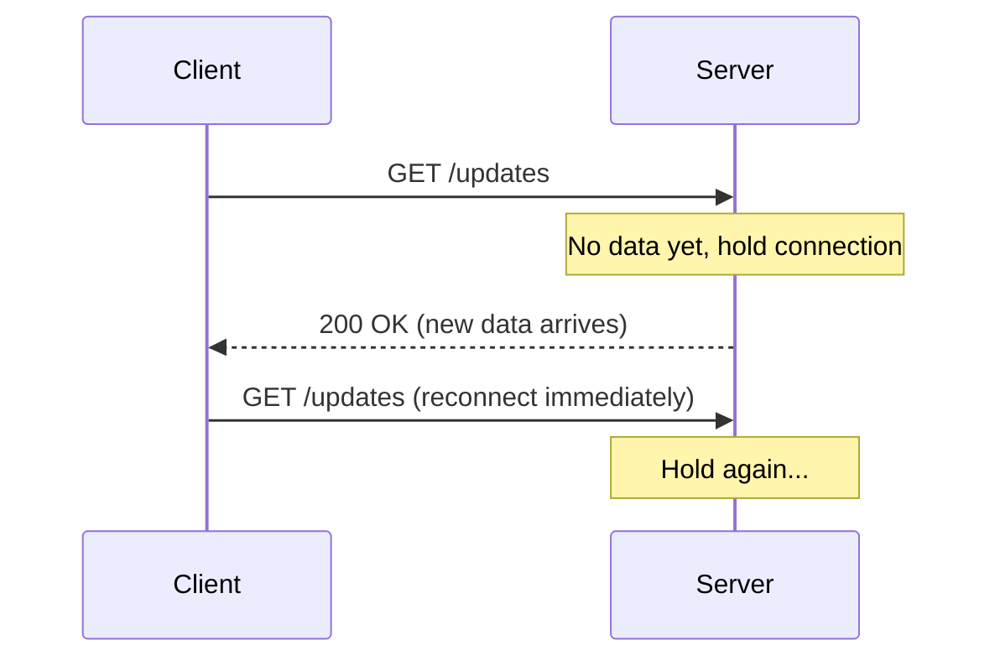
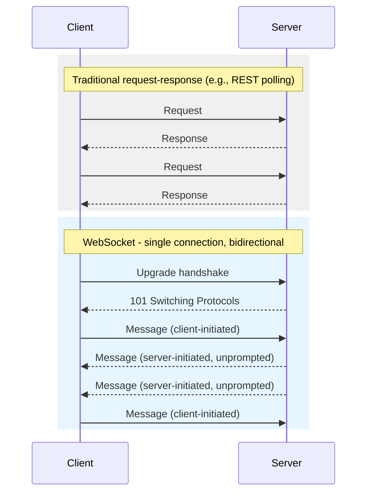

# Real-Time & Streaming APIs

> **Streaming APIs** push data to clients as it becomes available, instead of the client repeatedly asking "is there anything new yet?".

## Why it matters

Most CRUD APIs are request-response: the client asks, the server answers, done. But chat apps, live dashboards, stock tickers, and collaborative editors need the server to tell the client something changed, often with sub-second latency. Interviewers ask this topic to see whether you understand the trade-offs between simplicity, latency, server cost, and browser/infrastructure support - and whether you can pick the right tool instead of reaching for WebSockets by default.

## The Spectrum: Polling to Full Duplex

There are four common patterns, ordered from "client keeps asking" to "server and client both talk whenever they want":

1. **Short polling** - client sends a request on a fixed interval, regardless of whether anything changed.
2. **Long polling** - client sends a request, server holds it open until data is available (or a timeout), then the client immediately reconnects.
3. **Server-Sent Events (SSE)** - client opens one HTTP connection, server streams events over it indefinitely.
4. **WebSockets** - client and server upgrade to a persistent, bidirectional, full-duplex socket.



## Short Polling

The client repeats `GET /updates` every N seconds regardless of whether new data exists.

```http
GET /api/notifications HTTP/1.1
Host: example.com
```

- Simplest to implement - plain HTTP, works everywhere, easy to cache and debug.
- Wastes requests when nothing changed, and introduces latency up to the polling interval.
- Cost and server load scale linearly with number of clients times poll frequency.

Use it for low-frequency updates (e.g., checking a batch job status every 30 seconds) where simplicity beats latency.

## Long Polling

The client makes a request; the server does **not** respond immediately. It holds the connection open until new data exists or a timeout elapses, then responds. The client immediately issues a new request.



- Lower latency than short polling and far fewer wasted requests.
- Still pays HTTP request/response overhead on every cycle, and needs the server to hold many open connections (thread/connection pool pressure).
- Works through most proxies and load balancers without special configuration, since it's just HTTP.

## Server-Sent Events (SSE)

SSE is a single, long-lived HTTP connection where the server streams a sequence of text events using the `text/event-stream` content type. The browser's native `EventSource` API handles reconnection automatically.

```http
GET /api/stream HTTP/1.1
Accept: text/event-stream

HTTP/1.1 200 OK
Content-Type: text/event-stream

data: {"price": 101.2}

data: {"price": 101.5}

```

```js
const source = new EventSource("/api/stream");
source.onmessage = (event) => console.log(JSON.parse(event.data));
```

- One-way only: server to client. The client cannot send data over the same channel (it would issue separate HTTP requests for that).
- Built on plain HTTP/1.1 or HTTP/2, so it passes through standard infrastructure, proxies, and firewalls without special handling.
- Automatic reconnection and last-event-id tracking are built into the browser API, which simplifies client code considerably.
- Not supported natively in all environments (e.g., no built-in `EventSource` in some non-browser runtimes), and browsers historically capped the number of concurrent HTTP/1.1 connections per host, though HTTP/2 multiplexing largely removes that limit.

Use SSE for feeds that are inherently one-directional: live scores, stock prices, notification streams, log tailing, progress updates.

## WebSockets

WebSockets upgrade an initial HTTP request to a persistent TCP-like connection where both sides can send messages at any time, independently, with minimal framing overhead.

```http
GET /chat HTTP/1.1
Upgrade: websocket
Connection: Upgrade
Sec-WebSocket-Key: dGhlIHNhbXBsZSBub25jZQ==
Sec-WebSocket-Version: 13
```

- True full-duplex: client and server both push whenever they want, over one connection.
- Lower per-message overhead than repeated HTTP requests - no headers resent on every message.
- Requires managing connection lifecycle explicitly: reconnection, heartbeats/ping-pong, and backpressure are the application's responsibility (no built-in retry like SSE).
- Stateful connections complicate horizontal scaling - load balancers need sticky sessions or a shared pub-sub layer (e.g., Redis) to fan out messages across server instances.
- Some corporate proxies and older infrastructure block or mishandle the WebSocket upgrade.

Use WebSockets when the client also needs to send frequent, low-latency data: chat, multiplayer games, collaborative editing, trading platforms.

## Request-Response vs. WebSocket: Side by Side



## Comparison Table

| Aspect | Short Polling | Long Polling | SSE | WebSockets |
|---|---|---|---|---|
| Direction | Client-initiated | Client-initiated | Server-to-client only | Bidirectional |
| Latency | High (poll interval) | Low-medium | Low | Lowest |
| Protocol | Plain HTTP | Plain HTTP | HTTP (`text/event-stream`) | Upgraded TCP connection |
| Reconnection | N/A (stateless) | Manual, per request | Automatic (built into browser) | Manual, app-managed |
| Proxy/firewall friendliness | Excellent | Excellent | Very good | Can be blocked |
| Server resource cost | Low per request, adds up at scale | Medium (held connections) | Medium (open connections) | Medium-high (stateful, needs sticky routing at scale) |
| Typical use case | Infrequent status checks | Chat before WebSockets were common, simple notifications | Live feeds, dashboards, logs | Chat, gaming, collaborative editing |

## Common Interview Questions

**Q: When would you choose SSE over WebSockets?**
A: When the data only flows server-to-client, such as live notifications, price tickers, or log streaming. SSE is simpler to operate, works over plain HTTP so it survives most proxies, and gives you automatic reconnection for free, so it's a better fit whenever you don't need the client to push data back over the same channel.

**Q: Why would long polling still be used instead of SSE or WebSockets?**
A: Long polling requires no special server support beyond standard HTTP, so it works in environments with very restrictive proxies, old infrastructure, or clients that can't use `EventSource` or WebSocket APIs. It's a reasonable fallback when broader compatibility matters more than efficiency.

**Q: How do you scale WebSocket connections across multiple servers?**
A: Because each WebSocket connection is stateful and pinned to one server process, you need either sticky sessions at the load balancer (so a client always reaches the same instance) or a shared message bus (like Redis pub-sub or a message queue) so any server instance can publish an event that reaches a client connected to a different instance.

**Q: What happens if a WebSocket connection drops silently?**
A: TCP doesn't always signal a dead connection immediately (e.g., a client that loses network without a clean close). Applications typically implement heartbeat/ping-pong frames and a timeout so the server can detect and clean up stale connections, and the client implements its own reconnect-with-backoff logic.

**Q: Does SSE support binary data?**
A: No, SSE is text-only (UTF-8 event streams). If you need binary data, you'd base64-encode it inside the text payload or use WebSockets, which supports binary frames natively.

**Q: What's the main downside of short polling at scale?**
A: Request volume scales with `number of clients × poll frequency`, regardless of whether data actually changed, so it wastes server resources and bandwidth on empty responses, and it caps how low your latency can go without hammering the server.

**Q: Can you use HTTP/2 to improve polling or SSE?**
A: Yes. HTTP/2 multiplexes many streams over a single TCP connection, which removes the old per-host connection limit that hurt SSE and polling under HTTP/1.1, reducing connection overhead when a client needs several concurrent streams to the same origin.

## Related

- [REST](rest.md) - the request-response style that polling and long polling are built on top of
- [GraphQL](graphql.md) - GraphQL subscriptions offer a similar real-time pattern typically layered over WebSockets
- [Kafka](kafka.md) - a durable, server-side streaming/messaging backbone often sitting behind these client-facing patterns
- [API Concepts](concepts.md) - foundational API design vocabulary referenced throughout this topic
