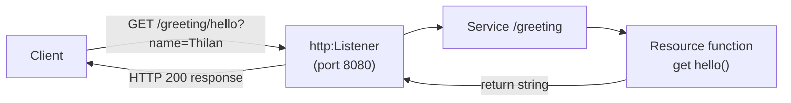
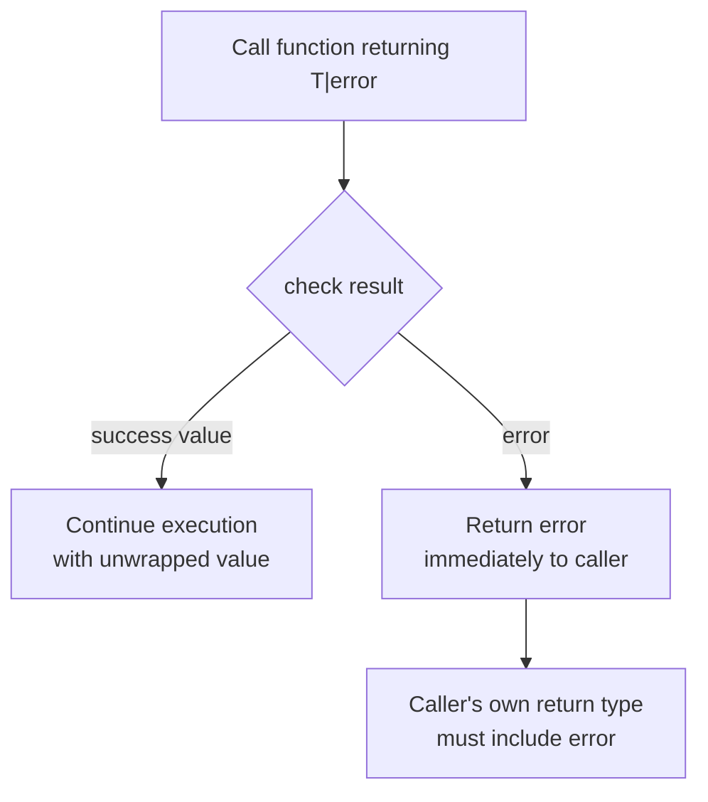

# Ballerina Language Basics

> **Ballerina** is an open-source, statically-typed programming language from WSO2 designed specifically for writing network-distributed applications, with first-class syntax for services, data, and concurrency.

## Why it matters

Ballerina shows up in interviews at WSO2 and in integration/API-heavy roles because it takes a different bet than general-purpose languages: instead of bolting HTTP, JSON, and concurrency onto a language via libraries, it builds them into the type system and syntax. Interviewers use it to check whether you understand what "network-aware" and "data-oriented" mean in practice, and whether you can reason about error propagation and concurrency models that differ from typical exception/thread-based designs.

## Services and Listeners

A **service** in Ballerina is a first-class construct: a named collection of network-accessible resource functions, attached to a **listener** that handles the underlying protocol (HTTP, gRPC, Kafka, etc.). The listener is responsible for binding to a port/transport and dispatching incoming requests to the right resource function based on method and path.

```ballerina
import ballerina/http;

listener http:Listener httpListener = new (8080);

service /greeting on httpListener {

    resource function get hello(string name) returns string {
        return "Hello, " + name + "!";
    }
}
```

- `service /greeting on httpListener` declares a service attached at path `/greeting`.
- `resource function get hello` maps `GET /greeting/hello` to that function; the accessor name (`get`, `post`, ...) is the HTTP method.
- Query parameters (`name`) and path parameters bind directly to function parameters by type.



## Records: Data-Oriented Design

Ballerina treats data as a first-class citizen. A **record** is a structured, named type similar to a struct, with structural typing rather than nominal typing — two records with the same shape are compatible even without a shared declared type. Records map naturally to JSON, which is central to Ballerina's "network aware" pitch: request/response payloads are just records.

```ballerina
type Employee record {
    string name;
    int age;
    string department?; // optional field
};

Employee e = { name: "Alice", age: 30 };
json j = e.toJson();
```

| Concept | Purpose |
|---|---|
| `record {}` (open) | Allows additional, unspecified fields at runtime |
| `record {\| \|}` (closed) | Rejects any field not explicitly declared |
| `?` on a field | Marks the field optional |
| Structural typing | A value satisfies a type if its shape matches, regardless of declared type name |

This structural approach lets Ballerina convert seamlessly between JSON payloads and typed records, with compile-time and runtime shape checks instead of manual (de)serialization boilerplate.

## Error Handling with `check`

Ballerina does not use exceptions for ordinary control flow. Instead, functions that can fail return a union type like `T|error`. The `check` keyword unwraps a successful value or immediately returns the error to the caller — a lightweight, explicit form of error propagation.

```ballerina
import ballerina/http;

function fetchUser(http:Client cl, string id) returns json|error {
    http:Response resp = check cl->get("/users/" + id);
    json payload = check resp.getJsonPayload();
    return payload;
}
```

- `check` on an expression of type `T|error`: if it's an error, the enclosing function returns that error immediately (the function's return type must itself include `error`).
- `checkpanic` behaves like `check` but panics (crashes) instead of propagating, used when an error is truly unexpected.
- `trap` converts a panic into an error value, letting you recover from it.
- Errors are typed values, not thrown objects — you can pattern-match on `error` and its `detail()` map.



## Concurrency: Workers and Strands

Ballerina supports concurrency through **workers** — named, lightweight concurrent execution units within a function, scheduled cooperatively on the Ballerina runtime's strand scheduler (not necessarily one OS thread each). Workers communicate via explicit send/receive rather than shared mutable state.

```ballerina
function processOrder() {
    worker validate {
        int result = 42;
        result -> summarize;
    }

    worker summarize {
        int val = <- validate;
        // use val
    }
}
```

- `->` sends a value to a named worker; `<-` receives from one.
- Every function body itself runs as an implicit default worker, so named workers run alongside it.
- This model avoids explicit locks for the common case: data flows between workers through typed channels, and the compiler checks send/receive type compatibility.
- Because network calls are asynchronous under the hood, remote calls (`cl->get(...)`) integrate naturally with this scheduling model without you managing callbacks or futures directly.

## Common Interview Questions

**Q: What does "network-aware" mean for a language like Ballerina?**
A: Constructs like services, listeners, and resource functions are part of the language syntax and type system, not library abstractions. The compiler understands HTTP paths, methods, and payloads well enough to do type checking and generate OpenAPI-style contracts directly from source.

**Q: How does `check` differ from exceptions in languages like Java?**
A: `check` operates on ordinary `T|error` union return types and propagates by early return, entirely visible in the function signature and call site. There's no hidden control-flow jump like a thrown exception; every function that can fail must declare `error` in its return type, making failure paths explicit and auditable at compile time.

**Q: What is the difference between an open and a closed record?**
A: An open record (`record {}`) permits extra fields beyond those declared, useful for loosely structured JSON. A closed record (`record {| |}`) rejects any field not explicitly listed, giving stricter validation — closer to a fixed schema.

**Q: Why use workers instead of threads?**
A: Workers give explicit, typed, message-passing concurrency within a single function, scheduled cooperatively by the runtime. This avoids shared-state race conditions by construction and keeps concurrency declarative rather than requiring manual locks or thread pools.

**Q: What happens if you forget to `check` a call that returns `T|error`?**
A: The code won't compile as-is if you try to use the value directly, because the static type remains the union `T|error`, not `T` — you must either `check` it, handle the error explicitly with a `match`/`if`, or use `checkpanic`. This is enforced by the type system, not a runtime convention.

**Q: How does structural typing benefit a service that consumes external JSON APIs?**
A: Any JSON payload that matches a record's shape is assignable to it, so you don't need the producing system's exact type or class — only a compatible structure. This reduces coupling between services that don't share a common type library.

**Q: Can a Ballerina service have multiple listeners or protocols?**
A: Yes. A single service can be attached to multiple listeners, and Ballerina ships listener implementations for several protocols (HTTP, gRPC, Kafka, WebSocket, and others), letting the same resource logic potentially be exposed over more than one transport.

## Related

- [error-handling.md](error-handling.md) - deeper dive into error types, `trap`, and failure-handling patterns
- [concurrency.md](concurrency.md) - strands, workers, and asynchronous invocation in depth
- [rest-api-design.md](rest-api-design.md) - designing the HTTP contracts Ballerina services expose
