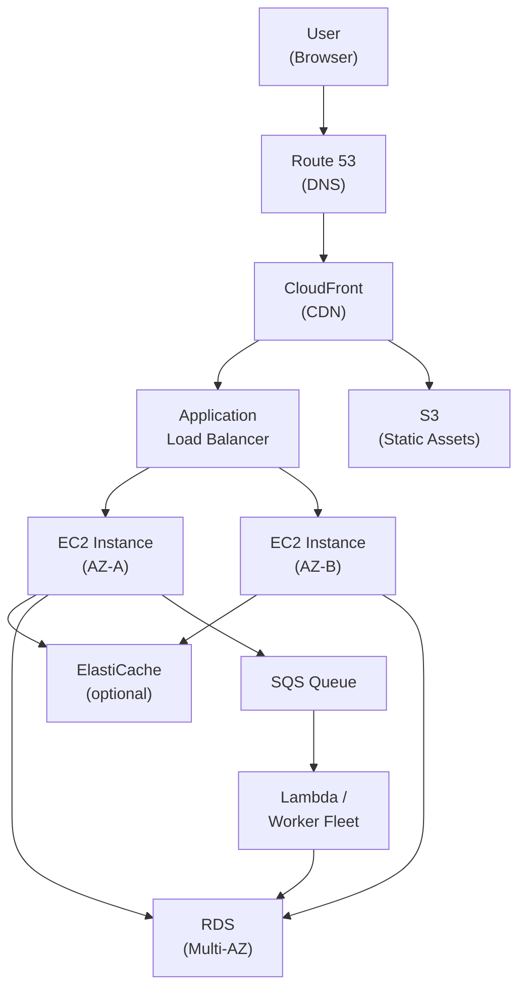

# Amazon Web Services (AWS)

> **AWS** is Amazon's cloud platform, offering on-demand compute, storage, database, networking, and other infrastructure services that you provision programmatically and pay for based on usage.

## Why it matters

AWS is the market-leading cloud provider, so interviewers use it as a proxy for whether you can design and operate real systems, not just write application code. Questions probe whether you know which service fits which job (SQS vs SNS, RDS vs DynamoDB, ALB vs NLB), how the shared responsibility model splits duties, and whether you can reason about scaling, availability, and security with AWS building blocks.

## Services Overview

| Category | Service | Purpose |
|---|---|---|
| Compute | EC2 | Resizable virtual machines (instances) |
| Compute | Lambda | Serverless, event-driven functions |
| Compute | EKS | Managed Kubernetes control plane |
| Compute | Elastic Beanstalk | PaaS for quick app deployment |
| Storage | S3 | Object storage (files, backups, static sites) |
| Storage | EBS | Block storage attached to EC2 instances |
| Database | RDS | Managed relational databases (Aurora, MySQL, PostgreSQL, MariaDB, Oracle, SQL Server) |
| Database | DynamoDB | Managed NoSQL key-value/document database |
| Networking | VPC | Isolated virtual network for your resources |
| Networking | ELB (ALB/NLB/GLB) | Load balancing across instances/targets |
| Networking | Route 53 | DNS and domain routing |
| Networking | CloudFront | CDN for low-latency content delivery |
| Messaging | SQS | Message queuing to decouple services |
| Messaging | SNS | Pub/sub notifications |
| Security | IAM | Identity, access, and permissions management |
| Security | KMS | Encryption key management |
| Governance | CloudFormation | Infrastructure as Code |
| Governance | AWS Config | Resource configuration tracking and compliance |

## Compute: EC2, Lambda, EKS

Amazon **EC2** provides resizable virtual servers ("instances") sized by CPU/memory/network profile. Key features: Auto Scaling groups that add/remove instances based on demand, security groups and key pairs for access control, Elastic IPs for static addresses, and pay-as-you-go pricing (with reserved/spot options for savings).

**AWS Lambda** is serverless compute: you upload code and AWS runs it in response to events (API Gateway requests, S3 uploads, queue messages) without you managing servers. It scales automatically, bills per invocation/duration, and supports multiple runtimes (Python, Node.js, Java, and others) - cost-effective for spiky or infrequent workloads.

**Amazon EKS** is a managed Kubernetes service - AWS runs the control plane so you don't have to. It integrates with VPC networking, IAM, and CloudWatch, and spans multiple Availability Zones for high availability.

**Auto Scaling** uses launch templates, scaling policies (target tracking, step, or scheduled), and health checks that replace unhealthy instances automatically. **Lifecycle hooks** pause an instance's launch/termination to run custom actions, such as triggering a Lambda function or SNS notification before the transition completes.

## Storage: S3 vs EBS

| Aspect | S3 | EBS |
|---|---|---|
| Type | Object storage | Block storage |
| Access | Over HTTP(S) via API/SDK | Attached to a single EC2 instance |
| Use case | Backups, static sites, big data, logs | Databases, OS/application disks |
| Durability model | Designed for very high durability across multiple AZs | Tied to a single Availability Zone |
| Scaling | Virtually unlimited, no provisioning | Provisioned size/IOPS per volume |

S3 stores objects (files) addressed by key within a bucket - ideal for anything that doesn't need a traditional filesystem. EBS behaves like an attached hard drive for an EC2 instance and suits applications (like databases) needing low-latency, persistent block storage.

## Database: RDS vs DynamoDB

**RDS** is a managed relational database service supporting engines like Aurora, MySQL, PostgreSQL, MariaDB, Oracle, and SQL Server. AWS automates backups, patching, monitoring, and replication, but you still own schema design and query performance.

**DynamoDB** is a managed NoSQL key-value/document database built for single-digit-millisecond latency at virtually any scale, with pay-per-request or provisioned-throughput pricing. Choose RDS for relational integrity, joins, and multi-table transactions; choose DynamoDB for predictable low-latency access at massive scale with simpler access patterns.

## Networking: VPC, Load Balancers, Route 53, CloudFront

A **VPC** is your own isolated network within AWS, divided into subnets. A **public subnet** has a route to the internet via an Internet Gateway (used for load balancers or bastion hosts); a **private subnet** has no direct internet route (used for databases and internal services, reached only from within the VPC or via a NAT gateway for outbound access).

**Security groups** act as stateful virtual firewalls attached to instances, controlling inbound/outbound traffic by protocol, port, and source/destination - because they're stateful, a response to an allowed inbound request is automatically permitted outbound.

AWS's Elastic Load Balancing offers three types: **Application Load Balancer (ALB)** - Layer 7 (HTTP/HTTPS), path/host-based routing; **Network Load Balancer (NLB)** - Layer 4 (TCP/UDP), high throughput and low latency; **Gateway Load Balancer (GLB)** - for deploying and scaling third-party virtual appliances.

**Route 53** is AWS's DNS and domain registration service, supporting routing policies (simple, weighted, latency-based, failover, geolocation, multi-value) and health checks. **CloudFront** is AWS's CDN, caching content at edge locations worldwide, integrating with S3/EC2 origins plus AWS WAF and Shield for protection.

## Messaging: SQS and SNS

**SQS** is a managed message queue used to decouple producers and consumers. It offers standard queues (at-least-once delivery, best-effort ordering) and FIFO queues (exactly-once processing, strict order), plus dead-letter queues and visibility timeouts.

**SNS** is a pub/sub messaging service that fans out a single published message to multiple subscribers - email, SMS, Lambda, or SQS - a common building block for event-driven architectures.

## Security: IAM and the Shared Responsibility Model

**IAM** controls who can do what in an AWS account: creating users, groups, and roles, attaching fine-grained policies, enforcing multi-factor authentication, and applying least-privilege access. Data protection typically combines SSL/TLS **in transit** and KMS-managed encryption **at rest** (for S3, EBS, RDS, DynamoDB).

The **Shared Responsibility Model** splits security duties: AWS secures *of* the cloud (hardware, software, networking, facilities); the customer secures *in* the cloud (data, IAM configuration, network controls, application security).

## Infrastructure as Code and Governance

**CloudFormation** defines AWS resources declaratively in JSON/YAML templates, enabling version-controlled, repeatable, dependency-aware deployments (including reusable nested stacks). **Elastic Beanstalk** is a higher-level PaaS that deploys apps into pre-configured environments quickly, trading control for simplicity; CloudFormation gives full, low-level control instead.

**AWS Config** continuously records and evaluates resource configuration, giving a change history, a current-state snapshot, and rule-based compliance auditing - useful across multi-account setups managed with AWS Organizations.

## Typical Web Application Architecture

A common pattern for a scalable, resilient web app on AWS combines several of the services above:

The request flow: Route 53 resolves the domain, CloudFront caches and serves static assets from S3 at the edge, and dynamic requests pass through the ALB to EC2 instances spread across Availability Zones for fault tolerance. Instances read/write to a Multi-AZ RDS database, offload background work via SQS to Lambda or a worker fleet, and everything sits inside a VPC with security groups restricting traffic between tiers.

## Common Interview Questions

**Q: What's the difference between S3 and EBS?**
A: S3 is object storage over HTTP(S), ideal for files, backups, and static content at virtually unlimited scale. EBS is block storage attached to one EC2 instance in one Availability Zone, used for OS disks and databases needing low-latency block access.

**Q: When would you choose DynamoDB over RDS?**
A: Choose DynamoDB for predictable, single-digit-millisecond latency at massive scale with simple key-based access and no need for joins or complex transactions. Choose RDS for relational integrity, complex queries, and multi-table transactions.

**Q: What's the difference between security groups and NACLs?**
A: Security groups are stateful and operate at the instance level, allowing return traffic automatically. NACLs are stateless and operate at the subnet level, so both inbound and outbound rules must be defined explicitly.

**Q: How does Auto Scaling decide when to add or remove instances?**
A: Through scaling policies - target tracking (e.g., keep average CPU at 50%), step scaling (add capacity in increments based on alarm thresholds), or scheduled scaling - combined with health checks that replace unhealthy instances.

**Q: What is the Shared Responsibility Model?**
A: AWS secures the underlying infrastructure - hardware, hypervisor, networking, facilities. The customer is responsible for security in the cloud: data encryption, IAM policies, network configuration, and application security.

**Q: Why would you use SQS with SNS together?**
A: SNS fans out one event to multiple subscribers, and each subscriber can be an SQS queue so every consumer gets its own durable, independently processed copy - a common fan-out pattern for event-driven architectures.

**Q: What's the difference between Elastic Beanstalk and CloudFormation?**
A: Elastic Beanstalk is an opinionated PaaS that provisions a ready-made environment (load balancer, instances, scaling) quickly. CloudFormation is a lower-level IaC service where you define every resource explicitly, trading setup effort for control.

## Related

- [Cloud Computing Concepts](concepts.md) - service models (IaaS/PaaS/SaaS) and shared responsibility background
