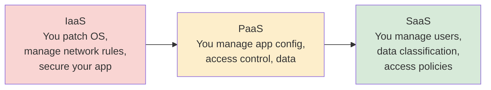

# Cloud Computing Concepts

> **Cloud computing** is the on-demand delivery of compute, storage, and other IT resources over the internet, billed based on usage rather than owned as fixed capital infrastructure.

## Why it matters

Interviewers use this topic to check whether you understand what you're actually responsible for when you build on a cloud platform - security, patching, scaling, cost. Confusing IaaS with PaaS, or not knowing where the provider's job ends and yours begins, is a common tell that someone has only used cloud services without understanding the model underneath. It also comes up whenever a design question touches on "how would you scale this" or "who patches the OS here."

## Service Models: IaaS, PaaS, SaaS

The service models differ in how much of the stack the provider manages versus how much you manage yourself.

| Layer | IaaS | PaaS | SaaS |
|---|---|---|---|
| Application code | You | You | Provider |
| Runtime / middleware | You | Provider | Provider |
| Operating system | You | Provider | Provider |
| Virtualization | Provider | Provider | Provider |
| Servers, storage, networking | Provider | Provider | Provider |
| Example | AWS EC2, Azure VMs | AWS Elastic Beanstalk, Heroku, Google App Engine | Gmail, Salesforce, Office 365 |

- **IaaS (Infrastructure as a Service)** gives you raw compute, storage, and networking - virtual machines, block storage, load balancers. You install and manage the OS, runtime, and application. Maximum control, maximum operational burden.
- **PaaS (Platform as a Service)** gives you a managed runtime to deploy application code into. The provider handles the OS, patching, and scaling infrastructure; you focus on code and configuration.
- **SaaS (Software as a Service)** gives you a finished application. You manage only your data and user access; everything else is the provider's problem.

A useful way to remember it: as you move from IaaS to SaaS, you trade control for convenience.

```mermaid
flowchart TB
    subgraph IaaS["IaaS - e.g. EC2"]
        direction TB
        I1["App code - You"]
        I2["Runtime - You"]
        I3["OS - You"]
        I4["Virtualization - Provider"]
        I5["Servers/Network - Provider"]
    end

    subgraph PaaS["PaaS - e.g. Elastic Beanstalk"]
        direction TB
        P1["App code - You"]
        P2["Runtime - Provider"]
        P3["OS - Provider"]
        P4["Virtualization - Provider"]
        P5["Servers/Network - Provider"]
    end

    subgraph SaaS["SaaS - e.g. Gmail"]
        direction TB
        S1["App code - Provider"]
        S2["Runtime - Provider"]
        S3["OS - Provider"]
        S4["Virtualization - Provider"]
        S5["Servers/Network - Provider"]
    end
```

## Deployment Models

- **Public cloud**: Infrastructure is owned and operated by a third-party provider (AWS, Azure, GCP) and shared across multiple tenants, isolated logically. Lowest upfront cost, fastest to provision, no hardware to manage.
- **Private cloud**: Infrastructure is dedicated to a single organization, either on-premises or hosted by a provider on dedicated hardware. Used when regulatory, security, or latency requirements rule out multi-tenancy.
- **Hybrid cloud**: A combination of private and public (or on-prem and cloud), with workloads and data able to move between them. Common pattern: keep sensitive data or legacy systems on-premises while bursting compute-heavy or customer-facing workloads to the public cloud.

There's also **multi-cloud** (using more than one public cloud provider, usually for redundancy, avoiding lock-in, or picking the best service per workload), which is a distinct axis from the public/private/hybrid choice.

## Shared Responsibility Model

Cloud security and operations are never 100% the provider's job. The **shared responsibility model** defines the split, and it shifts depending on the service model you're using.

- The provider is always responsible for the security *of* the cloud: physical data centers, host infrastructure, hypervisor, and (for managed services) the underlying software.
- You are always responsible for security *in* the cloud: your data, identity and access management, network configuration (e.g., security groups), and - depending on the service model - the OS, runtime, and application code.

A classic interview trap: a misconfigured S3 bucket or an open security group is *your* responsibility, not the provider's, even on a fully managed public cloud - the provider secures the platform, not your configuration choices on top of it.

## Elasticity vs Scalability

These two terms are related but not interchangeable.

- **Scalability** is a system's *capacity* to handle increased load, generally by adding resources. It can be:
  - **Vertical scaling (scale up)**: add more CPU/RAM to an existing instance.
  - **Horizontal scaling (scale out)**: add more instances behind a load balancer.
- **Elasticity** is the *automation* of scaling in response to real-time demand - resources are added when load increases and removed when load drops, typically without manual intervention (e.g., AWS Auto Scaling Groups reacting to CPU utilization).

In short: scalability is about whether a system *can* grow; elasticity is about whether it grows and shrinks *automatically and dynamically* to match demand. A system can be scalable but not elastic (you manually provision more servers during a planned traffic spike); true elasticity implies scalability plus automatic, on-demand adjustment in both directions.

## Common Interview Questions

**Q: What's the difference between IaaS, PaaS, and SaaS?**
A: They differ in how much of the stack you manage versus the provider. IaaS gives you VMs and you manage the OS up; PaaS gives you a runtime and you manage only your app and data; SaaS gives you a finished product and you manage only your usage of it.

**Q: Who is responsible for patching the OS on an EC2 instance versus on Elastic Beanstalk?**
A: On EC2 (IaaS), you are responsible for OS patching. On Elastic Beanstalk (PaaS), AWS manages the underlying platform and OS, though you're still responsible for your application dependencies and configuration.

**Q: What's the difference between elasticity and scalability?**
A: Scalability is the ability of a system to handle more load by adding resources, manually or otherwise. Elasticity is the automatic addition and removal of resources in real time to match fluctuating demand, so you pay only for what you use at any given moment.

**Q: When would you choose a private cloud over public cloud?**
A: When regulatory or compliance requirements mandate data residency or isolation, when workloads need predictable low-latency access to on-premises systems, or when existing capital investment in hardware makes a dedicated environment more cost-effective.

**Q: Give an example of the shared responsibility model going wrong.**
A: A publicly readable S3 bucket containing customer data. AWS secures the storage infrastructure, but the bucket's access policy is the customer's responsibility - misconfiguring it is a customer-side failure, not a provider outage.

**Q: Is a system that scales but requires a human to click "add server" elastic?**
A: No. That's scalability without elasticity. Elasticity specifically implies the process is automatic and responds to real-time demand signals, scaling both up and down without manual triggers.

**Q: What's the difference between hybrid cloud and multi-cloud?**
A: Hybrid cloud combines private/on-premises infrastructure with public cloud, often for data residency or legacy integration reasons. Multi-cloud means using multiple public cloud providers, typically to avoid vendor lock-in or to use best-of-breed services from each.

## Related

- [aws.md](aws.md) - concrete IaaS/PaaS/SaaS services and how they map to these models
