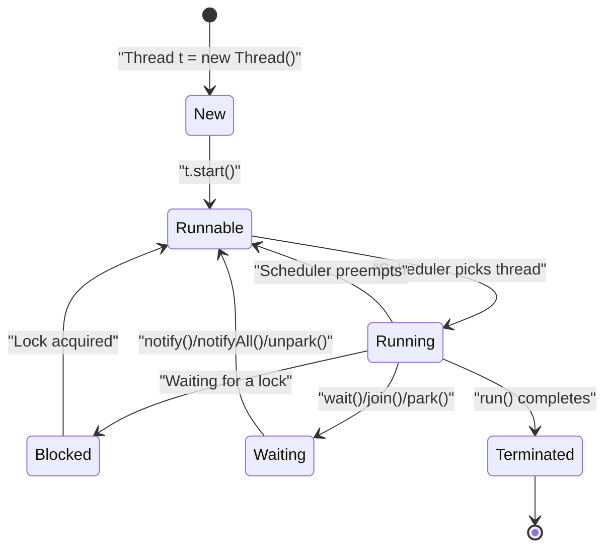
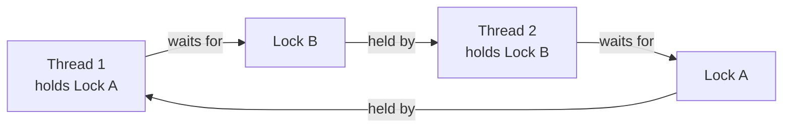

# Multithreading and Concurrency

> **Multithreading** is running multiple threads within a single process so they share memory and can execute concurrently, trading isolation for speed and requiring explicit coordination to stay correct.

## Why it matters

Almost every backend, mobile, and systems role touches concurrency, whether it is a thread pool serving requests, a lock protecting shared state, or a race condition causing a production incident. Interviewers use this topic to check whether you understand what can go wrong when multiple execution paths touch the same memory, and whether you know the standard tools (locks, atomics, thread-safe collections) to prevent it. It also reveals whether you can reason about correctness under interleaving, not just write code that happens to work in a single-threaded test.

## Processes vs Threads

| Aspect | Process | Thread |
|--------|---------|--------|
| Memory | Separate address space | Shared memory within process |
| Creation | Slower | Faster |
| Communication | Inter-process communication | Shared memory (careful!) |
| Overhead | High | Low |
| Isolation | Isolated from each other | Less isolated |
| Context switch | Expensive | Less expensive |

## Java Threading Basics

```java
// Method 1: Extend Thread class
class MyThread extends Thread {
    public void run() {
        System.out.println("Thread is running");
    }
}

MyThread thread = new MyThread();
thread.start();  // NOT thread.run()

// Method 2: Implement Runnable interface
class MyRunnable implements Runnable {
    public void run() {
        System.out.println("Thread is running");
    }
}

Thread thread = new Thread(new MyRunnable());
thread.start();

// Or with Lambda (Java 8+)
new Thread(() -> System.out.println("Thread is running")).start();
```

## Thread Lifecycle

A thread moves through a well-defined set of states, managed by the JVM/OS scheduler. Calling `start()` moves a thread from `New` to `Runnable`; the scheduler then decides when it actually gets CPU time (`Running`). From there it can be pulled off the CPU (back to `Runnable`), or it can move into `Blocked` (waiting on a lock) or `Waiting`/`Timed Waiting` (waiting on `wait()`, `join()`, or `sleep()`), before finally reaching `Terminated`.



## Synchronization

### Synchronized Blocks and Methods

```java
class Counter {
    private int count = 0;

    // Synchronized method
    synchronized void increment() {
        count++;
    }

    // Alternative: synchronized block
    void incrementBlock() {
        synchronized (this) {
            count++;
        }
    }

    synchronized int getCount() {
        return count;
    }
}

// Multiple threads can't execute synchronized methods on the same monitor simultaneously
```

### Race Conditions

`count++` is not atomic - it is a read, an increment, and a write. Without synchronization, two threads can interleave and lose an update:

```
Thread 1: Read count (5)
Thread 2: Read count (5)
Thread 1: Increment to 6, Write
Thread 2: Increment to 6, Write
Result: count = 6 (should be 7)
```

## Locks

### ReentrantLock

```java
import java.util.concurrent.locks.ReentrantLock;

class BankAccount {
    private double balance = 1000;
    private final ReentrantLock lock = new ReentrantLock();

    void withdraw(double amount) {
        lock.lock();
        try {
            if (balance >= amount) {
                balance -= amount;
            }
        } finally {
            lock.unlock();  // Always unlock in finally
        }
    }
}
```

### ReadWriteLock

```java
import java.util.concurrent.locks.ReadWriteLock;
import java.util.concurrent.locks.ReentrantReadWriteLock;

class Cache {
    private Map<String, String> data = new HashMap<>();
    private final ReadWriteLock lock = new ReentrantReadWriteLock();

    String get(String key) {
        lock.readLock().lock();
        try {
            return data.get(key);  // Multiple reads allowed
        } finally {
            lock.readLock().unlock();
        }
    }

    void put(String key, String value) {
        lock.writeLock().lock();
        try {
            data.put(key, value);  // Exclusive write
        } finally {
            lock.writeLock().unlock();
        }
    }
}
```

`synchronized` versus `Lock` is a frequent follow-up:

| Aspect | `synchronized` | `ReentrantLock` / `Lock` |
|--------|-----------------|---------------------------|
| Acquisition | Implicit, block-scoped | Explicit `lock()`/`unlock()` |
| Fairness | Not configurable | Can be constructed as fair |
| Try/timeout | Not supported | `tryLock()`, `tryLock(timeout)` |
| Interruptible wait | No | `lockInterruptibly()` |
| Multiple conditions | No (single monitor) | Yes, via `newCondition()` |
| Release on exception | Automatic | Must unlock manually in `finally` |

## Deadlock

A deadlock is a situation where two or more threads are blocked forever, each waiting for a resource the other holds. It requires four conditions to hold simultaneously:

1. **Mutual exclusion** - a resource can only be held by one thread at a time.
2. **Hold and wait** - a thread holds one resource while waiting for another.
3. **No preemption** - a resource can't be forcibly taken from a thread.
4. **Circular wait** - a closed chain of threads, each waiting on the next.



```java
class Account {
    private double balance;
    private final int id;

    synchronized void transfer(Account other, double amount) {
        // Thread 1: locks this, then waits for other
        // Thread 2: locks other, then waits for this
        // Result: deadlock!
        synchronized (other) {
            this.balance -= amount;
            other.balance += amount;
        }
    }
}
```

### Preventing Deadlock

Breaking any one of the four conditions above prevents deadlock. In practice, the two most common techniques are:

- **Lock ordering** - always acquire locks in a fixed, global order (e.g., by account ID) so a circular wait can never form.
- **Try-lock with timeout** - use `tryLock(timeout)` and back off (releasing already-held locks) if the second lock isn't available in time.

```java
// Deadlock prevention with lock ordering
void transfer(Account other, double amount) {
    Account first = this.id < other.id ? this : other;
    Account second = this.id < other.id ? other : this;

    synchronized (first) {
        synchronized (second) {
            // Safe transfer
        }
    }
}

// Or with timeout
boolean transfer(Account other, double amount) {
    Lock lock1 = this.getLock();
    Lock lock2 = other.getLock();

    try {
        if (lock1.tryLock(1, TimeUnit.SECONDS)) {
            try {
                if (lock2.tryLock(1, TimeUnit.SECONDS)) {
                    try {
                        // Perform transfer
                        return true;
                    } finally {
                        lock2.unlock();
                    }
                }
            } finally {
                lock1.unlock();
            }
        }
    } catch (InterruptedException e) {
        Thread.currentThread().interrupt();
    }
    return false;
}
```

## Livelock

Livelock is similar to deadlock in that no thread makes progress, but instead of sitting blocked, the threads actively respond to each other and keep changing state, burning CPU without ever resolving the conflict.

```java
class Person {
    private Direction direction;

    void walk(Person other) {
        while (weAreFacingEachOther(other)) {
            if (shouldIGoLeft()) {
                // Thread 1: tries to go left
                // Thread 2: also tries to go left
                // Both change direction, still facing each other
                direction = Direction.LEFT;
            }
        }
    }
}
```

## Thread Communication

`wait()`/`notify()`/`notifyAll()` let threads coordinate on a shared monitor instead of busy-spinning. `wait()` must always be called in a loop that re-checks the condition, because a thread can wake up spuriously or before the condition it cares about is actually true.

```java
class MessageQueue {
    private String message = null;

    synchronized void put(String msg) throws InterruptedException {
        while (message != null) {
            wait();  // Wait until message is consumed
        }
        message = msg;
        notifyAll();  // Wake up waiting threads
    }

    synchronized String take() throws InterruptedException {
        while (message == null) {
            wait();  // Wait for message
        }
        String msg = message;
        message = null;
        notifyAll();  // Wake up waiting threads
        return msg;
    }
}
```

## Executor Framework

Manually creating and managing raw `Thread` objects doesn't scale. The `ExecutorService` framework decouples task submission from thread management, using a pool of reusable worker threads.

```java
ExecutorService executor = Executors.newFixedThreadPool(3);

// Submit tasks
for (int i = 0; i < 10; i++) {
    executor.submit(() -> {
        System.out.println("Task executed by: " +
                         Thread.currentThread().getName());
    });
}

executor.shutdown();  // No new tasks accepted
// executor.shutdownNow();  // Cancel current tasks

// Wait for completion
executor.awaitTermination(1, TimeUnit.MINUTES);
```

```java
// Single thread
ExecutorService single = Executors.newSingleThreadExecutor();

// Fixed thread pool
ExecutorService fixed = Executors.newFixedThreadPool(4);

// Cached thread pool
ExecutorService cached = Executors.newCachedThreadPool();

// Scheduled executor
ScheduledExecutorService scheduled =
    Executors.newScheduledThreadPool(2);

// Schedule tasks
scheduled.schedule(() -> System.out.println("After 5 seconds"),
                   5, TimeUnit.SECONDS);
scheduled.scheduleAtFixedRate(() -> System.out.println("Periodic"),
                              1, 2, TimeUnit.SECONDS);
```

## Thread-Safe Collections

```java
// Synchronized wrapper - every method call is fully locked
Map<String, String> syncMap = Collections.synchronizedMap(
    new HashMap<>()
);

// Concurrent collections - finer-grained locking, better throughput
ConcurrentHashMap<String, String> concurrentMap =
    new ConcurrentHashMap<>();

CopyOnWriteArrayList<String> cowList =
    new CopyOnWriteArrayList<>();

BlockingQueue<String> queue = new LinkedBlockingQueue<>();
```

## Common Interview Questions

**Q: What's the difference between `synchronized` and `Lock`?**
A: `Lock` (e.g. `ReentrantLock`) gives explicit control - `tryLock()`, timeouts, interruptible acquisition, and multiple conditions - but you must remember to unlock in a `finally` block. `synchronized` is simpler and the JVM releases it automatically, but it's block-scoped and less flexible.

**Q: Explain a race condition and how to prevent it.**
A: A race condition happens when multiple threads access and modify shared state without synchronization, so the outcome depends on thread interleaving. Prevent it with synchronization, locks, or atomic classes (e.g. `AtomicInteger`).

**Q: What is a deadlock and how do you prevent it?**
A: A deadlock is a circular wait where each thread holds a resource another thread needs. Prevent it by always acquiring locks in a consistent global order, using `tryLock()` with a timeout, or minimizing the scope in which locks are held.

**Q: Explain `wait()`, `notify()`, and `notifyAll()`.**
A: They let threads coordinate through a shared monitor. `wait()` releases the lock and pauses the thread until notified; `notify()` wakes one waiting thread; `notifyAll()` wakes all of them. They must be called inside a `synchronized` block on the same monitor, and `wait()` should always be in a `while` loop rechecking the condition.

**Q: What's the difference between `sleep()` and `wait()`?**
A: `Thread.sleep()` pauses the current thread for a fixed time without releasing any lock it holds. `Object.wait()` releases the held monitor lock and waits until another thread calls `notify()`/`notifyAll()` (or a timeout elapses).

**Q: How does `ConcurrentHashMap` achieve thread safety without locking the whole map?**
A: It uses fine-grained internal locking (bucket/bin-level synchronization in modern JVMs, historically segment-level) so multiple threads can read and write different parts of the map concurrently instead of contending on one global lock.

**Q: What is thread pooling and why use it?**
A: A thread pool is a set of reusable worker threads that pick up submitted tasks from a queue. It avoids the cost of creating and tearing down a thread per task and lets you bound the number of concurrent threads to control resource usage.

## Related

- [../java/java-threading.md](../java/java-threading.md) - Java-specific threading API details and examples
- [../oop/basics.md](../oop/basics.md) - object fundamentals that underlie thread-safe class design
- [../system-design/scalability.md](../system-design/scalability.md) - how concurrency choices scale into distributed system design
