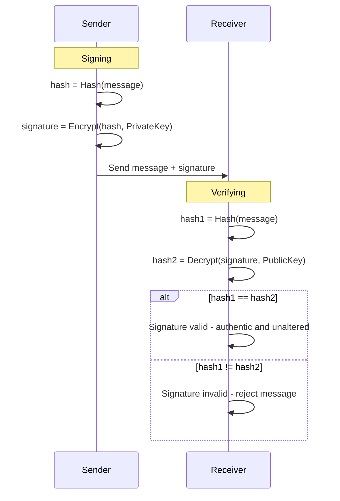
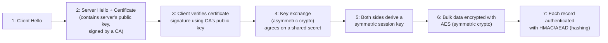

# Cryptography Fundamentals

> **Cryptography** is the practice of securing information through mathematical transformations so that only authorized parties can read it, verify it, or prove they sent it.

## Why it matters

Interviewers ask about cryptography basics to check whether you understand *why* a system is secure, not just that it "uses encryption." Every secure system you'll touch - HTTPS, password storage, API tokens, code signing - is built from the same four primitives: symmetric encryption, asymmetric encryption, hashing, and digital signatures. Knowing which one solves which problem, and why you can't substitute one for another, is a strong signal of real security understanding versus buzzword familiarity.

## Symmetric Encryption

Symmetric encryption uses **one shared secret key** for both encryption and decryption. It's fast and efficient, which is why it's used for bulk data.

- Algorithms: AES (the modern standard), ChaCha20.
- The hard problem: both parties must already share the key, and that key must be exchanged over a secure channel first.
- Used for: encrypting the actual data payload once a session is established (e.g., the bulk of a TLS connection, disk encryption, encrypted database columns).

```text
Plaintext --[AES + Key K]--> Ciphertext --[AES + Key K]--> Plaintext
```

## Asymmetric Encryption

Asymmetric (public-key) encryption uses a **mathematically linked key pair**: a public key anyone can have, and a private key only the owner holds. Data encrypted with the public key can only be decrypted with the matching private key.

- Algorithms: RSA, elliptic curve (ECDH/ECDSA).
- Solves the key-distribution problem symmetric encryption can't: no secret needs to be shared in advance.
- Trade-off: significantly slower and more computationally expensive than symmetric encryption, so it's impractical for large amounts of data.
- Used for: key exchange (agreeing on a symmetric session key) and digital signatures - not for bulk data encryption.

## Symmetric vs Asymmetric

| Aspect | Symmetric | Asymmetric |
|---|---|---|
| Keys | One shared secret key | Public/private key pair |
| Speed | Fast, low overhead | Much slower, CPU-intensive |
| Key distribution | Hard - must share secret securely | Easy - public key can be shared openly |
| Typical use | Encrypting bulk data | Key exchange, signatures, identity |
| Examples | AES, ChaCha20 | RSA, ECDSA, ECDH |
| Data size handled | Large payloads | Small payloads (keys, hashes) |

## Hashing (One-Way Functions)

A cryptographic hash function takes an input of any size and produces a fixed-size output (a **digest**), and it is **one-way**: you cannot feasibly reverse the digest back into the original input.

Properties a good hash function must have:
- **Deterministic** - same input always produces the same output.
- **Pre-image resistant** - infeasible to find an input that produces a given hash.
- **Collision resistant** - infeasible to find two different inputs that produce the same hash.
- **Avalanche effect** - a tiny change in input drastically changes the output.

Hashing is not encryption - there's no key and no decryption. It's used for:
- Password storage (with a per-user salt, and a slow algorithm like bcrypt/scrypt/Argon2 rather than a fast general-purpose hash like SHA-256).
- Data integrity checks (verifying a file wasn't corrupted or tampered with).
- Building blocks for digital signatures and message authentication codes (HMAC).

## Digital Signatures

A digital signature proves two things at once: **authenticity** (who sent it) and **integrity** (it wasn't altered). It combines hashing and asymmetric encryption:

1. The sender hashes the message to get a fixed-size digest.
2. The sender encrypts that digest with their **private** key - this encrypted digest is the signature.
3. The receiver hashes the message independently, decrypts the signature using the sender's **public** key, and compares the two digests.

If the digests match, the receiver knows the message came from the holder of that private key and wasn't modified in transit.



## Where TLS Uses Each Primitive

TLS (the protocol behind HTTPS) is the clearest real-world example of all four primitives working together in one handshake.



- **Asymmetric encryption** - used briefly during the handshake to authenticate the server and establish a shared secret (via key exchange), without ever transmitting a symmetric key in the clear.
- **Digital signatures** - the server's certificate is signed by a Certificate Authority; your browser verifies that signature using the CA's public key to confirm the certificate is genuine.
- **Symmetric encryption** - once the handshake completes, all actual application data is encrypted with a fast symmetric cipher like AES, because asymmetric crypto is too slow for bulk traffic.
- **Hashing** - used inside HMAC or AEAD constructions to guarantee each encrypted record hasn't been tampered with, and inside the certificate signature itself.

## Common Interview Questions

**Q: Why not just use asymmetric encryption for everything?**
A: It's computationally far more expensive than symmetric encryption, so it doesn't scale to encrypting large volumes of data efficiently. Real systems use it only for the small, infrequent operations - key exchange and signatures - then switch to symmetric encryption for the actual payload.

**Q: What's the difference between encryption and hashing?**
A: Encryption is reversible given the correct key - it's designed to be decrypted. Hashing is one-way and irreversible by design; you use it to verify or fingerprint data, never to recover the original input.

**Q: Why do you need to salt passwords before hashing them?**
A: A salt is random data unique per user, added to the password before hashing. It defeats precomputed rainbow-table attacks and ensures that two users with the same password get different stored hashes, so an attacker can't crack many accounts at once with one lookup table.

**Q: How does a digital signature differ from just hashing a message?**
A: A hash alone only proves integrity if you can compare it against a trusted copy - anyone can recompute a hash, so it doesn't prove who sent the message. A signature adds the sender's private key into the process, so only the actual key holder could have produced it, giving you authenticity as well as integrity.

**Q: In TLS, whose key encrypts the actual HTTP traffic - client's or server's?**
A: Neither, directly. The handshake uses asymmetric crypto to authenticate the server and derive a shared symmetric session key, and that shared symmetric key (known to both sides) encrypts the actual traffic afterward.

**Q: What happens if a hash function has a collision vulnerability?**
A: An attacker could craft two different inputs that produce the same digest, which undermines integrity checks and signature schemes built on that hash - they could substitute a malicious file or message for a legitimate one that shares the same signed hash. This is why broken hash functions like MD5 and SHA-1 are deprecated for security-sensitive use.

**Q: Can you decrypt a hashed password if you have the hash?**
A: No, not by reversing the function - hashing has no decryption. An attacker instead guesses candidate passwords, hashes each one, and checks for a match (a dictionary or brute-force attack), which is exactly why slow, salted hashing algorithms like bcrypt or Argon2 are used to make guessing expensive.

## Related

- [RSA](rsa.md) - a deep dive into the specific asymmetric algorithm referenced throughout this page
