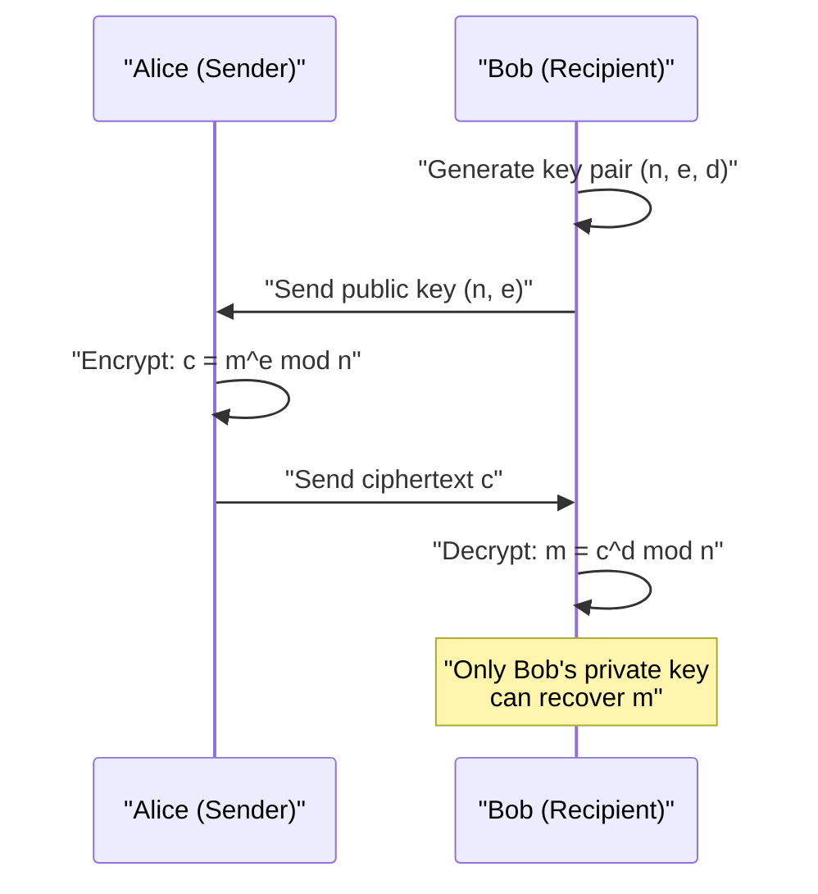
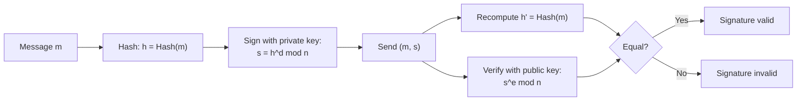

# RSA Algorithm

> **RSA** is an asymmetric (public-key) cryptosystem whose security rests on the practical difficulty of factoring the product of two large prime numbers.

## Why it matters

RSA is the canonical example interviewers use to check whether you understand asymmetric cryptography at a level deeper than "it uses two keys." It ties together number theory (modular arithmetic, Euler's totient), the public/private key relationship, and real-world uses like TLS certificates and digital signatures. Expect follow-up questions on why key size matters, why RSA is rarely used to encrypt bulk data directly, and how signing differs from encryption.

## Key Generation

1. **Choose two large primes** `p` and `q`, kept secret. They should be of similar bit-length and generated randomly.
2. **Compute the modulus**: `n = p * q`. This `n` is public and its bit-length (e.g. 2048 bits) is what people mean by "RSA key size."
3. **Compute Euler's totient**: `φ(n) = (p - 1) * (q - 1)`. This counts integers less than `n` that are coprime to `n`, and must stay secret (revealing it is equivalent to revealing `p` and `q`).
4. **Choose the public exponent `e`**: an integer such that `1 < e < φ(n)` and `gcd(e, φ(n)) = 1`. In practice `e = 65537` is the near-universal choice — it's prime, has few bits set (fast exponentiation), and avoids known weaknesses of very small exponents like `e = 3`.
5. **Derive the private exponent `d`**: the modular multiplicative inverse of `e` mod `φ(n)`, i.e. `d * e ≡ 1 (mod φ(n))`. Computed via the Extended Euclidean Algorithm.
6. **Publish** the public key `(n, e)`. **Keep secret** the private key `(n, d)` (and discard or securely destroy `p`, `q`, `φ(n)`).

```text
Public key  = (n, e)
Private key = (n, d)

n = p * q
φ(n) = (p-1)(q-1)
e * d ≡ 1 (mod φ(n))
```

## Encryption and Decryption

RSA operates on integers `m` in the range `0 ≤ m < n` (a message is padded/encoded into this range before encryption).

| Operation | Formula | Uses |
|---|---|---|
| Encrypt | `c = m^e mod n` | Public key `(n, e)` |
| Decrypt | `m = c^d mod n` | Private key `(n, d)` |

The correctness of decryption (`(m^e)^d ≡ m mod n`) follows from Euler's theorem, given that `e * d ≡ 1 (mod φ(n))`. Anyone can encrypt with the public key, but only the holder of the private key can reverse the operation efficiently — because computing `d` from `e` and `n` requires factoring `n` into `p` and `q`, which is computationally infeasible for sufficiently large `n`.

In practice, raw ("textbook") RSA is never used directly on messages: it is deterministic and malleable, so real systems apply padding schemes such as **OAEP** for encryption. RSA is also slow relative to symmetric ciphers, so it's typically used only to encrypt a short symmetric session key (a "digital envelope"), with the bulk data encrypted using AES.



## Digital Signatures

Signing reverses which key does which job: the **private key signs**, and the **public key verifies**. This proves authenticity and integrity, not confidentiality.

1. The sender hashes the message: `h = Hash(m)` (e.g. SHA-256).
2. The sender signs the hash with their private key: `s = h^d mod n`.
3. The sender transmits `(m, s)`.
4. The verifier recomputes `h' = Hash(m)`, then checks `s^e mod n == h'` using the sender's public key.

If the signature matches, the verifier knows the message wasn't altered and that it was signed by someone holding the corresponding private key. As with encryption, real signature schemes use a padding scheme (**PSS** is the modern recommendation over the older PKCS#1 v1.5) to resist forgery attacks.



## Key Size and Security

RSA's security depends entirely on the difficulty of factoring `n`. As factoring algorithms and computing power improve, the safe minimum key size grows:

| Key size (bits) | General status |
|---|---|
| 1024 | Considered inadequate for new systems; too weak against modern factoring resources |
| 2048 | Current common minimum for most applications |
| 3072–4096 | Used where longer-term security margins are wanted |

A larger `n` makes factoring harder but also makes every modular exponentiation slower, which is why RSA key sizes are chosen as a security/performance trade-off rather than "bigger is always better." This is also why RSA key sizes (2048+ bits) look so much larger than comparable symmetric key sizes (128–256 bits) or elliptic-curve keys (256–384 bits) for equivalent security — the underlying hard problems (factoring vs. discrete log vs. elliptic-curve discrete log) scale differently.

## Common Interview Questions

**Q: Why is `e = 65537` used so often instead of a smaller value like 3?**
A: It's a good balance: it's small enough for fast encryption/signature verification (few bits set, so few multiplications), but large enough to avoid attacks that work against very small public exponents (e.g. certain low-exponent attacks against poorly padded messages).

**Q: Why can't you just encrypt large files directly with RSA?**
A: RSA can only encrypt messages smaller than the modulus `n`, and it's computationally expensive compared to symmetric ciphers. In practice RSA encrypts a random symmetric key, and that symmetric key (via AES or similar) encrypts the actual data — this is the standard "hybrid encryption" approach used in TLS.

**Q: What happens if `p` and `q` are chosen too close together?**
A: The modulus becomes vulnerable to Fermat factorization, which efficiently factors `n` when `p` and `q` are close in value. Prime generation must ensure sufficient separation and randomness.

**Q: How does RSA-based digital signing differ from RSA encryption?**
A: They use the keys in opposite roles. Encryption uses the recipient's public key to encrypt and the recipient's private key to decrypt (confidentiality). Signing uses the sender's private key to sign and the sender's public key to verify (authenticity/integrity) — anyone can verify, but only the private key holder could have produced a valid signature.

**Q: What is the totient `φ(n)` and why must it stay secret?**
A: `φ(n) = (p-1)(q-1)` counts the integers coprime to `n`, and it's the modulus used to derive `d` from `e`. If an attacker learns `φ(n)`, they can compute `d` directly without factoring `n` themselves, fully breaking the private key.

**Q: Why does RSA need padding schemes like OAEP?**
A: Textbook (unpadded) RSA is deterministic — the same plaintext always produces the same ciphertext — and it's malleable, meaning an attacker can manipulate ciphertexts to predictably alter the decrypted plaintext. OAEP adds randomness and structure so encryption is non-deterministic and resistant to chosen-ciphertext attacks.

**Q: Is RSA quantum-resistant?**
A: No. A sufficiently large quantum computer running Shor's algorithm could factor `n` efficiently, breaking RSA. This is a key driver behind current post-quantum cryptography standardization efforts.

## Related

- [concepts.md](concepts.md) - related notes on password hashing, salting, and JWTs
