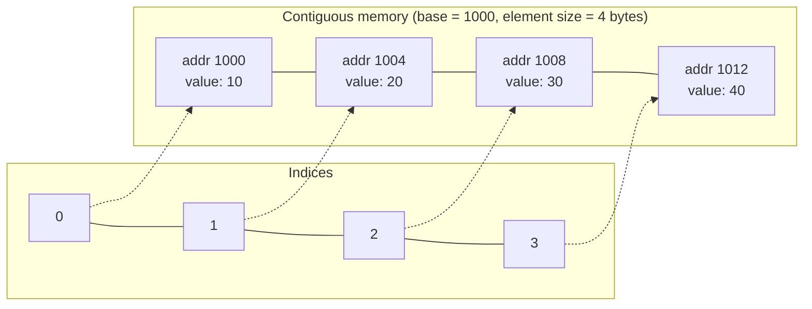
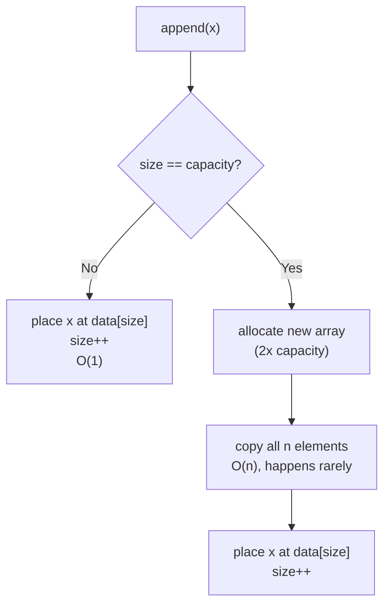

# Array

> An **array** is a linear data structure that stores elements of the same type in a contiguous block of memory, indexed from `0` (or `1`, depending on the language), giving O(1) random access to any element.

## Why it matters

Arrays are the foundation almost every other data structure is built on — dynamic arrays back lists, stacks, and hash table buckets; heaps are stored as arrays; strings are arrays of characters. Interviewers ask about arrays because the questions expose whether a candidate understands *why* certain operations are cheap and others aren't — it's really a question about memory layout and cost, not syntax.

## Contiguous memory and O(1) access

Every element in an array sits right next to the previous one in memory. Because the elements are the same fixed size, the address of any element can be computed directly from the array's base address:

```
address(i) = base_address + i * element_size
```

This is why indexing is **O(1)**: the CPU computes one address and reads it, no traversal needed. Contiguity also means arrays are cache-friendly — reading `arr[i]` typically pulls neighboring elements into the same cache line, which is why sequential array scans are fast in practice even though a linked list has the same "O(n) traversal" complexity on paper.



## Static vs dynamic arrays

| Aspect | Static array | Dynamic array |
|---|---|---|
| Size | Fixed at creation, cannot change | Grows/shrinks as needed |
| Memory | Allocated once, exact size | Over-allocates capacity, resizes when full |
| Examples | C arrays (`int arr[10]`), Java arrays | `ArrayList` (Java), `list` (Python), `Vec` (Rust), `vector` (C++) |
| Access | O(1) | O(1) |
| Growth cost | N/A | Amortized O(1) append, O(n) worst case on resize |

A dynamic array is just a static array under the hood, plus bookkeeping: a `size` (elements in use) and a `capacity` (allocated slots). When `size == capacity` and another element is appended, the array **resizes** — allocates a new, larger backing array (commonly 1.5x or 2x the old capacity), copies every existing element over, then frees the old array.

## Amortized O(1) append

A single append that triggers a resize costs O(n) because every element must be copied. But if capacity grows geometrically (doubling), resizes become exponentially rarer as the array grows, so the *total* copying work across `n` appends is bounded by a constant multiple of `n`. Averaged ("amortized") over all `n` appends, each one costs O(1).



If the growth factor were additive instead (e.g. +1 capacity each time), every append would trigger a full copy, making append O(n) per call and O(n²) overall — this is the key reason geometric growth matters and is a common follow-up interview question.

## Insertion and deletion cost

Unlike append at the end, inserting or deleting at an arbitrary position requires shifting elements to keep the array contiguous:

| Operation | Cost | Why |
|---|---|---|
| Access `arr[i]` | O(1) | Direct address computation |
| Append at end | Amortized O(1) | Occasional O(n) resize, averaged out |
| Insert/delete at end | O(1) | No shifting needed |
| Insert/delete at index `i` | O(n) | All elements after `i` shift by one |
| Insert/delete at start | O(n) | Every other element shifts |
| Search (unsorted) | O(n) | Must scan linearly |
| Search (sorted) | O(log n) | Binary search possible |

## Complexity summary

| Operation | Static array | Dynamic array |
|---|---|---|
| Access by index | O(1) | O(1) |
| Append at end | N/A (fixed size) | Amortized O(1) |
| Insert/delete at end | N/A | O(1) |
| Insert/delete in middle | O(n) | O(n) |
| Search (unsorted) | O(n) | O(n) |
| Space | O(n) exact | O(n), with some unused slack |

## Common Interview Questions

**Q: Why is array access O(1) but linked list access O(n)?**
A: An array's elements are contiguous and fixed-size, so any address can be computed directly from the index. A linked list has no such formula — nodes can be anywhere in memory, so reaching the i-th node requires following `i` pointers from the head.

**Q: Why is dynamic array append "amortized" O(1) instead of just O(1)?**
A: Most appends are O(1) because there's spare capacity, but occasionally the array is full and must resize, copying all existing elements — an O(n) operation. Because resizes happen exponentially less often as the array grows (with doubling), the extra cost spreads thinly across all prior appends, averaging out to O(1) per append over any long sequence.

**Q: Why do dynamic arrays typically double capacity instead of growing by a fixed amount?**
A: Doubling makes resizes geometrically rarer, keeping total copying work linear in the number of elements ever appended (amortized O(1)). Growing by a fixed increment (e.g. +1) forces a copy on nearly every append, making the sequence of `n` appends cost O(n²) overall.

**Q: How do you delete an element from the middle of an array?**
A: Shift every element after the deleted index one position left (or, if order doesn't matter, swap the last element into the gap and shrink size by one for O(1) deletion).

**Q: Array vs linked list — when would you choose each?**
A: Choose an array when you need fast random access, cache-friendly iteration, or minimal memory overhead per element. Choose a linked list when you need frequent insertions/deletions at arbitrary positions without shifting, or when the size is highly unpredictable and you want to avoid over-allocation.

**Q: What's the time complexity of inserting at the beginning of a dynamic array with `n` elements?**
A: O(n) — every existing element must shift right by one position to make room, regardless of whether a resize is also needed.

**Q: Can you do binary search on any array?**
A: Only if the array is sorted. Binary search relies on being able to discard half the remaining elements based on an ordering comparison, which only works when the data is sorted (or has some other monotonic structure).

## Related

- [Stack](stack.md) - commonly implemented on top of a dynamic array
- [Heap](heap.md) - a binary heap is typically stored as a flat array using index arithmetic
