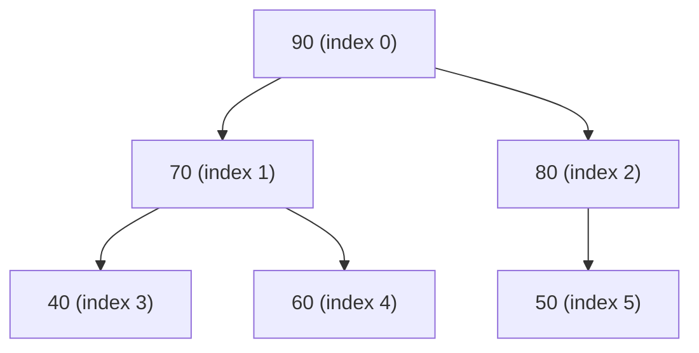
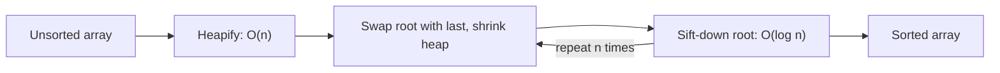

# Binary Heap

> A **heap** is a complete binary tree stored in an array that satisfies the heap property: every parent is ordered relative to its children (min-heap: parent ≤ children; max-heap: parent ≥ children).

## Why it matters

Heaps are the backbone of priority queues, and priority queues show up constantly in interview problems: Dijkstra's shortest path, merging k sorted lists, top-k / k-closest problems, median maintenance, and task scheduling. Interviewers use heap questions to check whether you understand amortized complexity, array-based tree representations, and the difference between "sorted" and "partially ordered" data structures. It is also one of the few data structures where the array representation itself (no pointers) is worth being able to derive on a whiteboard.

## Min-Heap vs Max-Heap

| Property | Min-Heap | Max-Heap |
|---|---|---|
| Root value | Smallest element | Largest element |
| Parent-child rule | parent ≤ children | parent ≥ children |
| `peek()` returns | Minimum | Maximum |
| Typical use | Dijkstra, k smallest elements | Heap sort (ascending), k largest elements |

Both variants share the same structure and operations; only the comparison direction flips. Many languages only ship a min-heap by default (Python's `heapq`, Java's `PriorityQueue`), so a max-heap is usually simulated by negating keys or supplying a reverse comparator.

## Complete Binary Tree and Array Representation

A heap is a **complete binary tree**: every level is fully filled except possibly the last, which is filled left to right. Completeness is what allows a heap to be stored compactly in an array with no wasted space and no pointers.

For a node at index `i` (0-indexed array):

```text
parent(i)      = (i - 1) / 2   (integer division)
left_child(i)  = 2*i + 1
right_child(i) = 2*i + 2
```

If the array is 1-indexed instead, the formulas simplify to `parent(i) = i/2`, `left(i) = 2*i`, `right(i) = 2*i + 1`.



This tree is a valid **max-heap**: every parent is greater than or equal to its children (90 ≥ 70, 90 ≥ 80, 70 ≥ 40, 70 ≥ 60, 80 ≥ 50). Its array form is `[90, 70, 80, 40, 60, 50]`.

## Insert (Sift-Up / Bubble-Up)

To insert, append the new element at the end of the array (the next open leaf position, preserving completeness), then repeatedly swap it with its parent while it violates the heap property.

```python
def push(heap, value):
    heap.append(value)
    i = len(heap) - 1
    while i > 0:
        parent = (i - 1) // 2
        if heap[parent] < heap[i]:      # max-heap comparison
            heap[parent], heap[i] = heap[i], heap[parent]
            i = parent
        else:
            break
```

The new element rises at most the height of the tree, so insert is **O(log n)**.

## Extract-Max / Extract-Min (Sift-Down / Bubble-Down)

To remove the root: save it, move the **last** element in the array to the root position, shrink the array by one, then sift that element down by repeatedly swapping it with its larger (max-heap) or smaller (min-heap) child until the property holds.

```python
def pop_max(heap):
    top = heap[0]
    last = heap.pop()
    if heap:
        heap[0] = last
        i = 0
        n = len(heap)
        while True:
            l, r, largest = 2*i + 1, 2*i + 2, i
            if l < n and heap[l] > heap[largest]:
                largest = l
            if r < n and heap[r] > heap[largest]:
                largest = r
            if largest == i:
                break
            heap[i], heap[largest] = heap[largest], heap[i]
            i = largest
    return top
```

Extract is also **O(log n)**, and peek (reading the root) is **O(1)**.

## Heapify (Build-Heap in O(n))

Building a heap by inserting elements one at a time costs O(n log n). Instead, **heapify** starts from the last non-leaf node (`n/2 - 1`) and sifts each node down, moving toward the root:

```python
def heapify(arr):
    n = len(arr)
    for i in range(n // 2 - 1, -1, -1):
        sift_down(arr, i, n)
```

This runs in **O(n)** overall, not O(n log n), because most nodes are near the bottom of the tree and only need to sift down a short distance — the sum of work across all levels converges to a linear bound rather than n·log n.

## Heap Sort

Heap sort reuses these two building blocks:

1. Heapify the array into a max-heap — **O(n)**.
2. Repeatedly swap the root (the current maximum) with the last unsorted element, shrink the heap by one, and sift the new root down — **O(log n)** per step, **n** steps.



Total time is **O(n log n)**, in place, with **O(1)** extra space — but it is not stable, since equal elements can be reordered during swaps.

## Priority Queue Use

A priority queue is the abstract interface (`insert`, `peek`, `extract`); a binary heap is the standard concrete implementation because it offers O(log n) insert/extract with O(1) peek and no extra memory overhead beyond the array. Typical interview applications:

- **Dijkstra's / Prim's algorithms** — always extract the minimum-distance/weight node next.
- **Merge k sorted lists** — a min-heap of size k holding the current head of each list.
- **Top-k / k closest elements** — a bounded heap of size k, evicting the worst element on each insert.
- **Running median** — two heaps (a max-heap for the lower half, a min-heap for the upper half).

## Complexity Summary

| Operation | Time | Space |
|---|---|---|
| Peek (top) | O(1) | O(1) |
| Insert | O(log n) | O(1) |
| Extract-min/max | O(log n) | O(1) |
| Build heap (heapify) | O(n) | O(1) |
| Heap sort | O(n log n) | O(1) extra |

## Common Interview Questions

**Q: Why is building a heap from an array O(n) instead of O(n log n)?**
A: Because sift-down cost depends on a node's height, not its depth, and most nodes in a complete tree are near the bottom with small height. Summing height × count-of-nodes-at-that-height across all levels gives a series that converges to O(n), not O(n log n).

**Q: Why use an array instead of a pointer-based tree for a heap?**
A: Completeness guarantees no gaps, so parent/child relationships can be computed with simple index arithmetic (`2i+1`, `2i+2`, `(i-1)/2`). This avoids pointer storage overhead and gives excellent cache locality compared to a linked tree.

**Q: What is the time complexity to find the k-th largest element using a heap?**
A: Maintaining a min-heap of size k while scanning n elements takes O(n log k): each of the n elements triggers at most one O(log k) push/pop against the bounded heap.

**Q: Is a binary heap the same as a binary search tree?**
A: No. A BST maintains a total order that enables O(log n) search for arbitrary values via in-order traversal. A heap only guarantees the parent-child ordering needed to find the min/max quickly; it does not support efficient arbitrary search, and in-order traversal of a heap is not sorted.

**Q: How do you implement a max-heap using a language whose library only provides a min-heap?**
A: Negate the keys before pushing (and negate again on pop), or supply a comparator/key function that reverses the natural ordering.

**Q: Is heap sort stable? Is it in-place?**
A: It is in-place (O(1) extra space) but not stable — swapping the root with the last element during extraction can change the relative order of equal keys.

**Q: When would you prefer a heap-based priority queue over simply sorting the data?**
A: When elements arrive incrementally and you repeatedly need the current min/max without knowing the full data set upfront, or when you only need the top-k of a large stream, a heap avoids the cost of a full O(n log n) sort and keeps per-operation cost at O(log n).

## Related

- [Trees](trees.md) - heaps are a specialized, array-backed complete binary tree
- [Sorting Algorithms](sorting.md) - heap sort compared against quicksort and merge sort
- [Graphs](graphs.md) - priority queues built on heaps drive Dijkstra's and Prim's algorithms
