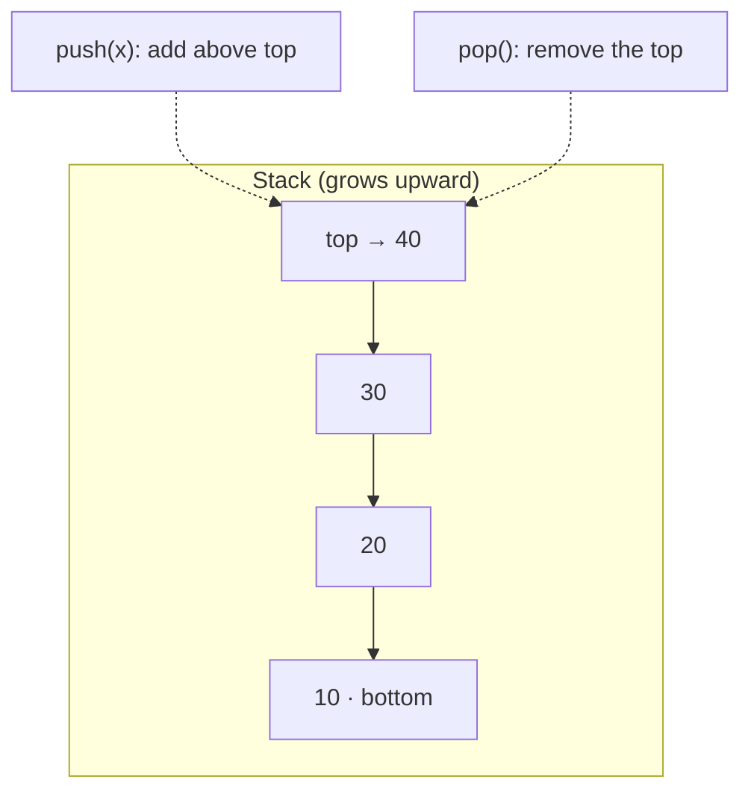

# Stack

> A **stack** is a linear data structure that follows **LIFO** — Last In, First Out. The last element pushed is the first one popped. Think of a stack of plates: you add and remove from the top only.

## Why it matters

Stacks are everywhere in systems you already use — the **call stack** that runs your program, the **undo** button, browser **back** history, and **depth-first search**. Interviewers love stack problems because the right data structure turns an ugly problem (balanced parentheses, expression evaluation, "next greater element") into a clean O(n) pass.

## Core operations

All core operations are **O(1)** — they only touch the top.

| Operation | Description | Time |
|-----------|-------------|------|
| `push(x)` | Add `x` to the top | O(1) |
| `pop()` | Remove & return the top | O(1) |
| `peek()` / `top()` | Look at the top without removing | O(1) |
| `isEmpty()` | Is the stack empty? | O(1) |
| `size()` | Number of elements | O(1) |



## Implementation

A stack can be backed by a **dynamic array** or a **linked list**. Array-backed is the common default (cache-friendly, less memory overhead).

```java
// Array-backed stack (Java-style pseudocode)
class Stack<T> {
    private Object[] data = new Object[16];
    private int n = 0; // number of elements

    void push(T x) {
        if (n == data.length) resize(2 * data.length); // amortized O(1)
        data[n++] = x;
    }

    @SuppressWarnings("unchecked")
    T pop() {
        if (n == 0) throw new RuntimeException("Stack underflow");
        T x = (T) data[--n];
        data[n] = null; // avoid loitering / memory leak
        return x;
    }

    @SuppressWarnings("unchecked")
    T peek() {
        if (n == 0) throw new RuntimeException("Stack empty");
        return (T) data[n - 1];
    }

    boolean isEmpty() { return n == 0; }
}
```

> In real code, use the language's built-in: `java.util.Deque` (`ArrayDeque`) in Java — prefer it over the legacy `Stack` class — or a plain `list` (`append`/`pop`) in Python.

## Classic applications

- **Function call stack** — each call pushes a frame; returning pops it. Infinite recursion → *stack overflow*.
- **Balanced parentheses** — push openers, pop and match on closers.
- **Undo / redo** — push each action; undo pops.
- **Expression evaluation** — convert infix → postfix and evaluate with a stack.
- **DFS** — the iterative form uses an explicit stack (recursion uses the call stack).
- **Backtracking** — the recursion stack records the path to unwind.

## Example: valid parentheses (O(n))

```python
def is_valid(s: str) -> bool:
    pairs = {')': '(', ']': '[', '}': '{'}
    stack = []
    for ch in s:
        if ch in '([{':
            stack.append(ch)
        elif ch in pairs:
            if not stack or stack.pop() != pairs[ch]:
                return False
    return not stack   # leftover openers → invalid
```

## Common Interview Questions

**Q: Stack vs Queue?**
A: Stack is **LIFO** (add/remove same end); queue is **FIFO** (add at rear, remove from front). Choose by whether you need most-recent-first (stack) or oldest-first (queue).

**Q: How do you implement a queue using two stacks?**
A: Keep an `in` stack and an `out` stack. Push to `in`. To dequeue, if `out` is empty, pop everything from `in` into `out` (reversing order), then pop from `out`. Amortized O(1) per operation.

**Q: How would you design a stack that returns the minimum in O(1)?**
A: Keep an auxiliary "min stack" that pushes the current minimum alongside each element (or pushes only when a new min appears). `getMin` reads the top of the min stack in O(1).

**Q: What causes a stack overflow?**
A: The call stack exceeding its size limit — usually unbounded/deep recursion with no base case, or recursion depth larger than the stack can hold. Fixes: add/verify the base case, or convert to an iterative solution with an explicit heap-allocated stack.

## Related

- [Heap](heap.md) — a different "stack vs heap" (memory) and the heap data structure
- [Array](array.md) — the usual backing store for a stack
