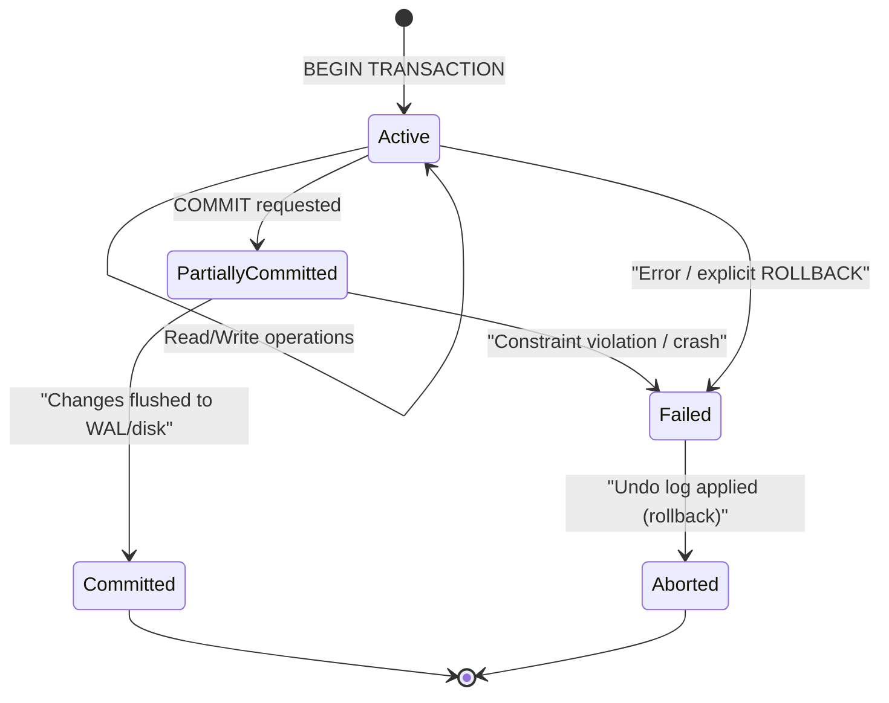

# ACID Properties

> **ACID** (Atomicity, Consistency, Isolation, Durability) is the set of guarantees a database transaction makes so that data stays correct even under crashes and concurrent access.

## Why it matters

Interviewers ask about ACID to check that you understand what a database actually promises you, not just how to write queries. It comes up constantly in system design ("can we relax consistency for scale?"), debugging ("why did I see a partial update?"), and architecture reviews (choosing SQL vs. NoSQL, picking an isolation level). A candidate who can explain each property with a concrete failure scenario, and can map isolation levels to the anomalies they prevent, signals real production experience rather than textbook memorization.

## The Four Properties

| Property | Guarantee | Failure it prevents |
|---|---|---|
| Atomicity | A transaction's operations all succeed, or none do | Partial writes (e.g., debit without credit) |
| Consistency | A transaction moves the database from one valid state to another, respecting constraints | Violation of schema rules, foreign keys, invariants |
| Isolation | Concurrent transactions don't see each other's uncommitted intermediate state | Dirty reads, race conditions between transactions |
| Durability | Once committed, changes survive crashes, power loss, restarts | Lost updates after a crash |

**Atomicity** - a money transfer debits one account and credits another; if the credit fails, the debit must roll back too. Databases implement this with undo logs / transaction logs that let incomplete work be rolled back.

**Consistency** - constraints such as `PRIMARY KEY`, `FOREIGN KEY`, `CHECK`, and application-level invariants (e.g., balance >= 0) must hold before and after the transaction. Note: this is *not* the same "C" as in the CAP theorem.

**Isolation** - two customers withdrawing from the same account at the same time shouldn't corrupt the balance. Implemented via locking (row/table/page-level) or Multi-Version Concurrency Control (MVCC), which gives each transaction a consistent snapshot instead of blocking readers.

**Durability** - after a transaction commits, the change survives a server crash. Implemented via Write-Ahead Logging (WAL) - the log is flushed to disk before the change is acknowledged - plus periodic checkpoints.

## Transaction Lifecycle

A transaction moves through a small number of states between `BEGIN` and its terminal outcome.



```sql
BEGIN TRANSACTION;
UPDATE accounts SET balance = balance - 100 WHERE id = 1;
UPDATE accounts SET balance = balance + 100 WHERE id = 2;
COMMIT;
```

- `COMMIT` finalizes the transaction; changes become permanent and visible to others.
- `ROLLBACK` undoes every operation in the transaction, returning the database to its pre-transaction state.
- If the system crashes before `COMMIT`, atomicity guarantees the change is rolled back on recovery. If it crashes after `COMMIT`, durability guarantees the change is replayed from the WAL.

## Isolation Levels and Anomalies

Isolation levels trade off correctness guarantees against concurrency (and therefore performance). Stricter levels prevent more anomalies but allow less parallelism.

| Isolation Level | Dirty Read | Non-Repeatable Read | Phantom Read | Typical Mechanism |
|---|---|---|---|---|
| Read Uncommitted | Possible | Possible | Possible | No locking on reads |
| Read Committed | Prevented | Possible | Possible | Row locks / snapshot per statement |
| Repeatable Read | Prevented | Prevented | Possible* | Snapshot per transaction |
| Serializable | Prevented | Prevented | Prevented | Range locks / serializable snapshot isolation |

\* Some engines (e.g., MySQL InnoDB) prevent phantom reads at Repeatable Read using gap locking, going beyond the SQL standard's minimum guarantee.

**Anomaly definitions:**
- **Dirty read** - reading data written by an uncommitted transaction that might still be rolled back.
- **Non-repeatable read** - re-reading the same row within a transaction and getting a different value because another transaction committed a change in between.
- **Phantom read** - re-running the same query and getting a different *set of rows* because another transaction inserted or deleted matching rows.

Choosing a level is a trade-off: Serializable gives the strongest correctness but the most blocking/aborts under contention; Read Committed (the default in PostgreSQL and Oracle) is often the practical sweet spot for OLTP workloads.

## Distributed Transactions and ACID

Maintaining ACID across multiple nodes is harder than on a single node:

- **Two-Phase Commit (2PC)**: a coordinator asks all participants to *prepare* (can you commit?); only if all agree does it send *commit*. Guarantees atomicity across databases but blocks on coordinator failure.
- **Consensus algorithms** (Paxos, Raft) are used to keep replicated logs consistent so durability and consistency survive node failures.
- **Network partitions** force a choice between availability and strict consistency, which is why many distributed/NoSQL systems adopt **BASE** (Basically Available, Soft state, Eventual consistency) instead of full ACID.

| Aspect | ACID (traditional RDBMS) | BASE (many NoSQL systems) |
|---|---|---|
| Consistency | Strong, immediate | Eventual |
| Transactions | Strict, multi-statement | Often limited or single-document |
| Scalability | Typically vertical | Typically horizontal |
| Availability under partition | May sacrifice availability | Favors availability |

## Common Interview Questions

**Q: What does ACID stand for and why does it matter?**
A: Atomicity, Consistency, Isolation, Durability - the guarantees that make a transaction safe to run concurrently and resilient to crashes. Without them, a partial failure (crash mid-transfer, two users writing at once) could corrupt data silently.

**Q: What's the difference between atomicity and durability?**
A: Atomicity is about the transaction's operations succeeding or failing as a unit while it's running. Durability is about what happens *after* it commits - the result must survive crashes. Atomicity protects against partial writes; durability protects against losing completed writes.

**Q: How does MVCC provide isolation without heavy locking?**
A: Each transaction reads a consistent snapshot of the database as of its start (or statement start), so readers don't block writers and writers don't block readers. Multiple versions of a row are kept until no active transaction needs the old version.

**Q: What isolation level would you pick for a banking application, and why?**
A: Often Repeatable Read or Serializable for the transfer logic itself, because dirty or non-repeatable reads on balances can cause real financial errors; Read Committed may be acceptable for less sensitive reporting queries where slight staleness is tolerable.

**Q: What is a phantom read and which isolation level prevents it?**
A: A phantom read happens when a transaction re-runs a range query and sees new rows that another transaction inserted and committed in between. Serializable isolation prevents it (and some engines' Repeatable Read implementations do too, via gap locking).

**Q: Is the "C" in ACID the same as the "C" in CAP theorem?**
A: No. ACID's Consistency means the database respects its own constraints and invariants after every transaction. CAP's Consistency means all nodes see the same data at the same time (linearizability) - a distributed-systems property, not a schema-integrity one.

**Q: Why do stronger isolation levels hurt performance?**
A: They require more locking or more conflict detection (e.g., range locks for Serializable), which increases blocking, deadlock risk, and transaction aborts under contention, reducing throughput compared to weaker levels like Read Committed.

## Related

- [sql.md](sql.md) - the query language transactions are written in
- [concepts.md](concepts.md) - broader database fundamentals underpinning ACID
- [nosql.md](nosql.md) - how BASE-style systems relax ACID guarantees for scale
- [indexing.md](indexing.md) - how locks and MVCC interact with indexes during concurrent access
