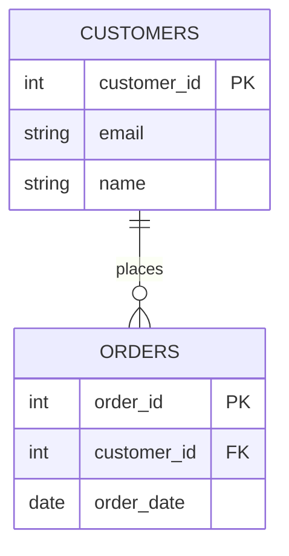

# Database Concepts: Entities, Schemas, and Keys

> A **database** is an organized collection of structured data, and the concepts of entities, schemas, and keys describe how that data is modeled, constrained, and connected.

## Why it matters

Interviewers ask about these fundamentals because everything else - normalization, indexing, query performance, transaction design - depends on them. A candidate who cannot clearly explain what makes a key a key, or how a DBMS differs from an RDBMS, usually struggles once the conversation moves to real schema design or debugging a data integrity bug. These questions are quick to ask and reveal whether someone has a solid mental model versus memorized buzzwords.

## Entities and Schemas

An **entity** is a distinct object or concept the database stores information about - a customer, an order, a product. In a relational database, each entity type typically becomes a **table**, each instance becomes a **row**, and each attribute becomes a **column**.

A **schema** is the structural blueprint of the database: the tables, columns, data types, constraints, and the relationships between them. It defines what data *can* exist and how it fits together, independent of the actual data (the rows) stored at any given moment.

- **Logical schema** - the conceptual structure (entities, attributes, relationships), independent of any specific DBMS.
- **Physical schema** - how that structure is actually implemented on disk (file organization, storage engine, indexing, partitioning).

## DBMS vs RDBMS

A **DBMS (Database Management System)** is software that lets applications create, read, update, and delete data in a database. An **RDBMS (Relational DBMS)** is a specific kind of DBMS that organizes data into tables with rows and columns, enforces relationships through keys, and typically supports SQL and ACID transactions.

| Aspect | DBMS | RDBMS |
|---|---|---|
| Data model | Any (files, hierarchical, network, document, key-value, relational) | Strictly tabular (rows and columns) |
| Relationships | Not necessarily enforced | Enforced via primary/foreign keys and constraints |
| Standard query language | Varies by product | SQL |
| Normalization | Not applicable in most models | Central concept |
| ACID compliance | Not guaranteed | Generally required/expected |
| Examples | File systems, MongoDB, early hierarchical systems | PostgreSQL, MySQL, Oracle, SQL Server |

Every RDBMS is a DBMS, but not every DBMS is relational - this is the classic set/subset relationship interviewers are checking that you understand.

## Keys

Keys are how a relational database uniquely identifies rows and links tables together.

- **Candidate key** - any column (or minimal set of columns) that could uniquely identify a row. A table can have several candidate keys.
- **Primary key** - the candidate key chosen to be *the* unique identifier for a table. It cannot be `NULL` and must be unique for every row.
- **Composite key** - a primary (or candidate) key made up of two or more columns, used when no single column is unique on its own (e.g., `order_id` + `product_id` in an order-items table).
- **Super key** - any set of columns that uniquely identifies a row, including extra columns beyond what's strictly needed. Every candidate key is a super key, but not every super key is minimal enough to be a candidate key.
- **Foreign key** - a column (or set of columns) in one table that references the primary key of another table, enforcing referential integrity between the two.
- **Surrogate key** - an artificial, system-generated identifier (e.g., an auto-increment integer or UUID) with no business meaning, used instead of a natural key that might change over time.

```sql
CREATE TABLE customers (
    customer_id   INT PRIMARY KEY,
    email         VARCHAR(255) UNIQUE NOT NULL, -- candidate key
    name          VARCHAR(255) NOT NULL
);

CREATE TABLE orders (
    order_id      INT PRIMARY KEY,
    customer_id   INT NOT NULL,
    order_date    DATE NOT NULL,
    FOREIGN KEY (customer_id) REFERENCES customers(customer_id)
);
```

## Relationships

Relationships describe how rows in one table connect to rows in another, and they come in three cardinalities:

- **One-to-one** - one row in Table A relates to exactly one row in Table B (e.g., a user and their profile).
- **One-to-many** - one row in Table A relates to many rows in Table B (e.g., one customer has many orders). This is the most common relationship and is implemented with a foreign key on the "many" side.
- **Many-to-many** - many rows in Table A relate to many rows in Table B (e.g., students and courses). This requires a junction (bridge) table holding foreign keys to both sides.



In this diagram, `customer_id` is the primary key of `CUSTOMERS` and a foreign key in `ORDERS`, giving a one-to-many relationship: one customer can place zero or many orders (`||--o{`), but each order belongs to exactly one customer.

## Common Interview Questions

**Q: What is the difference between a database, a DBMS, and an RDBMS?**
A: A database is the actual stored data. A DBMS is the software layer that manages access to that data. An RDBMS is a DBMS that specifically organizes data relationally, into tables linked by keys, and generally supports SQL and ACID transactions.

**Q: What's the difference between a primary key and a candidate key?**
A: A candidate key is any minimal column set that could uniquely identify a row - a table can have several. The primary key is the one candidate key chosen as the table's official identifier; all other candidate keys become "alternate keys" or unique constraints.

**Q: What is a composite key, and when would you use one?**
A: A composite key is a primary key made of two or more columns because no single column is unique on its own. It's common in junction tables for many-to-many relationships, such as `(student_id, course_id)` in an enrollments table.

**Q: What's the difference between a super key and a candidate key?**
A: A super key is any combination of columns that uniquely identifies a row, even if it includes redundant columns. A candidate key is a *minimal* super key - remove any column from it and it stops being unique.

**Q: Why use a surrogate key instead of a natural key?**
A: Natural keys (like an email or a national ID) can change or turn out not to be as unique as assumed, which breaks anything referencing them as a foreign key. A surrogate key (auto-increment ID, UUID) is stable, has no business meaning, and never needs to change.

**Q: How do you model a many-to-many relationship in a relational database?**
A: You cannot represent it directly with a single foreign key. Instead, you create a junction table that holds a foreign key to each side of the relationship, and typically the combination of the two foreign keys becomes that junction table's composite primary key.

**Q: What is a schema, and how is it different from the data itself?**
A: The schema is the structural definition - tables, columns, types, constraints, relationships. The data is the actual rows stored according to that structure at any point in time. You can change the schema (e.g., add a column) without changing the existing data's meaning.

## Related

- [normalization.md](normalization.md) - how these keys and relationships are used to eliminate redundancy
- [sql.md](sql.md) - the query language used to define and manipulate schemas built on these concepts
- [acid.md](acid.md) - the transactional guarantees RDBMSs provide on top of this relational model
- [nosql.md](nosql.md) - how non-relational databases handle entities and relationships differently
