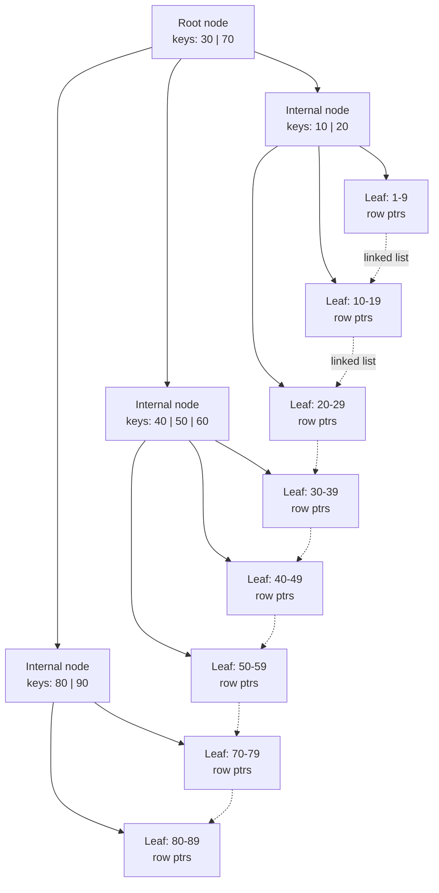

# Database Indexing
> A **database index** is a separate data structure that maps column values to row locations, letting the engine find rows without scanning the whole table.

## Why it matters
Indexing questions separate candidates who memorized "add an index to make it fast" from those who understand the underlying trade-offs. Interviewers use this topic to probe whether you understand how data is physically stored, why every index has a write-time cost, and why composite index column order matters. It also opens the door to deeper systems questions about B-trees, query planning, and covering indexes.

## How an Index Works
An index is a sorted (or hashed) structure built on one or more columns, containing the column values plus a pointer (or the primary key) back to the full row. Instead of scanning every row (an O(n) table scan), the database engine can binary-search the index structure and jump directly to matching rows, typically O(log n) for tree-based indexes.

The trade-off is fundamental: an index speeds up reads that filter, sort, or join on the indexed column(s), but it must be updated on every `INSERT`, `UPDATE`, and `DELETE`, which slows down writes and consumes extra storage.

## Clustered vs Non-Clustered Indexes

| Aspect | Clustered Index | Non-Clustered Index |
|---|---|---|
| Data storage | The table's rows are physically stored in index order | Rows stay in their own storage; the index is a separate structure with pointers back to rows |
| Count per table | One (the table can only be sorted one way physically) | Many |
| Lookup for non-covered columns | Direct — the leaf node *is* the row | Extra step: leaf points to a row locator, requiring a second lookup ("bookmark lookup" / key lookup) |
| Typical default | Primary key (e.g., InnoDB clusters on the primary key) | Any other indexed column, e.g., `email`, `created_at` |
| Best for | Range scans on the clustering key, primary key lookups | Selective equality/range lookups on non-key columns |

In MySQL's InnoDB, the primary key index *is* the clustered index — the table data lives inside it. Every secondary (non-clustered) index stores the primary key value as its row pointer, which is why a small, stable primary key matters for overall index size.

## B-Tree and B+-Tree Structure
Most relational databases use a **B+-tree** for their indexes (a variant of the B-tree). Internal nodes store only keys used for navigation; all actual data (or row pointers) lives in the leaf nodes, and leaf nodes are linked together in a doubly linked list. That leaf-linking is what makes range scans (`BETWEEN`, `ORDER BY`, `<`, `>`) efficient — once you find the starting leaf, you walk the linked list instead of re-traversing the tree.

Key properties:
- Balanced: every leaf is at the same depth, so lookup cost is consistent (O(log n)).
- High fan-out: each node holds many keys, so trees stay shallow (often 3-4 levels) even for millions of rows, keeping disk I/O low.
- Sorted: in-order traversal of leaves gives sorted output for free, which is why B+-trees support both equality and range queries — unlike hash indexes, which only support equality.



A lookup for `WHERE id = 45` walks Root -> B (since 40 <= 45 < 60's boundary) -> leaf `40-49`, then reads the row pointer. A range scan `WHERE id BETWEEN 25 AND 55` finds the first matching leaf the same way, then follows the linked-list pointers forward instead of re-descending the tree for every value.

## Composite Indexes
A composite (multi-column) index is built on two or more columns, stored as a single sorted structure keyed on column order — analogous to sorting by last name, then first name.

```sql
CREATE INDEX idx_users_name_email ON users(last_name, first_name);
```

The **leftmost-prefix rule** governs when this index helps:
- `WHERE last_name = 'Doe'` — uses the index.
- `WHERE last_name = 'Doe' AND first_name = 'Jane'` — uses the index fully.
- `WHERE first_name = 'Jane'` — cannot use this index (no leftmost prefix), likely a full scan or a different index.

Column order should generally put the most selective / most frequently filtered-alone column first, though equality columns before range columns is another common rule of thumb (put columns used with `=` before columns used with `<`, `>`, or `BETWEEN`).

## Covering Indexes
A covering index includes every column a query needs (in the `SELECT`, `WHERE`, `JOIN`, and `ORDER BY` clauses), so the engine can answer the query from the index alone without touching the underlying table — this is called an **index-only scan**.

```sql
CREATE INDEX idx_orders_covering ON orders(customer_id, order_date, total_amount);

SELECT order_date, total_amount
FROM orders
WHERE customer_id = 42;
```

Because `order_date` and `total_amount` are stored in the index itself, the database skips the extra row lookup entirely. This is one of the highest-leverage index optimizations for read-heavy hot paths, but it trades additional index storage and write overhead for the read speedup.

## Read vs Write Trade-offs

| Concern | Effect of adding an index |
|---|---|
| SELECT performance | Faster lookups, range scans, sorts, joins on indexed columns |
| INSERT / UPDATE / DELETE | Slower — every index on the table must be updated too |
| Storage | Extra disk space per index (can rival or exceed table size for wide composite indexes) |
| Query planner | More indexes give the optimizer more choices but also more overhead to evaluate |
| Cardinality sensitivity | High-cardinality columns (many unique values, e.g., email, UUID) benefit most; low-cardinality columns (e.g., boolean flags) rarely justify an index |

The practical guidance: index columns that are frequently filtered, joined, or sorted on and have reasonably high selectivity; avoid indexing every column "just in case," especially on write-heavy tables.

## Common Interview Questions

**Q: What's the difference between a clustered and a non-clustered index?**
A: A clustered index determines the physical storage order of table rows — there can be only one per table. A non-clustered index is a separate structure with pointers back to the rows, and a table can have many of them.

**Q: Why does column order matter in a composite index?**
A: The index is a single structure sorted by the first column, then the second, and so on. Queries can only use the index efficiently if they filter on a leftmost prefix of the indexed columns; skipping the first column defeats the index.

**Q: What is a covering index and why is it fast?**
A: It's an index that contains every column a query needs, so the engine can satisfy the query entirely from the index without a separate lookup into the table (an index-only scan), avoiding extra I/O.

**Q: Why do indexes slow down writes?**
A: Every `INSERT`, `UPDATE`, or `DELETE` must also update each index on the affected columns to keep them consistent with the table, which means more B-tree maintenance work and I/O per write.

**Q: Why are B+-trees preferred over plain B-trees for database indexes?**
A: B+-trees store all data only in leaf nodes and link leaves together, so range scans just walk the linked list instead of re-traversing the tree; internal nodes stay small and hold only navigation keys, keeping the tree shallow and disk-efficient.

**Q: When would a hash index be preferable to a B-tree index?**
A: When the workload is pure equality lookups (no range queries, no sorting needed) — hash indexes offer O(1) average lookup but cannot support `<`, `>`, `BETWEEN`, or `ORDER BY`.

**Q: What is index cardinality and why does it matter?**
A: Cardinality is the number of distinct values in a column relative to total rows. High-cardinality columns (e.g., email) benefit greatly from indexing because each lookup filters out most rows; low-cardinality columns (e.g., a boolean) filter out little, so the index adds overhead without much read benefit.

## Related
- [SQL Fundamentals](sql.md) - query patterns that indexes are built to optimize
- [ACID Properties](acid.md) - how transactional guarantees interact with index updates
- [Normalization](normalization.md) - schema design decisions that shape which indexes make sense
- [NoSQL Databases](nosql.md) - how indexing differs in non-relational stores
