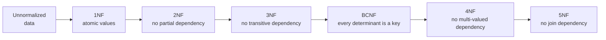
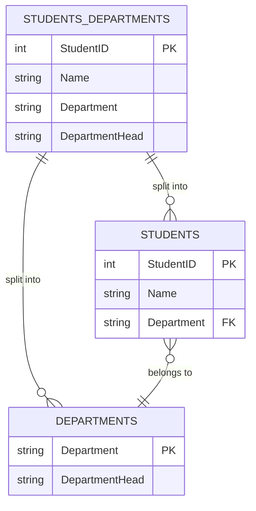

# Database Normalization

> **Normalization** is the process of structuring relational tables to eliminate redundant data and dependency anomalies, driven by a series of increasingly strict **normal forms**.

## Why it matters

Interviewers ask about normalization because it tests whether a candidate can reason about data dependencies, not just memorize definitions. A schema with the wrong dependencies causes update, insert, and delete anomalies that silently corrupt data as an application grows. It's also a good proxy for judgment: senior engineers know when to normalize for integrity and when to denormalize for read performance.

## The Normal Forms

Normalization defines a series of normal forms (1NF through 5NF, plus BCNF), each building on the previous one:

1. **First Normal Form (1NF)**: Eliminate duplicate columns and ensure atomicity.
2. **Second Normal Form (2NF)**: Ensure 1NF and remove partial dependencies.
3. **Third Normal Form (3NF)**: Ensure 2NF and remove transitive dependencies.
4. **Boyce-Codd Normal Form (BCNF)**: Stronger version of 3NF.
5. **Fourth Normal Form (4NF)**: Eliminate multi-valued dependencies.
6. **Fifth Normal Form (5NF)**: Handle join dependencies.

## First Normal Form (1NF)

A table is in 1NF if:

1. All columns contain atomic (indivisible) values.
2. Each row is unique (has a unique identifier like a primary key).
3. Each column has a single value (no repeating groups or arrays).

Example (Non-1NF):
| StudentID | Name | Subjects |
|-----------|--------|------------------|
| 101 | Alice | Math, Science |
| 102 | Bob | English, History |

Converted to 1NF:
| StudentID | Name | Subject |
|-----------|--------|---------|
| 101 | Alice | Math |
| 101 | Alice | Science |
| 102 | Bob | English |
| 102 | Bob | History |

## Second Normal Form (2NF)

A table is in 2NF if:

1. It is in 1NF.
2. It has no partial dependencies (a non-prime attribute should depend on the entire primary key, not a part of it).

Example (Non-2NF):
| OrderID | ProductID | ProductName | Quantity |
|---------|-----------|---------------|---------|
| 1 | 101 | Laptop | 2 |
| 2 | 102 | Smartphone | 3 |

Here, ProductName depends only on ProductID (a part of the key, not the whole key).

Converted to 2NF:

1. Orders Table:
   | OrderID | ProductID | Quantity |
   |---------|-----------|---------|
   | 1 | 101 | 2 |
   | 2 | 102 | 3 |

2. Products Table:
   | ProductID | ProductName |
   |-----------|---------------|
   | 101 | Laptop |
   | 102 | Smartphone |

## Third Normal Form (3NF)

A table is in 3NF if:

1. It is in 2NF.
2. It has no transitive dependencies (non-key attributes should not depend on other non-key attributes).

Example (Non-3NF):
| StudentID | Name | Department | DepartmentHead |
|-----------|--------|------------|----------------|
| 101 | Alice | CS | Dr. Smith |
| 102 | Bob | EE | Dr. Jones |

Here, DepartmentHead depends on Department, not directly on StudentID.

Converted to 3NF:

1. Students Table:
   | StudentID | Name | Department |
   |-----------|--------|------------|
   | 101 | Alice | CS |
   | 102 | Bob | EE |

2. Departments Table:
   | Department | DepartmentHead |
   |------------|----------------|
   | CS | Dr. Smith |
   | EE | Dr. Jones |

### Visualizing the split

The diagram below shows the general shape of a decomposition: a single table with a partial or transitive dependency is split into two tables joined by a foreign key, so each non-key attribute depends only on its own table's key.

`DepartmentHead` transitively depended on `StudentID` through `Department`. Moving it into its own `DEPARTMENTS` table means `DepartmentHead` now depends directly on `Department`, its actual key, and the two tables are reconnected with a foreign key.

## Boyce-Codd Normal Form (BCNF)

A table is in BCNF if:

1. It is in 3NF.
2. For every dependency, the left-hand side is a superkey.

Example (Non-BCNF):
| ProfessorID | Course | Department |
|-------------|--------------|------------|
| 1 | Databases | CS |
| 2 | Networks | EE |

Here, Course → Department violates BCNF because Course is not a superkey.

Converted to BCNF:

1. ProfessorCourses Table:
   | ProfessorID | Course |
   |-------------|------------|
   | 1 | Databases |
   | 2 | Networks |

2. Courses Table:
   | Course | Department |
   |------------|------------|
   | Databases | CS |
   | Networks | EE |

## Fourth Normal Form (4NF)

A table is in 4NF if:

1. It is in BCNF.
2. It has no multi-valued dependencies.

Example (Non-4NF):
| StudentID | Course | Hobby |
|-----------|------------|--------------|
| 101 | Math | Painting |
| 101 | Math | Music |
| 101 | Science | Painting |

Converted to 4NF:

1. StudentCourses Table:
   | StudentID | Course |
   |-----------|------------|
   | 101 | Math |
   | 101 | Science |

2. StudentHobbies Table:
   | StudentID | Hobby |
   |-----------|------------|
   | 101 | Painting |
   | 101 | Music |

## Fifth Normal Form (5NF)

A table is in 5NF if:

1. It is in 4NF.
2. It handles join dependencies (data cannot be further split without losing information).

## Partial and Transitive Dependencies

- **Partial dependency**: a non-prime attribute depends on part of a composite key (violates 2NF).
- **Transitive dependency**: a non-key attribute depends on another non-key attribute rather than directly on the key (violates 3NF).

| Feature | 3NF | BCNF |
|---------|-----|------|
| Dependency rule | No transitive dependency | Every determinant is a key |
| Key requirement | Non-prime attributes depend on key | Every left-hand side is a superkey |
| Strictness | Less strict | More strict |

## Denormalization

Denormalization is the process of deliberately combining tables to:

- Improve read performance.
- Reduce complex joins.

However, it increases data redundancy and the risk of update anomalies, so it is a trade-off, not a shortcut.

**Use denormalization when:**

- The application is read-heavy and joins are the bottleneck.
- Building reporting or analytics systems that favor fewer joins.
- Scalability and read latency are prioritized over strict integrity.

## Trade-offs of Normalization

| Aspect | Normalization | Denormalization |
|--------|---------------|------------------|
| Data redundancy | Low | Higher |
| Data integrity | Strong | Weaker, needs care |
| Write performance | Better | Can degrade with duplication |
| Read performance | Can require many joins | Fewer joins, faster reads |
| Schema complexity | More tables | Fewer, wider tables |

## Common Interview Questions

**Q: What is normalization and why is it important?**
A: Normalization is the process of organizing relational data to minimize redundancy and prevent update, insert, and delete anomalies. It matters because it keeps data consistent as a schema grows and reduces the chance of conflicting copies of the same fact.

**Q: What is the difference between a partial dependency and a transitive dependency?**
A: A partial dependency is when a non-key attribute depends on only part of a composite primary key (a 2NF violation). A transitive dependency is when a non-key attribute depends on another non-key attribute instead of directly on the primary key (a 3NF violation).

**Q: What is the difference between 3NF and BCNF?**
A: 3NF only requires that non-prime attributes depend on the whole key and not on other non-prime attributes. BCNF is stricter: every determinant in every functional dependency must be a superkey, even if that determinant is made up of non-prime attributes. A table can satisfy 3NF but still violate BCNF when overlapping composite candidate keys exist.

**Q: Why would you denormalize a database?**
A: To reduce the number of joins needed for frequent read queries, typically in read-heavy or reporting workloads where query latency matters more than storage efficiency or write-time integrity. It's a deliberate trade of redundancy for speed, usually applied after profiling shows joins are the bottleneck.

**Q: Can a table be in 3NF but not in BCNF? Give an example.**
A: Yes, this happens when there are multiple overlapping composite candidate keys. For example, in a table of (ProfessorID, Course, Department) where a professor can teach multiple courses but each course belongs to exactly one department, Course → Department is a valid functional dependency, yet Course alone is not a superkey of the table, so it violates BCNF even though it may pass 3NF's non-prime-attribute test.

**Q: How does normalization affect indexing and performance?**
A: Normalization reduces table width and row size, which improves indexing performance and reduces index maintenance overhead. The trade-off is that queries often need more joins across the smaller, related tables, which can add read-time cost that indexing and query planning need to offset.

**Q: What is a surrogate key and why use one during normalization?**
A: A surrogate key is an artificial primary key, such as an auto-increment integer or UUID, that has no business meaning and uniquely identifies each row. It's useful when decomposing tables during normalization because it gives each new table a stable, simple key to reference via foreign keys, independent of any natural key that might change.

## Related

- [sql.md](sql.md) - joins and queries needed to work with normalized, decomposed tables
- [acid.md](acid.md) - transactional guarantees that keep normalized data consistent across related tables
- [indexing.md](indexing.md) - how indexes offset the join cost introduced by normalization
- [nosql.md](nosql.md) - contrasts with denormalized, document-oriented data modeling
