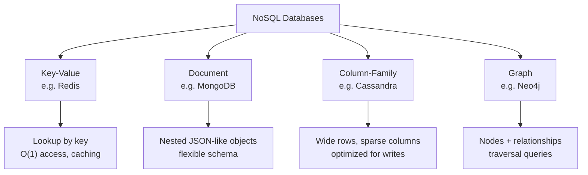
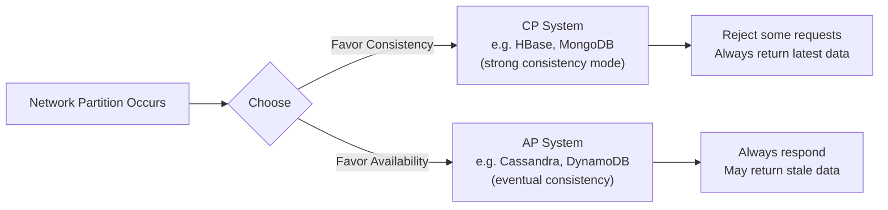

# NoSQL Databases
> **NoSQL** databases are non-relational data stores built to trade strict consistency and rigid schemas for flexible schemas, horizontal scalability, and high availability across distributed nodes.

## Why it matters
Interviewers ask about NoSQL to see whether you can match a data store to a workload instead of defaulting to "just use Postgres" or "just use Mongo." The topic tests whether you understand distributed systems trade-offs (CAP, consistency models) and can reason about access patterns, not just syntax. It also reveals whether you've actually operated one of these systems in production, where replication lag and partition behavior become real problems.

## The Four Types of NoSQL Databases
Each type optimizes for a different access pattern. Picking the right one is largely about how your application reads and writes data.

| Type | Data model | Example DB | Best for |
|---|---|---|---|
| Key-Value | Opaque value stored under a unique key | Redis | Caching, session storage, feature flags |
| Document | Semi-structured documents (JSON/BSON) | MongoDB | Content management, catalogs, nested objects |
| Column-Family | Rows with dynamic, sparse columns grouped by column family | Cassandra | Time-series, write-heavy telemetry, large-scale logging |
| Graph | Nodes and edges with properties | Neo4j | Social networks, recommendation engines, fraud detection |

- **Key-value** is the simplest model: get/set by key, no query language over the value's internals. Redis also layers in data structures (lists, sets, sorted sets) and pub/sub, which is why it's used for caching and rate limiting, not just plain key-value lookups.
- **Document** stores group related data into a single document, avoiding joins for common access patterns. MongoDB documents map naturally to application objects, which speeds up development but pushes referential integrity into the application layer.
- **Column-family** stores (Cassandra, HBase) organize data by row key with column families that can vary per row. They're built for massive write throughput and linear horizontal scaling, at the cost of query flexibility - you generally design tables around your queries, not the other way around.
- **Graph** databases store relationships as first-class citizens (edges with properties), making multi-hop traversals - "friends of friends who liked this product" - fast in ways a relational JOIN chain is not.

## CAP Theorem Trade-offs
The CAP theorem states that a distributed system can only guarantee two of the following three properties at the same time, during a network partition:

- **Consistency (C)** - every read receives the most recent write or an error.
- **Availability (A)** - every request receives a non-error response, without guaranteeing it's the latest write.
- **Partition tolerance (P)** - the system keeps operating despite network partitions between nodes.

In practice, partitions happen, so **P is not optional** for a distributed system - the real choice is between C and A when a partition occurs.

- **CP systems** (e.g., HBase, MongoDB with majority write/read concern) refuse requests they can't guarantee are consistent, sacrificing availability during a partition.
- **AP systems** (e.g., Cassandra, DynamoDB) keep responding to reads and writes during a partition, accepting that different nodes may temporarily disagree.
- This is a spectrum, not a binary: many databases (Cassandra, DynamoDB) let you tune consistency per query (e.g., quorum reads/writes) to move along the C/A trade-off as needed.

## BASE vs. ACID
Relational databases typically target **ACID** guarantees (Atomicity, Consistency, Isolation, Durability), which prioritize correctness of every transaction. Many NoSQL systems instead embrace **BASE**:

| | ACID | BASE |
|---|---|---|
| Stands for | Atomicity, Consistency, Isolation, Durability | Basically Available, Soft state, Eventual consistency |
| Consistency model | Strong, immediate | Eventual, converges over time |
| Optimized for | Correctness, transactional integrity | Availability, scalability |
| Typical use | Financial ledgers, inventory counts | Social feeds, product catalogs, analytics |

BASE doesn't mean "no guarantees" - it means the system accepts a window where replicas can be out of sync, in exchange for staying available and scaling horizontally. Some NoSQL databases now offer ACID transactions in limited scopes (e.g., MongoDB's multi-document transactions within a replica set), blurring this line, but the underlying storage engine still trades off differently than a traditional RDBMS.

## When to Choose NoSQL Over SQL
Choose NoSQL when:
- Your schema changes frequently or data is naturally semi-structured (nested, variable fields).
- You need to scale writes horizontally across many commodity nodes rather than scaling a single machine vertically.
- Your access pattern is known in advance and simple (lookup by key, append-heavy time-series, graph traversal).
- You can tolerate eventual consistency for the sake of availability and low latency at scale.

Stick with SQL when:
- You need multi-row/multi-table transactions with strong consistency (e.g., money movement).
- Your data is highly relational and you need ad-hoc joins and complex queries.
- The team and tooling ecosystem (BI tools, ORMs, migrations) are built around relational models.

## Comparison Table
| Dimension | SQL (RDBMS) | NoSQL |
|---|---|---|
| Schema | Fixed, defined upfront | Flexible / schema-less |
| Scaling | Vertical (primarily) | Horizontal (built-in sharding) |
| Consistency | Strong (ACID) | Tunable, often eventual (BASE) |
| Query language | SQL (standardized) | Varies by product (no universal standard) |
| Relationships | Joins | Denormalized documents, or graph edges |
| Best fit | Transactional, relational data | High-scale, flexible, or specialized access patterns |

## Common Interview Questions

**Q: What is the CAP theorem and why can't a system have all three?**
A: In a distributed system, when a network partition occurs, you must choose between consistency (always returning the latest write) and availability (always responding). Partition tolerance is required for any distributed system, so the real trade-off during a partition is C vs. A.

**Q: What's the difference between eventual consistency and strong consistency?**
A: Strong consistency guarantees that a read always returns the most recent write, typically at the cost of latency or availability. Eventual consistency guarantees that, absent new writes, replicas will converge to the same value eventually, but a read shortly after a write may return stale data.

**Q: When would you choose Cassandra over MongoDB?**
A: Choose Cassandra when you need extremely high write throughput across many nodes with no single point of failure and your queries are known upfront (e.g., time-series or IoT telemetry). Choose MongoDB when your data is naturally document-shaped, your queries are more ad-hoc, and you want richer secondary indexing and aggregation.

**Q: How does MongoDB support multi-document transactions if it's NoSQL?**
A: MongoDB added multi-document ACID transactions within a replica set (and later across sharded clusters) so multiple documents can be updated atomically, similar to a relational transaction. It comes with a performance cost, so it's used selectively rather than for every write.

**Q: What is sharding, and how does it relate to NoSQL scalability?**
A: Sharding splits a dataset across multiple nodes based on a shard key, so each node holds a subset of the data. Many NoSQL databases build sharding in natively (e.g., Cassandra's consistent hashing, MongoDB's shard clusters), which is why they scale horizontally more easily than traditional RDBMS setups that require manual partitioning.

**Q: Why use a graph database instead of modeling relationships in a relational table?**
A: Relational joins across many-to-many relationships get expensive as hop count grows (friend-of-friend-of-friend). Graph databases like Neo4j store relationships as physical pointers, so traversal cost depends on the size of the traversal, not the size of the whole dataset, making deep relationship queries much faster.

**Q: What are the main challenges of adopting NoSQL?**
A: Loss of ad-hoc query flexibility (you often design the schema around specific queries), weaker or absent multi-record transactional guarantees, application-level responsibility for data integrity that a relational schema would normally enforce, and a less standardized query language across products compared to SQL.

## Related
- [sql.md](sql.md) - relational model and SQL fundamentals to contrast against NoSQL
- [acid.md](acid.md) - deeper dive into the ACID guarantees NoSQL's BASE model relaxes
- [concepts.md](concepts.md) - broader database concepts underlying both SQL and NoSQL systems
- [scenario.md](scenario.md) - applied scenarios for choosing between database models
