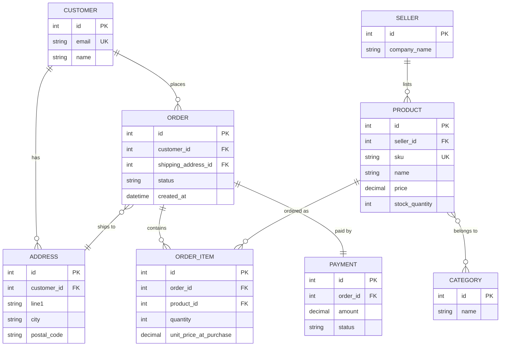

# Database Design Scenario: Designing an E-Commerce Schema

> A **schema design exercise** asks you to translate a set of business requirements into entities, relationships, keys, and constraints that stay correct and performant as the system grows.

## Why it matters

Interviewers use design scenarios because they reveal how you think, not just what you know. Anyone can recite "third normal form," but designing a schema forces you to ask clarifying questions, make trade-offs between normalization and query performance, and justify decisions like key choice and cascade behavior. It also tests whether you can reason about relationships (one-to-many vs many-to-many) and anticipate how the data will actually be queried.

## The Scenario

**Prompt:** "Design a database for an e-commerce platform. Customers browse a catalog of products (grouped into categories), place orders that can contain multiple products, and each order has a shipping address and a payment record. Products come from different sellers and have variable stock levels."

Before drawing anything, clarify the ambiguous parts out loud:

- Can a product belong to more than one category?
- Can an order be partially shipped, or split across multiple shipments?
- Do we need to preserve historical pricing (the price a customer paid, even if the product price later changes)?
- Is inventory tracked per product, or per product variant (size, color)?

These questions matter because the answers change the schema. For this walkthrough, assume: products can belong to multiple categories, one order can contain many products, and we must preserve the price paid at order time.

## Step 1: Identify Entities and Relationships

Start by listing nouns from the requirements, then decide how they relate.

| Entity | Relationship | Cardinality |
|---|---|---|
| Customer → Order | A customer places orders | 1-to-many |
| Order → Product | An order contains products | many-to-many (needs junction table) |
| Product → Category | A product can have multiple categories | many-to-many (needs junction table) |
| Seller → Product | A seller lists products | 1-to-many |
| Order → Address | An order ships to one address | many-to-1 |
| Order → Payment | An order has one payment record | 1-to-1 (or 1-to-many for split/retry payments) |

The two many-to-many relationships (`Order`-`Product` and `Product`-`Category`) cannot be represented directly in a relational model — each needs a **junction (associative) table** with foreign keys to both sides.

## Step 2: Define Keys and Constraints

For each table, decide the primary key and the constraints that protect data integrity:

- **Surrogate keys** (auto-incrementing `id` or UUID) for `customers`, `products`, `orders`, `categories`, `sellers` — stable, never need to change even if business attributes like email or SKU change.
- **Composite primary key** on the junction table `order_items` doesn't quite work alone, because we also need a surrogate `id` if we want to reference a specific line item (e.g., for a return). A common pattern: give `order_items` its own surrogate key, plus a `UNIQUE(order_id, product_id)` constraint to prevent duplicate lines.
- **Foreign keys** on every child-to-parent link, with `ON DELETE RESTRICT` for `order_items → products` (don't let a product vanish out from under historical orders) and `ON DELETE CASCADE` for `order_items → orders` (deleting an order deletes its line items).
- **Denormalized snapshot columns**: `order_items.unit_price_at_purchase` stores the price paid, decoupled from `products.price`, which can change over time. This is a deliberate denormalization to preserve historical accuracy — not a normalization violation, since it represents a fact fixed at a point in time, not a duplicate of live data.
- **Check constraints**: `products.stock_quantity >= 0`, `orders.status IN (...)`.

## Step 3: Apply Normalization

Walk through normal forms to justify the design:

- **1NF**: every column holds a single atomic value. No comma-separated category lists in a `products` column — that's why `product_categories` exists as a separate table.
- **2NF**: every non-key column depends on the *whole* primary key. In `order_items`, `unit_price_at_purchase` depends on the combination of order and product (the price at that specific purchase), not on `product_id` alone — so it correctly lives here rather than being inferred from `products`.
- **3NF**: no transitive dependencies. `orders` should not store `customer_email` — that depends on `customer_id`, not on the order itself, and belongs in `customers`.

In practice, most production schemas stop at 3NF and then selectively denormalize (like the price snapshot above) for correctness or read performance, documenting *why* each exception exists.

## The Final Schema

The `PRODUCT }o--o{ CATEGORY` many-to-many relationship implies a hidden `product_categories(product_id, category_id)` junction table, which most ER notations collapse into a single line for readability but which must physically exist as its own table with a composite (or surrogate) key.

## Common Interview Questions

**Q: Why not just add a `category_id` column directly on `products` instead of a junction table?**
A: That only works if a product can belong to exactly one category. The requirement here is many-to-many, so a single foreign key column can't express it — you need a junction table so each product can link to multiple categories and vice versa.

**Q: Why store `unit_price_at_purchase` on `order_items` instead of joining to `products.price`?**
A: Product prices change over time, but an invoice must reflect what the customer actually paid at checkout. Joining live would silently rewrite history whenever the price changed, corrupting past invoices and financial reporting.

**Q: Should `order_id` and `product_id` together be the primary key of `order_items`?**
A: They could be, using a composite key, but a surrogate `id` is often preferable because it gives every line item a stable, single-column identifier that other tables (like a `returns` table) can reference directly, while a `UNIQUE(order_id, product_id)` constraint still prevents duplicate lines.

**Q: How would you model product variants like size and color?**
A: Introduce a `product_variants` table with its own `id`, `product_id` FK, and attribute columns (or an `attribute_id`/`value` pair for full flexibility), and move `stock_quantity` and `sku` down to the variant level since inventory is actually tracked per variant, not per parent product.

**Q: What indexes would you add beyond the primary keys?**
A: Foreign key columns used in joins (`order_items.order_id`, `order_items.product_id`), a unique index on `customers.email` for login lookups, and a composite index on `orders(customer_id, created_at)` to speed up "show my order history" queries.

**Q: Would you normalize the address into the customer record or keep it separate?**
A: Keep it separate. A customer can have multiple addresses (billing, shipping, multiple homes), and an order should reference the specific address used at the time, so a dedicated `addresses` table with a foreign key from `orders` is more accurate and flexible than embedding address fields on `customers`.

**Q: How do you handle an order that ships in multiple partial shipments?**
A: Add a `shipments` table with a foreign key to `orders`, and a `shipment_items` junction table (or a `shipment_id` FK on `order_items`) so each line item can be tracked against the shipment that fulfilled it, rather than assuming one order maps to exactly one shipment.

## Related

- [Normalization](normalization.md) - deeper treatment of 1NF/2NF/3NF and when to denormalize
- [Indexing](indexing.md) - how to choose indexes for the foreign keys and query patterns used here
- [ACID Properties](acid.md) - why the order-and-payment write needs a transaction
- [SQL](sql.md) - writing the joins and constraints that implement this schema
