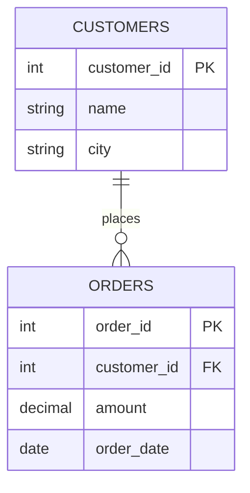
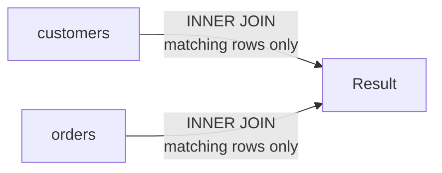

# SQL Joins, Grouping, and Query Fundamentals

> **SQL** (Structured Query Language) is the standard language for defining, querying, and controlling data in a relational database.

## Why it matters
Almost every backend role touches a relational database, and joins, grouping, and aggregation are the daily bread of writing correct, performant queries. Interviewers use SQL questions to check whether a candidate understands set-based thinking (not just loops translated into SQL), and whether they know the subtle difference between filtering rows before and after aggregation. Getting joins and `WHERE` vs `HAVING` wrong in production usually means silently wrong numbers, not a crash - which is why interviewers probe this so carefully.

## DDL vs DML vs DCL vs TCL
SQL statements are grouped by what they operate on.

| Category | Purpose | Example statements |
|---|---|---|
| DDL (Data Definition Language) | Defines/alters schema structure | `CREATE`, `ALTER`, `DROP`, `TRUNCATE` |
| DML (Data Manipulation Language) | Reads/writes row data | `SELECT`, `INSERT`, `UPDATE`, `DELETE` |
| DCL (Data Control Language) | Manages permissions | `GRANT`, `REVOKE` |
| TCL (Transaction Control Language) | Manages transaction boundaries | `COMMIT`, `ROLLBACK`, `SAVEPOINT` |

```sql
-- DDL: define structure
CREATE TABLE customers (
    customer_id INT PRIMARY KEY,
    name        VARCHAR(100) NOT NULL
);

-- DML: manipulate data
INSERT INTO customers (customer_id, name) VALUES (1, 'Alice');
UPDATE customers SET name = 'Alicia' WHERE customer_id = 1;

-- DCL: control access
GRANT SELECT ON customers TO reporting_role;

-- TCL: control the transaction
BEGIN;
UPDATE customers SET name = 'Alice B.' WHERE customer_id = 1;
COMMIT;
```

Note that most DDL statements auto-commit and cannot be rolled back on many database engines, which is a common trap in interviews.

## Example schema
The examples below use two related tables: `customers` and `orders`.



```sql
-- customers: (1, 'Alice', 'NY'), (2, 'Bob', 'LA'), (3, 'Cara', 'SF')
-- orders: (101, 1, 50.00, ...), (102, 1, 20.00, ...), (103, 2, 75.00, ...)
-- Note: Cara (customer 3) has no orders.
```

## Joins
A join combines rows from two or more tables based on a related column, typically a foreign key.



| Join type | Returns |
|---|---|
| `INNER JOIN` | Only rows with a match in both tables |
| `LEFT JOIN` | All rows from the left table, plus matches from the right (NULLs if no match) |
| `RIGHT JOIN` | All rows from the right table, plus matches from the left (NULLs if no match) |
| `FULL OUTER JOIN` | All rows from both tables; NULLs where no match exists on either side |

```sql
-- INNER JOIN: only customers who have placed an order
SELECT c.name, o.amount
FROM customers c
INNER JOIN orders o ON c.customer_id = o.customer_id;
-- Result: Alice/50.00, Alice/20.00, Bob/75.00  (Cara excluded)

-- LEFT JOIN: every customer, even those with no orders
SELECT c.name, o.amount
FROM customers c
LEFT JOIN orders o ON c.customer_id = o.customer_id;
-- Result: adds Cara/NULL

-- RIGHT JOIN: every order, even ones whose customer is missing
-- (rarely used in practice - usually rewritten as a LEFT JOIN with tables swapped)
SELECT c.name, o.amount
FROM customers c
RIGHT JOIN orders o ON c.customer_id = o.customer_id;

-- FULL OUTER JOIN: every customer and every order, matched where possible
-- (not supported directly in MySQL; emulate with UNION of LEFT and RIGHT JOIN)
SELECT c.name, o.amount
FROM customers c
FULL OUTER JOIN orders o ON c.customer_id = o.customer_id;
```

A quick mental model: `INNER` is the intersection, `LEFT`/`RIGHT` keep one full side, `FULL OUTER` keeps everything from both sides.

## WHERE vs HAVING
- `WHERE` filters individual rows **before** grouping and aggregation happen.
- `HAVING` filters groups **after** `GROUP BY` has produced aggregated results.
- `WHERE` cannot reference aggregate functions like `COUNT()` or `SUM()`; `HAVING` can.

```sql
-- WHERE: filter raw rows first (only 2024 orders are considered)
SELECT customer_id, SUM(amount) AS total_spent
FROM orders
WHERE order_date >= '2024-01-01'
GROUP BY customer_id;

-- HAVING: filter the aggregated groups
SELECT customer_id, SUM(amount) AS total_spent
FROM orders
WHERE order_date >= '2024-01-01'
GROUP BY customer_id
HAVING SUM(amount) > 50;
```

## GROUP BY and aggregate functions
`GROUP BY` collapses rows sharing a value in one or more columns into a single group, so aggregate functions can be applied per group.

Common aggregate functions: `COUNT()`, `SUM()`, `AVG()`, `MIN()`, `MAX()`.

```sql
SELECT c.city, COUNT(o.order_id) AS order_count, SUM(o.amount) AS total_amount
FROM customers c
LEFT JOIN orders o ON c.customer_id = o.customer_id
GROUP BY c.city;
```

Rule of thumb: every non-aggregated column in the `SELECT` list must also appear in `GROUP BY`, otherwise the result is ambiguous (some engines allow it, but the value returned is not well-defined).

## Subqueries
A subquery is a query nested inside another query, used in `SELECT`, `FROM`, or `WHERE` clauses.

```sql
-- Subquery in WHERE: customers who have placed at least one order over 60
SELECT name
FROM customers
WHERE customer_id IN (
    SELECT customer_id FROM orders WHERE amount > 60
);

-- Correlated subquery: re-evaluated per outer row
SELECT c.name
FROM customers c
WHERE EXISTS (
    SELECT 1 FROM orders o
    WHERE o.customer_id = c.customer_id AND o.amount > 60
);

-- Subquery in FROM (derived table): per-customer totals used as a data source
SELECT city, AVG(total_spent) AS avg_spent_per_customer
FROM (
    SELECT c.customer_id, c.city, SUM(o.amount) AS total_spent
    FROM customers c
    JOIN orders o ON c.customer_id = o.customer_id
    GROUP BY c.customer_id, c.city
) AS customer_totals
GROUP BY city;
```

A correlated subquery references a column from the outer query, so it conceptually runs once per outer row - this can be slow on large tables if not optimized by the query planner. A non-correlated subquery runs once, independent of the outer query.

## Common Interview Questions
**Q: What is the difference between INNER JOIN and LEFT JOIN?**
A: `INNER JOIN` returns only rows that have a match in both tables. `LEFT JOIN` returns all rows from the left table plus matching rows from the right, filling in NULLs when there is no match.

**Q: Why can't you use an aggregate function in a WHERE clause?**
A: `WHERE` filters rows before grouping/aggregation occurs, so aggregate values don't exist yet at that stage. Use `HAVING` to filter on aggregated results instead.

**Q: What is the difference between UNION and UNION ALL?**
A: `UNION` combines result sets and removes duplicate rows, which requires an implicit sort/dedup step. `UNION ALL` combines result sets and keeps all rows including duplicates, so it is generally faster.

**Q: What's the difference between a correlated and a non-correlated subquery?**
A: A non-correlated subquery is independent of the outer query and can run on its own. A correlated subquery references columns from the outer query, so conceptually it is re-evaluated for each outer row.

**Q: If table A has 5 rows and table B has 3 rows, how many rows can a plain JOIN between them produce?**
A: Without a join condition (a cross join) it produces 15 rows (5 x 3). With an `ON` condition, it depends on how many rows match, ranging from 0 up to 15.

**Q: How would you find duplicate rows in a table?**
A: Group by the column(s) that should be unique and filter with `HAVING COUNT(*) > 1`.
```sql
SELECT email, COUNT(*) FROM users GROUP BY email HAVING COUNT(*) > 1;
```

**Q: What happens if you GROUP BY a column but SELECT a non-aggregated, non-grouped column?**
A: It's a logical error - the database either rejects the query (standard SQL, PostgreSQL) or picks an arbitrary value for that column per group (older MySQL modes), which produces unreliable results.

## Related
- [Normalization](normalization.md) - schema design decisions that shape how tables and joins are structured
- [Indexing](indexing.md) - how indexes affect join and `WHERE`/`HAVING` performance
- [ACID](acid.md) - transaction guarantees relevant to DML and TCL statements
- [NoSQL](nosql.md) - contrasts relational joins/aggregation with non-relational data models
- [Database Concepts](concepts.md) - broader relational database fundamentals
