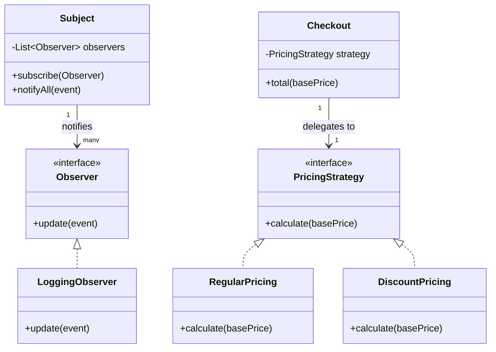

# Design Patterns

> A **design pattern** is a reusable, named solution to a recurring problem in software design, expressed as a template rather than finished code.

## Why it matters

Interviewers ask about design patterns to check whether you can recognize recurring structural problems and reach for a proven, well-understood solution instead of reinventing one badly. It also tests communication: can you explain *why* a pattern fits, not just recite its structure? In practice, knowing patterns matters more for reading other people's code and discussing trade-offs in design reviews than for memorizing UML diagrams.

## The Three Categories

Design patterns (as catalogued by the "Gang of Four") are grouped by the kind of problem they solve.

| Category | Solves problems about | Examples |
|---|---|---|
| Creational | How objects are created | Singleton, Factory Method, Abstract Factory, Builder, Prototype |
| Structural | How objects and classes are composed | Adapter, Decorator, Facade, Composite, Proxy |
| Behavioral | How objects communicate and share responsibility | Observer, Strategy, Command, State, Template Method |

A quick way to keep them straight: creational patterns hide *how* an object is built, structural patterns hide *how* pieces fit together, and behavioral patterns hide *how* pieces talk to each other.

## Singleton (Creational)

Ensures a class has exactly one instance and provides a single global access point to it.

**When to use it**: a shared resource where multiple instances would be wasteful or incorrect - a configuration manager, a connection pool, a logger. Use it sparingly: it introduces global state, makes unit testing harder (hidden dependencies), and can hide concurrency bugs if lazy initialization isn't thread-safe.

```java
public class ConfigManager {
    private static volatile ConfigManager instance;
    private final Map<String, String> settings = new HashMap<>();

    private ConfigManager() { /* load config */ }

    public static ConfigManager getInstance() {
        if (instance == null) {
            synchronized (ConfigManager.class) {
                if (instance == null) {
                    instance = new ConfigManager();
                }
            }
        }
        return instance;
    }
}
```

This is the classic double-checked locking form. In modern Java, an enum singleton or a static holder class is often preferred because it avoids the locking boilerplate and is safe by construction.

## Factory Method (Creational)

Defines an interface for creating an object but lets subclasses decide which concrete class to instantiate.

**When to use it**: when a class can't anticipate which concrete implementation it needs, or when you want to centralize object-creation logic so callers depend only on an interface, not on concrete constructors. Common in frameworks that need to be extended by client code.

```java
interface Notification {
    void send(String message);
}

class EmailNotification implements Notification {
    public void send(String message) { System.out.println("Email: " + message); }
}

class SmsNotification implements Notification {
    public void send(String message) { System.out.println("SMS: " + message); }
}

class NotificationFactory {
    static Notification create(String type) {
        return switch (type) {
            case "EMAIL" -> new EmailNotification();
            case "SMS" -> new SmsNotification();
            default -> throw new IllegalArgumentException("Unknown type: " + type);
        };
    }
}
```

Callers ask the factory for a `Notification` without knowing or caring which concrete class was built, so adding a new channel (e.g. push notifications) doesn't touch calling code.

## Observer (Behavioral)

Defines a one-to-many dependency so that when one object (the subject) changes state, all its dependents (observers) are notified automatically.

**When to use it**: event-driven systems - UI components reacting to model changes, pub/sub messaging, listeners on a stream of domain events. It decouples the subject from the concrete observers; the subject only knows about a common interface.

```java
interface Observer {
    void update(String event);
}

class Subject {
    private final List<Observer> observers = new ArrayList<>();

    void subscribe(Observer o) { observers.add(o); }

    void notifyAll(String event) {
        for (Observer o : observers) {
            o.update(event);
        }
    }
}

class LoggingObserver implements Observer {
    public void update(String event) { System.out.println("Logged: " + event); }
}
```

## Strategy (Behavioral)

Defines a family of interchangeable algorithms, encapsulates each one, and lets the client swap them at runtime through a common interface.

**When to use it**: whenever you'd otherwise write a large `if/else` or `switch` to pick between algorithm variants - payment methods, sorting comparators, pricing rules, validation policies. It favors composition over inheritance and keeps each algorithm independently testable.

```java
interface PricingStrategy {
    double calculate(double basePrice);
}

class RegularPricing implements PricingStrategy {
    public double calculate(double basePrice) { return basePrice; }
}

class DiscountPricing implements PricingStrategy {
    public double calculate(double basePrice) { return basePrice * 0.9; }
}

class Checkout {
    private final PricingStrategy strategy;
    Checkout(PricingStrategy strategy) { this.strategy = strategy; }

    double total(double basePrice) { return strategy.calculate(basePrice); }
}
```

`Checkout` never checks "which kind of pricing is this" - it just delegates. Swapping `RegularPricing` for `DiscountPricing` requires no change to `Checkout` itself.

### Strategy vs. Observer structure

Both patterns rely on programming to an interface, but the relationship differs: Strategy is a client holding *one* interchangeable algorithm, while Observer is a subject broadcasting to *many* independent listeners.



## Common Interview Questions

**Q: What's the difference between Factory Method and Abstract Factory?**
A: Factory Method creates one product via a single overridable method (usually one level of subclassing). Abstract Factory creates a *family* of related products through a set of factory methods, ensuring the products it returns are compatible with each other (e.g. a "dark theme" factory returning matching button, checkbox, and window objects).

**Q: Why is Singleton considered an anti-pattern by some?**
A: It introduces hidden global state, creates implicit coupling between unrelated parts of the codebase, and makes unit testing harder because you can't easily substitute a mock without a seam (like dependency injection). Most modern codebases prefer a DI container to manage a single shared instance instead of a hardcoded Singleton class.

**Q: How is Strategy different from State?**
A: Structurally they look almost identical (a context holding a reference to an interchangeable interface). The difference is intent: Strategy lets a *client* choose an algorithm explicitly and the strategies typically don't know about each other. State lets an *object* change its own behavior as its internal state changes, and state objects often trigger transitions to other states.

**Q: When would you use Observer versus a message queue?**
A: Observer is in-process and synchronous by default - notification happens on the same thread, in the same memory space, with no persistence. A message queue is for decoupling across processes or services, with delivery guarantees, retries, and persistence. Use Observer for in-app event handling; use a queue when consumers can be down, slow, or remote.

**Q: Can you give a real project example of using a design pattern?**
A: A strong answer names the actual problem first (e.g. "we had five payment providers with an ever-growing if/else block"), then the pattern applied (Strategy, with a `PaymentStrategy` interface selected via a factory), and the concrete benefit (adding a new provider became a new class, with zero changes to checkout code).

**Q: Is Singleton the same as a static class?**
A: No. A static class can't implement an interface, can't be subclassed polymorphically, and can't be lazily or conditionally constructed. A Singleton is a normal object that happens to be limited to one instance, so it can implement interfaces, be passed around, and be swapped for a test double behind an abstraction.

**Q: What problem does Decorator solve that inheritance alone doesn't?**
A: Inheritance fixes behavior additions at compile time and leads to class explosion when combinations are needed (e.g. `EncryptedCompressedStream`, `CompressedEncryptedStream`). Decorator wraps an object at runtime, so behaviors can be composed in any combination and added or removed dynamically without new subclasses for every combination.

## Related

- [OOP Basics](../oop/basics.md) - design patterns build directly on encapsulation and polymorphism
- [API Design](../system-design/api-design.md) - many structural patterns (Facade, Adapter) show up when shaping public APIs
