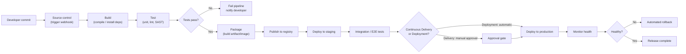

# CI/CD (Continuous Integration / Continuous Delivery / Deployment)

> **CI/CD** is the practice of automating the build, test, and release of code so that changes move from a developer's commit to a running production system quickly, safely, and repeatably.

## Why it matters

CI/CD is one of the most common DevOps topics in interviews because it sits at the intersection of engineering discipline, tooling, and risk management. Interviewers use it to check whether you understand automation as a way to catch bugs early, reduce manual error, and enable frequent, low-risk releases. It also reveals whether you can reason about trade-offs like speed versus safety, and whether you have hands-on experience with real pipelines rather than just the definitions.

## Continuous Integration vs. Delivery vs. Deployment

These three terms are related but distinct, and mixing them up is a common interview mistake.

| Practice | What happens | Human gate before prod? |
|---|---|---|
| Continuous Integration (CI) | Developers merge code into a shared branch frequently; the pipeline auto-builds and runs tests on every merge/commit | N/A (stops before release) |
| Continuous Delivery (CD) | Every change that passes CI is automatically built into a release-ready artifact and staged for deployment | Yes, manual approval to push to production |
| Continuous Deployment (CD) | Every change that passes all pipeline stages is automatically released to production | No, fully automated |

Key point: Continuous Delivery guarantees the code is *always* deployable; Continuous Deployment actually *deploys* it. An organization can practice CI and Continuous Delivery without doing Continuous Deployment (common where compliance or business reasons require a sign-off).

## Anatomy of a Pipeline

A pipeline is an ordered set of automated stages that a code change passes through. A typical pipeline looks like:

1. **Source** - trigger on commit, PR, or merge to a branch
2. **Build** - compile code, resolve dependencies, produce a binary or container image
3. **Test** - unit tests, static analysis/linting, security scans
4. **Package/Publish** - produce a versioned, immutable artifact and push it to a registry
5. **Deploy to staging** - deploy the artifact to a non-production environment; run integration/end-to-end tests
6. **Approval (if Continuous Delivery)** - manual gate, often with change-management sign-off
7. **Deploy to production** - roll out using a strategy such as blue-green, canary, or rolling deployment
8. **Monitor/Rollback** - observe health metrics and automatically or manually roll back on failure

## Artifacts and Environments

An **artifact** is the immutable, versioned output of a build (a JAR, a container image, a compiled binary) that flows unchanged through every later stage. Rebuilding per environment is an anti-pattern because it breaks the guarantee that what you tested is what you ship - the same artifact should be promoted from environment to environment, only its configuration should change.

**Environments** typically form a promotion chain:

| Environment | Purpose |
|---|---|
| Dev/Local | Fast feedback for the developer |
| CI/Build | Ephemeral environment where the pipeline runs tests |
| Staging/QA | Production-like environment for integration and acceptance testing |
| Production | Live environment serving real users |

Configuration (URLs, credentials, feature flags) should be externalized per environment, not baked into the artifact, so the same build can be promoted safely.

## Deployment Strategies

- **Rolling deployment** - gradually replace old instances with new ones; simple but rollback is slower.
- **Blue-green deployment** - run two identical environments; switch traffic all at once, keep the old one as an instant rollback path.
- **Canary release** - route a small percentage of traffic to the new version, watch metrics, then ramp up or roll back.
- **Feature flags** - decouple deployment from release by shipping code dark and enabling it via configuration.

## Tooling Landscape

- **CI/CD platforms**: Jenkins, GitHub Actions, GitLab CI, CircleCI, Bamboo
- **CD/GitOps tools**: Argo CD, Flux, Spinnaker
- **Supporting infrastructure**: Docker (packaging), Kubernetes (orchestration), Terraform/Ansible/CloudFormation (Infrastructure as Code)
- **Quality and security**: SonarQube (static analysis), Trivy/Snyk (dependency and image scanning)
- **Secrets management**: HashiCorp Vault, AWS Secrets Manager, or the CI platform's native secret store - never hardcode secrets in pipeline scripts or source code.

## Common Interview Questions

**Q: What is the difference between Continuous Delivery and Continuous Deployment?**
A: Continuous Delivery automatically prepares every passing change into a release-ready artifact but requires a manual approval step before it reaches production. Continuous Deployment removes that manual gate and deploys automatically once all pipeline checks pass.

**Q: Why should you build an artifact once and promote it across environments instead of rebuilding for each environment?**
A: Rebuilding risks introducing differences (dependency versions, compiler flags) between what was tested and what is deployed. Building once and promoting the same immutable artifact guarantees that staging and production run exactly what passed CI.

**Q: What is the difference between a rolling deployment, blue-green deployment, and canary release?**
A: A rolling deployment replaces instances incrementally with no separate environment. Blue-green runs two full environments and cuts traffic over instantly, giving a fast rollback. Canary releases route a small slice of production traffic to the new version first, reducing blast radius before a full rollout.

**Q: How do you handle secrets in a CI/CD pipeline?**
A: Use a dedicated secrets manager (Vault, AWS Secrets Manager) or the CI platform's encrypted secret store, inject secrets as environment variables or mounted files at runtime, restrict access with least privilege, and never commit secrets to source control or bake them into images.

**Q: How would you design a rollback strategy?**
A: Keep previous artifact versions available for redeployment, use deployment strategies (blue-green or canary) that make reverting traffic fast, define automated health checks that trigger rollback on failure, and continue monitoring key metrics after every release.

**Q: What causes a pipeline to be flaky, and how do you address it?**
A: Common causes are non-deterministic tests, shared/unstable test environments, race conditions in async code, and network dependencies in tests. Fixes include isolating tests, using test doubles for external services, retrying only where safe, and quarantining flaky tests until fixed rather than ignoring failures.

**Q: How does Infrastructure as Code (IaC) support CI/CD?**
A: IaC tools like Terraform or CloudFormation let you version and automate the provisioning of environments the same way you version application code. This ensures staging and production environments are consistent, reproducible, and can be recreated or rolled back through the same pipeline discipline used for application deployments.

## Related

- [Docker](docker.md) - containers provide the consistent, portable artifact format that CI/CD pipelines build, test, and promote.
- [Kubernetes](kubernetes.md) - the deployment target that pipelines push artifacts to, using strategies like rolling updates and canary releases.
