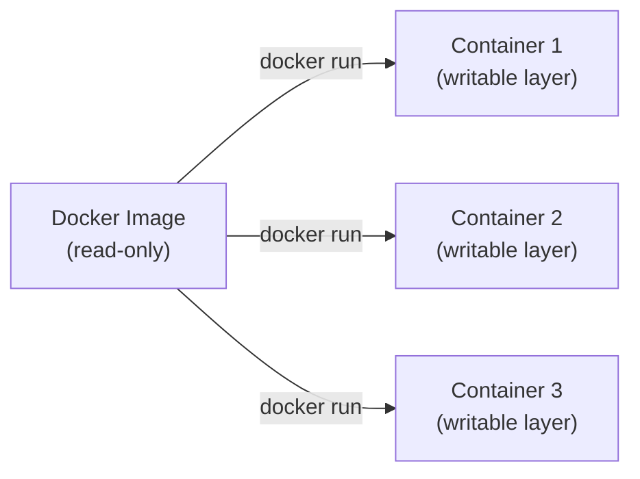
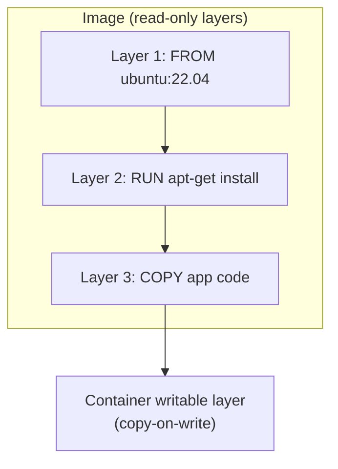
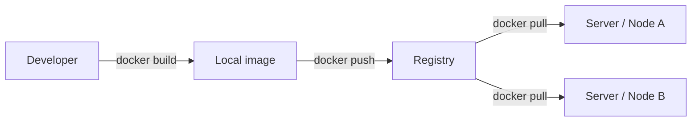
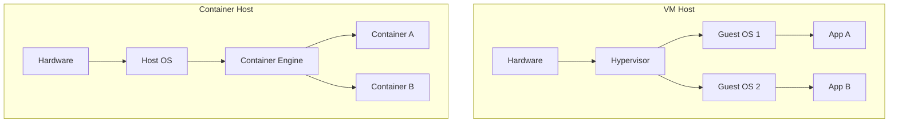

# Docker

> **Docker** is a platform for packaging an application and its dependencies into a portable, isolated **container** that runs consistently across environments.

## Why it matters
Docker questions test whether a candidate understands isolation and packaging, not just the CLI. Interviewers use it to probe whether you can reason about layers and image size, whether you know why containers aren't lightweight VMs, and whether you can debug real production issues like image bloat, networking, or state management. It's also a gateway topic into Kubernetes and CI/CD, so a shaky grasp here tends to show up later.

## Images vs. Containers
- An **image** is a read-only, immutable template: application code, runtime, libraries, and config, built up in layers.
- A **container** is a running instance of an image, with a thin writable layer added on top plus its own isolated filesystem view, process namespace, and network stack.
- One image can spawn many containers, each isolated from the others. Deleting a container does not affect the image it came from.



## Layers and the Union Filesystem
Every instruction in a Dockerfile that changes the filesystem (`RUN`, `COPY`, `ADD`) creates a new, read-only **layer**. Docker stacks these layers using a union filesystem (e.g. overlay2), which presents them as a single merged view to the container while storing them separately on disk.

This design gives two big wins:
- **Caching** - if a layer's inputs haven't changed, Docker reuses the cached layer instead of rebuilding it, speeding up builds.
- **Sharing** - multiple images that share a base layer (e.g. the same `FROM ubuntu:22.04`) only store that layer once on disk, and containers only store the delta they add.

When a container writes or deletes a file, it doesn't modify the underlying image layers. Instead it uses copy-on-write: the file is copied up into the container's own writable layer and modified there.



## The Dockerfile
A Dockerfile is a declarative script of instructions used to build an image. Key instructions:

| Instruction | Purpose |
|---|---|
| `FROM` | Sets the base image to build on |
| `RUN` | Executes a command at build time, creating a new layer |
| `COPY` / `ADD` | Copies files from the build context into the image (`ADD` also handles remote URLs and tar extraction) |
| `WORKDIR` | Sets the working directory for subsequent instructions |
| `EXPOSE` | Documents the port the container listens on (does not publish it) |
| `ENV` | Sets environment variables |
| `CMD` | Default arguments/command for the container; easily overridden at `docker run` |
| `ENTRYPOINT` | The fixed executable the container runs; harder to override |

```dockerfile
FROM node:20-alpine AS build
WORKDIR /app
COPY package*.json ./
RUN npm ci
COPY . .
RUN npm run build

FROM node:20-alpine
WORKDIR /app
COPY --from=build /app/dist ./dist
COPY --from=build /app/node_modules ./node_modules
ENTRYPOINT ["node", "dist/server.js"]
```

This example is also a **multi-stage build**: it uses two `FROM` statements so build tools and intermediate artifacts stay out of the final image, keeping it small and free of unnecessary build dependencies.

## Registries
A **registry** stores and distributes images by name and tag (e.g. `myapp:1.2.0`). Docker Hub is the default public registry; teams commonly run private registries (e.g. Amazon ECR, Google Artifact Registry, or a self-hosted registry) for internal images.



## Containers vs. Virtual Machines
Containers and VMs both provide isolation, but at different layers of the stack.

| Aspect | Container | Virtual Machine |
|---|---|---|
| Kernel | Shares the host OS kernel | Runs its own full guest OS and kernel |
| Isolation boundary | Process/namespace level (via cgroups, namespaces) | Hardware-level, via a hypervisor |
| Startup time | Seconds or less | Tens of seconds to minutes |
| Image/disk size | Megabytes (just app + deps) | Gigabytes (full OS) |
| Density per host | High - many containers per host | Lower - overhead per VM |
| Isolation strength | Weaker (shared kernel is an attack surface) | Stronger (separate kernel per VM) |



## Networking and Data
Docker ships several network drivers: `bridge` (default, containers on one host communicate via a virtual network), `host` (shares the host's network namespace directly), `overlay` (multi-host networking, used in Swarm), and `none` (no networking). Custom user-defined bridge networks let containers resolve each other by container name.

For persistent or shared state, use volumes over relying on the container's writable layer:
- **Volumes** are managed by Docker and stored under `/var/lib/docker/volumes`; they're the recommended way to persist data and survive container removal.
- **Bind mounts** map a specific host path into the container, useful for local development but less portable.

Because containers are meant to be immutable and disposable, "updating" one means stopping it, pulling or building a new image, and running a fresh container - not patching a live container in place.

## Common Interview Questions
**Q: What is the difference between an image and a container?**
A: An image is a read-only template built from layers; a container is a running instance of that image with an added writable layer. One image can produce many independent containers.

**Q: How does the union filesystem make Docker efficient?**
A: It stacks read-only image layers and overlays a writable layer per container, so unchanged layers are cached and shared across images and containers instead of being duplicated on disk.

**Q: What's the difference between CMD and ENTRYPOINT?**
A: `CMD` sets a default command/arguments that can be overridden at `docker run`; `ENTRYPOINT` sets the fixed executable that always runs, with `CMD` optionally supplying its default arguments. They're often combined.

**Q: Why are containers faster to start than VMs?**
A: Containers share the host kernel and only need to start a process, not boot an entire OS, so there is no kernel or hardware initialization overhead like a VM has.

**Q: How do you reduce Docker image size?**
A: Use a minimal base image like alpine, combine `RUN` instructions to cut down layers, clean up build artifacts in the same layer they were created, use `.dockerignore`, and apply multi-stage builds to drop build-time dependencies from the final image.

**Q: How do you persist data across container restarts?**
A: Use Docker volumes (managed by Docker under `/var/lib/docker/volumes`) or bind mounts (mapping a host directory into the container). Volumes are preferred because they're portable and lifecycle-managed by Docker.

**Q: What is a multi-stage build and why use one?**
A: It's a Dockerfile pattern with multiple `FROM` statements where later stages selectively `COPY --from=` artifacts out of earlier ones, so compilers and build tools never end up in the shipped image, reducing size and attack surface.

## Related
- [Kubernetes](kubernetes.md) - orchestrates and schedules containers like the ones Docker builds
- [CI/CD](cicd.md) - pipelines typically build, tag, and push Docker images as part of the release process
