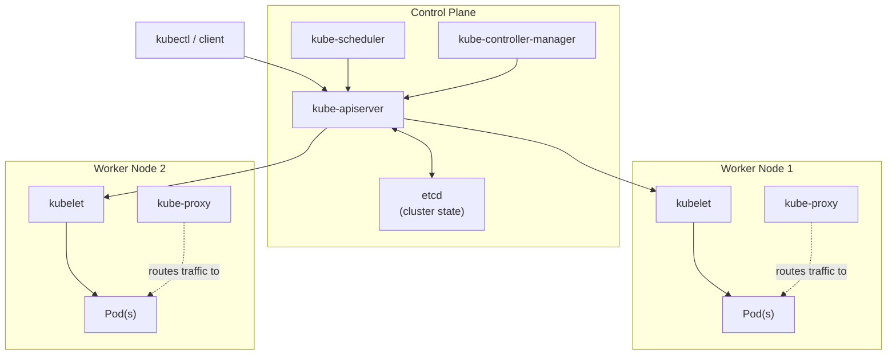
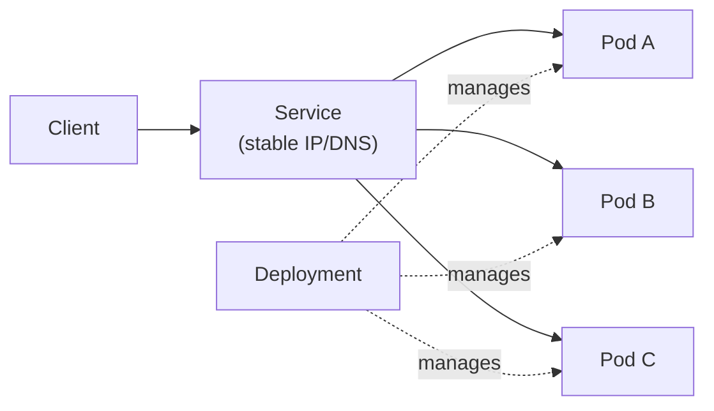

# Kubernetes

> **Kubernetes** (K8s) is an open-source container orchestration platform that automates the deployment, scaling, networking, and self-healing of containerized applications across a cluster of machines.

## Why it matters

Kubernetes is the de facto standard for running production workloads at scale, so interviewers use it to gauge whether you understand distributed systems concepts, not just `kubectl` commands. Questions probe whether you know what happens when a node dies, how traffic finds a healthy pod, and why the control plane is split into separate components. A candidate who can reason about the architecture (not just recite object names) signals real operational experience.

## Cluster Architecture: Control Plane vs Worker Nodes

A cluster has two categories of machines. The **control plane** makes global decisions about the cluster (scheduling, detecting failures) and stores its state. **Worker nodes** run the actual application containers and report back to the control plane.

| Component | Location | Responsibility |
|---|---|---|
| kube-apiserver | Control plane | Front door for all REST/kubectl requests; validates and persists changes to etcd |
| etcd | Control plane | Consistent, highly available key-value store holding all cluster state |
| kube-scheduler | Control plane | Assigns newly created Pods to a Node based on resources, affinity, taints |
| kube-controller-manager | Control plane | Runs reconciliation loops (node, replication, endpoint controllers) that drive actual state toward desired state |
| kubelet | Worker node | Agent that ensures containers described in PodSpecs are running and healthy on its node |
| kube-proxy | Worker node | Maintains network rules on the node so Services can route traffic to the right Pods |
| Container runtime | Worker node | Pulls images and runs containers (e.g., containerd, CRI-O) |

Everything flows through the API server. The scheduler and controller-manager never talk to nodes directly; they watch the API server for state changes and write back new desired state, which the API server persists to etcd and the kubelet on each node picks up.

## Pods, Deployments, and Services

- **Pod**: the smallest deployable unit. One or more containers that share a network namespace (single IP, shared port space) and can share storage volumes. Containers in a pod are always scheduled together on the same node.
- **Deployment**: a controller that manages a ReplicaSet of Pods for stateless applications. It supports declarative rolling updates and rollbacks, and continuously reconciles the actual number of running Pods to match the desired replica count.
- **StatefulSet**: like a Deployment, but for stateful applications that need stable network identities, stable persistent storage per replica, and ordered (sequential) deployment/scaling/termination.
- **Service**: a stable virtual IP and DNS name in front of a dynamic set of Pods, selected by label. Because Pods are ephemeral and their IPs change, Services provide the fixed address that other components rely on.

| Service Type | Access Scope |
|---|---|
| ClusterIP (default) | Internal-only, reachable within the cluster |
| NodePort | Exposes the service on a static port on every node's IP |
| LoadBalancer | Provisions an external cloud load balancer pointing at the service |
| ExternalName | Maps the service to an external DNS name (no proxying) |

## Scaling

Kubernetes supports scaling at multiple levels:

- **Manual scaling**: changing `replicas` on a Deployment or StatefulSet.
- **Horizontal Pod Autoscaler (HPA)**: automatically adjusts the number of Pod replicas based on observed metrics like CPU/memory utilization or custom metrics.
- **Vertical Pod Autoscaler (VPA)**: adjusts CPU/memory requests and limits for existing Pods rather than the replica count.
- **Cluster Autoscaler**: adds or removes worker nodes based on whether Pods are unschedulable due to insufficient node capacity, or nodes are underutilized.

These operate independently: HPA and VPA scale within existing node capacity, while the Cluster Autoscaler scales the nodes themselves.

## Self-Healing

Kubernetes is a reconciliation system: controllers continuously compare desired state (what you declared) to actual state (what's running) and act to close the gap. This is what gives it self-healing behavior:

- If a container crashes, the kubelet restarts it according to the Pod's restart policy.
- If a node goes unresponsive, the node controller marks it as unhealthy and its Pods are rescheduled onto healthy nodes.
- **Liveness probes** detect a container that is running but stuck; a failing probe triggers a restart.
- **Readiness probes** detect a container that isn't ready to serve traffic yet; a failing probe removes the Pod from Service endpoints without restarting it.
- The Deployment controller keeps the actual replica count equal to the desired count at all times, replacing any Pod that disappears.

## Other Core Objects

- **ConfigMap**: stores non-confidential configuration as key-value pairs, injected into Pods as environment variables or mounted files.
- **Secret**: stores sensitive data (passwords, tokens, keys) similarly to a ConfigMap, but base64-encoded and intended to be handled with tighter access controls (base64 is encoding, not encryption).
- **Namespace**: a logical partition within a cluster used to separate environments (dev/test/prod), scope RBAC and resource quotas, and avoid naming collisions.
- **DaemonSet**: ensures a copy of a Pod runs on every node (or a matching subset) - common for log collectors, node monitoring agents, and storage daemons.
- **Helm**: a package manager for Kubernetes; a Helm chart is a templated bundle of manifests that simplifies versioned, repeatable deployment.
- **Operator**: a custom controller plus Custom Resource Definitions (CRDs) that encode operational knowledge for a specific application, automating tasks like backups, upgrades, and failover beyond what built-in controllers offer.

## Common Interview Questions

**Q: What is the difference between a Deployment and a StatefulSet?**
A: A Deployment manages interchangeable, stateless Pod replicas with no guaranteed identity or ordering. A StatefulSet gives each replica a stable, unique network identity and persistent storage, and creates/scales/terminates Pods in a defined order - needed for things like databases and message queues.

**Q: What happens when a worker node fails?**
A: The kubelet on that node stops reporting heartbeats to the API server. After a timeout, the node controller marks the node as `NotReady`, and the Pods that were on it are considered for rescheduling onto healthy nodes by the relevant controllers (e.g., ReplicaSet), since Pods themselves are not automatically moved - they are recreated elsewhere.

**Q: Why is etcd so important, and what happens if it's lost?**
A: etcd is the single source of truth for all cluster state - every object definition, node status, and secret is stored there. If etcd is lost without backup, the control plane has no record of the cluster's desired or actual state, effectively making the cluster state unrecoverable even if the workload Pods are still running.

**Q: What is the difference between a liveness probe and a readiness probe?**
A: A liveness probe checks whether a container is still functioning; failure causes the kubelet to restart the container. A readiness probe checks whether a container is ready to receive traffic; failure removes the Pod from Service endpoints without restarting it, so it stops receiving requests until it passes again.

**Q: How does the Horizontal Pod Autoscaler differ from the Cluster Autoscaler?**
A: HPA scales the number of Pod replicas for a workload up or down based on metrics like CPU or memory usage, working within the capacity already available on nodes. The Cluster Autoscaler instead adds or removes worker nodes themselves, triggered when Pods can't be scheduled due to insufficient capacity or when nodes sit underutilized.

**Q: How does traffic actually reach a Pod through a Service?**
A: A Service is assigned a stable virtual IP; kube-proxy on each node watches the API server for Service and Endpoint changes and programs local networking rules (iptables/IPVS) so that traffic sent to the Service IP gets load-balanced to one of the matching, ready Pods, wherever they are running in the cluster.

**Q: What's the difference between a ConfigMap and a Secret?**
A: Both store key-value configuration data injected into Pods as environment variables or mounted volumes. ConfigMaps are for non-sensitive data and stored as plain text; Secrets are intended for sensitive data and are base64-encoded, which is obfuscation rather than encryption, so they should still be paired with RBAC restrictions and, ideally, encryption at rest.

## Related

- [Docker](docker.md) - the container runtime concepts Kubernetes builds its orchestration on top of
- [CI/CD Pipelines](cicd.md) - how built container images get deployed into a Kubernetes cluster
