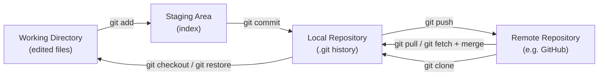
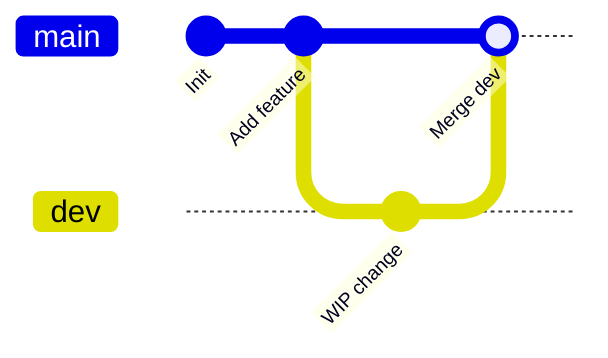

# Git Basics

> **Git** is a distributed version control system that tracks changes to files over time, letting multiple people collaborate without a central server being a single point of failure.

## Why it matters

Nearly every engineering role assumes daily Git fluency, so interviewers use it to gauge whether you understand what your tools actually do rather than just memorizing commands. Distributed version control also underpins branching workflows, code review, and CI/CD, so a shaky mental model here tends to surface as confusion in later, more advanced Git questions. Explaining the three areas correctly is usually the fastest way to prove you understand Git rather than just parrot it.

## Distributed vs Centralized VCS

In a centralized system (like older Subversion setups), there is one authoritative repository on a server, and clients check out a working copy. In Git, every clone is a full repository with the complete history, so most operations (commit, diff, log, branch) happen entirely locally and offline.

| Aspect | Centralized VCS | Distributed VCS (Git) |
|---|---|---|
| Full history location | Server only | Every clone |
| Offline commits | No | Yes |
| Single point of failure | Yes (server) | No (any clone can restore the rest) |
| Typical workflow | Checkout, edit, commit to server | Commit locally, then push/pull to sync |

## The Three (Plus One) Areas

Git manages your files through distinct areas, and understanding how a change moves between them is the core mental model for everything else.

- **Working directory** - the actual files on disk that you edit. Git compares them against the last commit to detect changes.
- **Staging area (index)** - a snapshot of what will go into the next commit. `git add` copies changes here; it lets you commit only part of your work.
- **Local repository** - the committed history, stored in `.git`, made of immutable snapshots (commits) linked together.
- **Remote repository** - a copy of the repository hosted elsewhere (e.g., GitHub), used to share history with others via `push` and `pull`.



## Core Commands

| Command | What it does |
|---|---|
| `git init` | Creates a new, empty repository in the current directory (adds a `.git` folder). |
| `git clone <url>` | Copies a remote repository, including full history, into a new local directory. |
| `git status` | Shows which files are modified, staged, or untracked, relative to the last commit. |
| `git add <file>` | Moves changes from the working directory into the staging area. |
| `git commit -m "<msg>"` | Records a permanent snapshot of the staged changes into the local repository. |
| `git log` | Shows the commit history for the current branch. |
| `git push` | Uploads local commits to a remote repository. |
| `git pull` | Downloads and merges remote commits into the current local branch (fetch + merge). |

A typical local workflow:

```bash
git init
git add index.html
git commit -m "Initial commit"
git status
git log --oneline
```

Connecting to a remote and syncing:

```bash
git clone https://github.com/example/repo.git
git push origin main
git pull origin main
```

## What Actually Happens on Commit

Each commit stores a snapshot of the staged tree, a pointer to its parent commit(s), author/committer metadata, and a message, all identified by a SHA hash of that content. Because each commit points to its parent, the history forms a directed acyclic graph, which is what makes branching and merging possible.



## `git pull` vs `git fetch`

`git fetch` downloads new commits and branches from the remote but does not touch your working directory or current branch - it only updates the remote-tracking branches (e.g., `origin/main`). `git pull` does a `fetch` followed immediately by a `merge` (or `rebase`, with `--rebase`) into your current branch. Many experienced engineers prefer `fetch` plus a manual review before merging, especially on shared branches.

## Common Interview Questions

**Q: What is the difference between the working directory, staging area, and repository?**
A: The working directory holds your actual edited files, the staging area (index) holds a curated snapshot of changes you intend to commit next, and the repository holds the permanent, committed history. `git add` moves changes from working directory to staging, and `git commit` moves staged changes into the repository.

**Q: Why is Git called "distributed"?**
A: Because every clone contains the full history of the project, not just the latest snapshot. This means commits, branching, and history browsing all work offline, and any clone can serve as a full backup of the project.

**Q: What is the difference between `git pull` and `git fetch`?**
A: `git fetch` retrieves new commits from the remote without changing your working branch. `git pull` does a fetch and then automatically merges (or rebases) those commits into your current branch.

**Q: What does `git add` actually do?**
A: It copies the current state of the specified file(s) from the working directory into the staging area (index), marking exactly what will be included in the next commit. It does not touch the repository history.

**Q: If you delete your remote repository, do you lose your work?**
A: Not if you or a collaborator has a clone. Because Git is distributed, any full clone contains the complete history and can be pushed to a new remote to recreate it.

**Q: What information does a Git commit actually store?**
A: A snapshot of the staged files, a pointer to its parent commit(s), author and committer information with timestamps, and a commit message, all hashed together to form the commit's unique SHA identifier.

**Q: Can you commit without staging changes first?**
A: Not directly for tracked-file edits, though `git commit -a` will automatically stage all modified (already-tracked) files before committing. New (untracked) files still need an explicit `git add`.

## Related

- [Resolving Merge Conflicts](conflicts.md) - what happens when `pull` or `merge` cannot auto-combine changes
