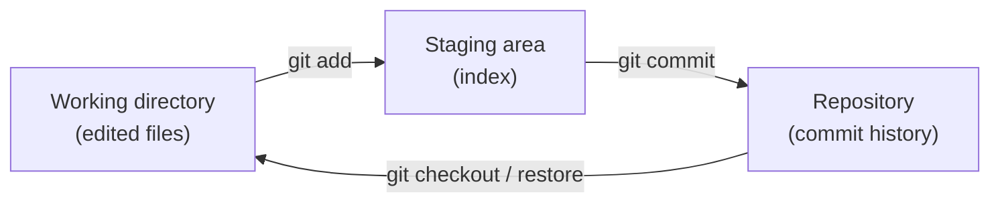
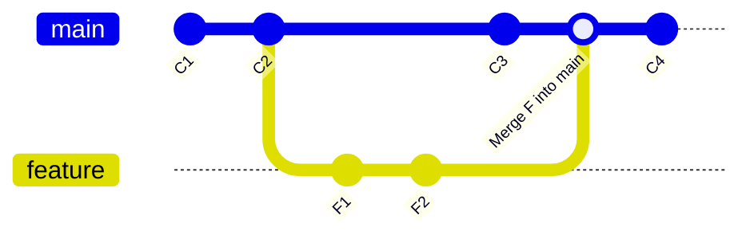
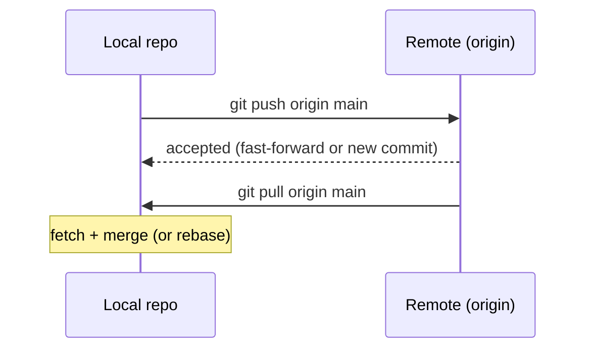

# Git Commands

> A **Git command** is one of the subcommands of the `git` CLI (`config`, `add`, `commit`, `branch`, `merge`, `rebase`, ...) that operates on the three areas Git manages: the working directory, the staging area (index), and the repository history.

## Why it matters

Interviewers ask about Git commands to check that you can actually work day-to-day in a codebase, not just recite theory. Knowing the right command for the job - and why `git commit -am` is different from `git add . && git commit`, or why `rebase` differs from `merge` - signals real hands-on experience. It also opens the door to deeper questions about how Git's object model and history work under the hood.

## Setup

Configuration commands set up identity and repository state before you start tracking anything.

| Command | Purpose |
|---|---|
| `git config --global user.name "Your Name"` | Set the committer name used in commits |
| `git config --global user.email "you@example.com"` | Set the committer email |
| `git config --list` | Show effective configuration (local + global + system) |
| `git init` | Create a new, empty repository (`.git` directory) in the current folder |
| `git clone <url> [dir]` | Copy a remote repository (and its full history) to a local directory |

`--global` writes to `~/.gitconfig` and applies to every repo for that user; omit it to set a value for the current repository only (stored in `.git/config`).

## Snapshotting (working directory, staging, commits)

These commands move a change from your working directory into permanent history.

```bash
git status              # see staged, unstaged, and untracked files
git add <file>           # stage a specific file
git add .                 # stage everything in the current directory
git commit -m "message"   # save staged changes as a new commit
git commit -am "message"  # stage + commit all already-tracked, modified files in one step
git log                   # full commit history
git log --oneline         # compact, one line per commit
```

`git commit -am` only picks up modifications and deletions to files Git already tracks - it will not stage brand-new (untracked) files, so `git add` is still required for those.



## Branching and Merging

A branch is a movable pointer to a commit; branching lets multiple lines of work progress independently.

```bash
git branch                 # list local branches
git branch <name>           # create a new branch (doesn't switch to it)
git checkout <name>         # switch to an existing branch
git checkout -b <name>      # create and switch in one step
git switch <name>           # modern equivalent of checkout for switching branches
git merge <name>             # merge <name> into the current branch
```

`git merge` creates a new commit (a "merge commit") that has two parents whenever the branches have diverged, preserving the exact history of both. `git rebase <branch>` instead replays your current branch's commits one by one on top of `<branch>`'s tip, producing a linear history with no merge commit - but it rewrites commit hashes, so never rebase commits that have already been pushed and shared with others.



The diagram above shows the merge case: `main` and `feature` both gain commits, then `merge` ties them together with a two-parent commit. If you rebased `feature` onto `main` instead, `F1` and `F2` would be rewritten as new commits sitting directly after `C3`, and `main` would fast-forward into a single straight line.

## Remotes

Remotes are named references to other copies of the repository (usually on a server like GitHub).

```bash
git remote -v                       # list remotes and their URLs
git remote add origin <url>          # register a new remote named "origin"
git push origin <branch>             # upload local commits on <branch> to the remote
git pull origin <branch>             # fetch and merge the remote branch into your current branch
```

`git pull` is really `git fetch` followed by `git merge` (or `git rebase` with `--rebase`). Many teams prefer `git fetch` + a manual `git merge`/`git rebase` so they can inspect incoming changes before integrating them.



## Undoing Changes

| Command | Effect | Rewrites history? |
|---|---|---|
| `git reset <file>` | Unstage a file, keep working directory changes | No |
| `git reset --soft <commit>` | Move branch pointer, keep changes staged | Yes (local) |
| `git reset --hard <commit>` | Move branch pointer, discard all changes to that point | Yes (local) |
| `git checkout -- <file>` / `git restore <file>` | Discard working directory changes to a file | No |
| `git revert <commit>` | Create a new commit that undoes a previous commit | No (adds history) |
| `git stash` | Temporarily shelve uncommitted changes | No |
| `git stash pop` | Reapply the most recently stashed changes | No |

`git reset --hard` is destructive - it discards uncommitted work with no confirmation, so double-check `git status` first. `git revert` is the safer choice for undoing a commit that has already been pushed, because it adds a new commit rather than deleting history that others may have already pulled.

## Common Interview Questions

**Q: What's the difference between `git merge` and `git rebase`?**
A: `git merge` combines two branches with a new merge commit that has two parents, preserving true history. `git rebase` replays your commits on top of another branch's tip, producing a linear history but generating new commit hashes - so it should only be done on local, unpublished commits.

**Q: What does `git add` actually do?**
A: It copies changes from the working directory into the staging area (the index), marking exactly what will go into the next commit. This lets you commit a subset of your changes rather than everything you've edited.

**Q: What's the difference between `git fetch` and `git pull`?**
A: `git fetch` downloads new commits and branches from the remote without touching your working branch. `git pull` does a fetch and then automatically merges (or rebases) the remote branch into your current branch.

**Q: When would you use `git revert` instead of `git reset`?**
A: Use `git revert` on commits that have already been pushed/shared, since it creates a new commit undoing the change without altering existing history. Use `git reset` only on local, unpublished commits, since it rewrites the branch pointer and can discard history.

**Q: What is the staging area (index) and why does Git have one?**
A: It's an intermediate area between the working directory and the repository where you build up exactly what the next commit will contain. It lets you stage partial changes (e.g. `git add -p`) and review with `git status` before committing.

**Q: How do you temporarily set aside changes without committing them?**
A: `git stash` saves uncommitted working directory and staged changes onto a stack and reverts the working directory to match HEAD; `git stash pop` reapplies (and removes) the most recent stash entry.

**Q: What happens if you `git commit -am` but you just created a new file?**
A: The new file is not committed. The `-a` flag only stages modifications and deletions to files Git already tracks; untracked files still require an explicit `git add` first.

## Related

- [Git Basics](basics.md) - the underlying model (working directory, staging, repository) these commands operate on
- [Merge Conflicts](conflicts.md) - what happens when `git merge` or `git rebase` can't auto-combine changes
