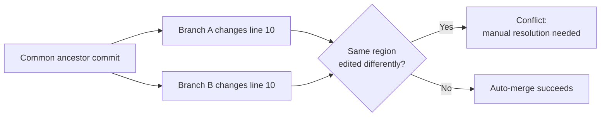
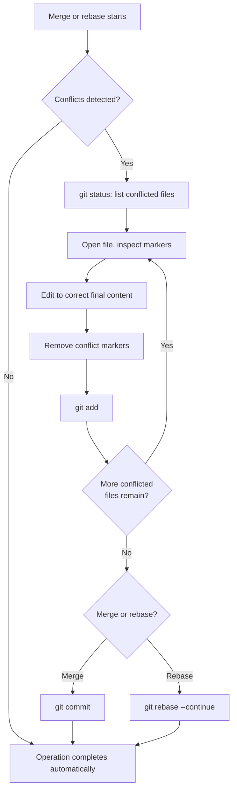

# Merge Conflicts

> A **merge conflict** occurs when Git cannot automatically combine changes from two branches because they touch the same lines (or one branch deletes what the other edits), leaving the human to decide the final result.

## Why it matters

Interviewers ask about conflicts because resolving them well is a daily skill, not a theoretical one — it tests whether you actually understand what a commit history represents versus just memorizing commands. It also reveals whether you know the difference between `merge` and `rebase` conflict handling, since panicking mid-rebase and running the wrong command can rewrite history badly. Finally, it's a quick proxy for how comfortable someone is reading diffs and reasoning about intent, not just syntax.

## Why Conflicts Happen

Git merges are line-based (via a three-way merge algorithm), not semantic. It compares the **common ancestor** (merge base), "ours", and "theirs" for each file. A conflict is raised when:

- The same line range was changed differently in both branches.
- One branch modified a file that the other branch deleted.
- One branch renamed a file while the other edited its contents.
- Binary files differ (Git can't merge them at all — one side wins or you resolve manually).

Git never guesses when both sides touched the same region — it stops and asks you to decide.



## Anatomy of Conflict Markers

When a conflict occurs, Git leaves markers directly in the file:

```text
<<<<<<< HEAD
const greeting = "Hello, world";
=======
const greeting = "Hi there, world";
>>>>>>> feature/greeting-update
```

| Marker | Meaning |
|---|---|
| `<<<<<<< HEAD` | Start of the version from your current branch (the checkout target) |
| `=======` | Divider between the two conflicting versions |
| `>>>>>>> <branch/commit>` | End marker, labeled with the incoming branch or commit being merged |

During a **rebase**, the labels flip in spirit: `HEAD` represents the commit being replayed onto, and the incoming side is your commit being reapplied — so "ours" and "theirs" swap meaning compared to a merge. This is a common source of confusion and a good thing to mention explicitly in an interview.

## Step-by-Step Resolution Workflow

1. Run `git status` to list all conflicted files.
2. Open each file and locate the marker blocks.
3. Decide the correct combined content: keep one side, keep both, or write something new entirely.
4. Delete the `<<<<<<<`, `=======`, and `>>>>>>>` markers — they are not valid syntax in your file.
5. Stage the resolved file with `git add <file>`.
6. Once all conflicts are staged, run `git commit` (for a merge) or `git rebase --continue` (for a rebase).
7. Test the result before pushing — a syntactically clean merge can still be logically wrong.



## Merge vs Rebase Conflict Handling

| Aspect | Merge | Rebase |
|---|---|---|
| History shape | Preserves both branch histories, adds a merge commit | Rewrites commits onto a new base, linear history |
| Conflict occurrence | Resolved once, in a single merge commit | May recur commit-by-commit as each one is replayed |
| Abort command | `git merge --abort` | `git rebase --abort` |
| Continue command | `git commit` after staging fixes | `git rebase --continue` after staging fixes |
| Skip a commit | Not applicable | `git rebase --skip` |
| Safe on shared/pushed branches | Yes | No — rewrites SHAs, avoid on shared history unless coordinated |

A practical implication: rebasing a long-lived feature branch with many diverging commits can mean resolving the *same* conflict repeatedly, once per replayed commit. `git rebase --interactive` with autosquash or simply merging instead can reduce that pain.

## Tools and Techniques

- **`git diff`** during a conflict shows the merge markers inline; `git diff --ours` / `--theirs` can isolate one side.
- **`git log --merge`** lists commits touching the conflicted paths from both branches, useful for understanding intent.
- **Merge tools**: `git mergetool` launches a configured three-way diff tool (e.g., `vimdiff`, `meld`, VS Code's merge editor) that shows base/ours/theirs side by side instead of raw markers.
- **`git checkout --ours <file>`** or **`--theirs <file>`** resolves a whole file by picking one side outright, then `git add` it — useful for generated files or lockfiles where one side is clearly authoritative.
- **`.gitattributes` merge strategies** (e.g., `merge=union` or a custom driver) can auto-resolve predictable conflicts, such as appending both sides in changelog files.
- **`git rerere`** ("reuse recorded resolution") remembers how you resolved a conflict pattern before and reapplies it automatically on repeat occurrences — valuable during long rebases.

## Common Interview Questions

**Q: What causes a merge conflict?**
A: Git's three-way merge cannot reconcile a region of a file because both branches changed the same lines differently relative to their common ancestor, or one branch deleted a file the other modified.

**Q: What do HEAD and the other label mean in conflict markers?**
A: `HEAD` is the content from the branch you currently have checked out; the label after `>>>>>>>` names the incoming branch or commit. In a rebase, this is reversed in intent — `HEAD` is the commit being rebased onto, and your own commit is the "incoming" side being replayed.

**Q: How do you abort a conflicted merge or rebase and go back to a clean state?**
A: Use `git merge --abort` or `git rebase --abort`, both of which restore the working tree and HEAD to the state before the operation started.

**Q: Why might the same conflict appear multiple times during a rebase but only once during a merge?**
A: A merge resolves all differences in one merge commit, while a rebase replays each commit individually onto the new base, so a conflicting region can resurface at every commit that touches it.

**Q: How would you resolve a conflict in a generated or lock file like package-lock.json?**
A: Usually pick one side wholesale with `git checkout --theirs package-lock.json` (or `--ours`), then regenerate it by reinstalling dependencies, rather than hand-editing the merge markers.

**Q: What is `git rerere` and when is it useful?**
A: It's a feature that records how you resolved a conflict and automatically reapplies that resolution if the same conflict pattern appears again, saving effort during repeated rebases or long-lived branch maintenance.

**Q: Can Git resolve a conflict incorrectly without telling you?**
A: Git will not silently merge a conflicting region — it always stops and marks it. However, an automatic merge of *non-overlapping* nearby changes can still be logically wrong even though it's syntactically clean, which is why testing after resolution matters.

## Related

- [merge-vs-rebase.md](commands.md) - deeper dive into history shape and when to choose each strategy
