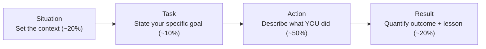
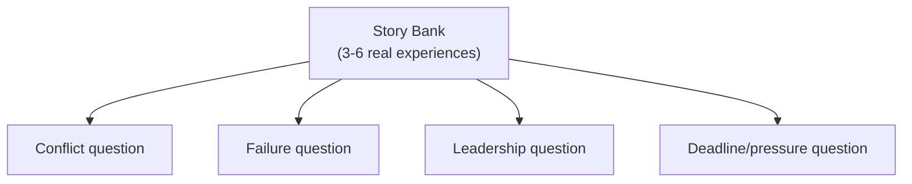

# HR / Behavioral Interview Questions

> The **HR round** (also called the behavioral round) evaluates how you think, communicate, and act under real work pressure - using your past experiences as evidence, not hypotheticals.

## Why it matters

Technical rounds test whether you *can* do the job; the HR round tests whether you'll do it *well with other people*. Interviewers are screening for self-awareness, communication clarity, and culture fit, and they are trained to distrust vague or rehearsed-sounding answers. A candidate who answers with a specific, structured story is far more credible than one who answers in generalities - which is exactly why the STAR method exists.

## The STAR Method

STAR is a structure for answering "tell me about a time when..." questions using a real example instead of a general opinion. Each letter forces you to include a detail that makes the story verifiable and complete.

| Component | What it covers | Common mistake |
|---|---|---|
| **S**ituation | The context: team, project, timeline, constraint | Too much backstory, no relevance to the point |
| **T**ask | Your specific responsibility or goal in that situation | Confusing "task" with "team's goal" |
| **A**ction | What *you* did, step by step | Saying "we" the whole time, hiding your own contribution |
| **R**esult | The measurable or observable outcome, plus what you learned | Skipping the result, or forgetting to mention the lesson |

The **Action** step should dominate your answer time - interviewers are trying to isolate your individual judgment and behavior, not the team's.

## Preparing Answers Without Fabricating Them

Never invent a story to fit a question. Instead, prepare a small bank of 4-6 real experiences (a project deadline, a disagreement with a teammate, a mistake you caught late, a time you had to learn something fast) and map each one to the STAR components in advance. Most behavioral questions are variations on a handful of themes, so one well-prepared story can often answer several different questions depending on which angle you emphasize.

## Common Interview Questions

**Q: Tell me about yourself.**
A: This is not an invitation to recite your resume line by line. Structure it as: current role/focus in one sentence, a brief path of how you got here, then a bridge to why you're interested in this specific role. Keep it under two minutes and end on something forward-looking so it naturally leads to the next question.

**Q: What are your greatest strengths and weaknesses?**
A: For strengths, pick one that's relevant to the role and back it with a one-line example rather than just naming it. For weaknesses, name something real and specific - not a disguised strength like "I work too hard" - and immediately follow it with the concrete step you're taking to address it. Interviewers are checking for self-awareness more than the weakness itself.

**Q: Why do you want to work at this company?**
A: A strong answer connects something specific about the company (its products, engineering culture, technical challenges, or mission) to something specific about your own goals or values. Generic answers ("great company, good growth opportunities") signal you haven't researched the company and would give the same answer anywhere.

**Q: Tell me about a conflict you had with a teammate or manager.**
A: Use STAR, but choose an example where the resolution came from you improving communication or finding common ground - not one where you were simply "right" and the other person was wrong. Emphasize the Action step: what you specifically did to de-escalate or align, and the Result should show the working relationship afterward, not just who "won."

**Q: Tell me about a time you failed.**
A: Choose a genuine failure, take clear ownership without over-apologizing or blaming others, and spend most of the answer on what you changed afterward. A good failure story is more convincing than a good success story because it shows how you respond to setbacks, which is what the interviewer actually cares about.

**Q: Where do you see yourself in 5 years?**
A: Answer in terms of growth in skills, scope, or impact rather than a specific job title, and tie it back to a realistic path within the company you're interviewing at. Avoid answers that sound like you'll have left the company or the field entirely by then.

**Q: Do you have any questions for us?**
A: Always have at least two ready. Good questions probe team structure, how success is measured in the role, or current technical challenges - this signals genuine engagement rather than passive interest. Avoid questions whose answers are already on the company's public website.

## Related

- [Soft Skills](../soft-skills/soft-skills.md) - communication and collaboration habits that HR questions are probing for
- [Agile Questions](../agile/questions.md) - team-process questions that often surface in behavioral rounds too
