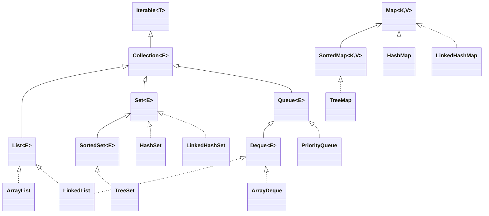

# Java Collections Framework

> The **Java Collections Framework** is a unified set of interfaces and implementations for storing, retrieving, and manipulating groups of objects.

## Why it matters
Interviewers use collections questions to check whether a candidate understands data structures, not just API names. Picking `ArrayList` vs `LinkedList`, or `HashMap` vs `TreeMap`, has real performance consequences, and being able to justify the choice with Big-O complexity signals practical engineering judgment rather than memorized syntax.

## Interface Hierarchy

The framework splits into two root interfaces: `Collection` (List, Set, Queue) and `Map` (which is not a `Collection` since it stores key-value pairs, not single elements).



`Collections` (plural, note the case) is unrelated to this hierarchy - it is a utility class of static helper methods (`sort()`, `reverse()`, `synchronizedList()`, `unmodifiableList()`) that operate on `Collection` implementations.

## List

An ordered sequence that allows duplicates and index-based access.

| Feature | ArrayList | LinkedList |
|---|---|---|
| Backing structure | Dynamic (resizable) array | Doubly linked list |
| Get by index | O(1) | O(n) |
| Insert/remove at end | Amortized O(1) | O(1) |
| Insert/remove at head/middle | O(n) (shifts elements) | O(1) at head/tail, O(n) to find middle |
| Memory overhead | Low | Higher (node + two pointer references per element) |
| Implements Deque | No | Yes |

Use `ArrayList` by default - most workloads are read-heavy or append-only, and cache-friendly contiguous memory makes it faster in practice even for many "insert in middle" cases. Reach for `LinkedList` only when you need frequent insertions/removals at both ends without random access, though `ArrayDeque` usually beats it even there.

## Set

A collection with no duplicates.

| Feature | HashSet | LinkedHashSet | TreeSet |
|---|---|---|---|
| Ordering | No guaranteed order | Insertion order | Sorted (natural or via `Comparator`) |
| Backing structure | Hash table | Hash table + linked list | Red-black tree |
| add/remove/contains | O(1) average | O(1) average | O(log n) |
| Null elements | One `null` allowed | One `null` allowed | Not allowed (throws `NullPointerException` on natural ordering, since it must compare) |

Use `HashSet` for pure uniqueness checks with no ordering requirement, `LinkedHashSet` when you need predictable iteration order matching insertion, and `TreeSet` when you need elements sorted or need range operations like `headSet()`, `tailSet()`, `first()`, `last()`.

## Map

Stores key-value pairs with unique keys.

| Feature | HashMap | LinkedHashMap | TreeMap |
|---|---|---|---|
| Ordering | No guaranteed order | Insertion order (or access order, configurable) | Sorted by key |
| Backing structure | Hash table (array of buckets; buckets treeify to a red-black tree under high collision) | Hash table + linked list | Red-black tree |
| get/put/remove | O(1) average | O(1) average | O(log n) |
| Null keys | One allowed | One allowed | Not allowed |
| Null values | Allowed | Allowed | Allowed |

Use `HashMap` as the default. Use `LinkedHashMap` when iteration order must match insertion (or for building an LRU cache via its access-order mode). Use `TreeMap` when keys must stay sorted or you need `NavigableMap` operations such as `floorKey()`, `ceilingKey()`, or `firstEntry()`.

## Queue and Deque

`Queue` models FIFO processing; `Deque` (double-ended queue) supports insertion/removal at both ends and can act as a stack or a queue.

| Implementation | Ordering | Typical use |
|---|---|---|
| `LinkedList` | FIFO (or as a Deque) | General-purpose queue/deque, when null elements are needed |
| `ArrayDeque` | FIFO/LIFO | Preferred stack/queue implementation - faster than `Stack` and `LinkedList`, no nulls allowed |
| `PriorityQueue` | Elements ordered by natural order or `Comparator`, head is always the smallest | Task scheduling, "top-k" problems, Dijkstra's algorithm |

`PriorityQueue` offers/polls in O(log n) time and peek in O(1), backed internally by a binary heap array.

## Comparable vs Comparator

| Feature | Comparable | Comparator |
|---|---|---|
| Method | `compareTo(T o)` | `compare(T o1, T o2)` |
| Defined | Inside the class being compared (single natural ordering) | In a separate class or lambda (multiple orderings possible) |
| Use case | The "default" sort order for a type | Custom or situational sort orders |

```java
class Student implements Comparable<Student> {
    int age;

    @Override
    public int compareTo(Student other) {
        return Integer.compare(this.age, other.age);
    }
}

// Custom ordering without touching the class:
list.sort(Comparator.comparing(Student::getName).thenComparingInt(s -> s.age));
```

## Iterating and Modifying Safely

Modifying a list while iterating with a plain `for-each` throws `ConcurrentModificationException`. Use `Iterator.remove()` or a `ListIterator` (which also supports backward traversal and `set()`) to mutate safely during iteration.

```java
Iterator<String> it = list.iterator();
while (it.hasNext()) {
    if (it.next().isEmpty()) {
        it.remove(); // safe removal during iteration
    }
}
```

Streams offer a functional alternative for read/transform pipelines:

```java
list.stream()
    .filter(s -> s.startsWith("A"))
    .map(String::toUpperCase)
    .forEach(System.out::println);
```

## Common Interview Questions

**Q: What are the main interfaces in the Collections Framework?**
A: `List` (ordered, allows duplicates - `ArrayList`, `LinkedList`), `Set` (no duplicates - `HashSet`, `LinkedHashSet`, `TreeSet`), `Map` (key-value pairs, not a true `Collection` - `HashMap`, `TreeMap`, `LinkedHashMap`), and `Queue`/`Deque` (FIFO/LIFO structures - `ArrayDeque`, `PriorityQueue`).

**Q: What's the difference between `Collection` and `Collections`?**
A: `Collection` is the root interface for lists, sets, and queues. `Collections` is a utility class of static helper methods, such as `sort()`, `reverse()`, and `synchronizedList()`, that operate on collection instances.

**Q: When would you choose `LinkedList` over `ArrayList`?**
A: Rarely in practice. `LinkedList` is better when you need constant-time insertion/removal at both ends without random access - but `ArrayDeque` usually outperforms it for that too. `ArrayList` wins for almost all read-heavy or index-access workloads due to cache locality.

**Q: How does `HashMap` achieve O(1) average lookup?**
A: It hashes the key to determine a bucket index in an internal array. Each bucket holds entries with colliding hashes as a linked list (or, once a bucket grows large enough, a red-black tree for better worst-case behavior). A good `hashCode()` implementation keeps collisions low, keeping lookups close to O(1).

**Q: Why must `hashCode()` and `equals()` be overridden together?**
A: `HashMap`/`HashSet` use `hashCode()` to locate the bucket and `equals()` to confirm a match within that bucket. If two equal objects produce different hash codes, they can end up in different buckets and the collection will treat them as distinct, breaking lookups and duplicate detection.

**Q: What happens if you modify a list while iterating over it with a for-each loop?**
A: It throws `ConcurrentModificationException`, because the iterator detects a structural modification via an internal modification counter. Use `Iterator.remove()`, `ListIterator`, or `removeIf()` instead.

**Q: How would you sort a list of custom objects two different ways?**
A: Implement `Comparable` for the natural/default ordering, and pass a `Comparator` (often a lambda or `Comparator.comparing()` chain) to `Collections.sort()` or `list.sort()` for any alternate ordering.

## Related
- [java-concurrency.md](java-threading.md) - thread-safe collection variants like `ConcurrentHashMap` and `CopyOnWriteArrayList`
