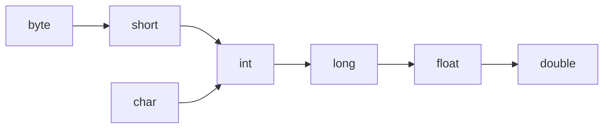
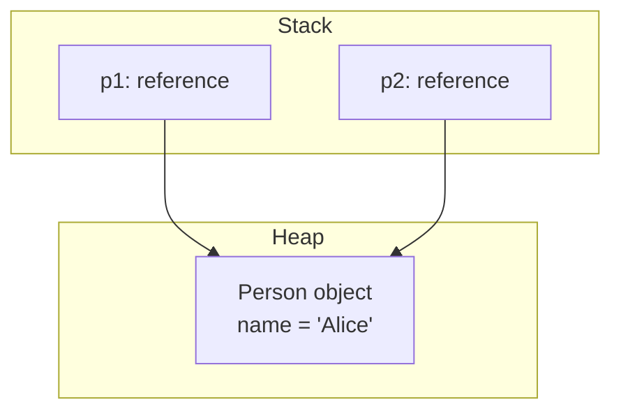

# Java Data Types

> Java splits its type system into **primitive types**, which hold values directly, and **reference types**, whose variables hold a pointer to an object on the heap.

## Why it matters

Data types sit under almost everything else in Java: memory layout, method overloading, collections, and equality checks all depend on whether you're holding a primitive or a reference. Interviewers use this topic to check whether you understand what's actually happening in memory - not just syntax - because mistakes here (autoboxing in a hot loop, `==` on wrapper objects, silent narrowing) are common sources of real bugs and performance issues.

## Primitive Types

Java has 8 primitive types. They are not objects, are never `null`, and are stored directly in the variable's memory slot (a local variable on the stack, or inline inside an object on the heap).

| Type | Size | Range | Default |
|---|---|---|---|
| `byte` | 8 bits | -128 to 127 | 0 |
| `short` | 16 bits | -32,768 to 32,767 | 0 |
| `int` | 32 bits | -2,147,483,648 to 2,147,483,647 | 0 |
| `long` | 64 bits | ~-9.2×10^18 to 9.2×10^18 | 0L |
| `float` | 32 bits | ~±3.4×10^38, 7 decimal digits precision | 0.0f |
| `double` | 64 bits | ~±1.8×10^308, 15 decimal digits precision | 0.0d |
| `char` | 16 bits | 0 to 65,535 (unsigned, represents a UTF-16 code unit) | '\u0000' |
| `boolean` | JVM-dependent (not precisely specified) | `true` / `false` | false |

`float` and `double` follow IEEE 754; `char` is the only unsigned primitive.

## Reference Types

Everything that isn't a primitive - objects, arrays, interfaces, enums, and `String` - is a reference type. The variable itself is a fixed-size reference (essentially a pointer); the actual object data lives on the heap. A reference variable's default value is `null`, meaning "points to nothing."

## Wrapper Classes

Every primitive has a corresponding wrapper class in `java.lang`, letting primitives be used wherever an object is required (generics, collections, nullable fields).

| Primitive | Wrapper |
|---|---|
| `byte` | `Byte` |
| `short` | `Short` |
| `int` | `Integer` |
| `long` | `Long` |
| `float` | `Float` |
| `double` | `Double` |
| `char` | `Character` |
| `boolean` | `Boolean` |

`int` cannot go into a `List<int>` - generics work only with reference types - so you write `List<Integer>` instead. `Integer` also adds utility methods (`Integer.parseInt`, `Integer.MAX_VALUE`, `Integer.compare`) and can hold `null`, which `int` cannot.

## Autoboxing and Unboxing

Autoboxing is the compiler automatically converting a primitive to its wrapper (`int` -> `Integer`); unboxing is the reverse. This happens implicitly wherever a primitive is used in an object context.

```java
List<Integer> nums = new ArrayList<>();
nums.add(5);          // autobox: int -> Integer
int first = nums.get(0); // unboxing: Integer -> int
```

Two gotchas interviewers like to probe:

- **Unboxing a null throws `NullPointerException`.** If `Integer x = null; int y = x;`, unboxing fails at runtime.
- **`Integer` caches values from -128 to 127.** `Integer a = 100, b = 100;` gives `a == b` as `true` (same cached object), but `Integer a = 200, b = 200;` gives `a == b` as `false` (different objects), even though `a.equals(b)` is always `true`.

## Type Casting: Widening vs Narrowing

- **Widening (implicit)**: a smaller type is automatically converted to a larger one because no data can be lost. The compiler does this for you.
- **Narrowing (explicit)**: a larger type is converted to a smaller one, which can lose data or precision, so it requires an explicit cast.



```java
int i = 100;
long l = i;      // widening, implicit
double d = l;    // widening, implicit

double big = 100.99;
int truncated = (int) big;   // narrowing, explicit cast -> 100 (fraction lost)

int overflow = 130;
byte b = (byte) overflow;    // narrowing -> -126 (wraps around, no exception)
```

Narrowing never throws - it silently truncates or wraps the bits, which is a common source of subtle bugs when casting large values into smaller types.

## Reference vs Value Semantics

Java is **always pass-by-value**. For primitives, the value itself is copied. For objects, the *reference* (the pointer) is copied - so two variables can point to the same object, and mutating through one is visible through the other, but reassigning one variable never affects the other.



```java
Person p1 = new Person("Alice");
Person p2 = p1;        // copies the reference, not the object
p2.setName("Bob");     // mutates the shared object
System.out.println(p1.getName()); // "Bob" - p1 sees the change
p2 = new Person("Carol"); // reassigns p2 only; p1 still points to the original object
```

### int vs Integer

- `int` is a primitive: fixed 4 bytes, stored by value, defaults to `0`, cannot be `null`.
- `Integer` is a reference type wrapping an `int`: it's an object, can be `null`, and is required in generic contexts like `List<Integer>`.

### == vs .equals()

- `==` compares references for objects (are these the same object in memory?) and values for primitives.
- `.equals()` compares logical content, if the class overrides it (as `Integer`, `String`, and most collection classes do). Two different `Integer` objects with the same value are `==`-unequal but `.equals()`-equal.

## Common Interview Questions

**Q: Why does Java need both primitives and wrapper classes?**
A: Primitives are fast and memory-efficient because they're stored directly without object overhead. Wrapper classes exist because generics, collections, and any API expecting an `Object` require reference types - primitives can't be used there directly.

**Q: What happens if you unbox a null Integer?**
A: The JVM throws a `NullPointerException` at the point of unboxing, since it tries to call `.intValue()` on a null reference.

**Q: Why does `Integer a = 127; Integer b = 127; a == b` return true, but the same with 128 returns false?**
A: The JVM caches `Integer` objects for values -128 to 127 via `Integer.valueOf()`. Values in that range reuse cached instances, so `==` happens to match; outside it, new objects are created each time, so `==` compares different references.

**Q: Is Java pass-by-value or pass-by-reference?**
A: Always pass-by-value. For object arguments, the value being copied is the reference itself, which is why mutating an object inside a method is visible to the caller, but reassigning the parameter is not.

**Q: What's the difference between widening and narrowing conversions?**
A: Widening converts a smaller type to a larger one with no data loss and happens implicitly. Narrowing converts a larger type to a smaller one, can lose data or overflow, and requires an explicit cast.

**Q: Does casting a double to an int round or truncate?**
A: It truncates (discards the fractional part), it does not round. `(int) 9.9` yields `9`, and `(int) -9.9` yields `-9`.

**Q: Why can't you put a primitive `int` in a `List<int>`?**
A: Java generics work only with reference types due to type erasure; `int` isn't a subtype of `Object`. The compiler autoboxes it to `Integer` so `List<Integer>` works instead.

## Related

- [java-strings.md](java-strings.md) - `String` is a reference type with its own immutability and pooling rules
- [java-oop.md](java-oop.md) - object references and how they're passed and shared between methods
- [java-collections.md](java-collections.md) - collections store only objects, which is why autoboxing matters there
- [java-keywords.md](java-keywords.md) - keywords like `final` and `static` that interact with variable storage
