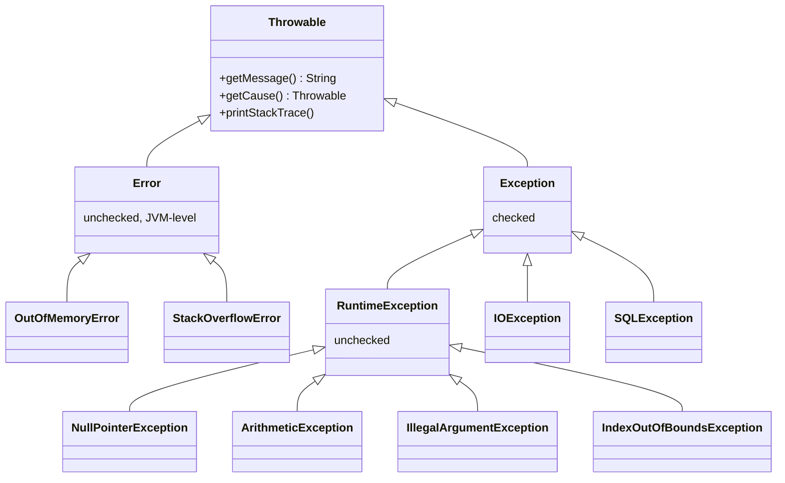
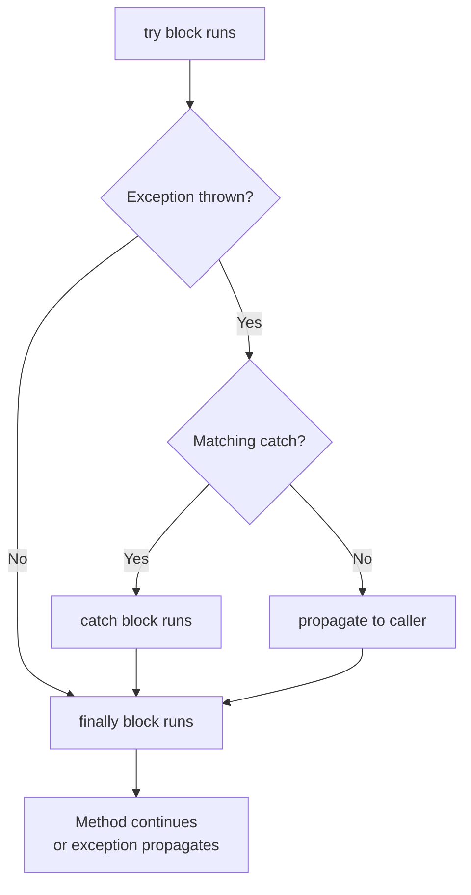

# Java Exceptions

> **Exceptions** are Java's mechanism for signaling and handling abnormal conditions that disrupt the normal flow of a program, separating error-handling logic from business logic.

## Why it matters

Exception handling questions test whether a candidate writes robust, production-grade code or just happy-path code. Interviewers use them to probe understanding of the checked/unchecked distinction, resource cleanup (a common source of leaks), and API design (should my method throw a checked or unchecked exception?). It also reveals whether someone knows subtle gotchas, like `finally` overriding a `return`, that trip up even experienced developers.

## The Throwable Hierarchy

Everything that can be thrown or caught in Java extends `Throwable`. It splits into two branches: `Error` for serious problems the JVM itself raises (not meant to be caught by application code), and `Exception` for conditions applications should handle. `Exception` further splits into checked exceptions and the unchecked `RuntimeException` subtree.



## Checked vs Unchecked Exceptions

The core distinction interviewers probe: checked exceptions are verified by the compiler at compile time, unchecked exceptions are not.

| Feature | Checked Exception | Unchecked Exception |
|---|---|---|
| Base class | `Exception` (not `RuntimeException`) | `RuntimeException` |
| Compile-time enforcement | Required — must catch or declare with `throws` | Not required |
| Typical cause | External/recoverable conditions (missing file, network failure) | Programming bugs (null dereference, bad cast, invalid index) |
| Examples | `IOException`, `SQLException`, `ClassNotFoundException` | `NullPointerException`, `ArithmeticException`, `IllegalArgumentException` |
| Where `Error` fits | Neither — `Error` is unchecked but signals JVM-level failure, not application logic | |

The design intent: checked exceptions force the caller to consciously decide how to recover from a condition it can reasonably anticipate (file not found, connection dropped). Unchecked exceptions represent bugs that should be fixed in the code, not caught defensively — catching a `NullPointerException` everywhere just hides the real problem.

## try / catch / finally

- `try` wraps code that might throw.
- `catch` handles a specific exception type (multiple `catch` blocks, or multi-catch with `|`, are allowed).
- `finally` always runs — whether the try block completes normally, throws, or even returns — used for guaranteed cleanup (closing streams, releasing locks).

```java
try {
    riskyOperation();
} catch (IOException | SQLException e) {
    log.error("Operation failed", e);
} finally {
    cleanup();
}
```



**`finally` can override a `return`.** If both `try` and `finally` contain a `return` (or `finally` throws), the outcome from `finally` wins and the original `try` return is discarded. This is legal but considered bad practice because it silently swallows the intended result.

```java
static int test() {
    try {
        return 1;
    } finally {
        return 2; // this wins — method returns 2
    }
}
```

## try-with-resources

Introduced in Java 7, `try-with-resources` automatically closes any resource that implements `AutoCloseable` (or `Closeable`), even if an exception is thrown, without needing an explicit `finally` block.

```java
try (BufferedReader br = new BufferedReader(new FileReader("file.txt"))) {
    String line = br.readLine();
    System.out.println(line);
} catch (IOException e) {
    log.error("Read failed", e);
}
```

Resources are closed in reverse order of declaration, and if both the try body and the automatic `close()` throw, the close-time exception is *suppressed* and attached to the primary one (retrievable via `getSuppressed()`) rather than replacing it — unlike the manual `finally`-return problem above, no information is silently lost.

## throw vs throws

| Feature | `throw` | `throws` |
|---|---|---|
| Purpose | Actually raises an exception instance | Declares that a method may propagate an exception |
| Location | Inside a method body | In the method signature |
| Cardinality | Throws exactly one exception object per statement | Can declare multiple, comma-separated |
| Example | `throw new IOException("bad input");` | `public void read() throws IOException, SQLException` |

`throw` is an executable statement; `throws` is compile-time metadata for the caller. A method can only `throw` one exception at a given point (though that exception can wrap a `cause` chain via its constructor), but its signature can `throws` several types.

## Custom Exceptions

Custom exceptions communicate domain-specific failure conditions more clearly than generic ones, and can carry extra context (error codes, offending values).

```java
public class InsufficientFundsException extends RuntimeException {
    private final BigDecimal shortfall;

    public InsufficientFundsException(String message, BigDecimal shortfall) {
        super(message);
        this.shortfall = shortfall;
    }

    public BigDecimal getShortfall() {
        return shortfall;
    }
}
```

Whether to extend `Exception` or `RuntimeException` depends on whether callers can reasonably recover:

- Extend `Exception` (checked) when the caller has a meaningful, expected recovery path — e.g., retrying after a network timeout.
- Extend `RuntimeException` (unchecked) when the condition signals a programming error or a business-rule violation that callers typically shouldn't be forced to handle at every call site — e.g., validation failures deep in a call chain, which is the more common modern preference (Spring and most frameworks favor unchecked exceptions to avoid boilerplate `throws` clauses).

## Best Practices

- Catch only exceptions you can meaningfully handle; avoid blanket `catch (Exception e)` or `catch (Throwable t)`.
- Always release resources — prefer `try-with-resources` over manual `finally` cleanup.
- Preserve the cause chain when wrapping: `throw new ServiceException("failed", e);` rather than swallowing `e`.
- Log exceptions with context; never catch-and-ignore silently.
- Don't use exceptions for normal control flow — they're relatively expensive and hurt readability.
- Keep custom exception hierarchies shallow and meaningful, named for the failure condition, not the implementation.

## Common Interview Questions

**Q: What is the difference between checked and unchecked exceptions?**
A: Checked exceptions extend `Exception` and are verified by the compiler — the method must either catch them or declare them with `throws`. Unchecked exceptions extend `RuntimeException` and have no such compile-time requirement; they typically indicate programming bugs like null dereferences.

**Q: Why does Java distinguish checked from unchecked exceptions at all?**
A: Checked exceptions model recoverable, externally-caused conditions (file missing, network down) where the compiler forces the developer to decide on a response. Unchecked exceptions model bugs (invalid arguments, null access) that should be fixed in code rather than defensively caught everywhere.

**Q: Does `finally` always execute?**
A: Almost always — even if the `try` or `catch` block returns, breaks, continues, or throws. The only exceptions are if the JVM exits (`System.exit()`) or the thread is killed before `finally` runs.

**Q: Can a `finally` block override a return value from `try`?**
A: Yes. If `finally` also contains a `return` statement, its value replaces the one from `try`, discarding the original return. This is legal but considered a code smell.

**Q: What is the difference between `throw` and `throws`?**
A: `throw` is a statement inside a method body that actually raises a specific exception instance. `throws` is part of a method's signature declaring which checked exceptions it might propagate to its caller.

**Q: What does try-with-resources do, and what must a resource implement?**
A: It automatically closes resources implementing `AutoCloseable` at the end of the block, in reverse declaration order, even if an exception occurs — removing the need for a manual `finally` with explicit `close()` calls. If the try body and the close both throw, the close exception is suppressed and attached to the primary exception instead of replacing it.

**Q: When should a custom exception extend `Exception` vs `RuntimeException`?**
A: Extend `Exception` when callers have a genuine, expected recovery path and should be forced to consider it (checked). Extend `RuntimeException` when the failure represents a bug or business-rule violation that shouldn't force a `throws` clause through every layer of the call stack — this is the more common modern convention.

## Related

- [Java Keywords](java-keywords.md) - covers `try`, `catch`, `throw`, `throws`, and `finally` as language keywords
- [Java OOP](java-oop.md) - inheritance concepts underlying the `Throwable` class hierarchy
- [Java Threading](java-threading.md) - how uncaught exceptions behave differently across threads
