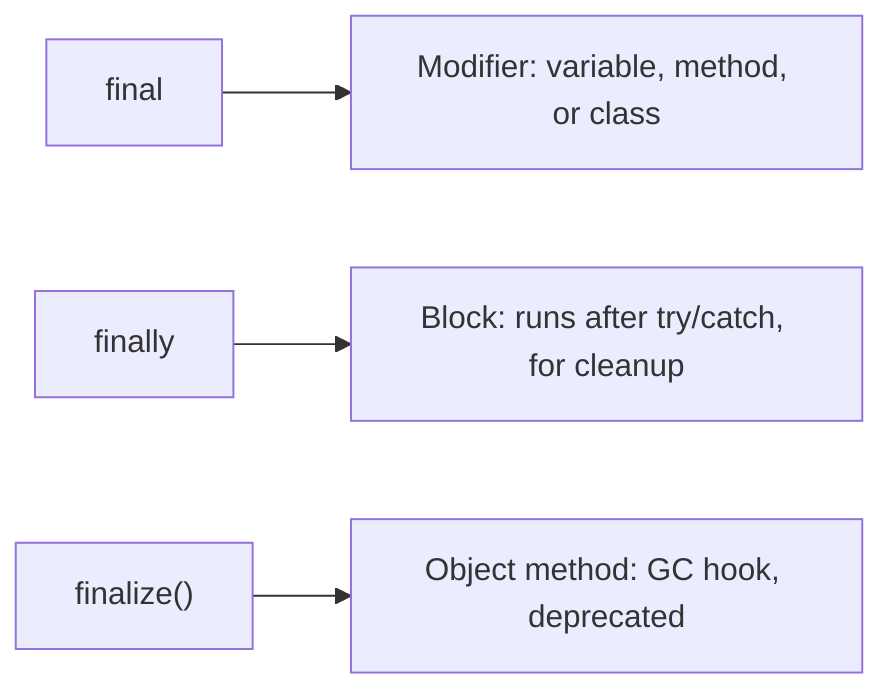
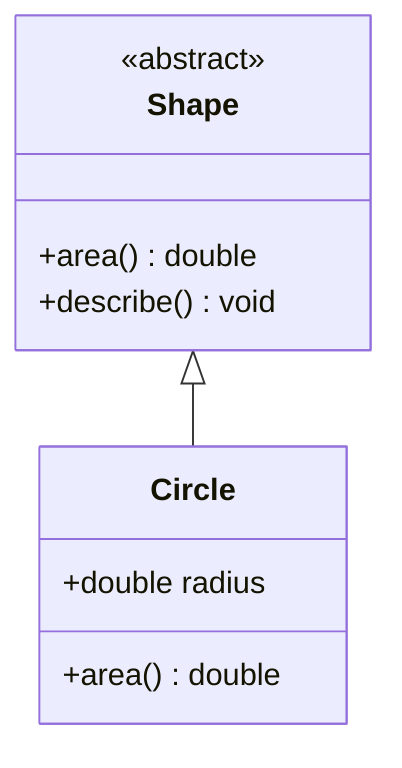
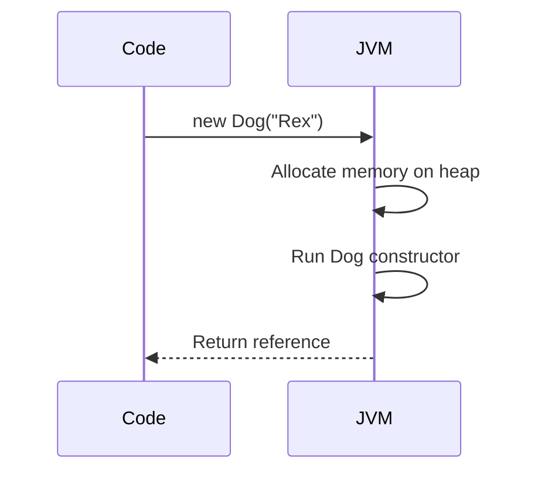

# Important Java Keywords

> **Keywords** are reserved words that give the compiler instructions about scope, mutability, inheritance, and thread visibility rather than being ordinary identifiers.

## Why it matters

Interviewers use keyword questions as a fast way to check whether you understand the JVM's memory model, object lifecycle, and OOP mechanics, not just syntax. Mixing up `final`/`finally`/`finalize`, or not knowing why `volatile` doesn't make an increment atomic, are classic signals of shallow Java knowledge. These keywords also show up constantly in real code reviews, so a solid grasp translates directly into fewer bugs.

## Quick Reference Table

| Keyword | Applies to | Meaning |
|---|---|---|
| `static` | field, method, block, nested class | Belongs to the class, not to instances; one shared copy |
| `final` | variable, method, class | Variable: unreassignable; method: cannot override; class: cannot extend |
| `this` | instance context | Reference to the current object instance |
| `super` | instance context | Reference to the immediate parent class |
| `abstract` | class, method | Class: cannot be instantiated; method: no body, must be implemented by subclass |
| `synchronized` | method, block | Only one thread may hold the lock and execute at a time |
| `volatile` | field | Reads/writes go straight to main memory, guaranteeing visibility across threads |
| `transient` | field | Field is skipped during default Java serialization |
| `instanceof` | expression operator | Runtime type check; returns `true`/`false` |
| `new` | expression operator | Allocates memory and invokes a constructor to create an object |

## static

`static` members belong to the class itself. There is exactly one copy shared by all instances, and it can be accessed without creating an object.

```java
class Counter {
    static int count = 0;   // shared across all instances

    Counter() {
        count++;
    }
}
```

Common uses: utility/helper methods (`Math.max`), constants (`static final`), and static initializer blocks that run once when the class is loaded.

## final vs finally vs finalize

This trio is one of the most commonly confused sets of terms in Java, and interviewers ask about it specifically because the three have nothing to do with each other beyond sharing a prefix.

| Term | Category | Purpose |
|---|---|---|
| `final` | Modifier (keyword) | Prevents reassignment, overriding, or subclassing |
| `finally` | Block (keyword) | Always executes after a `try`/`catch`, used for cleanup |
| `finalize()` | Method (from `Object`) | Deprecated hook the GC used to call before reclaiming an object; do not rely on it |

```java
final int max = 100;      // cannot reassign max

try {
    riskyOperation();
} finally {
    closeResources();     // always runs, even if an exception was thrown
}

@Override
protected void finalize() throws Throwable {
    // deprecated since Java 9 - use try-with-resources or Cleaner instead
}
```



## this and super

`this` refers to the current object; `super` refers to the parent class part of that same object. Both are commonly used to resolve naming conflicts and to call constructors explicitly.

```java
class Animal {
    String name = "Animal";
    Animal(String name) { this.name = name; }
    void speak() { System.out.println("..."); }
}

class Dog extends Animal {
    Dog(String name) {
        super(name);           // calls Animal's constructor
    }
    @Override
    void speak() {
        super.speak();         // calls Animal's speak()
        System.out.println(this.name + " barks");
    }
}
```

`super(...)` or `this(...)` must be the first statement in a constructor, and a constructor can call only one of them.

## abstract

An `abstract` class can hold both abstract (unimplemented) and concrete methods, and it cannot be instantiated directly. An `abstract` method has no body and forces every concrete subclass to provide one.

```java
abstract class Shape {
    abstract double area();          // no body

    void describe() {                // concrete method allowed
        System.out.println("Area: " + area());
    }
}

class Circle extends Shape {
    double radius;
    Circle(double r) { radius = r; }
    @Override
    double area() { return Math.PI * radius * radius; }
}
```



## synchronized and volatile

Both relate to concurrency but solve different problems. `synchronized` provides mutual exclusion (only one thread runs the block at a time) and also guarantees visibility. `volatile` provides visibility only, with no locking and no atomicity guarantee for compound operations like `count++`.

```java
class Counter {
    private volatile boolean running = true;   // visibility only
    private int count = 0;

    synchronized void increment() {            // mutual exclusion
        count++;
    }

    void stop() { running = false; }           // seen immediately by other threads
}
```

| Aspect | `synchronized` | `volatile` |
|---|---|---|
| Mutual exclusion | Yes | No |
| Visibility guarantee | Yes | Yes |
| Atomic compound ops (`count++`) | Yes, inside the block | No |
| Performance cost | Higher (locking) | Lower |
| Applies to | methods, blocks | fields only |

## transient

`transient` marks a field so the default Java serialization mechanism skips it. On deserialization that field is set to its default value (`null`, `0`, `false`).

```java
class User implements java.io.Serializable {
    String username;
    transient String password;   // never written to the byte stream
}
```

## instanceof and new

`instanceof` checks an object's runtime type before a cast, avoiding `ClassCastException`. `new` is the operator that allocates heap memory for an object and invokes its constructor.

```java
Object obj = "hello";

if (obj instanceof String s) {   // pattern variable (Java 16+)
    System.out.println(s.length());
}

Dog d = new Dog("Rex");          // allocation + constructor call
```



## Common Interview Questions

**Q: Can a `final` variable's internal state change?**
A: Yes, if it references a mutable object. `final` only prevents reassigning the reference itself, e.g. `final List<String> list = new ArrayList<>()` still allows `list.add(...)`.

**Q: Why doesn't `volatile` make `count++` thread-safe?**
A: `count++` is read-modify-write, three separate steps. `volatile` only guarantees each read/write is visible immediately; it does not make the whole sequence atomic, so two threads can still race. Use `AtomicInteger` or `synchronized` instead.

**Q: Can an `abstract` class have a constructor?**
A: Yes. It cannot be instantiated with `new` directly, but its constructor runs when a subclass is instantiated via `super()`.

**Q: What happens if you never call `super()` explicitly in a subclass constructor?**
A: The compiler inserts an implicit no-argument `super()` call as the first statement, provided the parent class has a no-arg constructor; otherwise it's a compile error.

**Q: Is `finalize()` still useful in modern Java?**
A: No. It has been deprecated since Java 9 because it is unpredictable, can delay garbage collection, and may not run at all. Use try-with-resources (`AutoCloseable`) or `java.lang.ref.Cleaner` for deterministic cleanup.

**Q: Does marking a field `transient` also stop it from being serialized by frameworks like Jackson or Gson?**
A: No. `transient` only affects the built-in `java.io.Serializable` mechanism. JSON libraries have their own annotations (e.g. `@JsonIgnore`) for excluding fields.

**Q: Can `static` methods be overridden?**
A: No, they can only be hidden. If a subclass declares a static method with the same signature, it is method hiding, resolved at compile time based on the reference type, not runtime polymorphism.

## Related

- [OOP Concepts](java-oop.md) - abstraction and inheritance underpin `abstract`, `this`, and `super`
- [Multithreading](java-threading.md) - deeper dive into `synchronized`, `volatile`, and thread safety
- [Exception Handling](java-exceptions.md) - `try`/`catch`/`finally` control flow in detail
