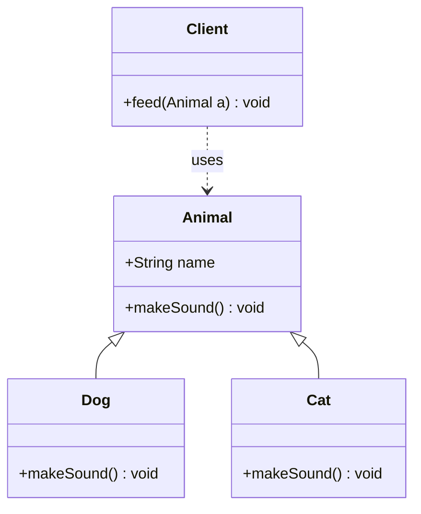

# Java Object-Oriented Programming (OOP)

> **Object-oriented programming** is a design paradigm that models software as a collection of interacting objects, each bundling state (fields) and behavior (methods) together.

## Why it matters

OOP fundamentals are the most common opening topic in Java interviews because they reveal how a candidate thinks about design, not just syntax. Interviewers use questions on encapsulation, inheritance, polymorphism, and abstraction to probe whether you can reason about coupling, extensibility, and correct API design - skills that matter far more on the job than memorizing keyword definitions. Weak or vague answers here are an early red flag, even for senior roles.

## Class vs Object

- A **class** is a blueprint or template that defines the structure (fields) and behavior (methods) shared by a category of things.
- An **object** is a runtime instance of a class, with its own state stored in memory.
- A class can exist and be useful even without any objects being created from it, if it exposes only `static` members. The `Math` class is a classic example - you call `Math.sqrt(x)` without ever instantiating `Math`.

```java
class Car {
    String color;          // instance field
    void drive() { ... }   // instance method
}

Car myCar = new Car();     // an object (instance) of Car
```

## The Four Pillars of OOP

| Pillar | What it means | How Java implements it |
|---|---|---|
| Encapsulation | Bundling data and the methods that operate on it, hiding internal state | `private` fields with public getters/setters |
| Abstraction | Exposing only essential behavior, hiding implementation detail | `abstract` classes and `interface` types |
| Inheritance | Acquiring fields/behavior from a parent type | `extends` (classes), `implements` (interfaces) |
| Polymorphism | One interface, many implementations | Method overloading (compile-time) and overriding (runtime) |

### Encapsulation

Encapsulation wraps data and the methods that act on it into a single unit (a class), and restricts direct access to some of that unit's internals - typically by marking fields `private` and exposing controlled access through public getters/setters. This protects invariants: a `BankAccount` class can guarantee `balance` never goes negative because the only way to change it is through a validated `withdraw()` method.

```java
class BankAccount {
    private double balance;

    public double getBalance() { return balance; }

    public void withdraw(double amount) {
        if (amount > balance) throw new IllegalArgumentException("Insufficient funds");
        balance -= amount;
    }
}
```

### Abstraction

Abstraction hides internal implementation details and exposes only the necessary features to the caller. It is implemented with `abstract` classes (which can mix implemented and unimplemented behavior) and `interface`s (which define a contract). Abstraction is about **what** an object does; encapsulation is about **protecting how** it does it - the two are related but distinct.

### Inheritance

Inheritance lets a class (the subclass) acquire the fields and methods of another class (the superclass) using `extends`. It enables code reuse and establishes an "is-a" relationship.

```java
class Animal {
    void eat() { System.out.println("eating"); }
}

class Dog extends Animal {
    void bark() { System.out.println("barking"); }
}
```

Java supports single inheritance for classes (one direct superclass) but multiple inheritance of type through interfaces.

### Polymorphism

Polymorphism allows one interface (a method name or type reference) to behave differently depending on the underlying data or object.

- **Compile-time (static) polymorphism**: method overloading - multiple methods with the same name but different parameter lists, resolved by the compiler.
- **Run-time (dynamic) polymorphism**: method overriding - a subclass provides its own implementation of a method already defined in its superclass, resolved at runtime based on the actual object type (dynamic dispatch).



In the diagram above, `Client.feed(Animal a)` is written once against the `Animal` type, but calling `a.makeSound()` invokes `Dog.makeSound()` or `Cat.makeSound()` depending on the actual object passed in at runtime - this is dynamic dispatch, the mechanism behind runtime polymorphism.

## Constructors

A constructor is a special method invoked when an object is created. It shares the class name and has no return type - not even `void`.

- **Default constructor** - takes no arguments; the compiler supplies one automatically only if no other constructor is defined.
- **Parameterized constructor** - accepts arguments to initialize fields at creation time.
- **Copy constructor** - not provided automatically in Java (unlike C++); if needed, you write one manually, typically taking another instance of the same class as its parameter.

## `this` and `super`

| Keyword | Refers to | Typical use |
|---|---|---|
| `this` | The current object instance | Disambiguate instance fields from parameters/locals with the same name; chain constructors (`this(...)`) |
| `super` | The immediate parent class instance | Call an overridden parent method (`super.method()`) or invoke a parent constructor (`super(...)`) |

## Static vs Non-Static Members

- **Static** members belong to the class itself and are shared across all instances. They can be accessed without creating an object (e.g., `ClassName.field`).
- **Non-static** members belong to each individual object; every instance holds its own copy.
- A static method cannot directly access non-static (instance) members, because static methods run without any particular object context - there is no `this` to resolve the instance data against. A static method can only touch instance members if it is given a specific object reference to operate on.

## Common Interview Questions

**Q: What is the difference between a class and an object?**
A: A class is a blueprint that defines structure and behavior; an object is a concrete instance of that class allocated in memory at runtime.

**Q: Can a class exist and be used without ever creating an object of it?**
A: Yes. A class composed entirely of static members - like `Math` - can be used directly through the class name without instantiation.

**Q: What is the difference between abstraction and encapsulation?**
A: Abstraction hides implementation complexity and exposes only relevant behavior (the "what"); encapsulation hides internal state and controls access to it (the "how" is protected). They're complementary: interfaces provide abstraction, private fields with getters/setters provide encapsulation.

**Q: What is the difference between method overloading and overriding?**
A: Overloading is having multiple methods with the same name but different parameter lists in the same class, resolved at compile time. Overriding is a subclass redefining a method inherited from its superclass with the same signature, resolved at runtime via dynamic dispatch.

**Q: Why can't a static method access instance (non-static) variables directly?**
A: Because static methods belong to the class and can run without any object existing at all, so there is no implicit `this` reference for the JVM to resolve instance state against.

**Q: Does Java support multiple inheritance?**
A: Not for classes - a class can extend only one superclass, to avoid ambiguity problems like the diamond problem. Java does support multiple inheritance of type via interfaces, since a class can implement several interfaces.

**Q: What is the difference between an abstract class and an interface?**
A: An abstract class can hold constructors, instance fields, and a mix of implemented and abstract methods, and a subclass can extend only one. An interface traditionally defines a pure contract (methods without bodies, though default methods are allowed), and a class can implement multiple interfaces.

## Related

- [Java Collections](java-collections.md) - how OOP principles show up in the collections framework design
- [Java Keywords](java-keywords.md) - deeper reference on `this`, `super`, `static`, and other modifiers used throughout OOP code
- [Java Exceptions](java-exceptions.md) - how inheritance and polymorphism apply to the exception class hierarchy
