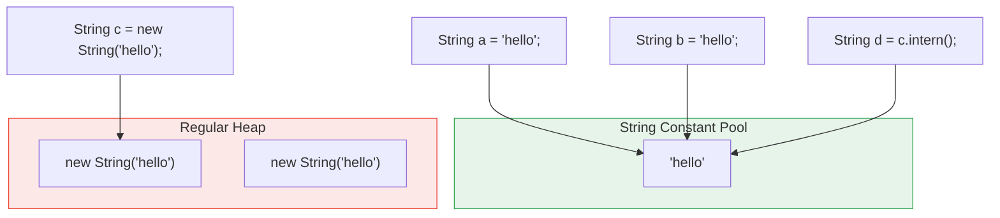

# Java Strings, the String Pool, and String Building

> A **String** in Java is an immutable sequence of characters, and understanding why it is immutable — plus how `StringBuilder`/`StringBuffer` avoid the cost of that immutability — is core to writing correct, efficient Java code.

## Why it matters

Strings are the most-used type in any Java codebase, yet their behavior around memory, equality, and mutability trips up even experienced developers. Interviewers use this topic to check whether you understand the JVM memory model (heap vs. string pool), whether you know why `==` fails silently for strings, and whether you can reason about performance trade-offs in loops that build text. It is also a gateway into deeper questions about `hashCode()` caching, `HashMap` keys, and thread safety.

## String Immutability and Why

A `String` object's internal character data cannot change after construction. Any operation that looks like it "modifies" a string — `concat()`, `replace()`, `toUpperCase()`, `+=` — actually creates and returns a **new** `String` object.

```java
String s = "hello";
s = s + " world"; // a new String object is created; "hello" is unchanged (and still pooled)
```

Java made `String` immutable for several deliberate reasons:

- **Security** - strings hold class names, file paths, and network hosts. If a string could be mutated after validation, its content could be changed after the security check but before use.
- **String pool safety** - immutability is what makes it safe for many references to share one pooled object (see below); a mutable shared string would corrupt every other reference.
- **Thread safety** - an immutable object can be shared across threads with no synchronization, since no thread can ever observe a partial or concurrent update.
- **Safe hashCode caching** - `String` caches its `hashCode()` on first computation. That's only correct because content never changes afterward, making `String` a fast, reliable `HashMap`/`HashSet` key.

## The String Constant Pool

The **string constant pool** (sometimes called the intern pool) is a special region the JVM uses to store one canonical copy of each distinct string literal. When you write a string literal, the JVM checks the pool first; if an equal string already exists there, the existing reference is reused instead of allocating a new object.



Key takeaways from the diagram:

- `a` and `b` are literals with the same content, so both point to the **same** pooled object; `a == b` is `true`.
- `c` uses `new String(...)`, which forces allocation of a fresh object on the regular heap even though the content is identical to what is already in the pool; `a == c` is `false`.
- Calling `.intern()` on `c` returns the pooled reference, so `d == a` is `true`.

## intern()

`intern()` returns the canonical, pooled representation of a string's content. If an equal string is already in the pool, that reference is returned; otherwise the string is added to the pool and that reference is returned.

```java
String a = new String("hello"); // heap object, NOT pooled
String b = a.intern();          // looks up / adds "hello" in the pool
String c = "hello";             // literal, already pooled

System.out.println(a == c); // false - a is a separate heap object
System.out.println(b == c); // true  - both reference the pooled "hello"
```

`intern()` can reduce memory when you have many duplicate strings built at runtime (e.g., parsing a large file with repeated tokens), but every call does a pool lookup, so it should be used deliberately, not by default.

## == vs equals()

- `==` compares **references** (are these the same object in memory?).
- `.equals()` compares **content** (do these have the same characters?).

```java
String a = "hello";
String b = new String("hello");

a == b;          // false: different objects
a.equals(b);      // true: same content
a == b.intern();  // true: intern() resolves to the pooled reference
```

Always use `.equals()` (or `.equalsIgnoreCase()`) to compare string content. Relying on `==` only "works" by accident when both operands happen to be pooled literals.

## String vs StringBuilder vs StringBuffer

| Feature | String | StringBuilder | StringBuffer |
|---|---|---|---|
| Mutability | Immutable | Mutable | Mutable |
| Thread-safe | Yes (immutable, safe to share) | No | Yes (synchronized methods) |
| Performance | Slow for repeated modification | Fast | Slower than StringBuilder due to synchronization |
| Typical use | Fixed or rarely-changed text | Single-threaded string building (loops, parsing) | String building shared across threads |

Building a string with repeated `+` in a loop creates a new object on every iteration, which is O(n²) work overall for n concatenations:

```java
// Inefficient: creates a new String object on every loop iteration
String result = "";
for (int i = 0; i < 1000; i++) {
    result += i;
}

// Efficient: mutates an internal buffer, one final String is created at the end
StringBuilder sb = new StringBuilder();
for (int i = 0; i < 1000; i++) {
    sb.append(i);
}
String result2 = sb.toString();
```

Use `StringBuilder` by default; reach for `StringBuffer` only when the same builder instance is genuinely shared and mutated by multiple threads (rare — most code builds a string locally within one method).

## Common String Methods

- `length()` - number of characters
- `charAt(index)` - character at a position
- `substring(start, end)` - a slice of the string
- `indexOf()`, `lastIndexOf()` - locate a substring
- `equals()`, `equalsIgnoreCase()` - content comparison
- `contains()`, `startsWith()`, `endsWith()` - substring checks
- `replace()`, `replaceAll()` - substring/regex replacement
- `split(delimiter)` - break into an array by a delimiter or regex
- `toLowerCase()`, `toUpperCase()` - case conversion
- `trim()` / `strip()` - remove leading/trailing whitespace

### replace() vs replaceAll()

- `replace()` takes literal characters or `CharSequence` values — no regex interpretation.
- `replaceAll()` takes a regular expression pattern.

```java
"abc123".replace("123", "");     // "abc"
"abc123".replaceAll("\\d+", ""); // "abc"  (matches one-or-more digits)
```

### Regular expressions in Java

Regex-based string work typically goes through `java.util.regex.Pattern` and `Matcher`:

```java
Pattern pattern = Pattern.compile("\\d+");
Matcher matcher = pattern.matcher("123abc");
System.out.println(matcher.find()); // true
```

Common regex tokens: `.` any character, `\d`/`\D` digit/non-digit, `\w` word character, `\s` whitespace, `*` zero or more, `+` one or more, `?` zero or one, `[abc]` a set of characters, `^`/`$` start/end of line.

## Common Interview Questions

**Q: Why is String immutable in Java?**
A: For security (validated values like class names or paths can't be changed after the check), to make the string pool safe to share across references, for thread safety without synchronization, and to allow `hashCode()` to be cached safely for fast use as a `HashMap` key.

**Q: What is the string constant pool?**
A: A dedicated area the JVM uses to store one canonical copy of each distinct string literal, so identical literals can share a single object instead of each allocating its own.

**Q: Does `new String("x") == "x"` return true or false?**
A: False. `new String(...)` always allocates a new object on the heap, bypassing the pool, even though `"x"` as a literal is pooled. Use `.equals()` for content comparison, or call `.intern()` on the heap string to get the pooled reference.

**Q: When would you choose StringBuffer over StringBuilder?**
A: Only when the exact same builder object is being mutated by multiple threads concurrently. In the much more common single-threaded case (building a string within one method), `StringBuilder` is preferred because it has no synchronization overhead.

**Q: What does intern() do and when is it useful?**
A: It returns the canonical pooled reference for a string's content, adding it to the pool if not already present. It's useful for reducing memory when an application creates many duplicate strings at runtime, but each call has a lookup cost, so it shouldn't be applied indiscriminately.

**Q: Why does String work well as a HashMap key?**
A: Because it's immutable, its `hashCode()` can be computed once and cached, and the content can never change after insertion, so the key's hash and equality stay consistent for the life of the map entry.

**Q: What's the difference between replace() and replaceAll()?**
A: `replace()` performs a literal character/string substitution with no regex processing. `replaceAll()` treats its first argument as a regular expression, so metacharacters like `.` or `\d` have special meaning.

## Related

- [Java Collections](java-collections.md) - how String's immutability and cached hashCode make it a reliable HashMap/HashSet key
- [Java Threading](java-threading.md) - why immutable objects like String are inherently thread-safe
- [Java OOP](java-oop.md) - immutability as a design principle beyond just String
