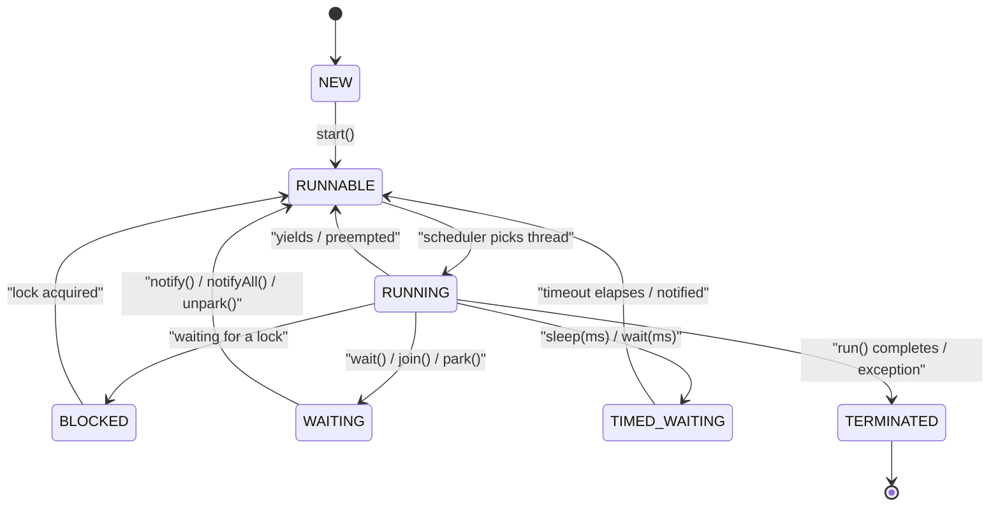
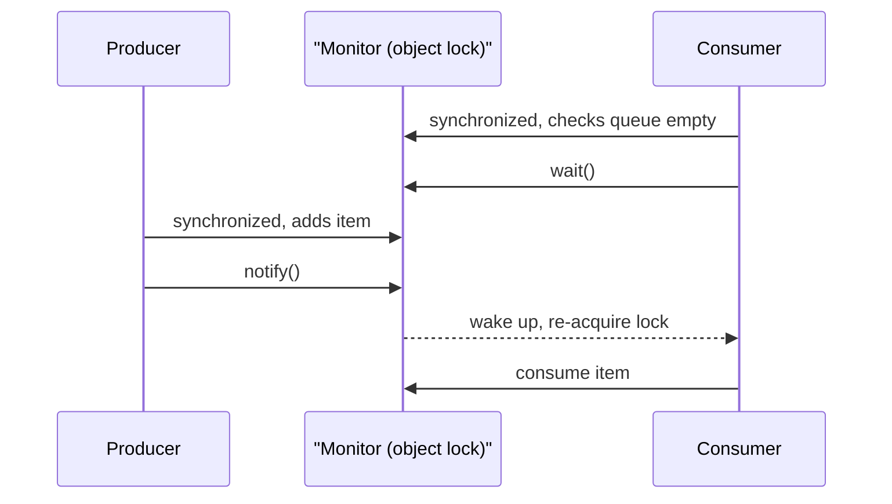

# Java Threading

> **Threading** in Java is the mechanism for running multiple paths of execution concurrently within a single JVM process, coordinated through the language's built-in memory model, locks, and the higher-level `java.util.concurrent` toolkit.

## Why it matters

Concurrency bugs (race conditions, deadlocks, visibility issues) are notoriously hard to reproduce and debug, so interviewers use threading questions to gauge whether a candidate actually understands shared mutable state rather than just knowing API names. Modern Java codebases rarely spawn raw `Thread` objects directly - they lean on the Executor framework, concurrent collections, and `CompletableFuture` - so interviewers also check whether a candidate can reason about thread pools and asynchronous composition, not just `synchronized` blocks.

## Thread vs Runnable vs Callable

There are three common ways to define a unit of work that runs on a thread.

```java
// 1. Extend Thread (uses up your one superclass slot; rarely recommended)
class MyThread extends Thread {
    public void run() {
        System.out.println("Thread running");
    }
}
new MyThread().start();

// 2. Implement Runnable (preferred - separates the task from the execution mechanism)
class MyRunnable implements Runnable {
    public void run() {
        System.out.println("Runnable running");
    }
}
new Thread(new MyRunnable()).start();

// 3. Submit to an ExecutorService (preferred in real applications)
ExecutorService executor = Executors.newFixedThreadPool(2);
executor.execute(() -> System.out.println("Thread pool task"));
executor.shutdown();
```

| Feature | Runnable | Callable |
|---|---|---|
| Return value | No (`void run()`) | Yes, via `Future<V>` |
| Checked exceptions | Cannot throw | Can throw |
| Introduced for | Raw `Thread`/basic tasks | Use with `ExecutorService` |

```java
Callable<Integer> task = () -> 123;
Future<Integer> future = executor.submit(task);
Integer result = future.get(); // blocks until done
```

Extending `Thread` ties a class to being "a thread," burns the single-inheritance slot, and is harder to reuse. Implementing `Runnable` (or `Callable`) decouples the task logic from how it's executed, which is why almost all production code favors it, paired with an `ExecutorService`.

## Thread Lifecycle

The JVM models a thread's life as a `Thread.State` enum, which can be queried at runtime for diagnostics (e.g., thread dumps).



- **NEW** - created but `start()` has not been called.
- **RUNNABLE** - eligible to run; the OS scheduler decides when it actually gets CPU time (Java does not distinguish "ready" from "running" as separate enum values, but conceptually the scheduler moves it in and out).
- **BLOCKED** - waiting to acquire an intrinsic (`synchronized`) lock held by another thread.
- **WAITING** - waiting indefinitely for another thread's signal (`Object.wait()`, `Thread.join()`, `LockSupport.park()`).
- **TIMED_WAITING** - like `WAITING` but bounded by a timeout (`sleep(ms)`, `wait(ms)`, `join(ms)`).
- **TERMINATED** - `run()` has returned or thrown, and the thread cannot be restarted.

## synchronized and Locks

`synchronized` provides mutual exclusion: only one thread can hold a given object's intrinsic lock at a time, and it also establishes a **happens-before** relationship so changes made inside the block are visible to the next thread that acquires the same lock.

```java
synchronized (object) {
    // critical section
}
```

`ReentrantLock` (from `java.util.concurrent.locks`) is an explicit alternative with more control:

```java
ReentrantLock lock = new ReentrantLock();
lock.lock();
try {
    // critical section
} finally {
    lock.unlock();
}
```

| Aspect | synchronized | ReentrantLock |
|---|---|---|
| Acquisition | Implicit, block-scoped | Explicit `lock()`/`unlock()` |
| Try without blocking | Not possible | `tryLock()` |
| Fairness policy | No | Optional (`new ReentrantLock(true)`) |
| Interruptible wait | No | `lockInterruptibly()` |
| Release on exception | Automatic | Must call `unlock()` in `finally` |
| Condition variables | One implicit monitor per object | Multiple `Condition` objects per lock |

## wait, notify, and notifyAll

These are methods on `Object`, used for inter-thread signaling, and must be called while holding the object's monitor (i.e., inside a `synchronized` block on that object), otherwise an `IllegalMonitorStateException` is thrown.

- `wait()` - releases the lock and suspends the current thread until another thread calls `notify()`/`notifyAll()` on the same object.
- `notify()` - wakes up one arbitrary waiting thread.
- `notifyAll()` - wakes up all waiting threads; safer default since it avoids missed signals when multiple consumers are waiting for different conditions.



## volatile and the Java Memory Model

The Java Memory Model (JMM) defines how threads observe each other's writes to shared memory, via **visibility** rules, **happens-before** ordering, and constraints on **instruction reordering** by the compiler/CPU.

```java
volatile boolean running = true;
```

`volatile` guarantees that a write to the variable is immediately visible to all other threads (it is not cached in a CPU register or reordered across the access), and it establishes a happens-before edge between a write and a subsequent read. It does **not** provide atomicity for compound operations (`counter++` on a `volatile` field is still a race condition) - for that, use `synchronized` or an atomic class such as `AtomicInteger`:

```java
AtomicInteger counter = new AtomicInteger(0);
counter.incrementAndGet();
```

`synchronized` and `final` (for safely-published immutable fields) also interact with the JMM to provide visibility and ordering guarantees.

## Race Conditions, Deadlock, and Starvation

| Problem | Cause | Typical fix |
|---|---|---|
| Race condition | Multiple threads read-modify-write shared data without coordination | `synchronized`, `ReentrantLock`, atomic classes |
| Deadlock | Threads hold locks in a cycle, each waiting on a lock the other holds | Consistent lock ordering, `tryLock()` with timeout, avoid nested locks |
| Starvation | A thread never gets CPU or lock access, often because other threads (or higher priority ones) monopolize it | Fair locks, avoid indefinite priority bias |
| Livelock | Threads keep changing state in response to each other but make no progress | Add randomized backoff |

## Thread-Safe Collections

- Legacy synchronized wrappers: `Vector`, `Hashtable`, `Collections.synchronizedList(...)` - every method call locks the whole collection, which is simple but limits throughput.
- Concurrent collections (preferred): `ConcurrentHashMap` (lock-striped, non-blocking reads), `CopyOnWriteArrayList` (best for read-heavy, rarely-mutated lists), `BlockingQueue` implementations (`ArrayBlockingQueue`, `LinkedBlockingQueue`) for producer-consumer pipelines.

## The Executor Framework

Manually creating and managing `Thread` objects doesn't scale: it's expensive to spin up threads per task, and there's no built-in way to bound concurrency. `ExecutorService` decouples task submission from execution policy (pool size, queueing, rejection).

```java
ExecutorService executor = Executors.newFixedThreadPool(4);
Future<Integer> future = executor.submit(() -> 123);
executor.shutdown();
```

`CompletableFuture` builds on `Future` to support asynchronous, non-blocking composition of dependent tasks:

```java
CompletableFuture.supplyAsync(() -> "Hello")
    .thenApply(str -> str + " World")
    .thenAccept(System.out::println);
```


## Common Interview Questions

**Q: What's the difference between `start()` and `run()`?**
A: `start()` creates a new call stack and hands execution to the thread scheduler, which eventually invokes `run()` on the new thread. Calling `run()` directly just executes the method body on the current thread - no new thread is created.

**Q: Why prefer `Runnable`/`Callable` over extending `Thread`?**
A: It decouples the task from the execution mechanism, avoids wasting Java's single-inheritance slot, and lets the same task be reused with different executors (thread pool, scheduled executor, etc.).

**Q: Why must `wait()`/`notify()` be called inside a `synchronized` block?**
A: They operate on the object's intrinsic monitor; calling them without holding that lock throws `IllegalMonitorStateException`, and without the lock there's no way to atomically check a condition and then wait on it without missing a signal.

**Q: What's the difference between `volatile` and `synchronized`?**
A: `volatile` only guarantees visibility and ordering for reads/writes of a single variable, with no locking or mutual exclusion. `synchronized` guarantees both visibility and atomicity of the whole critical section, but at the cost of blocking.

**Q: How do you prevent deadlock?**
A: Always acquire multiple locks in a fixed global order, use `tryLock()` with a timeout to back off instead of blocking forever, minimize the scope and nesting of locks, and prefer higher-level concurrency utilities that avoid manual lock management.

**Q: What does `ExecutorService.shutdown()` do versus `shutdownNow()`?**
A: `shutdown()` stops accepting new tasks but lets already-submitted tasks finish; `shutdownNow()` attempts to stop all actively executing tasks (via interruption) and returns the list of tasks that never started.

**Q: Is `ConcurrentHashMap` fully lock-free?**
A: No - it uses fine-grained internal locking/CAS operations scoped to segments/bins rather than one lock for the whole map, so multiple threads can read and write different parts concurrently without blocking each other, unlike `Hashtable` or `Collections.synchronizedMap`.

## Related

- [java-collections.md](java-collections.md) - core collection interfaces referenced by `BlockingQueue` and friends
- [java-collections-advanced.md](java-collections-advanced.md) - deeper dive into `ConcurrentHashMap` and other concurrent collections
- [java-keywords.md](java-keywords.md) - `synchronized`, `volatile`, and `final` as language keywords
- [java-exceptions.md](java-exceptions.md) - checked vs unchecked exceptions, relevant to `Callable`'s `throws` behavior
