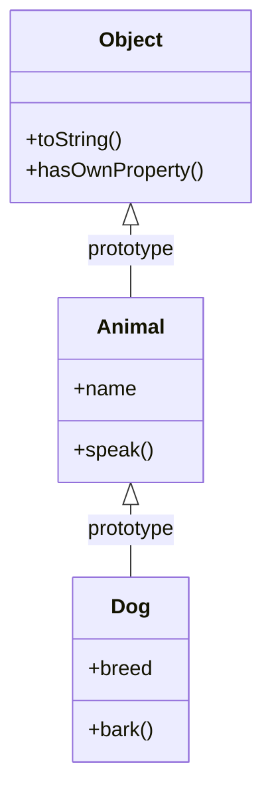
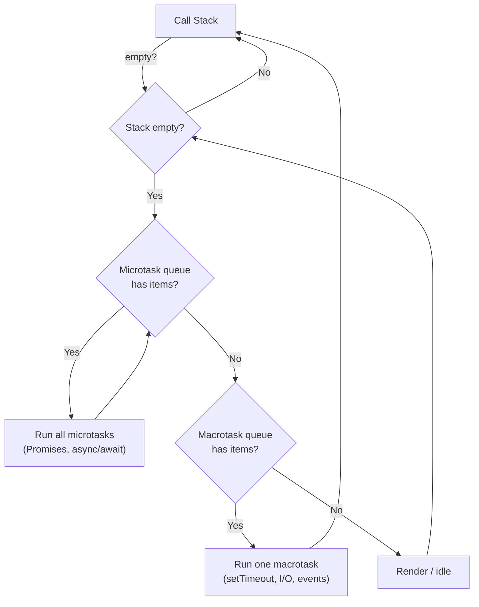
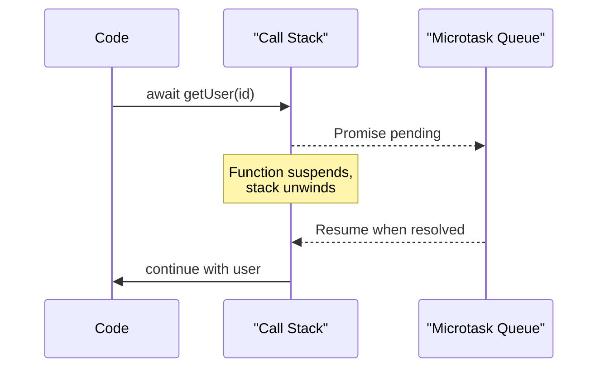

# JavaScript Core Concepts

> **JavaScript** is a single-threaded, event-driven language whose behavior around scope, `this`, and asynchronous execution trips up even experienced developers.

## Why it matters

These fundamentals separate candidates who can write JavaScript from candidates who understand it. Interviewers use closures, hoisting, and the event loop to probe whether you can reason about execution order and memory, not just syntax. Getting `==` vs `===` or `this` binding wrong in a live coding session is a common signal of shallow experience with the language.

## Scope and Hoisting

JavaScript has function scope (`var`) and block scope (`let`, `const`). Declarations are "hoisted" to the top of their scope during compilation, but only the declaration - not the initialization - moves.

- `var` declarations are hoisted and initialized to `undefined`, so they can be referenced (as `undefined`) before the line they're declared on.
- `let` and `const` are hoisted but not initialized. Accessing them before their declaration throws a `ReferenceError` because they sit in the **temporal dead zone (TDZ)**.
- `function` declarations are fully hoisted (name and body), so they can be called before their definition appears in the source.

```javascript
console.log(a); // undefined
var a = 1;

console.log(b); // ReferenceError: Cannot access 'b' before initialization
let b = 2;
```

| Keyword | Scope | Re-declarable | Hoisted behavior |
|---|---|---|---|
| `var` | Function | Yes | Initialized to `undefined` |
| `let` | Block | No | TDZ until declaration |
| `const` | Block | No | TDZ until declaration, must be initialized |

## Closures

A **closure** is a function that retains access to variables from its enclosing lexical scope even after the outer function has returned. Closures are how JavaScript implements private state, memoization, and callback factories.

```javascript
function makeCounter() {
  let count = 0;
  return function increment() {
    count += 1;
    return count;
  };
}

const counter = makeCounter();
counter(); // 1
counter(); // 2 - count persisted between calls
```

A classic gotcha is closures inside loops capturing the loop variable:

```javascript
for (var i = 0; i < 3; i++) {
  setTimeout(() => console.log(i), 0); // 3, 3, 3 (var is function-scoped)
}

for (let j = 0; j < 3; j++) {
  setTimeout(() => console.log(j), 0); // 0, 1, 2 (let creates a new binding per iteration)
}
```

## `this` Binding

`this` is determined by **how a function is called**, not where it is defined - except for arrow functions, which capture `this` lexically from their enclosing scope.

| Call pattern | `this` value |
|---|---|
| `obj.method()` | `obj` |
| Plain function call `fn()` | `undefined` in strict mode, global object otherwise |
| `fn.call(ctx)` / `fn.apply(ctx)` | `ctx` |
| `new Fn()` | The newly created instance |
| Arrow function | Inherited from the enclosing lexical scope |

```javascript
const obj = {
  name: "Ada",
  regular() { return this.name; },
  arrow: () => this?.name,
};

obj.regular(); // "Ada"
obj.arrow();   // undefined - `this` comes from where `obj` was defined, not obj itself
```

## Prototypes and Inheritance

Every JavaScript object has an internal link, `[[Prototype]]`, exposed via `Object.getPrototypeOf()` or the deprecated `__proto__`. Property lookups walk up this **prototype chain** until they find the property or hit `null`. `class` syntax is sugar over this same prototype-based model.



```javascript
function Animal(name) {
  this.name = name;
}
Animal.prototype.speak = function () {
  return `${this.name} makes a sound.`;
};

const dog = new Animal("Rex");
dog.speak(); // "Rex makes a sound." - found via Animal.prototype
```

## `==` vs `===`

`===` (strict equality) compares value and type with no conversion. `==` (loose equality) coerces operands to a common type before comparing, which produces surprising results.

```javascript
0 == "0";        // true  - string coerced to number
0 == "";         // true  - both coerce to 0
null == undefined; // true - special case in the spec
1 === "1";       // false - different types, no coercion
NaN === NaN;     // false - NaN is never equal to itself
```

Best practice: default to `===` and only reach for `==` in the rare case you deliberately want the coercion (e.g., `x == null` to catch both `null` and `undefined`).

## The Event Loop

JavaScript runs on a single call stack, but the browser or Node.js runtime provides queues that let it handle asynchronous work without blocking. The **event loop** continuously checks whether the call stack is empty and, if so, pulls the next task from a queue to execute.

- **Call stack**: synchronous code executes here, frame by frame.
- **Web APIs / Node APIs**: timers, I/O, and network calls run outside the stack.
- **Microtask queue**: Promise callbacks (`.then`, `.catch`, `queueMicrotask`) and `async/await` continuations. Drained completely before the next macrotask.
- **Macrotask (callback) queue**: `setTimeout`, `setInterval`, I/O callbacks, UI events. One macrotask runs per loop tick, then all microtasks are drained again.



```javascript
console.log("1: sync");

setTimeout(() => console.log("2: macrotask"), 0);

Promise.resolve().then(() => console.log("3: microtask"));

console.log("4: sync");

// Output order: 1, 4, 3, 2
// Sync code runs first, then all microtasks drain, then the macrotask fires.
```

## Callbacks vs Promises vs Async/Await

These are three layers of the same asynchronous model, each solving a problem with the previous one.

| Approach | How it works | Main drawback |
|---|---|---|
| Callback | Function passed in, invoked later with result/error | "Callback hell" from deep nesting; manual error handling |
| Promise | Object representing a future value, chained with `.then`/`.catch` | Better composition, but chains can still get verbose |
| `async`/`await` | Syntax sugar over Promises that lets async code read like sync code | Still needs `try/catch` for errors; easy to forget `await` |

```javascript
// Callback
getUser(id, (err, user) => {
  if (err) return handleError(err);
  getOrders(user.id, (err, orders) => {
    if (err) return handleError(err);
    console.log(orders);
  });
});

// Promise
getUser(id)
  .then((user) => getOrders(user.id))
  .then((orders) => console.log(orders))
  .catch(handleError);

// Async/await
async function loadOrders(id) {
  try {
    const user = await getUser(id);
    const orders = await getOrders(user.id);
    console.log(orders);
  } catch (err) {
    handleError(err);
  }
}
```



## Common Interview Questions

**Q: What is a closure and give a practical use case?**
A: A closure is a function bundled with references to the variables in its enclosing scope at creation time. Practical uses include private counters/state, memoized functions, and event handler factories that need to remember configuration data.

**Q: Why does `typeof null === "object"`?**
A: It's a long-standing bug from the original JavaScript implementation, where values were tagged by a type bit and objects had a `0` tag that `null` also matched. It has been kept for backward compatibility.

**Q: What's the difference between `null` and `undefined`?**
A: `undefined` means a variable has been declared but not assigned a value, or a property doesn't exist. `null` is an explicit assignment representing "no value," set intentionally by the developer.

**Q: Explain the difference between microtasks and macrotasks with an example.**
A: Microtasks (Promise callbacks, `queueMicrotask`) are drained completely before the event loop moves to the next macrotask (`setTimeout`, I/O). This is why `Promise.resolve().then(fn)` always logs before a `setTimeout(fn, 0)` scheduled at the same time.

**Q: How do you fix `this` losing its binding inside a callback?**
A: Use an arrow function (which lexically captures the surrounding `this`), or explicitly bind with `.bind(this)`, or store `this` in a variable like `const self = this` in older code.

**Q: What happens if you don't handle a rejected Promise?**
A: It becomes an "unhandled promise rejection." In Node.js and browsers this triggers a warning/event, and in stricter environments it can crash the process. Always attach a `.catch()` or wrap `await` calls in `try/catch`.

**Q: Is JavaScript single-threaded? How does it handle concurrency then?**
A: Yes, JavaScript execution itself is single-threaded with one call stack. Concurrency for I/O, timers, and network calls comes from the surrounding runtime (browser Web APIs or Node's libuv thread pool), which hands completed work back to the main thread through the event loop's queues.

## Related

- [Node.js Questions](../node/questions.md) - event loop details specific to the Node runtime and libuv
- [React Interview Guide](../react/interview-guide.md) - how closures and `this` show up in component patterns
- [Multithreading Concepts](../concurrency/multithreading.md) - broader concurrency concepts beyond the JS event loop
