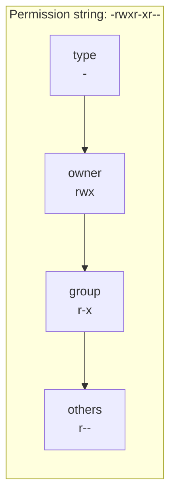
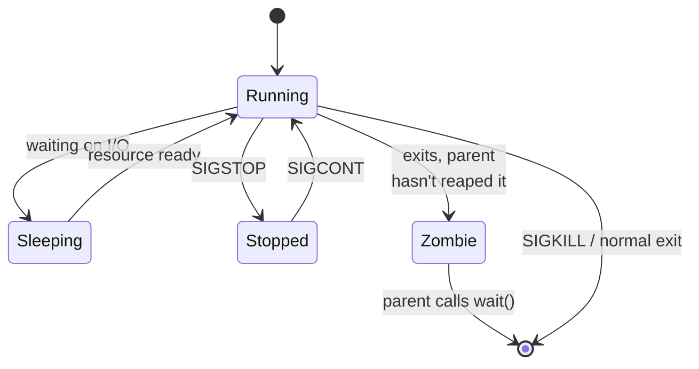

# Linux Basics

> **Linux** is a Unix-like, open-source operating system kernel that powers most servers, cloud infrastructure, and containers, built around a philosophy of small composable command-line tools.

## Why it matters

Almost every backend, DevOps, and SRE role assumes daily comfort with a Linux shell: debugging a hung process, tailing logs, checking disk space, or fixing permissions on a production box. Interviewers ask about Linux basics to confirm you can operate independently in a terminal without hand-holding, and to see whether you understand *why* commands behave the way they do (permission model, process lifecycle, signals) rather than just memorizing flags.

## Navigation and File Commands

- `ls` lists directory contents (`-l` for long format, `-a` for hidden files, `-h` for human-readable sizes).
- `cd` changes the working directory (`cd -` returns to the previous directory, `cd ~` goes home).
- `pwd` prints the current working directory.
- `cp`, `mv`, `rm` copy, move/rename, and delete files (`-r` for recursive, `-i` for confirmation).

```bash
ls -lah /var/log
cd /etc/nginx
pwd
cp -r config/ config.bak/
```

## Searching: grep and find

`grep` searches file **contents** for a pattern; `find` searches the **filesystem tree** for files matching name, type, size, or time criteria. They are frequently piped together.

```bash
# Search recursively for a string, case-insensitive, showing line numbers
grep -rin "connection refused" /var/log/app/

# Find files modified in the last 1 day under /tmp
find /tmp -type f -mtime -1

# Find and delete all .tmp files
find . -name "*.tmp" -exec rm {} \;

# Combine: find all .log files, then grep them for "ERROR"
find . -name "*.log" | xargs grep -l "ERROR"
```

| Tool | Searches | Common flags |
|---|---|---|
| `grep` | Text inside files | `-i` ignore case, `-r` recursive, `-n` line numbers, `-v` invert match, `-E` extended regex |
| `find` | Filesystem metadata (name, path, type, time, size) | `-name`, `-type f/d`, `-mtime`, `-size`, `-exec` |

## File Permissions: rwx and Octal Notation

Every file and directory has three permission sets — **owner (user)**, **group**, and **others** — each with **read (r)**, **write (w)**, and **execute (x)** bits. `ls -l` shows them as a 10-character string, e.g. `-rwxr-xr--`.



Each `rwx` triplet maps to an octal digit by summing bit values: `r=4, w=2, x=1`.

| Symbol | Octal | Meaning on a file | Meaning on a directory |
|---|---|---|---|
| `r--` | 4 | Read file contents | List directory entries |
| `-w-` | 2 | Modify file contents | Create/delete entries (needs `x` too) |
| `--x` | 1 | Execute the file | Enter the directory (`cd` into it) |
| `rwx` | 7 | Read, write, execute | Full access |

So `rwxr-xr--` becomes octal `754` (owner=7, group=5, others=4). Common commands:

```bash
chmod 754 deploy.sh          # set exact permissions via octal
chmod u+x deploy.sh          # symbolic: add execute for owner
chown alice:devops deploy.sh # change owner and group
chown -R www-data:www-data /var/www/app   # recursive
```

## Processes and Signals

Every running program is a **process** with a PID (process ID), a parent PID, and a state (running, sleeping, stopped, zombie). `ps` and `top`/`htop` inspect processes; `kill` sends **signals** to them — it does not necessarily terminate a process, it delivers a message the process (or the kernel, if unhandled) reacts to.

```bash
ps aux | grep nginx      # list processes, filter by name
top                       # live view of CPU/memory usage
kill -15 1234             # SIGTERM: ask process 1234 to terminate gracefully
kill -9 1234              # SIGKILL: force-terminate, cannot be caught or ignored
kill -1 1234               # SIGHUP: often used to reload config
```

| Signal | Number | Meaning | Can be caught/ignored? |
|---|---|---|---|
| `SIGHUP` | 1 | Hangup, often reload config | Yes |
| `SIGINT` | 2 | Interrupt (Ctrl+C) | Yes |
| `SIGTERM` | 15 | Polite request to terminate | Yes |
| `SIGKILL` | 9 | Immediate, forced termination | No |
| `SIGSTOP` | 19 | Pause process | No |



## Pipes and Redirection

Pipes (`|`) connect the standard output of one command to the standard input of the next, letting small tools compose into larger workflows. Redirection (`>`, `>>`, `<`, `2>`) controls where a command's input comes from and where its output/errors go.

```bash
ps aux | grep java | awk '{print $2}'   # pipe: chain commands together

echo "hello" > file.txt      # overwrite file.txt
echo "world" >> file.txt     # append to file.txt
sort < unsorted.txt > sorted.txt   # redirect input and output
command 2> errors.log        # redirect stderr only
command > all.log 2>&1       # redirect stdout and stderr to the same file
```

## Common Interview Questions

**Q: What's the difference between a hard link and a symbolic link?**
A: A hard link is another directory entry pointing to the same inode, so it shares the same data and survives even if the original name is deleted; it can't cross filesystems or link to directories. A symbolic link is a separate file containing a path reference to the target; it can cross filesystems and link to directories, but breaks if the target is moved or deleted.

**Q: How do you find which process is using a specific port?**
A: Use `lsof -i :8080` or `ss -tulpn | grep 8080` (or `netstat -tulpn` on older systems) to see the PID and process name bound to that port.

**Q: What does `chmod 644` mean?**
A: Owner gets read+write (6 = 4+2), group gets read-only (4), others get read-only (4). It's the typical permission set for regular files that shouldn't be executable, like config files.

**Q: What is the difference between SIGTERM and SIGKILL?**
A: SIGTERM (15) is a graceful request that a process can catch, ignore, or use to clean up before exiting. SIGKILL (9) is handled directly by the kernel and forcibly terminates the process immediately, with no chance to clean up.

**Q: Why would `chmod` on a directory need the execute bit, not just read?**
A: The execute bit on a directory allows traversal into it (e.g., `cd` into it or access a file by full path). Without it, you can list names with read permission but cannot actually access or stat the files inside.

**Q: How do you check disk usage and free space?**
A: `df -h` shows filesystem-level free/used space per mount point; `du -sh <dir>` shows the total size of a directory tree; `du -h --max-depth=1` breaks it down by subdirectory.

**Q: What happens to a process's file descriptors and child processes when it receives SIGKILL?**
A: The kernel immediately removes the process; open file descriptors are closed by the kernel, and any child processes become orphans, reparented to init (PID 1) or a subreaper, which is responsible for eventually reaping them.

## Related

- [SQL](sql.md) - another fundamental interview topic often paired with systems questions
- [Networking](networking.md) - complements process/port questions with how services communicate
- [Bash Scripting](bash.md) - builds on pipes, redirection, and command composition covered here
