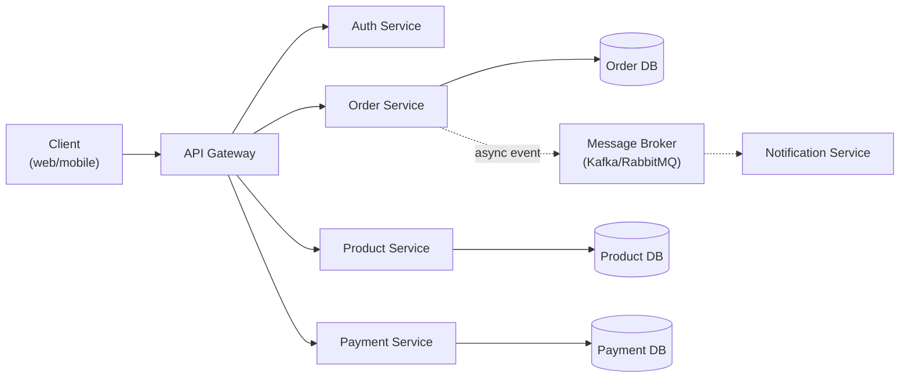
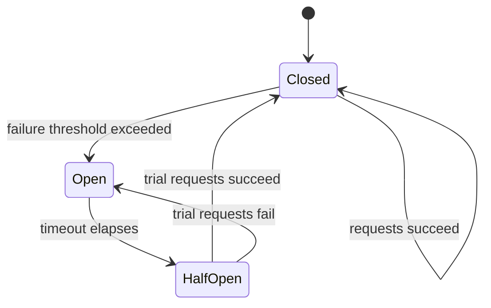
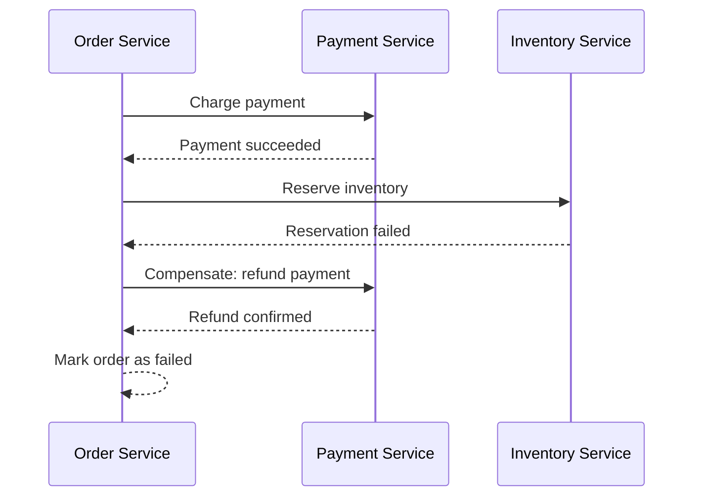

# Microservices Architecture

> **Microservices** is an architectural style where an application is built as a suite of small, independently deployable services, each owning its own data and communicating over the network.

## Why it matters

Microservices questions test whether a candidate can reason about distributed systems trade-offs, not just draw boxes and arrows. Interviewers use this topic to probe how you handle partial failure, data consistency without cross-service transactions, and operational complexity. It's also a common gateway into system design rounds, since most "design X" prompts assume a service-oriented backend.

## Monolith vs Microservices

| Aspect | Monolithic | Microservices |
|--------|-----------|---------------|
| Codebase | Single | Multiple, per service |
| Deployment | Deploy entire app | Deploy services independently |
| Scaling | Scale entire app | Scale individual services |
| Technology | Usually one stack | Polyglot possible |
| Complexity | Simpler initially | Higher operational complexity |
| Team structure | Single team | Team per service (or per few services) |
| Latency | In-process calls | Network hops between services |
| Failure blast radius | One failure can crash the app | Failures can be isolated |

## Topology and the API Gateway Pattern

Clients rarely talk to services directly. An API gateway sits in front, providing a single entry point for routing, auth, rate limiting, and response aggregation.



Gateway responsibilities:
- **Routing** requests to the correct backend service.
- **Authentication** centralized once instead of per service.
- **Rate limiting** to protect services from abuse or overload.
- **Response aggregation** combining calls to multiple services into one response.
- **Protocol translation**, e.g. exposing REST externally while services use gRPC internally.

```java
@GetMapping("/orders/{id}")
public OrderResponse getOrder(@PathVariable String id) {
    Order order = restTemplate.getForObject(
        "http://order-service/orders/" + id, Order.class);
    Product product = restTemplate.getForObject(
        "http://product-service/products/" + order.getProductId(), Product.class);
    return new OrderResponse(order, product);
}
```

## Core Principles

- **Single responsibility**: each service owns one business capability (e.g. Order, Payment, Inventory) and has one reason to change.
- **Autonomy**: independently deployable, owns its own database, owned by one team, makes local decisions.
- **Observability**: centralized logging, distributed tracing, metrics, and health checks are non-negotiable at scale.
- **Resilience**: services must expect and tolerate failures in their dependencies via circuit breakers, retries, and fallbacks.

## Communication Patterns

| | Synchronous (REST/gRPC) | Asynchronous (events/queues) |
|---|---|---|
| Coupling | Tighter, caller waits | Looser, fire-and-forget |
| Consistency | Immediate | Eventual |
| Failure behavior | Can cascade | Isolated, retried later |
| Debugging | Easier to trace | Harder to trace end-to-end |
| Typical use | Request/response, aggregation | Notifications, workflows, decoupled side effects |

## Service Discovery

Because service instances scale up/down and move across hosts, clients can't rely on static addresses.

- **Client-side discovery**: the client queries a service registry directly and picks an instance.
- **Server-side discovery**: a load balancer queries the registry and routes on the client's behalf.
- Common tools: Consul, Eureka, etcd, and Kubernetes' built-in service discovery/DNS.

## Circuit Breaker Pattern

A circuit breaker prevents a struggling downstream service from taking down its callers by failing fast instead of piling up slow, doomed requests.



```java
@CircuitBreaker(name = "orderService", fallbackMethod = "fallback")
public Order getOrder(String id) {
    return restTemplate.getForObject("http://order-service/orders/" + id, Order.class);
}

public Order fallback(String id, Exception e) {
    return cache.getOrDefault(id, Order.empty());
}
```

Pair this with **retry with exponential backoff** (e.g. 1s, 2s, 4s) for transient failures, and a **timeout** so a slow dependency never blocks a thread indefinitely.

## Data Consistency: the Saga Pattern

With a database per service, cross-service ACID transactions aren't available. A saga runs a sequence of local transactions, each with a compensating action if a later step fails.



- **Orchestration-based saga**: a central coordinator (e.g. Order Service) explicitly calls each participant and triggers compensations on failure. Easier to follow and test, but the orchestrator becomes a central piece of logic.
- **Choreography-based saga**: each service reacts to events emitted by others (`OrderCreated` → `PaymentProcessed` → `ItemReserved` → `OrderConfirmed`) with no central coordinator. More decoupled, but harder to trace the overall flow.

## Monitoring and Observability

- **Distributed tracing**: propagate a trace ID across service calls so a request's full path can be reconstructed (tools: Jaeger, Zipkin).
- **Centralized logging**: ship logs from all services to a common store for correlation (e.g. the ELK stack).
- **Metrics**: track request rate, error rate, latency percentiles, and resource usage (e.g. Prometheus/Grafana).

## Challenges

1. **Distributed systems complexity** - network latency, partial failures, message ordering.
2. **Data consistency** - no cross-service ACID transactions; sagas add complexity.
3. **Testing** - integration and contract testing across service boundaries is harder than unit testing a monolith.
4. **Deployment coordination** - versioning and backward compatibility across many services.
5. **Debugging** - a single request may span many services; tracing is essential.
6. **Organizational maturity** - requires strong DevOps, ownership, and on-call practices.

## When to Use Microservices

**Good fit**: large, complex domains; multiple teams; components with very different scaling needs; need for independent deployability or polyglot tech.

**Poor fit**: small applications, a single team, systems requiring strict cross-entity ACID transactions, latency-critical systems, or early-stage products where the domain boundaries aren't clear yet - a monolith is usually the better starting point.

## Common Interview Questions

**Q: What are the main trade-offs of microservices vs a monolith?**
A: Microservices gain independent deployability, scalability, and technology flexibility, at the cost of network latency, distributed data consistency, and operational complexity. A monolith is simpler to build and test but scales and deploys as one unit.

**Q: How do you keep data consistent across services without distributed transactions?**
A: Use the saga pattern - a sequence of local transactions with compensating actions - and accept eventual consistency, often communicated via events and idempotent handlers.

**Q: Explain the circuit breaker pattern and when you'd use it.**
A: It's a state machine (closed, open, half-open) that stops calling a failing dependency once a failure threshold is hit, failing fast instead of piling up timeouts. After a cooldown it allows a few trial requests through; if they succeed it closes again, otherwise it reopens. Use it for any synchronous call to a dependency that can be slow or unavailable.

**Q: What's the difference between orchestration and choreography in the saga pattern?**
A: Orchestration uses a central coordinator that explicitly directs each step and compensation, which is easier to reason about but couples the coordinator to every participant. Choreography has services react to each other's events with no central coordinator, which is more decoupled but harder to trace and debug.

**Q: How would you handle service-to-service authentication?**
A: Common approaches are mutual TLS between services, or short-lived tokens (e.g. JWT) issued by an identity provider and validated at each service or the gateway, often combined with a service mesh for transparent enforcement.

**Q: How do you debug an issue that spans multiple services?**
A: Propagate a correlation/trace ID through every call, use distributed tracing (Jaeger/Zipkin) to visualize the request path, and correlate logs across services in a centralized log store rather than SSH-ing into individual hosts.

**Q: When should you not use microservices?**
A: When the team is small, the domain boundaries aren't well understood yet, or the system needs strict cross-entity transactions and low, predictable latency. Starting with a well-structured monolith and extracting services later is often lower risk.

## Related

- [REST APIs](../api/rest.md) - the most common synchronous protocol between services and gateways
- [Kafka](../api/kafka.md) - a widely used message broker for asynchronous, event-driven communication
- [ACID Transactions](../database/acid.md) - the consistency guarantees sagas trade away for scalability
- [Scalability](../system-design/scalability.md) - broader system design patterns that pair with a microservices topology
