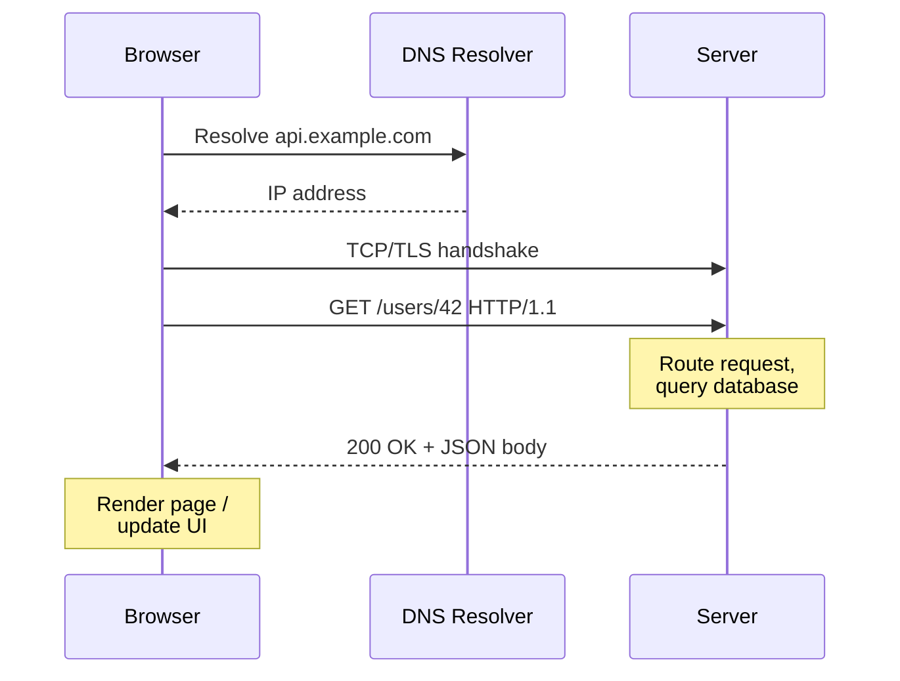
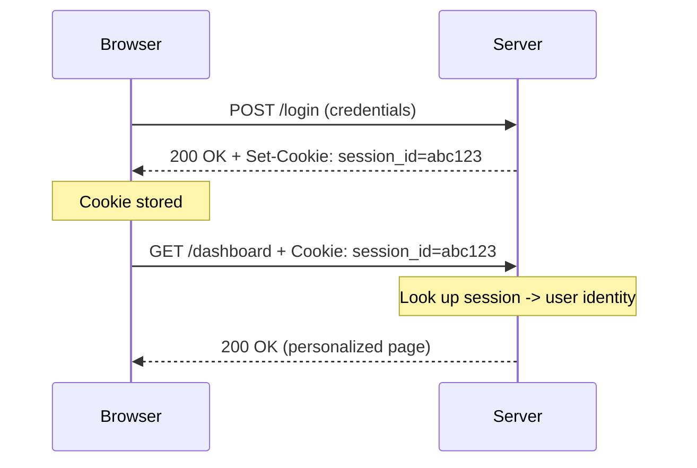

# HTTP — Hypertext Transfer Protocol

> HTTP is a **stateless**, text-based (in HTTP/1.1) request-response protocol that lets clients (browsers, apps) ask servers for resources and receive structured replies.

## Why it matters

Almost every web and API interview eventually touches HTTP: methods and idempotency decide how APIs are designed safely, status codes are the first thing you check when debugging a broken request, and statelessness explains why cookies, sessions, and tokens exist at all. Interviewers also use HTTP/1.1 vs HTTP/2 vs HTTP/3 to see whether you understand what's actually happening below the API layer.

## Request/response anatomy

An HTTP message has the same shape in both directions: a start line, headers, a blank line, and an optional body.

```http
GET /users/42 HTTP/1.1
Host: api.example.com
Accept: application/json
Authorization: Bearer <token>

```

```http
HTTP/1.1 200 OK
Content-Type: application/json
Content-Length: 57

{"id": 42, "name": "Ada Lovelace", "role": "engineer"}
```

- **Request line** — method, path (+ query string), protocol version.
- **Status line** — protocol version, status code, reason phrase.
- **Headers** — key-value metadata (content type, caching, auth, cookies).
- **Body** — optional payload; present on responses and on requests like `POST`/`PUT`/`PATCH`.

## Request flow: browser to server



The connection setup (TCP handshake, and TLS if HTTPS) happens once and can be reused for multiple requests — see [TCP](tcp.md) and [SSL/TLS](ssl.md).

## Methods and idempotency

| Method | Purpose | Has body | Safe | Idempotent |
|---|---|---|---|---|
| GET | Retrieve a resource | No | Yes | Yes |
| POST | Create a resource / trigger an action | Yes | No | No |
| PUT | Replace a resource entirely | Yes | No | Yes |
| PATCH | Partially update a resource | Yes | No | No* |
| DELETE | Remove a resource | No (usually) | No | Yes |

- **Safe** means the method doesn't change server state (read-only) — GET should never have side effects.
- **Idempotent** means calling it once or N times produces the same server state. `PUT /users/42 {"name":"Ada"}` sets the name to Ada regardless of how many times it's sent. `POST /users` typically creates a new resource each call, so it's not idempotent unless the API adds its own deduplication (e.g. an idempotency key).
- `PATCH` is *usually* not idempotent (e.g. "increment counter by 1"), but a well-designed PATCH that sets an absolute value can be.
- Idempotency matters for retries: a client can safely retry a `PUT` or `DELETE` after a timeout without fear of duplicating the effect, but retrying a plain `POST` risks double-creation.

## Status code classes

| Class | Meaning | Common codes |
|---|---|---|
| 1xx | Informational | 100 Continue, 101 Switching Protocols |
| 2xx | Success | 200 OK, 201 Created, 204 No Content |
| 3xx | Redirection | 301 Moved Permanently, 302 Found, 304 Not Modified |
| 4xx | Client error | 400 Bad Request, 401 Unauthorized, 403 Forbidden, 404 Not Found, 409 Conflict, 429 Too Many Requests |
| 5xx | Server error | 500 Internal Server Error, 502 Bad Gateway, 503 Service Unavailable |

- **401 vs 403** — 401 means "you're not authenticated, prove who you are"; 403 means "I know who you are, but you're not allowed."
- **502 vs 503** — 502 means an upstream server returned an invalid response (a proxy/gateway problem); 503 means the server is temporarily unable to handle the request (overloaded or down for maintenance).
- **304 Not Modified** — sent when a client's cached copy (validated via `ETag`/`If-None-Match` or `Last-Modified`) is still valid, saving a full response body.

## Headers

Headers carry metadata separately from the payload. Common categories:

- **General** — `Date`, `Connection`, `Cache-Control`.
- **Request** — `Host` (required in HTTP/1.1), `User-Agent`, `Accept`, `Authorization`.
- **Response** — `Content-Type`, `Content-Length`, `Set-Cookie`, `Location` (used with redirects).
- **Caching** — `Cache-Control`, `ETag`, `Last-Modified`, `Expires`.
- **CORS** — `Access-Control-Allow-Origin` and related headers control cross-origin requests from browsers.

## Cookies, sessions, and statelessness

HTTP itself is **stateless** — each request is independent; the server retains no memory of prior requests by default. To build stateful experiences (logins, shopping carts) on top of a stateless protocol:

1. Server sends `Set-Cookie: session_id=abc123; HttpOnly; Secure; SameSite=Lax` in a response.
2. Browser stores the cookie and automatically attaches `Cookie: session_id=abc123` on every subsequent request to that domain.
3. Server looks up `abc123` in a session store (memory, Redis, DB) to recall who the user is.



- **HttpOnly** prevents JavaScript from reading the cookie (mitigates XSS token theft).
- **Secure** ensures the cookie is only sent over HTTPS.
- **SameSite** restricts when the cookie is sent on cross-site requests (mitigates CSRF).
- Alternative to server-side sessions: **stateless tokens** (e.g. JWTs) where the token itself carries the claims, so the server doesn't need a session store — at the cost of harder revocation.

## HTTP/1.1 vs HTTP/2 vs HTTP/3

| | HTTP/1.1 | HTTP/2 | HTTP/3 |
|---|---|---|---|
| Transport | TCP | TCP | QUIC (over UDP) |
| Format | Text-based | Binary framing | Binary framing |
| Multiplexing | No (head-of-line blocking, needs multiple connections) | Yes (multiple streams per connection) | Yes (streams independent at transport layer) |
| Head-of-line blocking | Yes (at app layer) | Reduced at app layer, still possible at TCP layer | Eliminated (QUIC streams don't block each other) |
| Header compression | No | HPACK | QPACK |
| Server push | No | Yes (largely deprecated in practice) | Yes |
| Connection setup | TCP handshake (+TLS) | TCP handshake (+TLS) | QUIC handshake combines transport + TLS 1.3 setup |

- HTTP/1.1 typically needs multiple parallel TCP connections per origin to work around head-of-line blocking, since each connection can only process one request at a time (without pipelining, which is rarely used).
- HTTP/2 multiplexes many requests over a single TCP connection using streams, cutting connection overhead — but a single lost TCP packet still blocks *all* streams until retransmitted, since TCP itself delivers bytes in order (see [TCP](tcp.md)).
- HTTP/3 replaces TCP with **QUIC**, which multiplexes streams at the transport layer, so a lost packet only blocks the stream it belongs to, not the whole connection.

## Common Interview Questions

**Q: What does it mean that HTTP is stateless, and how do we work around it?**
A: The protocol doesn't retain any memory between requests — each one is handled independently. Applications add state on top using cookies plus server-side sessions, or stateless mechanisms like tokens (JWTs) that carry identity/claims in the request itself.

**Q: Is PUT idempotent? Is POST?**
A: PUT is idempotent — sending the same PUT multiple times leaves the resource in the same final state. POST is generally not idempotent, since each call is often interpreted as "create a new thing," resulting in duplicates unless the API adds explicit deduplication like an idempotency key.

**Q: What's the difference between 401 and 403?**
A: 401 Unauthorized means the request lacks valid authentication credentials. 403 Forbidden means the credentials were understood but the authenticated user doesn't have permission to access the resource.

**Q: Why does HTTP/2 use a single TCP connection instead of the multiple connections common in HTTP/1.1?**
A: HTTP/2 multiplexes many logical streams over one connection using binary framing, avoiding the overhead of opening several TCP (and TLS) connections and enabling header compression (HPACK) across requests, while still solving the app-layer head-of-line blocking that plagued HTTP/1.1.

**Q: Why does HTTP/3 use QUIC over UDP instead of TCP?**
A: TCP enforces strict in-order byte delivery, so one lost packet blocks every multiplexed stream on the connection. QUIC implements its own reliability and multiplexing over UDP so streams are independent — a lost packet only stalls the stream it belongs to, and QUIC also folds the transport and TLS 1.3 handshakes together for faster connection setup.

**Q: What's the difference between a cookie and a session?**
A: A cookie is the small piece of data (like a session ID) stored in the browser and sent with each request. A session is the server-side state (user identity, cart contents, etc.) that the cookie's ID is used to look up. The cookie is the pointer; the session is the data it points to.

**Q: When would you use PATCH instead of PUT?**
A: Use PUT when the client sends the complete replacement representation of a resource. Use PATCH when the client sends only the fields that changed, letting the server merge them into the existing resource.

## Related

- [TCP](tcp.md) - the transport protocol HTTP/1.1 and HTTP/2 run on
- [SSL/TLS](ssl.md) - the encryption layer behind HTTPS
- [OSI Model](osi.md) - HTTP sits at Layer 7 (Application)
