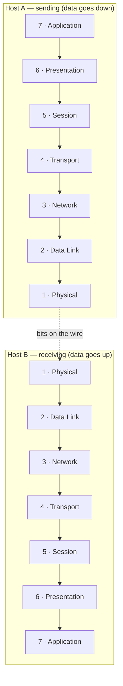
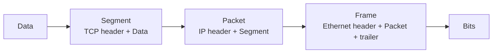

# OSI Model

> The **Open Systems Interconnection (OSI)** model is a 7-layer conceptual framework that standardizes how data moves across a network. Each layer has one job and talks only to the layers directly above and below it.

## Why it matters

The OSI model is the vocabulary of networking. Interviewers use it to see whether you can **place a protocol at the right layer** ("where does TLS sit?"), reason about **where a failure happens**, and explain **encapsulation** — how a message gets wrapped in headers on the way down and unwrapped on the way up.

## The 7 layers

Data flows **down** the stack on the sender (each layer adds a header — *encapsulation*) and **up** the stack on the receiver (each layer strips its header — *decapsulation*).

| # | Layer | Job | PDU | Examples |
|---|-------|-----|-----|----------|
| 7 | Application | Interface to the user/app | Data | HTTP, DNS, SMTP, FTP |
| 6 | Presentation | Encoding, encryption, compression | Data | TLS, JPEG, ASCII |
| 5 | Session | Open/close & manage sessions | Data | RPC, sockets |
| 4 | Transport | End-to-end delivery, reliability | Segment | **TCP**, UDP |
| 3 | Network | Logical addressing & routing | Packet | **IP**, ICMP, routers |
| 2 | Data Link | Node-to-node framing on a link | Frame | Ethernet, MAC, switches |
| 1 | Physical | Raw bits over a medium | Bit | Cables, radio, hubs |

> **Mnemonic (top→bottom):** *All People Seem To Need Data Processing.*

## Encapsulation

As a message descends the stack, each layer wraps the data from the layer above:

## OSI vs TCP/IP model

The real internet runs the leaner **TCP/IP** model; OSI is the teaching reference.

| OSI (7 layers) | TCP/IP (4 layers) |
|---|---|
| Application + Presentation + Session | Application |
| Transport | Transport |
| Network | Internet |
| Data Link + Physical | Network Access (Link) |

## Common Interview Questions

**Q: Which layer does a router operate at? A switch?**
A: A router works at **Layer 3 (Network)** — it forwards packets using IP addresses. A traditional switch works at **Layer 2 (Data Link)** using MAC addresses. (L3 switches blur this line.)

**Q: Where does TLS/SSL sit?**
A: Conventionally described at **Layer 6 (Presentation)** because it handles encryption, though in the TCP/IP model it sits between the application and transport layers.

**Q: What's the difference between a packet and a frame?**
A: A **packet** is the Layer 3 PDU (IP header + data). A **frame** is the Layer 2 PDU that encapsulates the packet with a MAC header/trailer for one physical hop.

**Q: A user can't load a website. How do you use the layers to debug?**
A: Work bottom-up: is the link up (L1/L2)? Can you reach the IP / does routing work — `ping` (L3)? Is the port open — TCP connect (L4)? Does DNS resolve and does the app respond — `curl` (L7)?

## Related

- [TCP](tcp.md) — the dominant Layer 4 protocol
- [HTTP](http.md) — Layer 7 application protocol
- [SSL/TLS](ssl.md) — encryption at the presentation boundary
