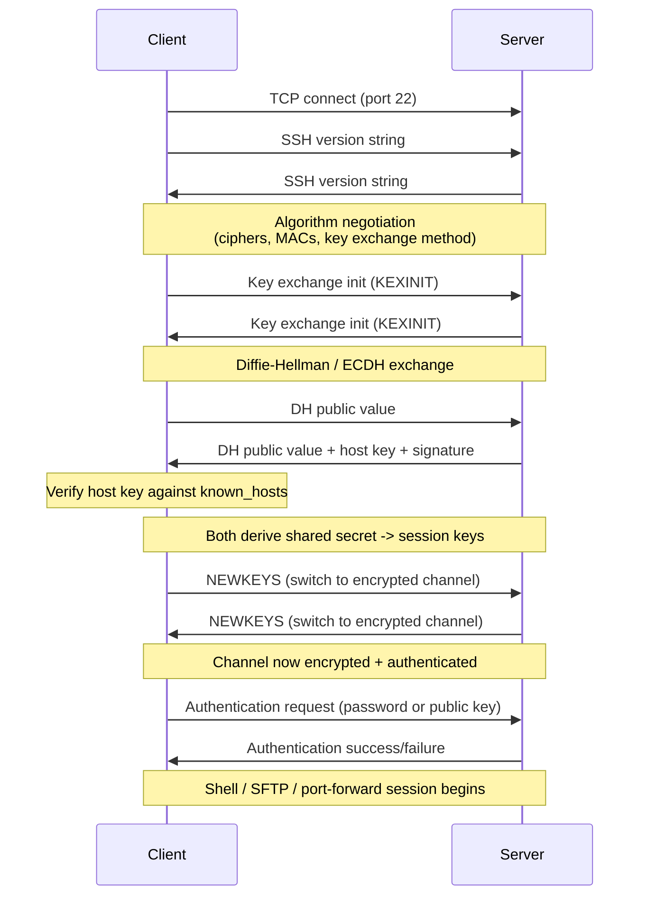

# SSH (Secure Shell)

> **SSH** is a cryptographic network protocol for operating network services securely over an unsecured network, most commonly used for remote shell access, secure file transfer, and port forwarding.

## Why it matters

SSH is the backbone of secure remote administration, CI/CD deploy pipelines, and Git over SSH, so interviewers use it to probe whether you understand applied cryptography rather than just memorized commands. It's a great vehicle for testing knowledge of asymmetric vs symmetric encryption, key exchange, and trust-on-first-use models, all of which show up again in TLS and other secure protocols. A candidate who can explain *why* SSH is secure (not just how to use it) demonstrates real security fundamentals.

## What problem SSH solves

Before SSH, tools like `telnet`, `rlogin`, and `rsh` sent commands, output, and even passwords in plaintext. Anyone sniffing the network could capture credentials or session data. SSH replaces these with an encrypted, authenticated channel that provides:

- **Confidentiality** - traffic is encrypted with a symmetric cipher negotiated per session.
- **Integrity** - a MAC (message authentication code) detects tampering.
- **Authentication** - both the server's identity and the client's identity are verified cryptographically.

## Why asymmetric keys establish a symmetric session key

Asymmetric (public-key) cryptography is computationally expensive and doesn't scale well to encrypting large amounts of data. Symmetric ciphers (like AES or ChaCha20) are fast but need both sides to share a secret key safely. SSH gets the best of both:

1. Use asymmetric key exchange (traditionally Diffie-Hellman, now often elliptic-curve variants like ECDH or Curve25519) so client and server can agree on a shared secret **without ever transmitting it** over the wire.
2. Derive symmetric session keys from that shared secret for the actual bulk data encryption (one set of keys per direction).
3. Use the server's host key pair only to *authenticate* the key exchange (sign it), not to encrypt the whole session.

This hybrid approach is the same pattern used by TLS/HTTPS.

## The SSH connection handshake



Key point for interviews: **host authentication happens during key exchange** (so the client can trust it isn't talking to a man-in-the-middle), while **user/client authentication happens afterward**, inside the already-encrypted channel.

## Password vs public-key authentication

| Aspect | Password authentication | Public-key authentication |
|---|---|---|
| What's sent to server | The password itself (over the encrypted channel) | A signature proving possession of the private key; the private key never leaves the client |
| Server-side storage | Hashed password (or PAM/LDAP lookup) | Client's public key in `authorized_keys` |
| Brute-force risk | Vulnerable to online guessing if rate limiting is weak | Effectively immune; private key can't be guessed |
| Phishing / replay risk | Password can be captured if client is compromised or tricked | Private key can be protected by a passphrase and never transmitted |
| Automation friendliness | Poor (needs interactive input or stored secrets) | Excellent (used heavily in CI/CD, `git`, automated deploys) |
| Best practice | Disable in production servers (`PasswordAuthentication no`) | Preferred; use `ssh-keygen`, protect private keys with a passphrase and/or an agent |

Public-key auth works via a challenge-response: the server sends a challenge (or the client signs session-specific data), and the client signs it with the private key. The server verifies the signature using the public key it already has on file - the private key is never sent anywhere.

## known_hosts and host verification

SSH's server authentication model is **trust-on-first-use (TOFU)**, not a certificate authority hierarchy like TLS/HTTPS normally uses:

- The first time you connect to a host, SSH shows the host key's fingerprint and asks you to confirm it.
- If accepted, the host's public key is stored in `~/.ssh/known_hosts`.
- On every future connection, the server's presented host key is compared against the stored entry.
- If the key doesn't match, SSH refuses to connect and warns loudly - this is the primary defense against man-in-the-middle attacks on subsequent connections.

```
# Example known_hosts entry
github.com ssh-ed25519 AAAAC3NzaC1lZDI1NTE5AAAAIOMqqnkVzrm0SdG6UOoqKLsabgH5C9okWi0dh2l9GKJl
```

This TOFU model means the very first connection is only as trustworthy as the channel used to verify the fingerprint out-of-band (e.g., comparing against a fingerprint published on the vendor's site). Organizations can strengthen this using SSH certificate authorities (`ssh-keygen -s`) so hosts and users present certificates signed by a trusted CA instead of relying on TOFU per-host.

## SSH agent and key management

An `ssh-agent` holds decrypted private keys in memory for the duration of a session so you aren't prompted for a passphrase on every connection. `ssh-add` loads keys into the agent, and `ssh -A` (agent forwarding) lets a remote host use your local agent to authenticate onward - convenient, but it expands the trust boundary, since a compromised intermediate host could potentially request signatures through your forwarded agent.

## Common Interview Questions

**Q: Why does SSH use both asymmetric and symmetric cryptography?**
A: Asymmetric crypto (Diffie-Hellman/ECDH) is used during the handshake to safely establish a shared secret over an untrusted network without ever transmitting it, and to authenticate the host via its key pair. That shared secret then derives fast symmetric session keys (AES, ChaCha20, etc.) used to encrypt the actual traffic, since asymmetric encryption is too slow for bulk data.

**Q: What's the difference between host authentication and user authentication in SSH?**
A: Host authentication happens during key exchange, where the client verifies the server's host key (checked against `known_hosts`) to confirm it's talking to the right server and not a man-in-the-middle. User authentication happens afterward, inside the already-encrypted channel, using a password or a public/private key pair to prove the client's identity.

**Q: Why is public-key authentication generally preferred over passwords?**
A: The private key never leaves the client, so there's nothing for an attacker to steal from the server even if `authorized_keys` (public keys) leaks. It also resists brute-force and credential-stuffing attacks, and is well suited to automation since it doesn't require typing a secret interactively.

**Q: What happens if a host key in known_hosts doesn't match what the server presents?**
A: SSH refuses the connection and displays a prominent warning about a possible man-in-the-middle attack or that the host key has changed, requiring the user to manually verify and remove the stale entry before proceeding. This is intentionally disruptive to prevent silently connecting to an impersonating server.

**Q: What is trust-on-first-use (TOFU) and what's its weakness?**
A: TOFU means the client accepts and stores a server's host key the first time it connects, trusting that no attacker was in the middle during that initial connection. Its weakness is that the very first connection has no independent verification unless the fingerprint is checked out-of-band, so a well-timed MITM attack on that first connection could go undetected.

**Q: How does SSH port forwarding work at a high level?**
A: SSH can tunnel arbitrary TCP traffic through the encrypted channel: local forwarding (`-L`) exposes a remote service on a local port, remote forwarding (`-R`) exposes a local service on the remote side, and dynamic forwarding (`-D`) turns the SSH client into a SOCKS proxy. All forwarded traffic rides inside the same encrypted, authenticated SSH connection.

**Q: What's the risk with SSH agent forwarding?**
A: Forwarding your agent to a remote host lets that host request signatures from your local private keys without ever seeing the keys themselves, but if that remote host is compromised, an attacker on it can use your forwarded agent to authenticate to other systems as you while the session is active.

## Related

- [TLS](tls.md) - shares the same asymmetric-to-symmetric handshake pattern used to secure HTTPS
- [DNS](dns.md) - name resolution that typically happens before the TCP connect in the SSH handshake
- [HTTP/HTTPS](http.md) - contrast SSH's TOFU trust model with the CA-based trust model of HTTPS
