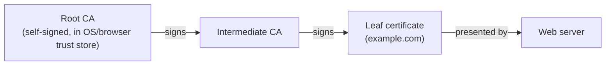
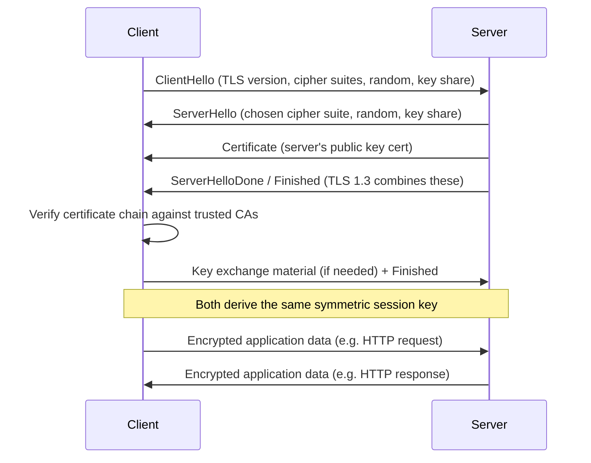

# SSL/TLS

> **TLS** (Transport Layer Security, the modern successor to SSL) is a cryptographic protocol that provides encryption, integrity, and authentication for data sent over a network.

## Why it matters

TLS underpins HTTPS, and interviewers use it to check whether you understand practical applied cryptography, not just buzzwords. It touches on symmetric vs asymmetric crypto, public key infrastructure, and performance trade-offs, all of which come up when debugging certificate errors, designing secure APIs, or explaining why a handshake adds latency. A candidate who can walk through the handshake step by step usually understands the underlying security model well.

## What TLS actually provides

TLS gives you three distinct guarantees, and it's worth naming them separately because each is achieved by a different mechanism:

| Property | What it means | How it's achieved |
|---|---|---|
| Confidentiality | Eavesdroppers can't read the data | Symmetric encryption (e.g. AES-GCM, ChaCha20-Poly1305) of the bulk data |
| Integrity | Data can't be tampered with in transit | MAC / AEAD authentication tags on every record |
| Authentication | You're talking to who you think you are | X.509 certificates signed by a trusted Certificate Authority (CA), verified with asymmetric crypto |

Note: "SSL" (SSL 2.0/3.0) is the deprecated predecessor; "TLS" (1.0 through 1.3) is the actively used protocol. In casual conversation people still say "SSL certificate" or "SSL/TLS" interchangeably, but SSL itself should not be used in production today.

## Asymmetric key exchange + symmetric bulk encryption

TLS combines two families of cryptography because each is good at a different job:

- **Asymmetric (public-key) cryptography** (RSA, ECDHE) is used only briefly, during the handshake, to authenticate the server (and optionally the client) and to establish a shared secret. It's computationally expensive and doesn't scale to encrypting megabytes of traffic.
- **Symmetric cryptography** (AES, ChaCha20) is fast and is used for the actual application data once both sides share a secret key.

This hybrid approach is the same pattern used in most real-world crypto systems: use asymmetric crypto to solve the "how do two strangers agree on a secret over an insecure channel" problem, then switch to cheap symmetric crypto for volume.

```text
Handshake (asymmetric):  authenticate server + derive shared secret
Record layer (symmetric): encrypt/decrypt every HTTP request/response with that secret
```

## Certificates and Certificate Authorities

A certificate binds a public key to an identity (a domain name) and is digitally signed by a CA. The client trusts the certificate because it trusts the CA that signed it, forming a chain of trust:



Key points interviewers probe:
- The browser/OS ships with a trust store of root CA public keys; anything chaining back to one of those is trusted.
- The server sends its leaf certificate plus intermediate certificates; the client validates the chain, checks the expiry date, checks the hostname matches the certificate's Subject Alternative Names, and checks it hasn't been revoked (via CRL or OCSP).
- Certificate ownership proves control of the domain (or organization, for EV certs) — it does not prove the site is trustworthy content, only that the connection is to whoever holds that domain's private key.

## The TLS handshake

The handshake's job is to agree on a cipher suite, authenticate the server, and derive a shared symmetric key, all before any application data is sent.



At a high level:
1. **ClientHello**: client proposes TLS version, supported cipher suites, a random value, and (in 1.3) a guessed key share.
2. **ServerHello + Certificate**: server picks the cipher suite, sends its certificate chain and its own key share.
3. **Verification**: client validates the certificate chain, hostname, and expiry.
4. **Key derivation**: both sides use the exchanged key shares (via Diffie-Hellman, typically ECDHE) plus the random values to derive the same shared secret, without ever transmitting it.
5. **Finished**: both sides send a MAC over the handshake transcript to confirm nothing was tampered with, then switch to symmetric encryption for all further traffic.

## TLS 1.2 vs TLS 1.3

| Aspect | TLS 1.2 | TLS 1.3 |
|---|---|---|
| Handshake round trips | 2 round trips (full handshake) | 1 round trip; 0-RTT possible for resumed sessions |
| Key exchange | RSA or (EC)DHE, negotiated | Only (EC)DHE — forward secrecy is mandatory |
| Cipher suites | Large legacy list, including weak/static RSA options | Small, curated list of modern AEAD ciphers only |
| Handshake confidentiality | Certificate sent in plaintext | Certificate encrypted after the first flight |
| Static RSA key exchange | Allowed (no forward secrecy) | Removed entirely |

The practical takeaway: TLS 1.3 is faster (fewer round trips) and stricter (drops legacy weak algorithms), which is why it's the recommended default wherever supported.

## Common Interview Questions

**Q: Why does TLS use both asymmetric and symmetric encryption instead of just one?**
A: Asymmetric crypto solves key distribution (no shared secret needed in advance) but is too slow for bulk data. Symmetric crypto is fast but requires both parties to already share a key. TLS uses asymmetric crypto during the handshake to establish a shared secret, then switches to symmetric crypto for the actual data.

**Q: What's the difference between encryption and a digital signature in this context?**
A: Encryption (with the server's public key, or via a derived symmetric key) keeps data confidential. A digital signature, used on certificates, proves the certificate content hasn't been altered and was issued by a specific CA holding the corresponding private key. Signatures give authenticity/integrity, not confidentiality.

**Q: What happens if a certificate is expired or the hostname doesn't match?**
A: The client should abort the handshake and the browser will show a security warning. The connection can technically still proceed if the user overrides it, but that defeats the authentication guarantee TLS is meant to provide.

**Q: What is a Certificate Authority and why do we trust it?**
A: A CA is a trusted third party that verifies domain (or organization) ownership and signs certificates with its private key. We trust it because its root certificate is pre-installed in the OS/browser trust store, and that trust is transitively extended to every certificate it signs.

**Q: What is forward secrecy and why does TLS 1.3 require it?**
A: Forward secrecy means that even if a server's long-term private key is later compromised, past recorded sessions can't be decrypted, because each session used an ephemeral key derived via Diffie-Hellman that was discarded afterward. TLS 1.3 mandates ephemeral (EC)DHE key exchange, removing static RSA key exchange, which lacked this property.

**Q: Can TLS be used without certificates?**
A: Yes, with self-signed certificates or anonymous Diffie-Hellman, but then there's no third-party authentication, only encryption and integrity. This is why browsers warn on self-signed certs — you get confidentiality but not verified identity.

**Q: Where does TLS sit in the network stack, and what does it protect?**
A: TLS sits between the transport layer (TCP) and the application layer (HTTP, SMTP, etc.), so it encrypts the application payload but exposes IP addresses and TCP/port metadata to network observers. This is why HTTPS traffic is still visible at the IP level even though the request content is encrypted.

## Related

- [TCP](tcp.md) - the transport protocol TLS runs on top of
- [HTTP](http.md) - the protocol most commonly secured by TLS to form HTTPS
- [OSI Model](osi.md) - where TLS sits relative to transport and application layers
- [SSH](ssh.md) - another protocol using similar public-key handshake concepts for secure shell access
