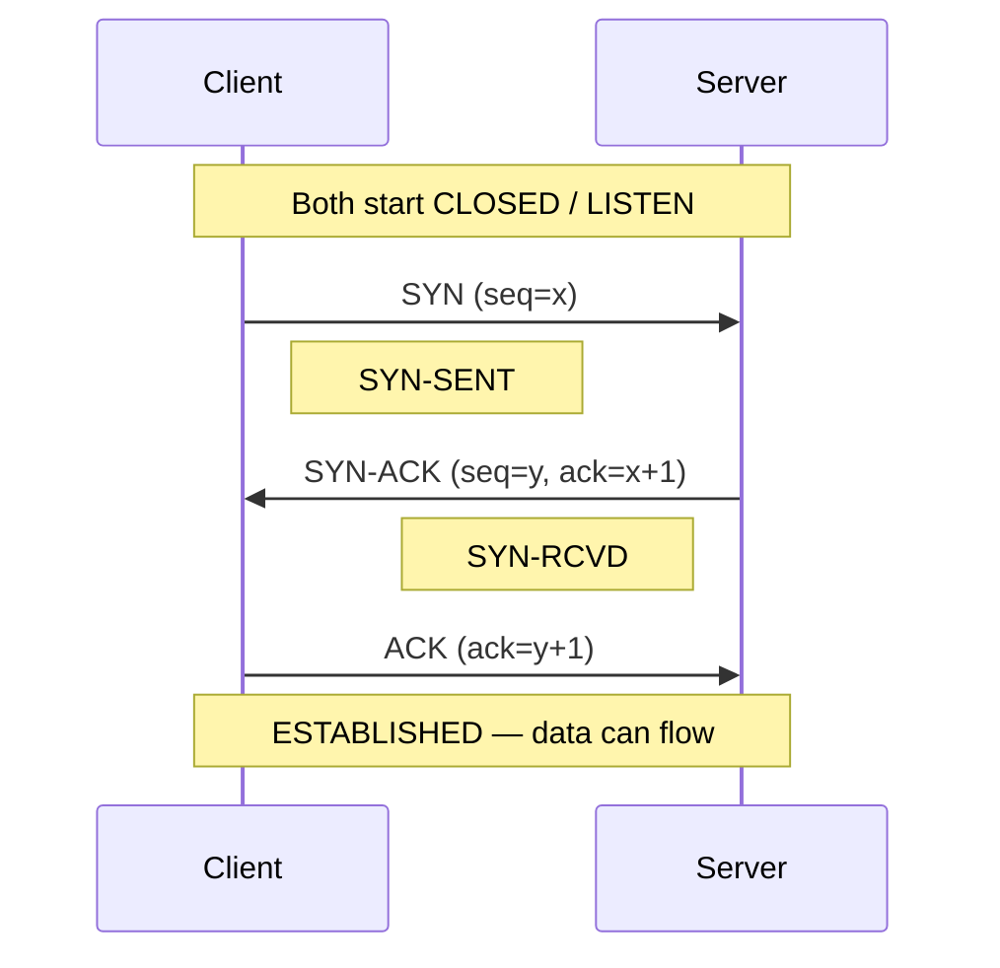
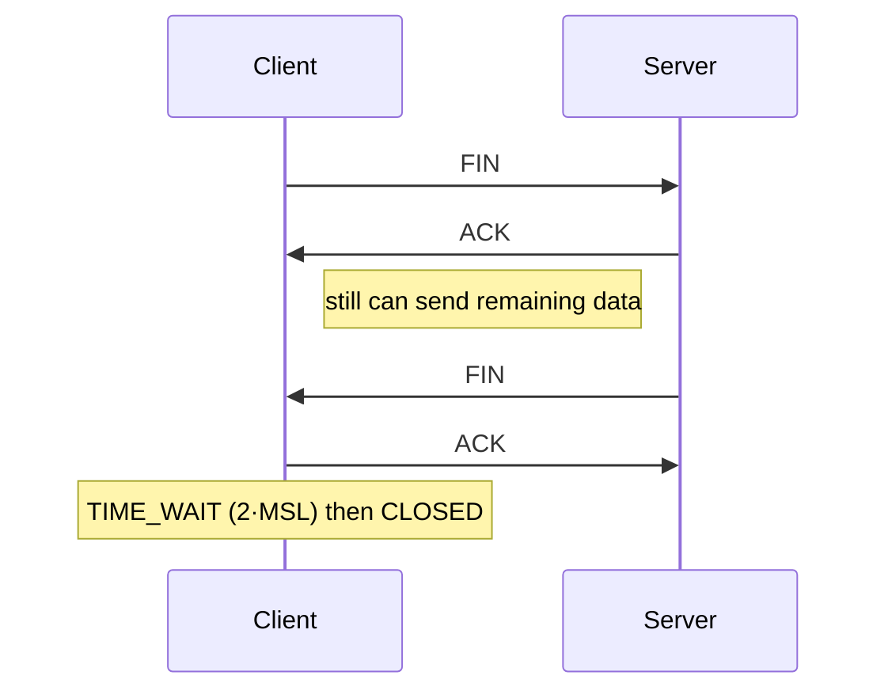
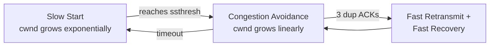

# TCP — Transmission Control Protocol

> TCP is a **connection-oriented**, **reliable**, **ordered**, byte-stream transport protocol. It guarantees that every byte you send arrives, exactly once, in order — at the cost of extra round-trips and state.

## Why it matters

Most of the internet you interact with (HTTP/1.1 and HTTP/2, TLS, SSH, SMTP, database connections) runs on TCP. Interviewers use TCP to probe whether you understand **reliability over an unreliable network** — how ordering, retransmission, and flow/congestion control are layered on top of raw IP packets.

## TCP vs UDP

| | TCP | UDP |
|---|---|---|
| Connection | Connection-oriented (handshake) | Connectionless |
| Reliability | Guaranteed delivery + retransmission | Best-effort, no guarantee |
| Ordering | In-order (sequence numbers) | No ordering |
| Overhead | Higher (20+ byte header, state) | Lower (8-byte header) |
| Speed | Slower to start (RTTs) | Faster, no setup |
| Use cases | Web, file transfer, email, DB | Video/voice, gaming, DNS |

## The 3-way handshake (connection setup)

Before any data flows, both sides synchronize sequence numbers. This costs **one round-trip** before the first byte of data.

- **SYN** — client picks an initial sequence number `x` and asks to synchronize.
- **SYN-ACK** — server acknowledges `x`, sends its own initial sequence number `y`.
- **ACK** — client acknowledges `y`. Connection is now `ESTABLISHED`.

## The 4-way teardown (connection close)

Because TCP is full-duplex, each direction is closed independently.

> **Interview favorite — why `TIME_WAIT`?** The side that closes first waits ~2×MSL (max segment lifetime) so any delayed duplicate segments die out and a late `FIN` can be re-acknowledged, preventing a stale connection from corrupting a new one on the same ports.

## How TCP stays reliable

- **Sequence & acknowledgement numbers** — every byte is numbered; the receiver ACKs the next byte it expects (cumulative ACK).
- **Retransmission** — unacknowledged data is resent after a timeout (RTO) or on **3 duplicate ACKs** (fast retransmit).
- **Flow control (sliding window)** — the receiver advertises a *receive window* so a fast sender can't overwhelm a slow receiver.
- **Congestion control** — the *network* is protected via **slow start**, **congestion avoidance (AIMD)**, and **fast recovery**. The effective send rate is `min(receive window, congestion window)`.

## Common Interview Questions

**Q: Why a 3-way handshake and not 2-way?**
A: Both sides must agree on each other's initial sequence numbers. A 2-way exchange only synchronizes one direction and can't reliably confirm the server's sequence number was received, leaving the connection open to stale/duplicate SYNs.

**Q: What's the difference between flow control and congestion control?**
A: Flow control protects the **receiver** (don't send faster than it can consume — the advertised window). Congestion control protects the **network** (back off when packets are being dropped — the congestion window).

**Q: How does TCP detect a lost packet?**
A: Two ways — a retransmission timeout (RTO) expires with no ACK, or the sender receives **3 duplicate ACKs** signaling a gap, triggering fast retransmit without waiting for the timer.

**Q: Is TCP or UDP better for video calls?**
A: UDP. A late-but-perfect frame is useless for real-time media; you'd rather drop it and move on. TCP's retransmission and in-order delivery add latency and head-of-line blocking.

**Q: What is head-of-line blocking in TCP?**
A: Because TCP delivers bytes strictly in order, one lost segment stalls delivery of everything behind it until it's retransmitted — even if later segments already arrived. HTTP/2 multiplexing still suffers this at the TCP layer, which is why HTTP/3 moves to QUIC over UDP.

## Related

- [OSI Model](osi.md) — TCP lives at Layer 4 (Transport)
- [HTTP](http.md) — application protocol that runs over TCP
- [SSL/TLS](ssl.md) — adds encryption on top of the TCP stream
