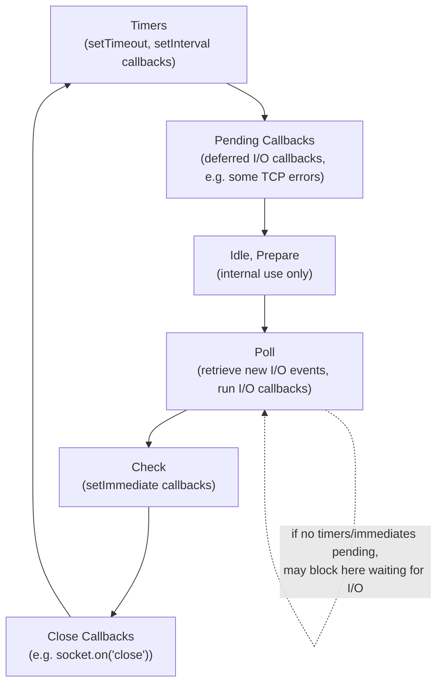
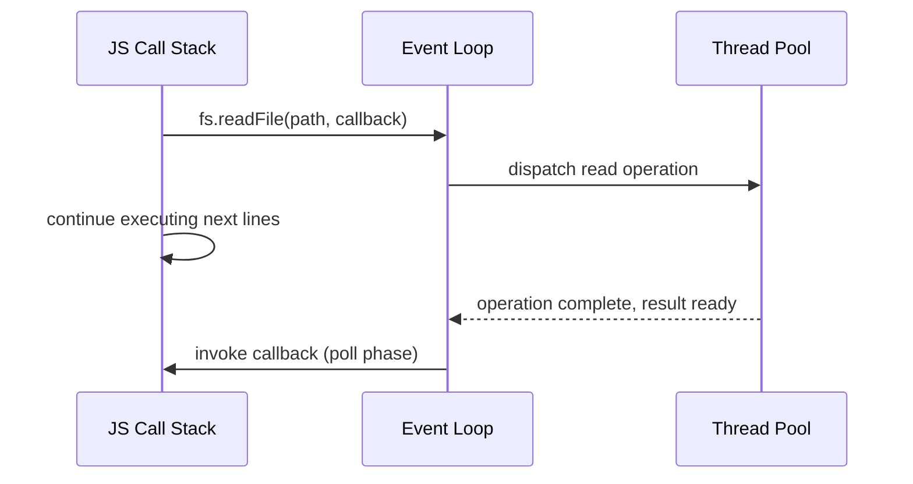
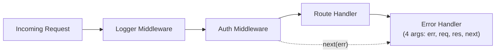

# Node.js Event Loop and Concurrency Model

> **Node.js** runs JavaScript on a single main thread but achieves high concurrency by offloading I/O to the operating system and a libuv-managed thread pool, then processing completed work through a phased **event loop**.

## Why it matters

Interviewers ask about the event loop because it separates candidates who memorized "Node is non-blocking" from those who understand *why* and *how*. Questions in this area probe whether you know the difference between the call stack, microtasks, macrotasks, and the actual OS/libuv layer underneath - knowledge that directly explains real production bugs like blocked event loops, starved I/O callbacks, and CPU-bound tasks freezing a server.

## Single-Threaded, But Not Really

JavaScript execution in Node happens on one main thread with one call stack, so only one piece of JS code runs at a time - there is no shared-memory multithreading of your application code by default. But Node itself is not single-threaded: it uses **libuv**, a C library that provides an event loop plus a thread pool (default size 4, configurable via `UV_THREADPOOL_SIZE`) for operations the OS can't do asynchronously natively.

| Layer | Threading | Handles |
|---|---|---|
| Your JS code | Single thread | Business logic, callbacks, promise handlers |
| libuv event loop | Single thread | Timers, I/O polling, callback scheduling |
| libuv thread pool | Multiple threads (default 4) | `fs` operations, DNS lookups (`dns.lookup`), some `crypto` (pbkdf2, scrypt), zlib compression |
| OS kernel | Async I/O (epoll/kqueue/IOCP) | Network sockets, pipes |

Network I/O (TCP/HTTP) doesn't need the thread pool at all - the OS kernel notifies libuv via non-blocking primitives (epoll on Linux, kqueue on macOS, IOCP on Windows). File system and some crypto/zlib calls do need the thread pool because most OS filesystem APIs are blocking.

## The Event Loop Phases

Each iteration of the event loop ("tick") passes through a fixed set of phases, each with its own FIFO callback queue:



- **Timers**: executes callbacks scheduled by `setTimeout`/`setInterval` whose threshold has elapsed.
- **Pending callbacks**: executes some system-level callbacks deferred from the previous loop iteration.
- **Poll**: the core phase - retrieves new I/O events, executes their callbacks, and will block here (if nothing else is queued) waiting for new events or timers.
- **Check**: runs `setImmediate` callbacks, which are designed to execute right after the poll phase.
- **Close callbacks**: runs `close` event callbacks (e.g., when a socket or handle is closed abruptly).

Between and within every phase, Node drains two microtask-like queues before moving on: `process.nextTick` callbacks (highest priority, Node-specific) and then Promise microtasks (`.then`/`.catch`/`async-await` continuations). This means `process.nextTick` always runs before any Promise callback, and both run before the loop proceeds to the next phase.

```js
console.log('start');

setTimeout(() => console.log('setTimeout'), 0);
setImmediate(() => console.log('setImmediate'));

process.nextTick(() => console.log('nextTick'));
Promise.resolve().then(() => console.log('promise'));

console.log('end');

// Output: start, end, nextTick, promise, setTimeout, setImmediate
// (setTimeout vs setImmediate order is not guaranteed outside an I/O callback)
```

## Non-Blocking I/O in Practice

The pattern that makes Node scale for I/O-bound workloads: the main thread never waits on I/O. It issues a request, registers a callback, and immediately moves on to other work. When the OS (or thread pool) finishes the operation, libuv queues the callback to run during the poll phase.



This is why a CPU-bound synchronous function (a huge loop, `JSON.parse` on a massive payload, synchronous crypto) blocks the *entire server* - it occupies the single JS thread, so no other request's callback, timer, or I/O event can be processed until it returns.

## Streams

Streams process data in chunks rather than loading it all into memory, essential for large files, network responses, or piping data between sources. Node has four stream types:

| Type | Direction | Examples |
|---|---|---|
| Readable | Source of data | `fs.createReadStream`, HTTP request (server-side) |
| Writable | Destination of data | `fs.createWriteStream`, HTTP response |
| Duplex | Both readable and writable | TCP sockets |
| Transform | Duplex that modifies data as it passes through | `zlib.createGzip`, crypto ciphers |

Streams are `EventEmitter`s under the hood, emitting events like `data`, `end`, `error`, and `finish`. `.pipe()` connects a readable to a writable and automatically manages backpressure - pausing the source if the destination can't keep up - which is far safer than manually reading and writing large files.

## EventEmitter

Most of Node's asynchronous, event-driven APIs (streams, HTTP servers, `child_process`, the `net` module) are built on the `EventEmitter` class, which implements the classic observer pattern: register listeners with `.on()`, fire them with `.emit()`.

```js
const EventEmitter = require('events');
const bus = new EventEmitter();

bus.on('order', (id) => console.log(`Processing order ${id}`));
bus.emit('order', 42);
```

Listeners are called synchronously, in the order they were registered, when `.emit()` is invoked. A special `error` event has unique behavior: if emitted with no listener attached, Node throws and crashes the process, so production code should always attach an `error` handler on emitters that can fail.

## Scaling Beyond One Thread: Cluster and Worker Threads

Because one Node process uses a single JS thread, scaling to use multiple CPU cores requires an explicit strategy.

| Approach | Use case | Memory model |
|---|---|---|
| `cluster` module | Scale network servers (HTTP) across cores | Separate processes, each with its own memory and event loop; a master process load-balances incoming connections |
| `worker_threads` | Offload CPU-bound work (parsing, image processing, encryption) within one process | Separate threads, isolated memory by default, communicate via message passing or shared `SharedArrayBuffer` |
| Thread pool (libuv) | Internal use for fs/dns/crypto/zlib | Managed automatically, not directly exposed to app code |

`cluster` forks full OS processes (higher overhead, no shared memory, ideal for stateless request handling), while `worker_threads` creates lighter-weight threads within the same process (lower overhead, can share memory, ideal for CPU-heavy computation that would otherwise block the main event loop).

## Express Middleware

Express structures request handling as a pipeline of middleware functions, each receiving `(req, res, next)`. Calling `next()` passes control to the next function in the chain; not calling it leaves the request hanging.



Middleware executes in registration order. Error-handling middleware is distinguished purely by having four parameters (`err, req, res, next`); calling `next(err)` anywhere skips remaining normal middleware and jumps straight to the nearest error handler.

```js
app.use((req, res, next) => {
  console.log(`${req.method} ${req.url}`);
  next();
});

app.use((err, req, res, next) => {
  res.status(500).json({ error: err.message });
});
```

## Common Interview Questions

**Q: Is Node.js single-threaded?**
A: The JavaScript execution model is single-threaded (one call stack), but Node itself uses multiple threads under the hood via libuv's thread pool for certain operations (file system, DNS, some crypto/zlib), plus the OS kernel's async I/O for networking.

**Q: What's the difference between `process.nextTick` and `Promise.then`?**
A: Both are microtasks that run before the event loop continues, and both run before macrotasks like timers. `process.nextTick` callbacks are drained completely before the Promise microtask queue is processed, so `nextTick` has strictly higher priority.

**Q: What's the difference between `setTimeout(fn, 0)` and `setImmediate(fn)`?**
A: `setTimeout` fires in the timers phase after at least the specified delay; `setImmediate` fires in the check phase, right after the poll phase completes. Inside an I/O callback, `setImmediate` is guaranteed to run before `setTimeout(fn, 0)`; at the top level, the order is not guaranteed and depends on process performance.

**Q: Why does a CPU-intensive synchronous function block the whole server?**
A: Because there is only one JS thread and one call stack. A long synchronous computation occupies that thread, so the event loop cannot process any other timers, I/O callbacks, or incoming requests until the function returns.

**Q: How would you handle a CPU-heavy task without blocking the event loop?**
A: Offload it to a `worker_threads` Worker (or a child process/`cluster` for isolated workloads), break it into smaller asynchronous chunks with `setImmediate` between them, or move it to an external service - keeping the main thread free to keep serving I/O.

**Q: What is backpressure in streams and why does it matter?**
A: Backpressure occurs when a writable destination can't consume data as fast as a readable source produces it. `.pipe()` handles this automatically by pausing the source stream until the destination drains, preventing unbounded memory growth when processing large files or slow network connections.

**Q: What happens if an EventEmitter emits an `error` event with no listener?**
A: Node treats it as an unhandled exception and throws, crashing the process by default. This is why any custom or built-in emitter that can fail (streams, sockets) should always have an `error` listener attached.

## Related

- [Async/Await and Promises](../javascript/questions.md) - the language-level mechanics that sit on top of the event loop
