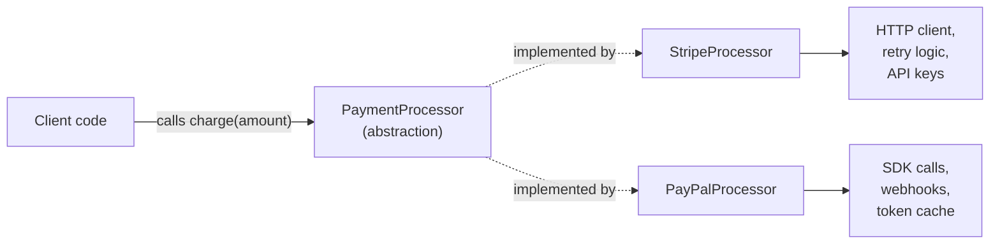
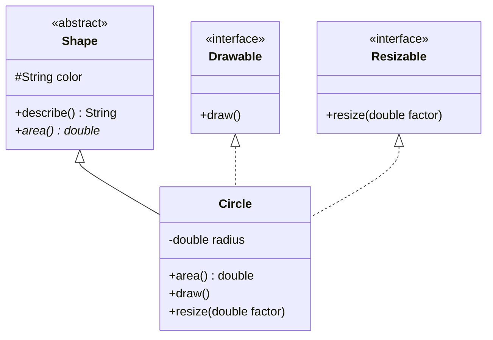

# Abstraction

> **Abstraction** is the practice of exposing only the essential behavior of a component while hiding the implementation details behind it.

## Why it matters

Interviewers ask about abstraction to see if a candidate can design systems that hide volatility. Code that depends on *what* something does instead of *how* it does it is easier to test, swap, and extend. It's also one of the most confused topics in OOP interviews because candidates often can't clearly separate it from encapsulation, or explain when to reach for an abstract class versus an interface - this question is a quick filter for real design experience versus memorized definitions.

## What abstraction actually hides

Abstraction operates at the level of a contract: a caller should be able to use a type by knowing only its public behavior (method names, parameters, return types, and the guarantees those methods make), never its internals (data structures, algorithms, state machines, or dependencies used to fulfill that contract).

A classic example: a `PaymentProcessor` interface exposes `charge(amount)`. The caller never needs to know whether the implementation calls a REST API, talks to a message queue, or writes to a mainframe.



The client only ever sees `Contract`. Everything below it can change freely without breaking callers.

## Abstraction vs encapsulation

These two are related but answer different questions, and interviewers specifically probe whether you can tell them apart.

| Aspect | Abstraction | Encapsulation |
|---|---|---|
| Question it answers | "What does this do?" | "How is this protected?" |
| Focus | Design-level: simplifying complexity by exposing only essentials | Implementation-level: bundling data and methods, restricting access |
| Mechanism | Abstract classes, interfaces, APIs | Access modifiers (`private`, `protected`), getters/setters |
| Direction | Outward - hides *what* isn't necessary for the caller | Inward - hides *how* data is stored and mutated |
| Analogy | A car's steering wheel and pedals (you don't need to know engine internals) | The engine bay being sealed so you can't reach in and rewire it |

In short: abstraction is about interface design; encapsulation is about access control. You can have encapsulation without abstraction (a class with private fields but no meaningful interface abstraction), and in principle define an abstraction without strict encapsulation, but in practice good OOP design uses both together - encapsulation is often the *mechanism* that enforces an abstraction's boundary.

## Abstract class vs interface

Both let you define a contract and defer implementation, but they differ in intent and capability.

```java
// Abstract class: partial implementation + shared state
public abstract class Shape {
    protected String color;

    public Shape(String color) {
        this.color = color;
    }

    // concrete, shared behavior
    public String describe() {
        return "A " + color + " shape with area " + area();
    }

    // must be implemented by subclasses
    public abstract double area();
}

public class Circle extends Shape {
    private final double radius;

    public Circle(String color, double radius) {
        super(color);
        this.radius = radius;
    }

    @Override
    public double area() {
        return Math.PI * radius * radius;
    }
}
```

```java
// Interface: pure contract, no shared state
public interface Drawable {
    void draw();
}

public interface Resizable {
    void resize(double factor);
}

// A class can implement multiple interfaces (multiple inheritance of type)
public class Circle extends Shape implements Drawable, Resizable {
    @Override
    public void draw() { /* rendering logic */ }

    @Override
    public void resize(double factor) { /* scale radius */ }
}
```

| Aspect | Abstract class | Interface |
|---|---|---|
| Purpose | Model an "is-a" relationship with shared code | Model a "can-do" capability or role |
| State | Can hold fields and constructors | Traditionally no instance state (some languages allow default methods, but no instance fields) |
| Implementation | Can mix abstract and concrete methods | Historically all abstract; many modern languages allow default/static methods |
| Inheritance | Single inheritance only (one parent) | A class can implement many interfaces |
| Access modifiers | Full range (`private`, `protected`, `public`) | Members are implicitly public |
| When it changes | Adding a method breaks all subclasses unless it has a body | Adding a method breaks all implementers unless a default is provided |



## When to use each

- **Use an abstract class** when subclasses share a genuine "is-a" relationship, you need common state or a partial default implementation, and single inheritance is not a limiting factor. Good for a family of closely related types with a common base (e.g., `Employee` → `Manager`, `Engineer`).
- **Use an interface** when you're describing a capability that unrelated classes might share ("can-do" rather than "is-a"), when a class needs to satisfy multiple contracts, or when you want maximum flexibility for future implementers. Good for cross-cutting behaviors (e.g., `Comparable`, `Serializable`, `Drawable`).
- **Prefer composition plus small interfaces over deep abstract-class hierarchies** in most modern designs - it's easier to test, easier to extend, and avoids the fragile-base-class problem where a change to a shared parent ripples through every subclass.
- **Combine both** when it makes sense: an abstract class can implement one or more interfaces, providing default behavior for some methods while leaving others for concrete subclasses.

## Common Interview Questions

**Q: What is the difference between abstraction and encapsulation?**
A: Abstraction hides unnecessary implementation detail to expose only relevant behavior (a design-level concept about interfaces and contracts). Encapsulation bundles data and methods together and restricts direct access to internal state (an implementation-level concept enforced with access modifiers). Encapsulation is often the mechanism used to achieve abstraction.

**Q: When would you choose an abstract class over an interface?**
A: When the types share real common state or behavior and you want to provide a partial implementation once instead of repeating it in every subclass, and when single inheritance is not a constraint - for example, a base `Vehicle` class holding shared fields like `speed` and a shared `startEngine()` method.

**Q: Can an abstract class have a constructor, and why would it need one?**
A: Yes. Even though you can't instantiate an abstract class directly, its constructor runs when a concrete subclass is instantiated (via `super(...)`), typically to initialize shared fields declared in the abstract class.

**Q: Can a class implement multiple interfaces but extend only one class? Why does that limitation exist?**
A: Yes, in most mainstream OOP languages (Java, C#) a class can implement any number of interfaces but extend only one class. This avoids the "diamond problem" of ambiguous state or method resolution that can arise from multiple concrete inheritance.

**Q: Is abstraction only achieved through abstract classes and interfaces?**
A: No. Any well-designed API is a form of abstraction - a public method that hides its internal algorithm, a database access layer that hides SQL, or even a well-named function that hides a multi-step calculation. Abstract classes and interfaces are just the formal OOP tools for enforcing it.

**Q: What happens if you add a new method to an interface that many classes already implement?**
A: Without a default implementation, every implementing class fails to compile until it adds the method - this is why interface changes are riskier in public APIs. Many modern languages mitigate this with default methods that supply a fallback implementation.

**Q: Give a real-world example of abstraction outside of syntax.**
A: A `List` interface in Java abstracts over `ArrayList`, `LinkedList`, and other implementations. Code written against `List` can swap the underlying data structure for performance reasons without any caller needing to change.

## Related

- [Encapsulation](encapsulation.md) - the access-control mechanism that often enforces an abstraction's boundary
- [Inheritance](inheritance.md) - the mechanism abstract classes use to share implementation with subclasses
- [Polymorphism](polymorphism.md) - how callers invoke the same abstract contract and get different concrete behavior
- [OOP Basics](basics.md) - foundational definitions this topic builds on
